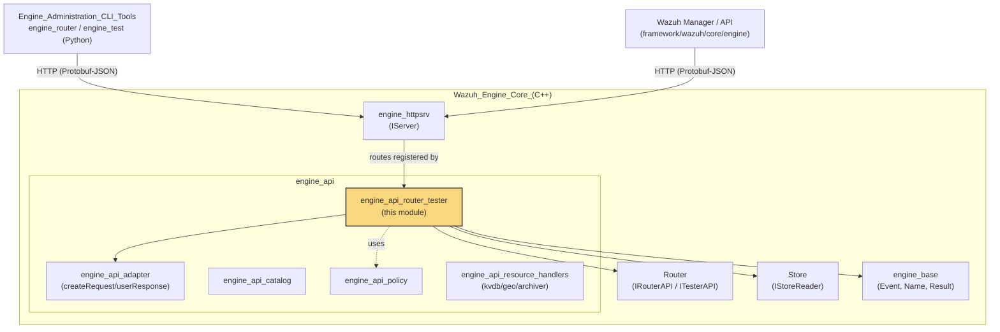
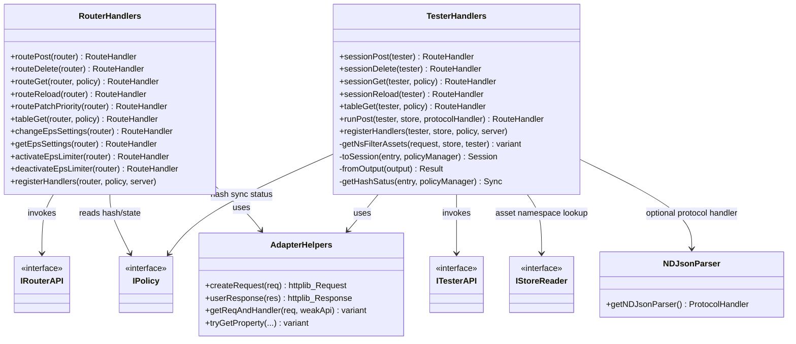
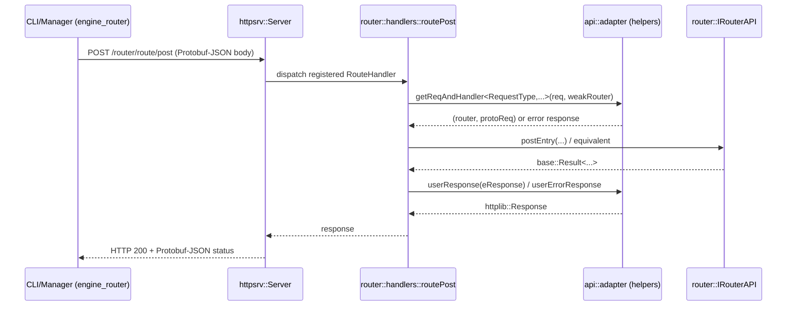
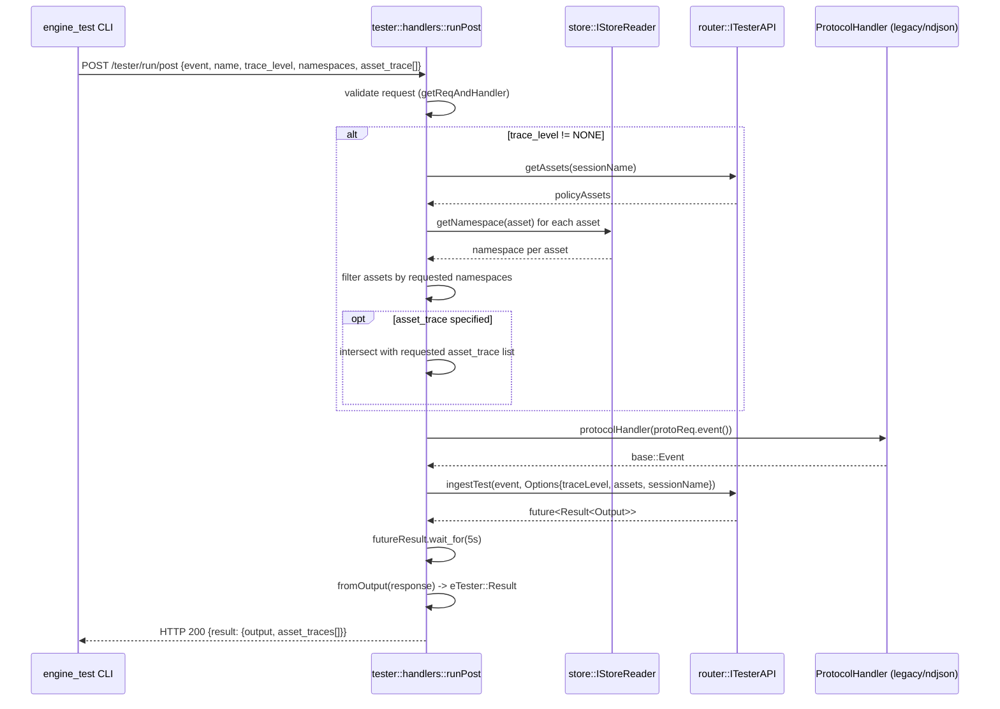
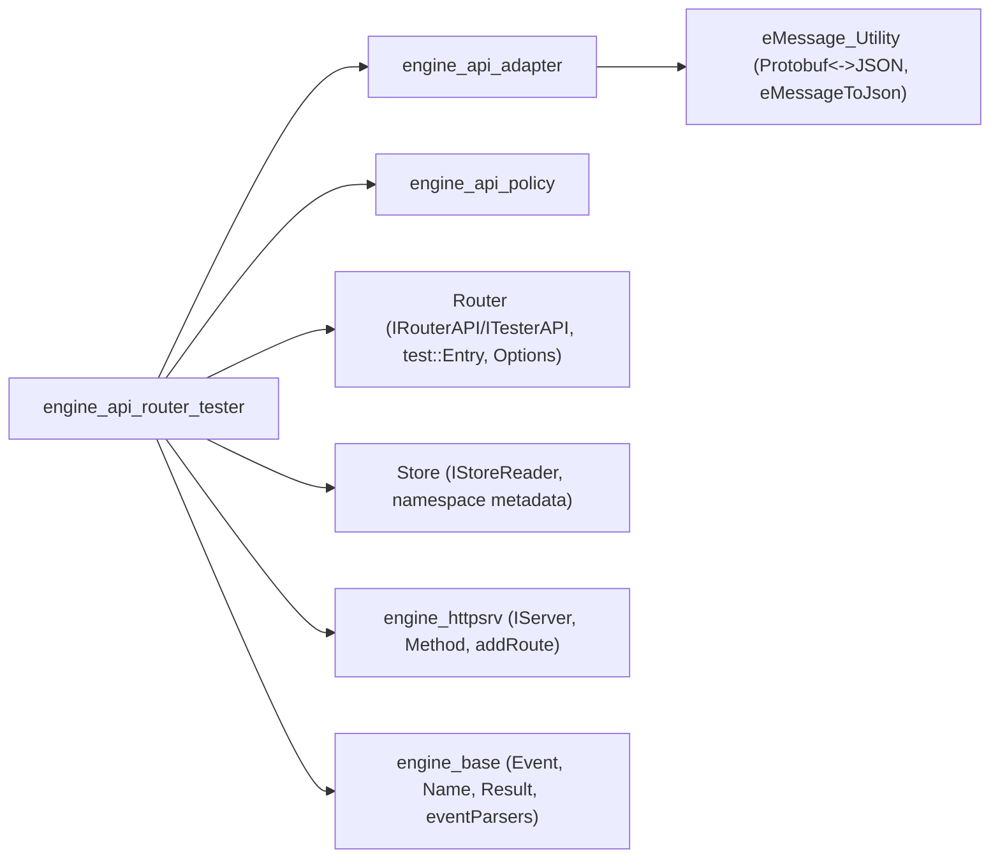
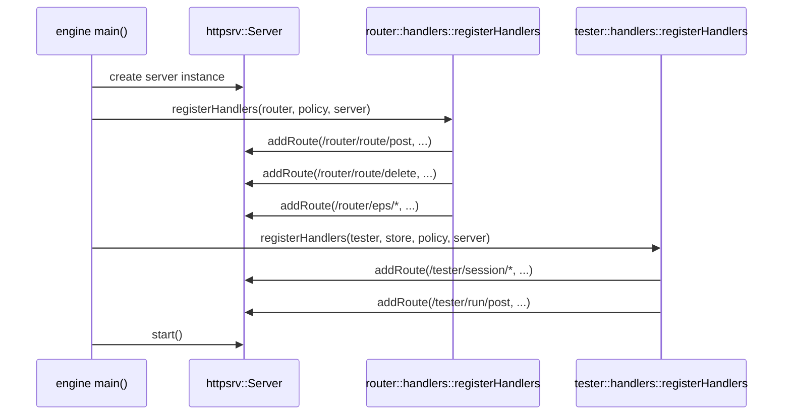

# Engine API Router & Tester Module

## Introduction

The **Engine API Router & Tester** module implements the HTTP API surface that exposes the Wazuh Engine's **Router** and **Tester** subsystems to external clients (primarily the `engine-router` and `engine-test` CLI tools, and internally the Wazuh manager/API). It is responsible for:

- Managing the lifecycle of **routes** (entries that bind a filter, priority and policy to the live event-processing pipeline).
- Exposing **EPS (Events Per Second) limiter** controls for the router.
- Managing **test sessions** (isolated, ephemeral policy runtime instances) used to validate rules/decoders/policies without touching production routing.
- Ingesting single test events (via `runPost`) and returning detailed per-asset execution traces.
- Parsing NDJSON-formatted batches of events for bulk ingestion scenarios.

This module is a thin, stateless **HTTP adapter layer**: it translates incoming Protobuf-encoded HTTP requests into calls against the `router::IRouterAPI` and `router::ITesterAPI` interfaces (implemented in the [Router module](Router.md)), and serializes the results back to Protobuf/JSON HTTP responses using helpers from the [engine_api_adapter](engine_api_adapter.md) module.

It sits inside the broader [engine_api](engine_api.md) component group, alongside sibling modules such as [engine_api_catalog](engine_api_catalog.md), [engine_api_policy](engine_api_policy.md) and [engine_api_resource_handlers](engine_api_resource_handlers.md) (kvdb, geo, archiver).

## Module Position in the System

## Core Responsibilities

| Area | Files | Purpose |
|---|---|---|
| Router route handlers | `api/router/include/api/router/handlers.hpp` | Registers HTTP endpoints for route CRUD, priority patching, EPS limiter control, and route table listing |
| Tester session handlers | `api/tester/include/api/tester/handlers.hpp`, `api/tester/src/handlers.cpp` | Registers HTTP endpoints for creating/deleting/listing/reloading test sessions and running test events |
| NDJSON ingestion parser | `api/event/include/api/event/ndJsonParser.hpp` | Splits a newline-delimited JSON batch into a queue of `base::Event` objects for bulk event ingestion |

## Component Diagram

## Data Flow: Route Management Request

## Data Flow: Test Session Run (`runPost`)

The `runPost` handler is the most complex flow in this module. It combines namespace-based asset filtering, event parsing and synchronous test execution with a timeout.

## Key Behaviors & Design Notes

### 1. Route Handlers (`api/router/handlers.hpp`)
- Declares a family of `adapter::RouteHandler` factory functions (`routePost`, `routeDelete`, `routeGet`, `routeReload`, `routePatchPriority`, `tableGet`, and EPS limiter controls).
- `registerHandlers` is the single entry point that wires all router-related endpoints onto an `httpsrv::Server` instance under the `/router/*` prefix.
- All handlers operate against the `router::IRouterAPI` interface — see [Router](Router.md) for the interface and its implementations (`Router`, `Environment`, `EnvironmentBuilder`, `EpsCounter`).
- `routeGet` and `tableGet` additionally depend on `api::policy::IPolicy` (see [engine_api_policy](engine_api_policy.md)) to resolve policy hash/sync information for display.

### 2. Tester Handlers (`api/tester/handlers.hpp`, `handlers.cpp`)
- Session lifecycle endpoints: `sessionPost` (create), `sessionDelete`, `sessionGet`, `sessionReload`, and `tableGet` (list all sessions).
- `runPost` is the core "ingest one event into a test session and return traces" endpoint. Internally:
  - Uses `getNsFilterAssets` (private helper) to resolve which assets should be traced, cross-referencing the [Store](Store.md) module's namespace metadata with the policy's asset list obtained from `ITesterAPI::getAssets`.
  - Converts the incoming JSON event into a `base::Event` via a pluggable `ProtocolHandler` (defaults to `base::eventParsers::parseLegacyEvent`, but can be swapped for the NDJSON parser below).
  - Delegates actual execution to `ITesterAPI::ingestTest`, which returns a `std::future` — the handler blocks with a 5-second timeout waiting for the result.
  - Formats the result into `eTester::Result`, including per-asset trace success/failure and raw trace lines (`fromOutput`).
- `toSession` and `getHashSatus` are private helpers that translate the internal `router::test::Entry` (see `RuntimeEntry` in [Router](Router.md)) into the public `eTester::Session` Protobuf message, including computing whether the session's policy is `UPDATED`, `OUTDATED`, or in `ERROR` state relative to the live policy store (via `IPolicy::getHash`).

### 3. NDJSON Parser (`api/event/ndJsonParser.hpp`)
- `getNDJsonParser()` returns a `ProtocolHandler` (`std::function<std::queue<base::Event>(std::string&&)>`) that:
  1. Splits a batch string on `\n` boundaries (in-place, using `\0` as a sentinel to avoid extra allocations).
  2. Rejects empty batches and empty lines with descriptive `std::runtime_error` messages.
  3. Parses each line into a `base::Event` (a `json::Json`-backed shared pointer) and enqueues it.
- This parser is an alternative to the legacy single-event parser used by `runPost`, intended for bulk/streaming event ingestion scenarios (e.g., agent simulators, batch replay tools).

## Dependency Overview

- **[engine_api_adapter](engine_api_adapter.md)**: Supplies `createRequest`/`userResponse` and the generic `getReqAndHandler`/`tryGetProperty` helpers used throughout this module to reduce boilerplate around Protobuf (de)serialization and error handling.
- **[engine_api_policy](engine_api_policy.md)**: Supplies `IPolicy::getHash` used to compute route/session policy synchronization status.
- **[Router](Router.md)**: Supplies the `IRouterAPI` / `ITesterAPI` interfaces, the `test::Entry`/`test::EntryPost`/`test::Output`/`RuntimeEntry` types, and the `Options`/`AssetTrace` structures consumed and produced by these handlers.
- **[Store](Store.md)**: Supplies `IStoreReader::getNamespace` used for namespace-based asset filtering in `runPost`.
- **[engine_httpsrv](engine_httpsrv.md)**: Supplies the `Server`, `Method`, and route-registration primitives (`addRoute`) that `registerHandlers` functions bind to.
- **[engine_base](engine_base.md)**: Supplies `base::Event`, `base::Name`, `base::Result`/`base::Error`, and the `eventParsers::parseLegacyEvent` function used as the default protocol handler.
- **[eMessage_Utility](eMessage_Utility.md)**: Underlies the Protobuf-to-JSON (and back) conversion used by `adapter::createRequest`/`userResponse`.

## Related Modules

- [engine_api](engine_api.md) — parent grouping of all Engine HTTP API sub-modules.
- [engine_api_adapter](engine_api_adapter.md) — shared HTTP/Protobuf adapter helpers used by this module.
- [engine_api_catalog](engine_api_catalog.md) — sibling module managing catalog (assets/decoders/rules) CRUD via HTTP.
- [engine_api_policy](engine_api_policy.md) — sibling module managing policy lifecycle; used here for hash/sync checks.
- [engine_api_resource_handlers](engine_api_resource_handlers.md) — sibling module exposing kvdb/geo/archiver HTTP handlers.
- [Router](Router.md) — core routing/testing engine that this module's handlers wrap.
- [Store](Store.md) — asset storage and namespace resolution used during test asset filtering.
- [engine_httpsrv](engine_httpsrv.md) — HTTP server abstraction used to register routes.
- [engine_base](engine_base.md) — foundational types (`Event`, `Name`, `Result`) shared across the Engine.
- [Engine_Administration_CLI_Tools_(Python)](Engine_Administration_CLI_Tools_(Python).md) — `engine_router` and `engine_test` Python CLIs that are the primary consumers of these HTTP endpoints.

## Usage Context

These handlers are registered during Engine HTTP server bootstrap (see `engine_main` in [engine_main](engine_main.md)) alongside the other `engine_api` sub-modules. A typical registration sequence is:

## Summary

The **engine_api_router_tester** module is the HTTP-facing control surface for Wazuh Engine's live routing table and ephemeral test sessions. It is intentionally thin — validation, business logic, and state management live in the `Router` module's `IRouterAPI`/`ITesterAPI` implementations — while this module focuses on:

- Protobuf/JSON request/response marshaling (via `engine_api_adapter`).
- Endpoint routing/registration (via `engine_httpsrv`).
- Cross-cutting concerns specific to testing: namespace-based asset trace filtering, synchronous test execution with timeout, and NDJSON batch parsing for bulk ingestion.

Developers extending the Engine's public API for routing or testing functionality should add new `RouteHandler` factory functions here and register them in the corresponding `registerHandlers` function, following the existing pattern of delegating to the `IRouterAPI`/`ITesterAPI` interfaces.
