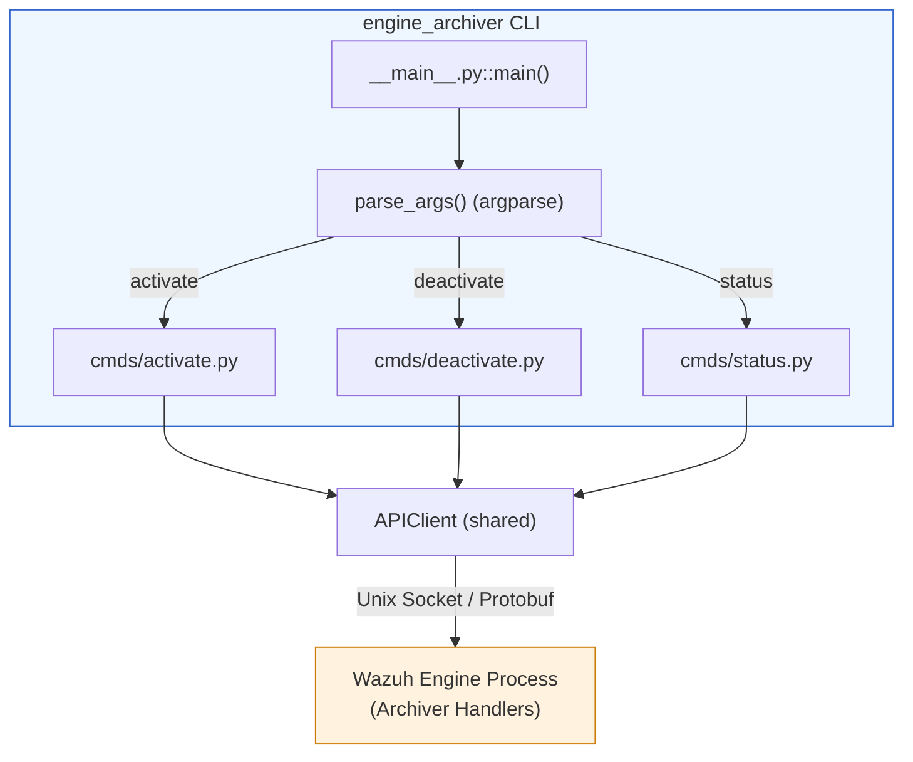
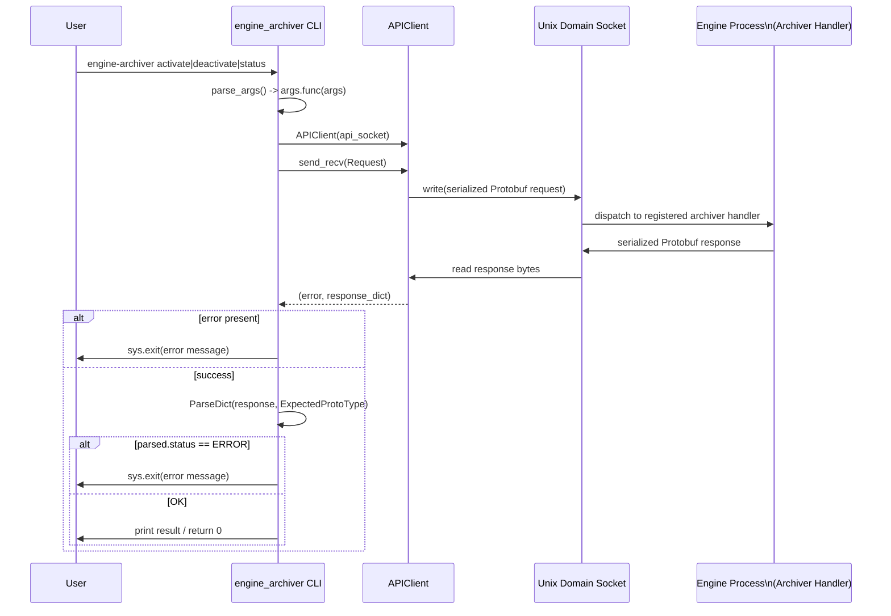

# Engine Archiver CLI (`engine_archiver`)

## 1. Purpose

`engine_archiver` is a small, focused **command-line client** distributed as part of the
`engine-suite` Python package. It allows administrators and operators to control the
Wazuh Engine's **archiver** feature — the internal component of the engine that persists
raw/processed events to disk for later inspection — without needing to interact directly
with the engine's low-level Unix-socket API.

The tool exposes three sub-commands:

| Command      | Effect                                                              |
|--------------|----------------------------------------------------------------------|
| `activate`   | Turns the archiver **on** inside the running engine instance         |
| `deactivate` | Turns the archiver **off**                                           |
| `status`     | Queries and prints whether the archiver is currently `active`/`inactive` |

Because the engine itself does not expose these controls over HTTP, `engine_archiver`
talks to the engine's control-plane Unix domain socket using a small binary
request/response protocol built on Protocol Buffers.

## 2. Architecture Overview

`engine_archiver` follows the same lightweight pattern used by all the sibling
`engine-suite` tools (`engine_catalog`, `engine_policy`, `engine_router`,
`engine_kvdb`, `engine_geo`, etc.): an `argparse`-based `__main__.py` entry point wires
up one sub-parser per command, and each command module implements a `configure()`
function (registers the CLI arguments) and a `run()` function (executes the actual
logic by calling the shared `APIClient`).



**Key external dependencies (documented in other module pages):**

- **`APIClient`** (`api-communication/src/api_communication/client.py`) — the generic
  socket client shared by every `engine-suite` tool for sending Protobuf requests and
  receiving Protobuf responses over the engine's control socket. See
  [engine_misc_tools.md](engine_misc_tools.md).
- **`Constants` / `CONFIG_ENV_KEYS`** (`shared/default_settings.py`) — provides the
  default socket path (`Constants.SOCKET_PATH`) used unless the user overrides it with
  `--api-socket`. See [engine_suite_shared.md](engine_suite_shared.md).
- **Server-side archiver handlers** — the requests sent by this CLI
  (`ArchiverActivate_Request`, `ArchiverDeactivate_Request`, `ArchiverStatus_Request`)
  are handled inside the engine process by the C++ archiver API handlers
  (`src/engine/source/api/archiver/include/api/archiver/handlers.hpp::registerHandlers`).
  See [engine_api_resource_handlers.md](engine_api_resource_handlers.md) for how the
  engine registers and processes these requests, and [engine_api.md](engine_api.md) /
  [engine_base.md](engine_base.md) for the broader engine API and process
  infrastructure that hosts the control socket.

## 3. Command Reference & Data Flow

Each command follows an identical, minimal pattern:

1. Read the `--api-socket` argument (defaults to `Constants.SOCKET_PATH`).
2. Instantiate an `APIClient` bound to that socket path.
3. Build the appropriate Protobuf request message (empty payload for all three
   commands — they are effectively RPC "signals").
4. Call `client.send_recv(request)`, which serializes the request, writes it to the
   socket, and reads back a serialized response.
5. Parse the raw dict response into the expected Protobuf response type
   (`engine.GenericStatus_Response` for `activate`/`deactivate`, and
   `archiver.ArchiverStatus_Response` for `status`).
6. On error (`status == engine.ERROR` or a socket-level error string) the process
   exits with a descriptive message via `sys.exit(...)`; otherwise it returns `0` and,
   for `status`, prints `active` or `inactive` to stdout.



### 3.1 `__main__.py` — Entry Point

- Builds the top-level `argparse.ArgumentParser` (`prog='engine-archiver'`).
- Registers global flags: `--version` (pulled from the `engine-suite` package
  metadata) and `--api-socket` (default from `Constants.SOCKET_PATH`).
- Creates a required sub-parser group and delegates registration of each command to
  `configure_activate`, `configure_deactivate`, and `configure_status`.
- `main()` parses the CLI arguments and dispatches to the selected command's `run`
  function via `args.func(vars(args))` (the `argparse` "sub-command dispatch"
  pattern).

### 3.2 `cmds/activate.py`

- `configure(subparsers)` registers the `activate` sub-command (no extra arguments
  beyond the global ones).
- `run(args)` sends an `archiver.ArchiverActivate_Request()` and expects a generic
  `engine.GenericStatus_Response`. Any transport-level or engine-level error causes
  the process to exit with a non-zero status and an explanatory message.

### 3.3 `cmds/deactivate.py`

- Mirrors `activate.py` exactly, but sends `archiver.ArchiverDeactivate_Request()`.

### 3.4 `cmds/status.py`

- Sends `archiver.ArchiverStatus_Request()`.
- Parses the response as `archiver.ArchiverStatus_Response()`, which contains an
  `active` boolean field in addition to the generic `status`/`error` fields.
- Prints `active` or `inactive` to stdout so the command is easily scriptable
  (e.g. `if [ "$(engine-archiver status)" = "active" ]; then ...`).

## 4. Relationship to the Rest of the System

`engine_archiver` is one of several thin CLI front-ends bundled under
**Engine Administration CLI Tools (Python)**, alongside `engine_catalog`,
`engine_decoder`, `engine_diff`, `engine_integration`, `engine_policy`,
`engine_router`, `engine_schema`, `engine_test`, `engine_kvdb`, and `engine_geo`.
All of these tools share the same `shared/` package
([engine_suite_shared.md](engine_suite_shared.md)) for configuration defaults,
resource handling, and execution helpers, and the same
`api-communication` client library ([engine_misc_tools.md](engine_misc_tools.md)) for
talking to the engine process.

On the server side, the requests issued by this CLI are ultimately serviced by the
**Wazuh Engine Core (C++)** process, specifically its API layer
([engine_api.md](engine_api.md) and [engine_api_resource_handlers.md](engine_api_resource_handlers.md)),
which registers handlers for archiver-related Protobuf messages and forwards
activation state changes to the engine's runtime archiver component.

```mermaid
graph LR
    subgraph "Engine Administration CLI Tools (Python)"
        ARCH[engine_archiver]
        CAT[engine_catalog]
        POL[engine_policy]
        ROUT[engine_router]
        OTHERS[...other engine_* CLIs]
    end

    SHARED[engine_suite_shared]
    MISC[engine_misc_tools\n(APIClient)]

    ARCH --> SHARED
    ARCH --> MISC
    CAT --> SHARED
    POL --> SHARED
    ROUT --> SHARED
    OTHERS --> SHARED
    CAT --> MISC
    POL --> MISC
    ROUT --> MISC

    MISC -->|Unix Socket| ENGINEAPI[engine_api /\nengine_api_resource_handlers]
    ENGINEAPI --> ENGINEBASE[engine_base]
```

## 5. Usage Examples

```bash
# Activate the archiver on the default socket
engine-archiver activate

# Deactivate the archiver on a custom socket path
engine-archiver --api-socket /var/ossec/queue/sockets/engine-api deactivate

# Check current status (prints "active" or "inactive")
engine-archiver status
```

## 6. Related Documentation

- [engine_suite_shared.md](engine_suite_shared.md) — shared configuration constants,
  resource handlers, and executor utilities used by every `engine-suite` CLI tool,
  including `engine_archiver`.
- [engine_misc_tools.md](engine_misc_tools.md) — the `APIClient` implementation used
  to communicate with the engine's control socket.
- [engine_api.md](engine_api.md) — overview of the Wazuh Engine's internal API layer.
- [engine_api_resource_handlers.md](engine_api_resource_handlers.md) — the C++
  handlers (including the archiver handlers) that process requests sent by this CLI.
- [engine_catalog.md](engine_catalog.md), [engine_policy.md](engine_policy.md),
  [engine_router.md](engine_router.md) — sibling CLI tools following the same
  command/APIClient pattern.
