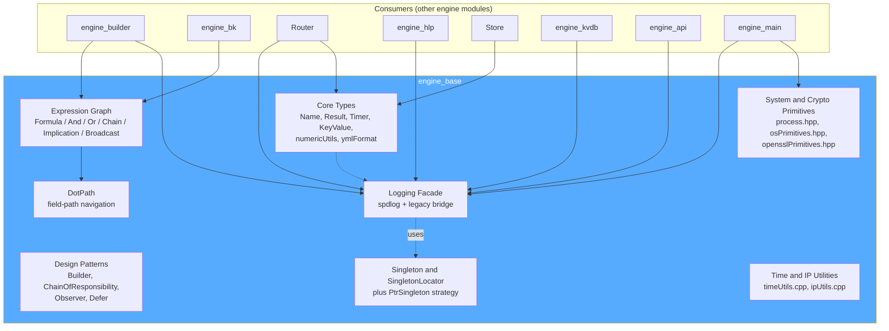
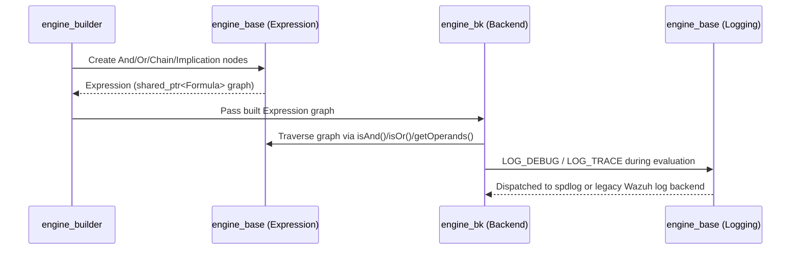

# Engine Base Module

## 1. Introduction and Purpose

`engine_base` is the foundational C++ library of the **Wazuh Engine** (the high-performance log analysis and
detection engine, successor to `analysisd`). It provides the low-level building blocks that every other engine
component depends on: the **expression graph** primitives used to represent decoders/rules/filters as executable
graphs, a unified **logging** façade that works both standalone and embedded inside the legacy Wazuh daemons,
common **design-pattern utilities** (Builder, Chain of Responsibility, Observer, Singleton, Singleton Locator,
Defer/RAII helpers), and a handful of **core value types and OS/crypto primitive wrappers** (`Name`, `Result`,
`Timer`, `KeyValue`, process/privilege-drop helpers, IP/time utilities, OpenSSL and OS syscall wrappers used for
dependency injection in unit tests).

Because almost every other C++ engine sub-module (`engine_bk`, `engine_builder`, `engine_conf`, `engine_hlp`,
`engine_kvdb`, `Router`, `Store`, `Schemf_(Schema_Validation)`, etc.) links against `engine_base`, this module
has **no internal dependencies on other engine modules** — it sits at the bottom of the dependency graph.

## 2. Architecture Overview

`engine_base` is organized into five cohesive areas, documented as separate sub-module pages:

| Area | Description | Documentation |
|------|-------------|----------------|
| Expression Graph | Core data structures (`Formula`, `And`, `Or`, `Chain`, `Implication`, `Broadcast`) that describe the decoder/rule/filter execution graph, plus `DotPath` for dot-notation field addressing. | [engine_base_expression.md](engine_base_expression.md) |
| Logging | Unified logging façade (`LOG_INFO`, `LOG_DEBUG`, ...) built on spdlog, with a bridge to the legacy Wazuh C logging system for embedded/non-standalone execution. | [engine_base_logging.md](engine_base_logging.md) |
| Design Patterns & Utilities | Generic, reusable C++ patterns: `Builder`, `AbstractHandler`/`Handler` (Chain of Responsibility), `Subject`/`Observer`, `Defer` (RAII scope guard), `Singleton`, `SingletonLocator`/`ISingletonManager`/`PtrSingleton`. | [engine_base_patterns.md](engine_base_patterns.md) |
| Core Value Types | Small, widely-used value types: `Name` (resource identifier), `Result<Event>` (success/failure wrapper with trace), `Timer`, `KeyValue` (key:value buffer parser), numeric rounding and YAML formatting helpers. | [engine_base_core_types.md](engine_base_core_types.md) |
| System & Crypto Primitives / Time-IP Utilities | Thin, mockable wrappers around OS syscalls (`OSPrimitives`) and OpenSSL calls (`OpenSSLPrimitives`), process/daemonization and privilege-drop helpers (`process.hpp`), plus free functions for time formatting (ISO-8601) and IP address classification/validation. | [engine_base_system.md](engine_base_system.md) |

## 3. High-Level Data Flow

## 4. Key Design Notes

* **Expression graphs are immutable trees of `shared_ptr<Formula>`.** Every node type (`And`, `Or`, `Chain`,
  `Implication`, `Broadcast`, `Term<T>`) is only constructible through a static `create()` factory method that
  returns a `shared_ptr`, guaranteeing that graph nodes are always heap-managed and safely shareable across the
  backend controllers (`engine_bk`) that later traverse and execute them.
* **Logging works in two modes**: *standalone* (the engine binary runs independently, using spdlog directly) and
  *embedded* (the engine runs as a Wazuh module and log calls are bridged into the legacy `wazuh-analysisd` logging
  functions via `dlopen`/`dlsym`). The `standaloneModeEnabled()` function (driven by the `WAZUH_SKIP_OSSEC_CONF`
  environment variable) decides which backend receives the log record at runtime.
* **`SingletonLocator` decouples singleton *usage* from singleton *lifetime management*.** Instead of each class
  implementing its own singleton pattern, consumers register a `Strategy` (e.g., `PtrSingleton`) for an interface
  type, and access the resolved instance through `SingletonLocator::instance<Interface>()`. This is the pattern
  used throughout the engine to inject/replace globally-scoped services (e.g., metrics manager) in tests.
* **`OSPrimitives`/`OpenSSLPrimitives` are protected mix-in base classes**, not directly callable — components that
  need to shell out to socket/file syscalls or OpenSSL routines derive from these classes so that unit tests can
  override the wrapped methods (via mocking derived test doubles) without touching real OS/crypto state.

## 5. Related Documentation

* [engine_builder.md](engine_builder.md) — builds decoder/rule/filter `Expression` graphs using `engine_base`
  primitives.
* [engine_bk.md](engine_bk.md) — backend controllers that execute the `Expression` graphs at runtime.
* [Router.md](Router.md) — uses `engine_base` logging and core types to route events across environments.
* [engine_conf.md](engine_conf.md) — configuration loader that supplies `logging::LoggingConfig` values.
* [engine_main.md](engine_main.md) — entry point that calls `base::process` helpers (`goDaemon`, privilege drop) and
  initializes logging via `logging::start`.
