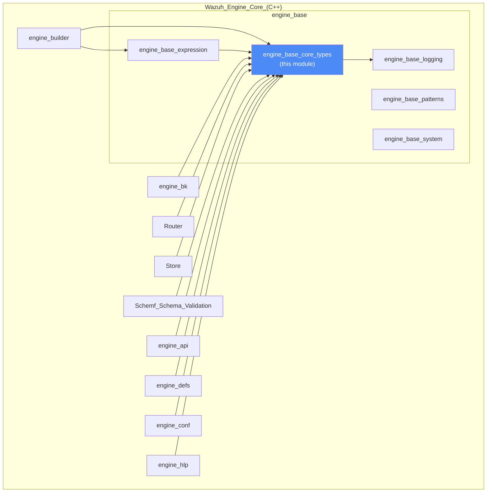
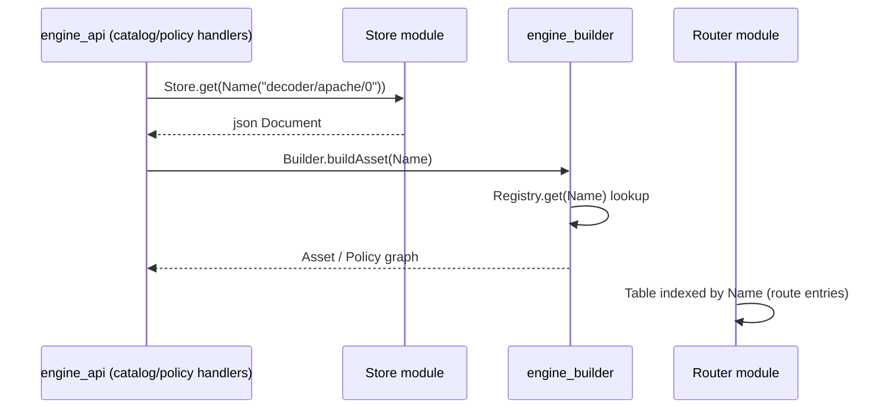
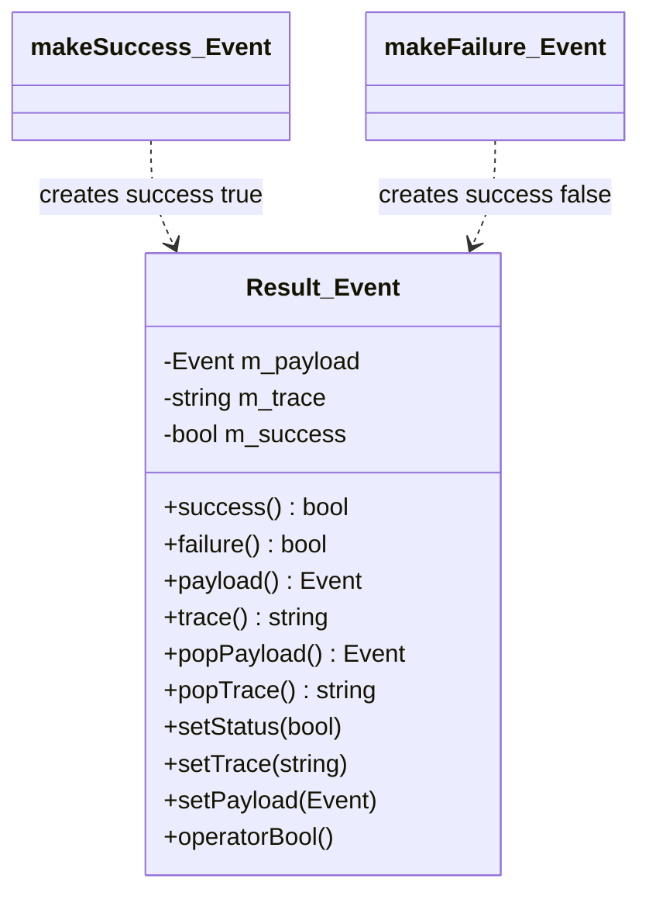
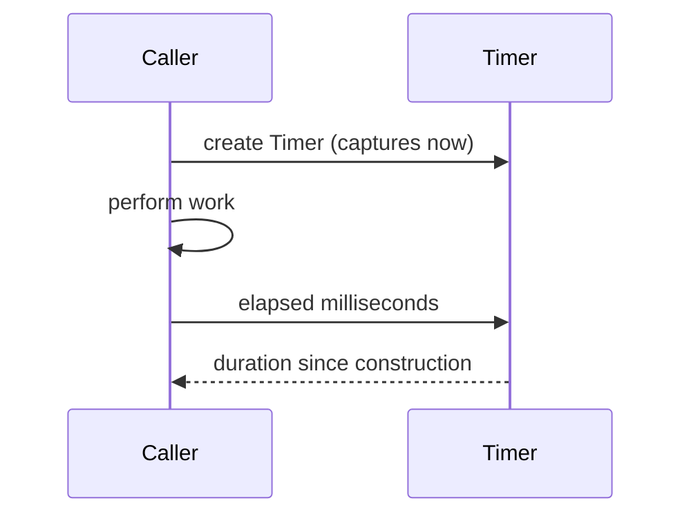
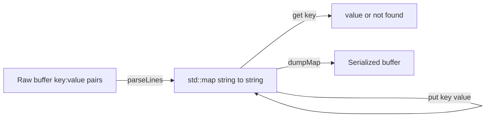
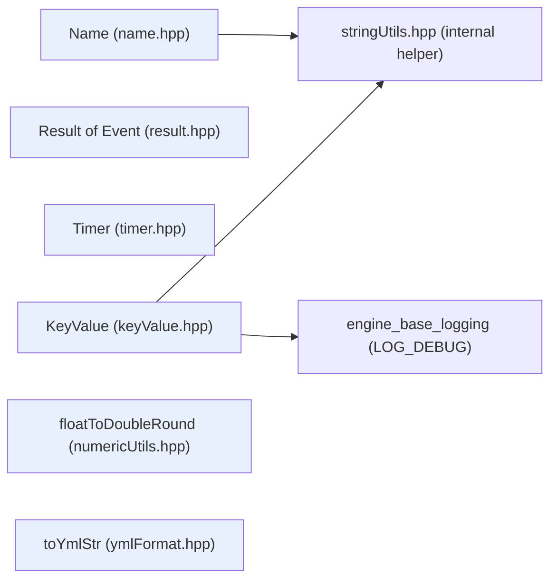
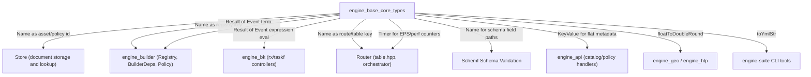

# Engine Base Core Types

## Introduction

The **`engine_base_core_types`** module is the collection of foundational, dependency‑free C++ value types that underpin the Wazuh Engine (`Wazuh_Engine_Core_(C++)`). It lives inside the `engine_base` library, alongside sibling modules that provide expression trees ([`engine_base_expression`](engine_base_expression.md)), logging ([`engine_base_logging`](engine_base_logging.md)), generic design patterns ([`engine_base_patterns`](engine_base_patterns.md)) and OS/system primitives ([`engine_base_system`](engine_base_system.md)).

Unlike those sibling modules, `engine_base_core_types` does not implement behaviour specific to a subsystem (parsing, building, routing, storing, etc.). Instead it defines the small, reusable **vocabulary types** that virtually every other engine component consumes:

| Component | Purpose |
|---|---|
| `base::Name` | Immutable, hashable identifier for store resources (decoders, rules, policies, etc.) |
| `base::result::Result<Event>` | Generic success/failure wrapper carrying a payload and a trace string |
| `base::chrono::Timer` | Minimal high-resolution stopwatch for measuring elapsed time |
| `base::utils::KeyValue` | Lightweight parser/serializer for `key:value` text blocks |
| `base::utils::numeric::floatToDoubleRound` | Utility to round a `float` to `double` with fixed precision |
| `base::ymlfmt::toYmlStr` | Utility to render a `vector<string>` as a simple YAML list |

Because these types have no dependency on the engine's business logic, they are included transitively by almost every other engine module (`engine_builder`, `engine_bk`, `Router`, `Store`, `Schemf_(Schema_Validation)`, `engine_api`, etc.), making this module one of the lowest layers in the Engine's dependency graph.

---

## 1. Position in the System



`engine_base_core_types` only depends on `engine_base_logging` (specifically, `KeyValue` uses the `LOG_DEBUG` macro) and on an internal string-splitting helper (`base/utils/stringUtils.hpp`, not documented separately as it has no independent responsibility). Everything else in the diagram depends **on** this module, directly or transitively.

---

## 2. Component Catalog

### 2.1 `base::Name` — Resource Identifier

`Name` (defined in `base/name.hpp`) represents a structured, slash-separated identifier such as `decoder/apache-access/0`. It is the canonical way the [`Store`](Store.md) module, the [`engine_builder`](engine_builder.md) module and the [`engine_api`](engine_api.md) catalog/policy handlers refer to assets, policies, and integrations.

Key characteristics:
- **Immutable value type**: built from a `std::string`, a `const char*`, or a `std::vector<std::string>` of parts.
- **Validated on construction**: throws `std::runtime_error` if the name is empty, exceeds `MAX_PARTS` (10), or contains empty parts.
- **Composable**: `operator+` concatenates two `Name`s (part-wise), used when building nested resource paths (e.g., appending a policy's namespace to an asset name).
- **Ordered & hashable**: implements `operator<` (lexicographic comparison) and a `std::hash<base::Name>` specialization, allowing `Name` to be used as a key in `std::map`/`std::unordered_map` — this is exploited heavily by `Store::Store`, `builder::Registry`, and `router::Router` to index assets and routes.
- **Formatter-aware**: a `fmt::formatter<base::Name>` specialization lets `Name` be used directly in `LOG_*` calls and `fmt::format` strings.

```mermaid
classDiagram
    class Name {
        -vector_string m_parts
        +Name(string fullName)
        +Name(vector_string parts)
        +toStr() string
        +fullName() string
        +parts() vector_string
        +operatorPlus(Name, Name) Name
        +operatorLess(Name) bool
        +operatorEquals(Name, Name) bool
    }
    class hash_Name {
        +operatorCall(Name) size_t
    }
    Name <.. hash_Name : specializes std::hash
```

**Typical usage across the Engine**



### 2.2 `base::result::Result<Event>` — Success/Failure Wrapper

`Result<Event>` (in `base/result.hpp`) is a generic, templated container used throughout the expression/build pipeline ([`engine_base_expression`](engine_base_expression.md), [`engine_builder`](engine_builder.md), [`engine_bk`](engine_bk.md)) to communicate the outcome of an operation together with:
- The resulting **payload** (`Event`, generally a JSON event or intermediate value),
- A human-readable **trace** string describing what happened (used for the `engine_test`/tester tooling and the trace/debug output of `Router`'s `Tester`),
- A boolean **success/failure** flag.

Factory helpers `makeSuccess(payload, trace)` and `makeFailure(payload, trace)` provide the conventional construction pattern, avoiding constructor ambiguity.



`Result` is the return type of every "term" and operator built by `engine_builder`'s op/stage builders (see `opfilter`, `opmap`, `optransform` in [`engine_builder`](engine_builder.md)) and is threaded through the `bk::rx`/`bk::taskf` expression controllers documented in [`engine_bk`](engine_bk.md).

### 2.3 `base::chrono::Timer` — Elapsed-Time Measurement

A minimal RAII-style stopwatch (`base/timer.hpp`) that starts on construction and exposes `elapsed<Duration>()` (default `std::chrono::milliseconds`). It is used for lightweight profiling inside engine components — e.g., measuring policy build time, EPS counters in [`Router`](Router.md)'s `EpsCounter`, or benchmark tooling (`engine-bench`, `UDGramSrv` benchmarks).



### 2.4 `base::utils::KeyValue` — Simple Key/Value Store

`KeyValue` (`base/utils/keyValue.hpp`) parses a buffer of `key:value` (newline separated) pairs into an internal `std::map`, and can serialize it back (`dumpMap()`). It supports lookups (`get`) and upserts (`put`), validating that keys/values do not themselves contain the separator or newline characters.

This is the module's only component with an explicit dependency on [`engine_base_logging`](engine_base_logging.md) (`LOG_DEBUG`), used to trace cache hits/misses and insert/update operations. It is typically used for small, flat configuration or metadata blobs (e.g., simple persisted state files) rather than full YAML/JSON documents — larger structured configuration is handled by [`engine_conf`](engine_conf.md) and [`engine_defs`](engine_defs.md).



### 2.5 `base::utils::numeric::floatToDoubleRound` — Precision-Safe Float-to-Double

A small free function (`base/utils/numericUtils.hpp`) that converts a `float` to a `double` while rounding to a fixed decimal `precision`, implemented via a `std::stringstream` with `std::fixed`/`std::setprecision`. This avoids floating-point noise when `float` values (e.g., metrics, GeoIP coordinates from [`engine_geo`](engine_geo.md), or numeric fields parsed by [`engine_hlp`](engine_hlp.md)) must be represented and compared as JSON doubles.

### 2.6 `base::ymlfmt::toYmlStr` — Vector-to-YAML Renderer

A single free function (`base/ymlFormat.hpp`) that renders a `std::vector<std::string>` as a simple `- item` YAML list, one entry per line. It is used by CLI/debug tooling and configuration dump routines (e.g., in `engine-suite` tools such as `engine_policy`/`engine_schema`, see [`Engine_Administration_CLI_Tools_(Python)`](Engine_Administration_CLI_Tools_(Python).md)) that need a minimal, dependency-free YAML emitter without pulling in a full YAML library.

---

## 3. Internal Architecture

None of the six components depend on each other — each header is self-contained — with the single exception of `KeyValue`, which depends on `engine_base_logging` and the internal `stringUtils.hpp` splitting helper. This flat, "leaf" architecture is intentional: it keeps compile times low and avoids circular dependencies since these types are included by nearly every translation unit in the Engine.



---

## 4. How Downstream Modules Consume These Types



### Example flow: building and routing a policy

1. The [`engine_api`](engine_api.md) catalog handler receives a request identified by a `Name` (e.g. `policy/wazuh/0`).
2. It asks [`Store`](Store.md) to resolve the document for that `Name`.
3. [`engine_builder`](engine_builder.md) uses the same `Name` to look up builders in its `Registry`, constructing an expression graph; every builder function returns a `Result<Event>` on evaluation.
4. [`engine_bk`](engine_bk.md) wraps these expressions into a runnable `Controller`, again propagating `Result<Event>` through `And`/`Or`/`Chain` nodes (see [`engine_base_expression`](engine_base_expression.md)).
5. [`Router`](Router.md) registers the resulting environment under a `Name`-keyed `Entry` in its routing `Table`, and uses `Timer`/`EpsCounter` to track throughput.

---

## 5. Design Notes & Rationale

- **Value semantics everywhere**: All types in this module favor value semantics (copy/move constructible, no shared ownership) to keep them safe to pass across threads in the Engine's multi-worker `Router`/`bk` execution pipelines.
- **Minimal external dependencies**: Only `fmt` (formatting), the C++ standard library, and — for `KeyValue` only — `engine_base_logging` are required. This module deliberately avoids depending on `engine_base_expression`, `engine_builder`, or any subsystem-specific code, preserving its role as a foundational layer.
- **Fail-fast validation**: `Name` throws immediately on malformed input (empty name, too many parts, empty parts) rather than allowing an invalid identifier to propagate through `Store`/`Builder`/`Router` lookups.
- **Not a general-purpose utility grab-bag**: Broader, more complex utilities (design patterns, OS primitives, expression trees, logging) are intentionally kept in their own sibling modules — see [`engine_base_patterns`](engine_base_patterns.md), [`engine_base_system`](engine_base_system.md), [`engine_base_expression`](engine_base_expression.md), and [`engine_base_logging`](engine_base_logging.md).

---

## 6. Related Documentation

- [`engine_base_expression`](engine_base_expression.md) — Boolean/operator expression trees (`And`, `Or`, `Chain`, ...) that consume `Result<Event>`.
- [`engine_base_logging`](engine_base_logging.md) — Logging configuration and macros used by `KeyValue`.
- [`engine_base_patterns`](engine_base_patterns.md) — Generic design-pattern utilities (Builder, Singleton, Observer, Chain-of-Responsibility) that complement, but are independent of, these core types.
- [`engine_base_system`](engine_base_system.md) — OS/process/network primitives (privilege separation, IP utilities, time helpers).
- [`engine_builder`](engine_builder.md) — Consumes `Name` (registry keys) and `Result<Event>` (builder/operator outcomes) extensively.
- [`engine_bk`](engine_bk.md) — Backend expression controllers propagating `Result<Event>`.
- [`Router`](Router.md) — Uses `Name` for routing table keys and `Timer`/`EpsCounter` for throughput metrics.
- [`Store`](Store.md) — Uses `Name` as the primary resource identifier for stored documents.
- [`Schemf_(Schema_Validation)`](Schemf_(Schema_Validation).md) — Uses `Name`/field paths for schema validation results.
- [`engine_api`](engine_api.md) — REST/API handlers (catalog, policy, router, tester) that identify resources via `Name`.
