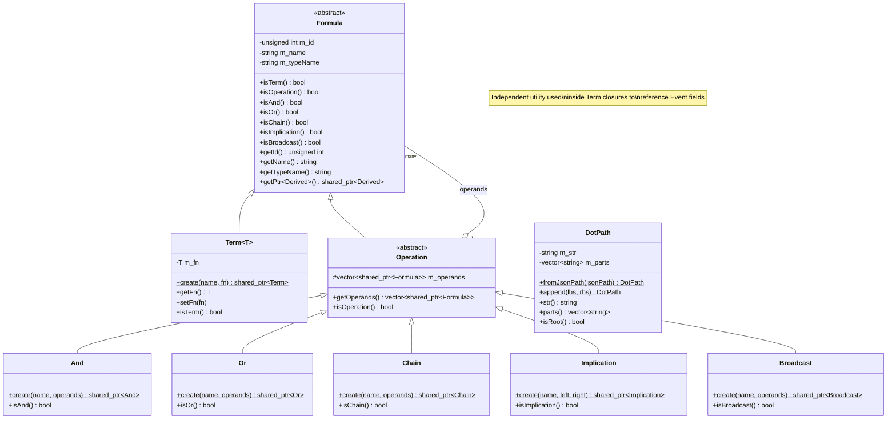
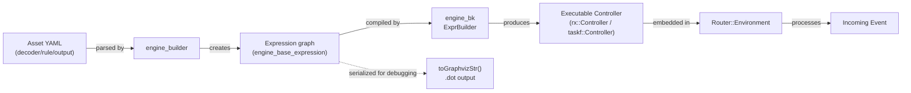

# Engine Base Expression Module

## Introduction

The **`engine_base_expression`** module is a foundational component of the [Wazuh Engine Core (C++)](Wazuh_Engine_Core_(C++).md). It defines the **Formula/Expression graph model**, a lightweight, backend-agnostic description of boolean/logical computations over an `Event`. This graph model is the intermediate representation used by higher-level engine components (such as the [`engine_builder`](engine_builder.md) and [`engine_bk`](engine_bk.md) modules) to describe how decoders, rules, filters and outputs are combined and executed.

Rather than performing computation itself, this module provides:

- A small hierarchy of **Formula** classes (`Term`, `Operation`, `And`, `Or`, `Chain`, `Implication`, `Broadcast`) that describe *what* should be computed and in *what order/relationship*, without specifying *how* it is executed.
- A `DotPath` utility class for referencing nested fields inside an `Event` using dot-separated (or JSON-pointer-derived) paths.
- A Graphviz (`.dot`) serialization utility (`toGraphvizStr`) used for debugging, tracing and visualizing the resulting expression graphs (e.g., via `engine-suite`'s `generate_graph` tooling).

This module is intentionally minimal and has almost no external dependencies beyond the C++ standard library and `fmt`, making it usable across the entire engine codebase (builder, backend, router, tester, etc.) without introducing coupling to any particular execution strategy.

---

## Purpose and Core Functionality

### 1. Formula / Expression Graph

The central abstraction is `base::Formula`, an abstract, reference-counted (`std::enable_shared_from_this`) node in a directed graph. Every node:

- Has a unique numeric `id`, a `name`, and a `typeName`.
- Can only be owned via `std::shared_ptr` (constructors are protected; nodes are created through static `create()` factory methods).
- Exposes type-check helper methods (`isTerm()`, `isOperation()`, `isAnd()`, `isOr()`, `isChain()`, `isImplication()`, `isBroadcast()`) used by consumers to safely downcast (`getPtr<Derived>()`) without RTTI-based `dynamic_cast` at every call site.

Two main specializations exist:

| Class | Kind | Description |
|---|---|---|
| `Term<T>` | Leaf | Wraps a callable of type `T` (typically `std::function<bool(Event)>`) representing an atomic computation (e.g., a single filter, mapping operation, or parser step). |
| `Operation` | Internal node | Holds a vector of child `Formula` operands and describes how they should be logically combined. |

`Operation` is further specialized into:

- **`And`** — All operands must evaluate to `true`, evaluated sequentially; short-circuits on the first `false`.
- **`Or`** — Operands evaluated sequentially while `false`; short-circuits on the first `true`.
- **`Chain`** — All operands are always evaluated regardless of result; the aggregate result is always `true`. Used for pipelines/sequences of transformations (e.g., decoder stages) where propagation should not stop on partial failure.
- **`Implication`** — Exactly two operands (`left`, `right`). If `left` is `true`, `right` is evaluated and its result becomes the result; if `left` is `false`, the result is `false` without evaluating `right`. Used to model conditional stages (e.g., "if this filter matches, then apply this mapping").
- **`Broadcast`** — Distributes/fans-out computation to all operands (used to model routing/broadcast semantics, e.g., sending an event to multiple independent sub-graphs).

Importantly, `Formula`/`Operation`/`And`/`Or`/etc. **do not implement `compute()` themselves** — they are purely descriptive. The actual runtime semantics (short-circuiting, sequential execution, tracing, parallelism) are implemented by backend controllers in the [`engine_bk`](engine_bk.md) module (`bk::rx::ExprBuilder`, `bk::taskf::ExprBuilder`, `TaskAnd`, `TaskOr`, `TaskChain`, `TaskImplication`, `TaskBroadcast`, `TaskTerm`), which walk this graph and translate it into an executable form (e.g., an RxCpp observable chain or a task-based functional composition).

### 2. Graph Visualization (`toGraphvizStr`)

`base::toGraphvizStr(Expression expression)` performs a depth-first traversal of the Formula graph and emits a [Graphviz DOT](https://graphviz.org/) representation, where:

- Each `Formula` node becomes a labeled cluster/node showing its name and id.
- Each `Operation`'s operands become directed edges to their children, labeled with their operand index.

This is used by engine developer tooling (e.g., `engine_integration`'s `generate_graph` command, and internal debug/trace utilities) to visually inspect how a policy, decoder, or rule set has been compiled into an expression graph.

### 3. DotPath

`DotPath` is a small value-type utility (not part of the Formula hierarchy, but co-located in `engine_base` because it is used pervasively by `Term` functions to reference fields inside an `Event`). It:

- Parses a dot-separated string (e.g., `"source.ip"`) into path segments, supporting escaped dots.
- Can be constructed from a JSON-Pointer-style path (`fromJsonPath`), converting `/a/b~1c` (`~0`/`~1` escapes) into the equivalent dot-path representation.
- Is hashable and formattable (`fmt::formatter<DotPath>` specialization) so it can be used as a key in hash maps/sets and printed directly in log/trace messages.
- Supports concatenation via the static `append()` helper.

`DotPath` is typically used inside the closures wrapped by `Term<T>` to know which field(s) of the `Event` a given operation should read or write.

---

## Architecture

### Class Diagram



### Component/File Layout

```mermaid
graph TD
    subgraph engine_base_expression["engine_base_expression module"]
        H["expression.hpp\n(Formula, Term, Operation,\nAnd, Or, Chain, Implication, Broadcast)"]
        C["expression.cpp\n(toGraphvizStr, id generation,\nclass implementations)"]
        D["dotPath.hpp\n(DotPath utility)"]
        C --> H
    end

    subgraph consumers["Consumers"]
        BUILDER["engine_builder\n(builds Expression graphs\nfrom policy/decoder/rule assets)"]
        BK["engine_bk\n(compiles Expression graph\ninto executable controller)"]
        TOOLS["engine_integration CLI\n(generate_graph command)"]
        ROUTER["Router\n(uses compiled expressions\nvia bk::Controller)"]
    end

    BUILDER -->|constructs And/Or/Chain/\nImplication/Broadcast/Term nodes| H
    BK -->|traverses Formula graph,\nproduces executable form| H
    TOOLS -->|calls| C
    ROUTER -->|executes compiled expression\n(indirectly, via bk)| BK
```

---

## How the Module Fits into the Overall System

`engine_base_expression` sits at the bottom of the Wazuh Engine's compilation pipeline for policies, decoders, rules and outputs:

1. **Definition stage** — The [`engine_builder`](engine_builder.md) module (specifically `builder_opfilter`, `builder_opmap`, `builder_optransform`, and `builder_policy`) constructs `Term` leaves (wrapping the actual filter/map/transform lambdas) and combines them using `And`, `Or`, `Chain`, `Implication`, and `Broadcast` nodes to represent the logic of an asset (decoder, rule, output, filter) and, ultimately, of a whole policy graph.
2. **Compilation stage** — The [`engine_bk`](engine_bk.md) module's `ExprBuilder` implementations (`bk::rx::ExprBuilder`, `bk::taskf::ExprBuilder`) walk the `Formula` graph produced above and translate it into an executable representation — either an RxCpp-based reactive pipeline or a task-functional (`TaskAnd`, `TaskOr`, `TaskChain`, `TaskImplication`, `TaskBroadcast`, `TaskTerm`) composition — while preserving the logical semantics described by the graph.
3. **Execution stage** — The compiled controller is embedded into an `Environment` and orchestrated by the [Router](Router.md) module, which feeds `Event`s through the compiled expression to make routing/decoding/rule decisions.
4. **Debug/inspection stage** — Tools such as `engine_integration`'s `generate_graph` (in the [Engine Administration CLI Tools (Python)](Engine_Administration_CLI_Tools_(Python).md) domain) invoke `toGraphvizStr` (indirectly, through the C++ engine or dumped artifacts) to produce visual `.dot` graphs of a policy/asset, aiding developers in debugging complex rule/decoder logic.



Because the Formula hierarchy has no dependency on how events are actually evaluated, the same graph can, in principle, be compiled by different backends (reactive vs. task-based), which is exactly how `engine_bk` is structured (two independent `ExprBuilder` implementations under `bk/src/rx` and `bk/src/taskf`).

---

## Key Data Structures

### `Expression` alias

```cpp
using Expression = std::shared_ptr<Formula>;
```

All public APIs in the builder and backend modules operate on this shared-ownership alias, allowing sub-graphs to be freely shared/reused (e.g., a common filter reused across multiple rules) without duplicating memory.

### `Formula` identity & introspection

- `unsigned int m_id` — globally unique, monotonically increasing id (atomic counter in `expression.cpp`), used for graph traversal/deduplication and for labeling nodes in Graphviz output.
- `std::string m_name` / `m_typeName` — human-readable identifiers used in logs, traces, and diagnostic graphs.
- `getPtr<Derived>()` — safe downcast helper that throws a descriptive `std::runtime_error` (via `fmt::format`) if the requested type does not match the actual runtime type, instead of causing undefined behavior.

### `DotPath`

- Internally stores both the canonical string (`m_str`) and the split parts (`m_parts`) to avoid repeated parsing.
- `fromJsonPath()` converts RFC 6901-style JSON Pointers (with `~0`/`~1` escaping) into the dot-path representation used throughout the engine's field-reference APIs.
- Specializes `std::hash<DotPath>` and `fmt::formatter<DotPath>`, making it a first-class citizen for use in `unordered_map`/`unordered_set` keys and in `fmt`/logging calls.

---

## Process Flow: Building and Evaluating an Expression

```mermaid
sequenceDiagram
    participant Builder as engine_builder
    participant Expr as engine_base_expression
    participant Bk as engine_bk (ExprBuilder)
    participant Ctrl as Compiled Controller
    participant Evt as Event

    Builder->>Expr: Term::create("filterX", fn)
    Builder->>Expr: And::create("stageA", {term1, term2})
    Builder->>Expr: Chain::create("assetPipeline", {stageA, stageB})
    Builder->>Expr: Broadcast::create("policyGraph", {asset1, asset2})
    Note over Builder,Expr: Graph is purely descriptive;<br/>no evaluation happens yet

    Builder->>Bk: buildExpression() returns root Expression
    Bk->>Expr: traverse graph (isAnd/isOr/isChain/... isTerm)
    Bk->>Ctrl: build executable pipeline (rx or taskf)

    Evt->>Ctrl: process(event)
    Ctrl->>Ctrl: evaluate Term functions,<br/>apply And/Or/Chain/Implication/Broadcast semantics
    Ctrl-->>Evt: mutated Event / result
```

---

## Relationships to Other Modules

| Related Module | Relationship |
|---|---|
| [`engine_bk`](engine_bk.md) | Consumes the `Formula`/`Expression` graph and compiles it into an executable controller (`rx::Controller`, `taskf::Controller`). Implements the actual runtime semantics of `And`, `Or`, `Chain`, `Implication`, and `Broadcast`. |
| [`engine_builder`](engine_builder.md) | Primary producer of `Expression` graphs: `opfilter`, `opmap`, `optransform` builders create `Term` leaves; `policy`/`factory.cpp` (`buildExpression`) assembles them into `And`/`Or`/`Chain`/`Implication`/`Broadcast` structures representing decoders, rules, outputs, and whole policies. |
| [`Router`](Router.md) | Uses the compiled controller (built from this module's graph) inside an `Environment` to route and process events at runtime. |
| `engine_base_logging` | Sibling module under `engine_base`; independent of expression but often used alongside it for tracing graph evaluation. |
| `engine_base_patterns` | Sibling module providing generic patterns (`Builder`, `AbstractHandler`, `Singleton`, etc.), some of which underpin the `create()`-based factory idiom used here. |
| `engine_base_core_types` | Sibling module providing basic value types (`Name`, `Result`, `Timer`) sometimes used alongside `DotPath` in field/result handling. |
| Engine Administration CLI Tools (`engine_integration`, `engine_policy`) | Indirectly rely on the Graphviz export (`toGraphvizStr`) for visualizing compiled policies/integrations during development and troubleshooting. |

---

## Design Notes & Conventions

- **Factory-only construction**: All concrete Formula subclasses expose a `[[nodiscard]] static create(...)` method and hide their constructors as `protected`, guaranteeing that every node is managed by a `shared_ptr` and can safely use `shared_from_this()` (via `getPtr<Derived>()`).
- **No virtual `compute()`**: This is a deliberate design choice to keep the description layer decoupled from execution strategy, enabling multiple backend implementations (see `engine_bk`) to interpret the same graph differently (e.g., synchronous task execution vs. reactive streams).
- **Type-check methods over RTTI**: `isAnd()`, `isOr()`, etc., avoid the cost and fragility of repeated `dynamic_cast` when backend code needs to branch on node type during traversal.
- **Immutability of graph shape after construction**: Operands are set at construction time via `create()`; the only mutable aspect exposed is `Term::setFn()`, allowing a leaf's function to be rebound (used in some builder scenarios where a placeholder term is patched with its final implementation).
