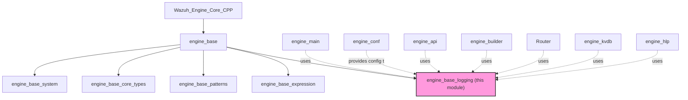
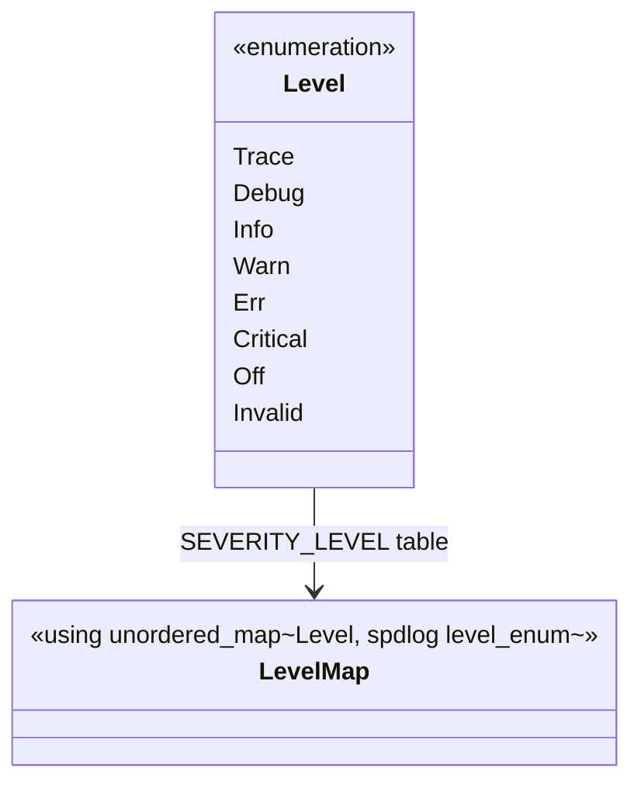
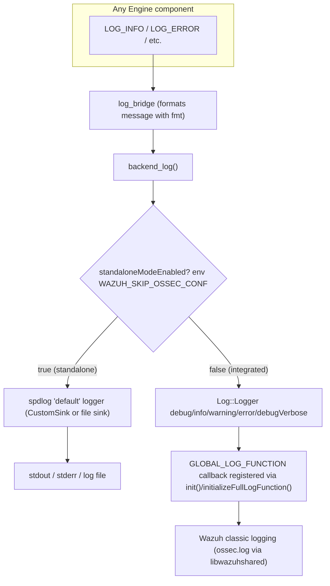
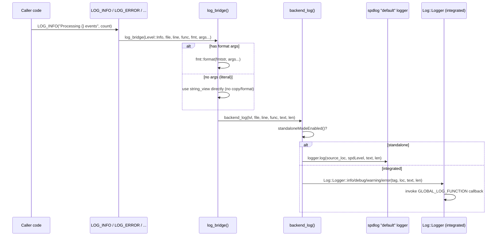
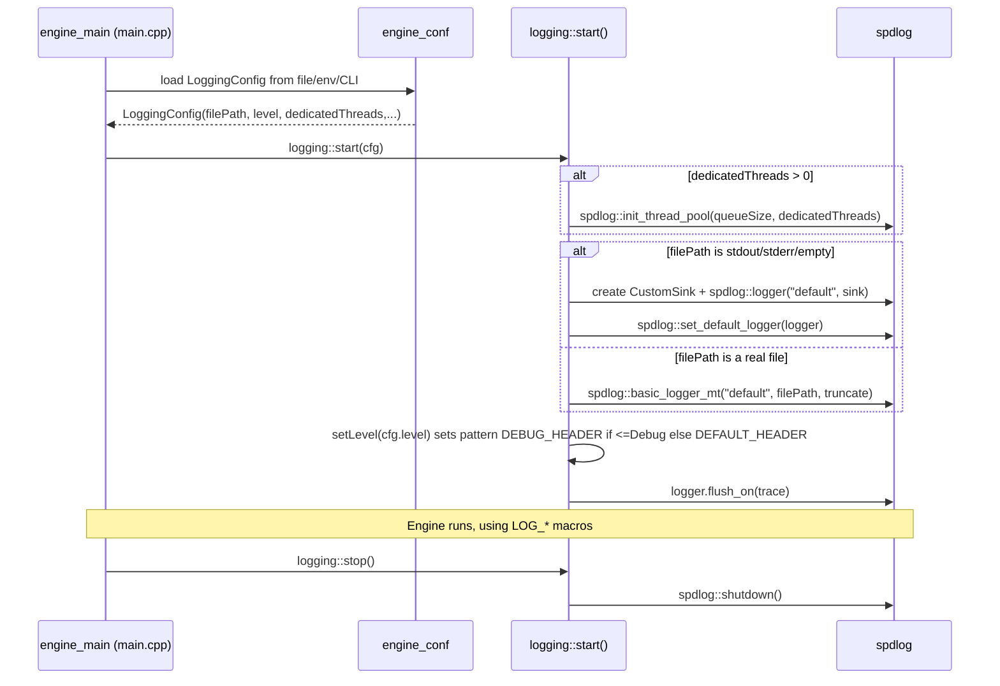
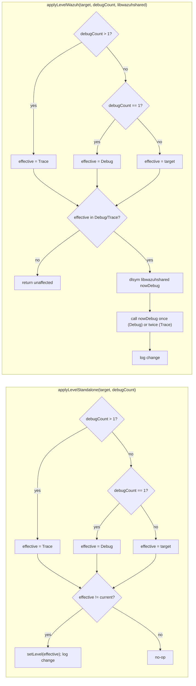

# Engine Base Logging Module

## Introduction

The **`engine_base_logging`** module is the foundational logging subsystem of the Wazuh Engine (C++). It provides a single, unified API — the `logging` namespace and the `LOG_*` macro family — that every other Engine component (API handlers, builder, router, KVDB, HLP, etc.) uses to emit diagnostic and operational messages.

Its defining characteristic is **dual-mode operation**:

1. **Standalone mode** — when the Engine runs as an independent process (`wazuh-engine` binary or test tools), logging is implemented directly on top of [spdlog](https://github.com/gabime/spdlog), writing to stdout/stderr or a file with configurable verbosity, flush policy, and optional asynchronous worker threads.
2. **Integrated ("Wazuh callback") mode** — when the Engine is embedded as a module inside the classic Wazuh daemons (e.g. `wazuh-analysisd`), log records are forwarded to the legacy Wazuh C logging facility (`Log::Logger` / `nowDebug()` from `libwazuhshared`) so that all logs share the same destination, rotation, and format as the rest of the manager.

This module hides that distinction behind one consistent API (`LOG_INFO`, `LOG_DEBUG`, `LOG_ERROR`, etc.), so calling code never needs to know which backend is active.

This document describes the module's internal architecture, its data flow, and how it fits into the broader `engine_base` and `Wazuh_Engine_Core_(C++)` module family. For information about other `engine_base` sibling components, see [Wazuh_Engine_Core_(C++)](Wazuh_Engine_Core_(C++).md) and [engine_base](engine_base.md).

---

## 1. Position in the System

`engine_base_logging` is one of five children of the `engine_base` module:



Because virtually **every** Engine subsystem includes `base/logging.hpp` to emit messages, this module has an extremely high fan-in dependency but almost no fan-out — it depends only on:

- **spdlog** (external, for standalone-mode formatting/sinks)
- **`shared_modules/utils/loggerHelper.h`** (`Log::Logger`, used in integrated mode) — see [common_helpers](common_helpers.md) / [Shared_Modules_Infrastructure_(C++)](Shared_Modules_Infrastructure_(C++).md)
- **`commonDefs.h`** (declares `full_log_fnc_t`, the C callback signature used by the legacy Wazuh logging bridge)

---

## 2. Core Components

| Component | File | Responsibility |
|---|---|---|
| `logging::Level` | `logging.hpp` | Enum of severity levels (`Trace`…`Off`) independent of spdlog. |
| `logging::LoggingConfig` | `logging.hpp` | POD configuration struct consumed by `logging::start()`. |
| `logging::verbosityToLevel` | `logging.hpp` | Maps a CLI verbosity counter (`-v`, `-vv`) to a `Level`. |
| `logging::CustomSink` | `logging.cpp` | Custom spdlog sink that routes `warn+` to `stderr` and the rest to `stdout`. |
| `logging::getLevel` / `setLevel` | `logging.cpp` | Runtime getter/setter for the active log level. |
| `logging::start` / `stop` | `logging.cpp` | Lifecycle management of the spdlog "default" logger. |
| `logging::testInit` | `logging.cpp` | Lazy, idempotent initializer used by unit tests. |
| `logging::backend_log` / `log_bridge` | `logging.hpp` | Internal dispatch functions used by the `LOG_*` macros. |
| `logging::standaloneModeEnabled` | `logging.cpp` | Detects execution mode via the `WAZUH_SKIP_OSSEC_CONF` environment variable. |
| `logging::applyLevelStandalone` / `applyLevelWazuh` | `logging.cpp` | Reconcile configured log level with CLI `-d` debug flags, per mode. |
| `LOG_TRACE` … `LOG_CRITICAL` (+ `_L` variants) | `logging.hpp` | Public macro API used throughout the Engine codebase. |

---

## 3. Data Structures

### 3.1 `Level` enum and mapping



`SEVERITY_LEVEL` is the canonical translation table between the Engine's own `Level` enum and spdlog's `level::level_enum`. `levelToStr()` / `strToLevel()` provide bidirectional string conversion (`"trace"`, `"debug"`, `"info"`, `"warning"`, `"error"`, `"critical"`, `"off"`) used when parsing configuration files (see [engine_conf](engine_base.md)) and CLI arguments (see `engine_main`).

### 3.2 `LoggingConfig`

```cpp
struct LoggingConfig
{
    std::string filePath {STD_OUT_PATH};
    Level level {Level::Info};
    const uint32_t flushInterval {DEFAULT_LOG_FLUSH_INTERVAL};
    const uint32_t dedicatedThreads {DEFAULT_LOG_THREADS};
    const uint32_t queueSize {DEFAULT_LOG_THREADS_QUEUE_SIZE};
    bool truncate {false};
};
```

| Field | Default | Meaning |
|---|---|---|
| `filePath` | `/dev/stdout` | Destination. `/dev/stdout`, `/dev/stderr`, or empty → console via `CustomSink`; any other path → file logger (`spdlog::basic_logger_mt`). |
| `level` | `Info` | Initial severity threshold. |
| `flushInterval` | `1` ms | Reserved for periodic-flush policies. |
| `dedicatedThreads` | `0` | If > 0, spdlog's async thread pool is initialized (`spdlog::init_thread_pool`). |
| `queueSize` | `8192` | Async queue depth when `dedicatedThreads > 0`. |
| `truncate` | `false` | Whether the log file is truncated on start (useful for test/tool runs). |

This structure is populated by `engine_conf` (`conf.hpp` / `fileLoader.hpp`) from the Engine's YAML/env configuration and passed to `logging::start()` during process bootstrap in `engine_main` (`main.cpp`).

---

## 4. Dual-Mode Architecture



### 4.1 Mode Detection

`standaloneModeEnabled()` performs a **lazy, cached** check (static local variable) of the `WAZUH_SKIP_OSSEC_CONF` environment variable. If truthy, the Engine assumes it runs standalone (no `ossec.conf`, no parent Wazuh daemon) and routes all logs through spdlog. Otherwise, it is assumed to run embedded inside a Wazuh daemon and routes through the legacy `Log::Logger` bridge.

### 4.2 Integrated-Mode Callback Registration

In integrated mode, the actual sink is external: a C function pointer registered once via the exported `init(full_log_fnc_t callback)` function (declared `extern "C"`), which stores the callback through `Log::assignLogFunction()` (see `loggerHelper.h` in [Shared_Modules_Infrastructure_(C++)](Shared_Modules_Infrastructure_(C++).md)). This is how the classic C daemon (`wazuh_modules/wm_router.c`, `wazuh_modules/wm_content_manager.c`, etc.) wires its own logging function into the Engine shared library at load time.

---

## 5. Logging Macro & Dispatch Flow



Key design points:

- **Zero-copy fast path**: when a `LOG_*` call has no interpolation arguments, `log_bridge` skips `fmt::format` entirely and passes the raw string view — avoiding allocation for static log literals (a common case for trace/debug guards).
- **Source location propagation**: `__FILE__`, `__LINE__`, and the calling function name (`SPDLOG_FUNCTION`, or explicit via the `_L` macro variants such as `LOG_DEBUG_L`) are always forwarded to both backends, preserving file/line info in `ossec.log` even in integrated mode.
- **Level translation**: `backend_log`'s `switch` statement maps `logging::Level` to the corresponding `Log::Logger` static method; `Critical` collapses into `error` in integrated mode since the legacy API has no distinct critical level.

---

## 6. Initialization & Lifecycle (Standalone Mode)



- **`CustomSink`** (a custom `spdlog::sinks::sink` implementation) is used instead of spdlog's built-in stdout/stderr color sinks so that message severity determines the output stream at write time: `warn` and above go to `stderr`, everything else to `stdout`. It owns a `spdlog::pattern_formatter` that can be swapped via `set_pattern`/`set_formatter`.
- **Log header format** switches automatically based on level: `LOG_DEBUG_HEADER` (includes file/function/line) for `Debug`/`Trace`, `DEFAULT_LOG_HEADER` (compact) otherwise — set inside `setLevel()`.
- **`testInit(Level lvl = Warn)`** is the idiomatic entry point for unit tests (see `Unit_Tests_-_*` modules that link against `engine_base`): it only initializes the "default" logger if one does not already exist, making it safe to call from every test fixture's `SetUp()`.

---

## 7. Runtime Level Reconciliation

Both execution modes must reconcile three potential sources of the desired log level: the **persisted configuration** (`target`), the **CLI debug flag count** (`-d`, `-dd`), and (for integrated mode) the **legacy daemon's own debug state**.



- `applyLevelStandalone` directly mutates the spdlog logger's level via `setLevel()`.
- `applyLevelWazuh` cannot set an explicit numeric level on the legacy logger; instead it toggles the classic Wazuh `nowDebug()` counter (resolved dynamically via `dlsym` from the `libwazuhshared` handle) — calling it once bumps verbosity to `debug`, twice to `trace`-equivalent. This function throws `std::runtime_error` if the `nowDebug` symbol cannot be resolved, guarding against a mismatched or missing shared library.

This dual-path level application is invoked from `engine_main` during startup and whenever a configuration reload occurs (e.g., via `engine_conf`'s file watcher or CLI signal), ensuring consistent behavior with either backend.

---

## 8. Public Macro API

| Macro | Level | Notes |
|---|---|---|
| `LOG_TRACE(msg, ...)` | Trace | Most verbose; typically compiled out or filtered in production. |
| `LOG_DEBUG(msg, ...)` | Debug | Developer diagnostics. |
| `LOG_INFO(msg, ...)` | Info | Default operational level. |
| `LOG_WARNING(msg, ...)` | Warn | Non-fatal anomalies. |
| `LOG_ERROR(msg, ...)` | Err | Recoverable errors. |
| `LOG_CRITICAL(msg, ...)` | Critical | Severe/unrecoverable conditions. |
| `LOG_*_L(functionName, msg, ...)` | (same) | Explicit function-name override, used for lambdas (`getLambdaName()` composes `ParentScope::<lambda>`) where `SPDLOG_FUNCTION` would otherwise resolve to an unhelpful compiler-generated name. |

All macros use `fmt::runtime(msg)` so format strings may be dynamic (e.g., built from configuration), at the cost of losing compile-time format-string validation — a deliberate trade-off for flexibility across the Engine's many call sites.

### Usage Example

```cpp
#include <base/logging.hpp>

void ExprBuilder::build(const Asset& asset)
{
    LOG_DEBUG("Building asset '{}'", asset.name());
    if (!asset.isValid())
    {
        LOG_ERROR("Invalid asset '{}': {}", asset.name(), asset.error());
        throw std::runtime_error("build failed");
    }
    LOG_TRACE_L(getLambdaName("ExprBuilder::build", "validate").c_str(), "validation lambda executed");
}
```

---

## 9. Relationship to Other Modules

| Related module | Relationship |
|---|---|
| [engine_base](engine_base.md) | Parent module; sibling of `engine_base_core_types`, `engine_base_expression`, `engine_base_patterns`, `engine_base_system`. |
| `engine_base_core_types` (see [engine_base](engine_base.md)) | Core types (`Result`, `Name`, `Timer`) are frequently logged via this module but have no direct code dependency. |
| `engine_base_system` (see [engine_base](engine_base.md)) | `process.hpp`'s daemonization helpers (`goDaemon`, privilege separation) run before logging is fully initialized; `engine_main` sequences `logging::start()` appropriately relative to `goDaemon()`. |
| `engine_main` (see [engine_base](engine_base.md) parent tree) | Owns the top-level call to `logging::start()`/`stop()` and `applyLevel*()`, using CLI-parsed `Options` and `LoggingConfig` from `engine_conf`. |
| `engine_conf` | Supplies the parsed `LoggingConfig` (file path, level, threading) from YAML/environment sources. |
| [Shared_Modules_Infrastructure_(C++)](Shared_Modules_Infrastructure_(C++).md) (`common_helpers` → `loggerHelper.h`) | Provides `Log::Logger` and `Log::assignLogFunction`, the integrated-mode backend used by `backend_log()`. |
| `Wazuh_Modules_Daemon_(C)` (`wazuh_modules/*.c`) | The classic C daemon modules call the exported `init(full_log_fnc_t)` C function to register their own logging callback, enabling integrated-mode dispatch. |
| `engine_api`, `engine_builder`, `engine_kvdb`, `engine_hlp`, `Router`, `Store` (see [Wazuh_Engine_Core_(C++)](Wazuh_Engine_Core_(C++).md)) | Consume the `LOG_*` macros for diagnostics; no other module reimplements logging. |
| `Unit_Tests_-_*` (C++ Engine test suites) | Call `logging::testInit()` in test fixtures to guarantee the "default" spdlog logger exists before assertions/log-dependent code runs. |

---

## 10. Design Notes & Constraints

- **Header-only dispatch, single-TU state**: The templated `log_bridge`/`backend_log` functions live in the header for zero-overhead inlining at call sites, while spdlog's static state (loggers, thread pools) is instantiated exactly once in `logging.cpp` to avoid multiple-definition issues when this header is included across many shared libraries (explicitly called out in the source comment referencing a known spdlog GitHub issue).
- **No dynamic level per-callsite**: Level filtering happens inside spdlog (`should_log`) or inside `Log::Logger`'s own level check, not in `backend_log`, keeping the hot path minimal.
- **Environment-driven mode switch**: The `WAZUH_SKIP_OSSEC_CONF` variable is the *only* signal used to pick a backend; there is no runtime API to force a mode, which keeps behavior predictable and testable via environment manipulation in test harnesses.
- **Thread-safety**: Both spdlog loggers (`basic_logger_mt`) and the `CustomSink` (guarded internally by spdlog's sink locking) are safe for concurrent use across the Engine's multi-threaded router/worker architecture (see [Wazuh_Engine_Core_(C++)](Wazuh_Engine_Core_(C++).md), `Router` submodule).
