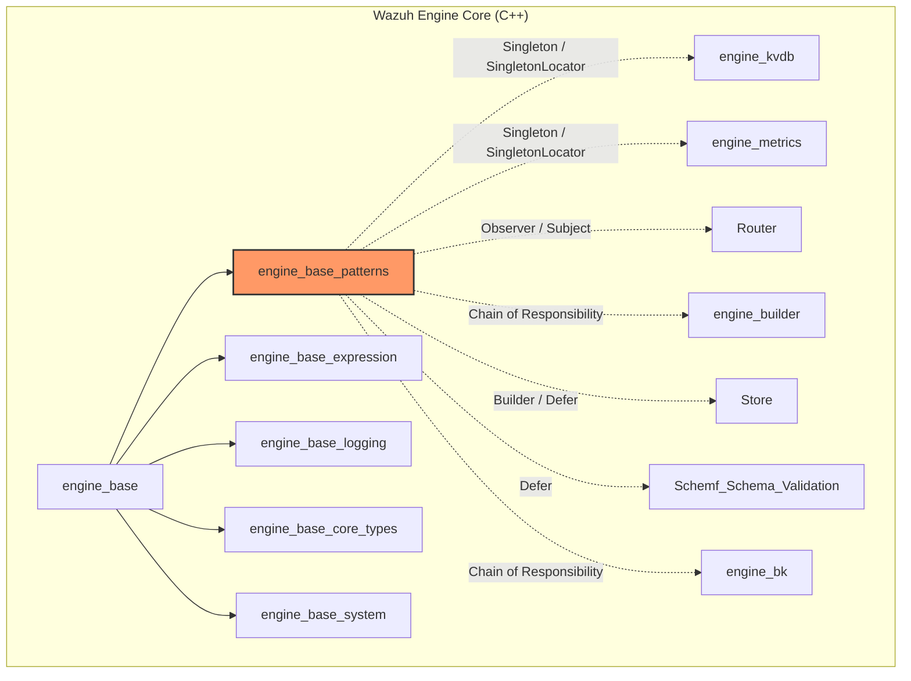
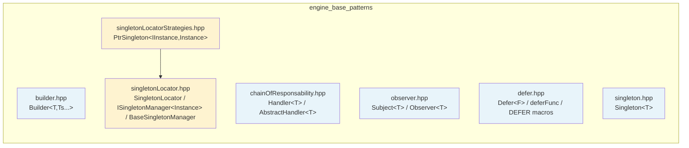
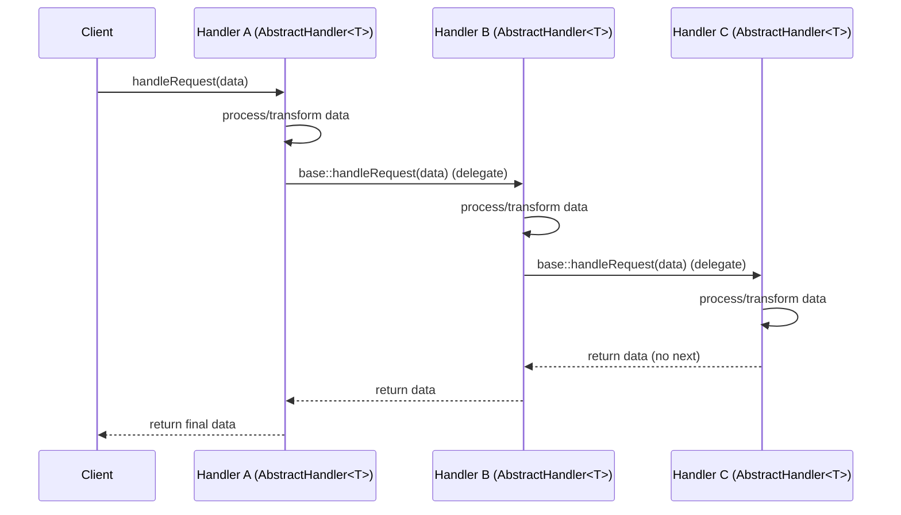
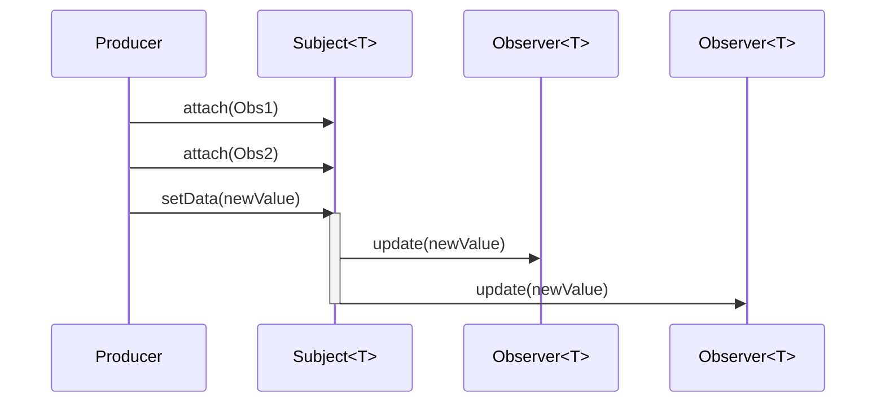
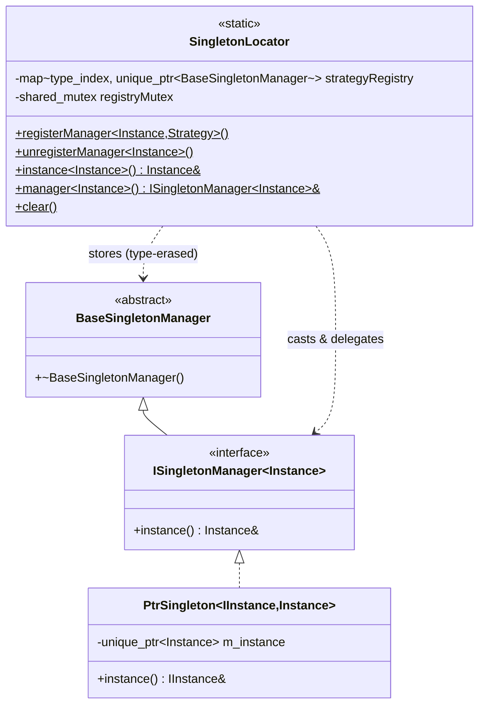
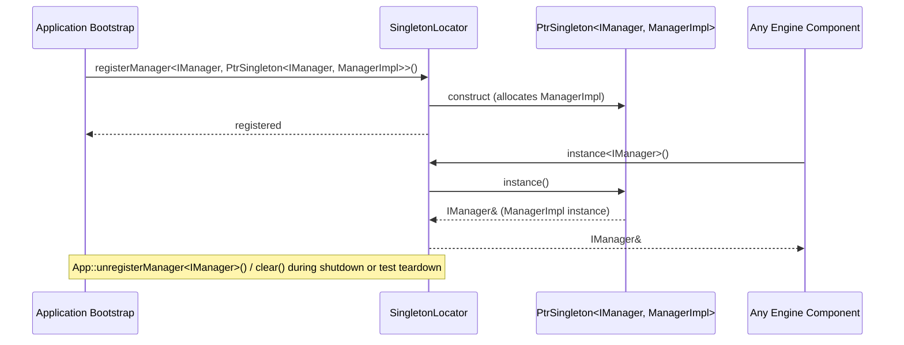
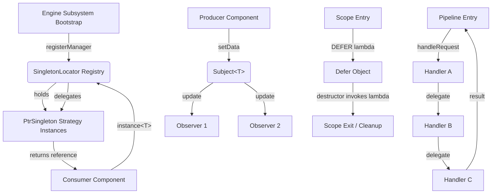

# Engine Base Patterns

## Introduction

`engine_base_patterns` is a small, header-only C++ template library that lives inside the **[engine_base](engine_base.md)** module of the **[Wazuh Engine Core](Wazuh_Engine_Core_(C++).md)**. It provides a set of generic, reusable software-design-pattern primitives — **Builder**, **Chain of Responsibility**, **Observer/Subject**, **Defer** (RAII scope-guard), **Singleton**, and a heterogeneous **Singleton Locator/Registry** — that are used across the Engine's higher-level subsystems (builder, router, metrics, kvdb, store, etc.) to achieve consistent object construction, pipeline processing, event notification, deterministic cleanup, and dependency-injection-style access to global services.

Unlike most modules in the Engine, this module contains **no business logic**: every component is a template class implemented entirely in a header file, with no corresponding `.cpp` translation unit. Its sole purpose is to be `#include`d by other Engine components that need a well-tested, allocation-light implementation of a common pattern instead of hand-rolling one.

## Purpose and Scope

| Pattern | Header | Responsibility |
|---|---|---|
| Builder | `builder.hpp` | Generic static factory / fluent-build helper for constructing objects of type `T`. |
| Chain of Responsibility | `chainOfResponsability.hpp` | Linked pipeline of `Handler<T>` objects (`AbstractHandler<T>`) that can each transform/inspect a value of type `T` and forward it to the next link. |
| Observer | `observer.hpp` | Thread-safe `Subject<T>` / `Observer<T>` pair for push-based notification of data changes to multiple listeners. |
| Defer | `defer.hpp` | RAII `Defer<F>` object (plus `DEFER`/`DEFER_STATIC` macros) that guarantees a callable is invoked when the enclosing scope ends — Wazuh's equivalent of Go's `defer` or a scope-guard. |
| Singleton | `singleton.hpp` | Classic Meyers'-singleton CRTP base class (`Singleton<T>`) providing a single lazily-constructed, static instance of `T`. |
| Singleton Locator | `singletonLocator.hpp`, `singletonLocatorStrategies.hpp` | A type-safe **service locator/registry** (`SingletonLocator`) that stores one manager (`ISingletonManager<Instance>`) per interface type, decoupling *interface* from *concrete implementation* and *lifetime strategy*. `PtrSingleton<IInstance, Instance>` is the default heap-allocated strategy implementation. |

Because these are pure utility templates, this module has **no runtime dependencies** on other Engine subsystems and no external library dependencies beyond the C++ standard library (`<memory>`, `<mutex>`, `<shared_mutex>`, `<map>`, `<typeindex>`, `<vector>`, `<algorithm>`).

## How This Module Fits Into the System

`engine_base_patterns` is one of five children of **[engine_base](engine_base.md)** (siblings: `engine_base_expression`, `engine_base_logging`, `engine_base_core_types`, `engine_base_system`), which in turn is a foundational library consumed by nearly every other subsystem of the **[Wazuh Engine Core (C++)](Wazuh_Engine_Core_(C++).md)** — including `engine_builder`, `engine_bk`, `engine_kvdb`, `engine_metrics`, `Router`, `Store`, and `Schemf_(Schema_Validation)`. Any Engine component that needs to:

- construct complex objects via a uniform interface (**Builder**),
- run data through a sequence of processing stages (**Chain of Responsibility**),
- broadcast state changes to multiple consumers (**Observer**),
- guarantee cleanup/resource release regardless of exit path (**Defer**), or
- expose exactly one, globally-reachable instance of a manager/service while remaining unit-testable and swappable (**Singleton** / **Singleton Locator**)

can depend on this header-only library rather than reimplementing the pattern. The **Singleton Locator** in particular is the most architecturally significant piece: it is designed so that Engine subsystems can register a concrete singleton behind an abstract interface, and other subsystems can request that interface without knowing the concrete type or its allocation strategy — a lightweight, header-only form of dependency injection used to avoid hard-coded global state while retaining single-instance semantics.



> Note: dotted arrows indicate *typical/likely* consumption based on architectural role, not verified call sites; consult the target module's documentation for confirmed usage.

## Architecture Overview

Each pattern is implemented as an independent, self-contained template — there are no inter-header dependencies except `singletonLocatorStrategies.hpp`, which depends on `singletonLocator.hpp`.



## Component Details

### 1. Builder (`base::utils::patterns::Builder<T, Ts...>`)

A minimal CRTP-style helper offering:
- `static T builder(Ts... args)` — constructs and returns a value of `T` by forwarding arguments to `T`'s constructor.
- `T& build()` — returns a reference to `*this` cast to `T&`, enabling fluent chaining when `T` derives from `Builder<T, ...>`.

This is a lightweight alternative to hand-writing factory methods; it is distinct from (and unrelated to) the domain-specific `Builder` class found in `engine_builder` (`builder_core`), which builds Engine **policies/assets** rather than generic C++ objects.

### 2. Chain of Responsibility (`utils::patterns::Handler<T>` / `AbstractHandler<T>`)

- `Handler<T>` is a pure-virtual interface exposing `setNext`, `setLast`, and `handleRequest(T data) -> T`.
- `AbstractHandler<T>` implements the linking logic (`m_next`) and default forwarding behavior: if a next handler exists, `handleRequest` delegates to it; otherwise it returns the (possibly-transformed) data unchanged.
- Concrete handlers subclass `AbstractHandler<T>` and override `handleRequest` to perform their own processing before/after calling `AbstractHandler<T>::handleRequest` (i.e., calling the base implementation continues the chain).



This pattern is a natural fit for pipeline-style processing found elsewhere in the Engine (e.g., asset/stage evaluation pipelines in `engine_builder`, or job/task dispatch chains).

### 3. Observer (`Subject<T>` / `Observer<T>`)

- `Observer<T>` is an abstract base with an `observerId()` accessor and a pure-virtual `update(T data)` callback.
- `Subject<T>` maintains a `std::vector<std::shared_ptr<Observer<T>>>` protected by a `std::mutex`, exposing:
  - `attach(observer)` — inserts, or **replaces** (by `observerId`) an existing observer.
  - `detach(observerId)` — removes an observer, throwing `std::runtime_error` if not found.
  - `setData(T)` / `notifyObservers(T)` — synchronously invokes `update()` on every registered observer while holding the lock.



Because notification is synchronous and mutex-guarded, this is best suited to lightweight, non-blocking observers (e.g., metrics counters, configuration-change listeners, EPS counters).

### 4. Defer (`Defer<F>` / `deferFunc` / `DEFER` macros)

A templated RAII wrapper: `Defer<F>` stores a callable `F` and invokes it in its destructor. The free function `deferFunc(F)` and convenience macros `DEFER(...)` / `DEFER_STATIC(...)` (which generate a uniquely-named local variable via `__COUNTER__`) let callers write Go-style deferred cleanup:

```cpp
DEFER([&]{ cleanupResource(); });
```

This guarantees the lambda runs when the enclosing scope exits — including via early `return` or exception — making it a common idiom for releasing file handles, locks, or temporary state throughout the Engine (e.g., in `Store`, `Schemf_(Schema_Validation)`, and CLI tools).

### 5. Singleton (`Singleton<T>`)

A classic CRTP Meyers'-singleton base class:

```cpp
template<typename T>
class Singleton {
public:
    static T& instance() { static T s_instance; return s_instance; }
protected:
    Singleton() = default;
    Singleton(const Singleton&) = delete;
    Singleton& operator=(const Singleton&) = delete;
};
```

`T::instance()` returns a function-local static, guaranteeing thread-safe lazy initialization (per the C++11 standard) and a single instance for the lifetime of the process. This is the simplest of the patterns in this module and is appropriate when a hard-coded, non-substitutable singleton is acceptable (e.g., in tests or simple utility classes).

### 6. Singleton Locator (`SingletonLocator`, `ISingletonManager<Instance>`, `PtrSingleton<IInstance, Instance>`)

This is the most sophisticated component in the module — a **type-erased service registry** that decouples *interface*, *implementation*, and *lifetime-management strategy*:

- `BaseSingletonManager` — non-template polymorphic base enabling storage of heterogeneous manager objects in a single container.
- `ISingletonManager<Instance>` — strategy interface with a single method `Instance& instance()`.
- `SingletonLocator` — a static registry (`std::map<std::type_index, std::unique_ptr<BaseSingletonManager>>`) guarded by a `std::shared_mutex`, exposing:
  - `registerManager<Instance, Strategy>()` — instantiates `Strategy` (which must derive from `ISingletonManager<Instance>` and be default-constructible) and stores it keyed by `typeid(Instance)`. Throws `std::logic_error` if a manager is already registered for that type.
  - `unregisterManager<Instance>()` — removes the registered strategy; throws if none exists.
  - `instance<Instance>()` — returns `Instance&` by delegating to the registered strategy's `instance()` method (read-locked).
  - `manager<Instance>()` — returns the raw `ISingletonManager<Instance>&` for advanced use cases.
  - `clear()` — wipes the entire registry (primarily for test teardown).
- `PtrSingleton<IInstance, Instance>` (in `singletonLocatorStrategies.hpp`) — the default strategy: heap-allocates a `std::unique_ptr<Instance>` at construction time and returns it upcast to `IInstance&`. A `static_assert` enforces that `Instance` derives from `IInstance`.



**Typical registration/usage flow:**



This registry pattern allows Engine subsystems (e.g., a KVDB manager, a metrics manager, or a schema validator) to be registered once at startup behind an abstract interface and later resolved by any consumer without a compile-time dependency on the concrete implementation — simplifying testing (mock strategies can be registered instead) and avoiding classic global-singleton anti-patterns (hidden hard-coded dependencies, inability to substitute implementations).

## Data Flow Summary



## Usage Guidance for Contributors

- Prefer **`SingletonLocator`** over the plain **`Singleton<T>`** CRTP base whenever the singleton needs to be mockable/testable or whenever multiple implementations of the same interface might be needed across build configurations (e.g., production vs. test).
- Use **`AbstractHandler<T>`** for any linear processing pipeline where each stage may short-circuit or transform the payload — remember that calling the base class's `handleRequest` is what continues the chain.
- Use **`Subject<T>`/`Observer<T>`** for fan-out notifications where notification order and thread-safety (via the internal mutex) matter; keep `update()` implementations fast since they execute synchronously while the `Subject`'s lock is held.
- Use the **`DEFER`** macro for exception-safe cleanup instead of manual try/catch/finally-style code.
- The **`Builder<T, Ts...>`** template is intentionally minimal; for complex, multi-step construction (e.g., Engine policies), see the domain-specific builder in **[engine_builder](engine_builder.md)** instead.

## Related Documentation

- Parent module: [engine_base](engine_base.md)
- Sibling modules: [engine_base_expression](engine_base_expression.md) · [engine_base_logging](engine_base_logging.md) · [engine_base_core_types](engine_base_core_types.md) · [engine_base_system](engine_base_system.md)
- Top-level module: [Wazuh_Engine_Core_(C++)](Wazuh_Engine_Core_(C++).md)
- Likely consumers: [engine_builder](engine_builder.md) · [engine_bk](engine_bk.md) · [engine_kvdb](engine_kvdb.md) · [engine_metrics](engine_metrics.md) · [Router](Router.md) · [Store](Store.md) · [Schemf_(Schema_Validation)](Schemf_(Schema_Validation).md)
- Analogous generic-utility library in a different subsystem: [shared_utils](shared_utils.md) → [design_patterns](design_patterns.md) (C++ `Builder`, `AbstractHandler`, `Subject`, `Subscriber`, `Provider`, `RoundRobinSelector` under `src/shared_modules/utils/`), which mirrors several of the same pattern implementations for the Shared Modules Infrastructure.
