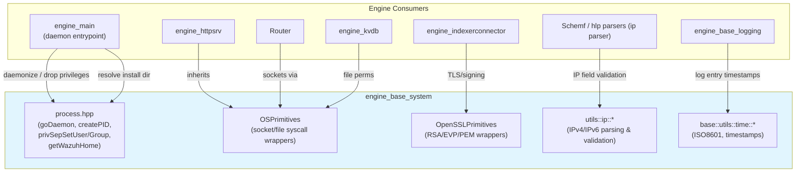
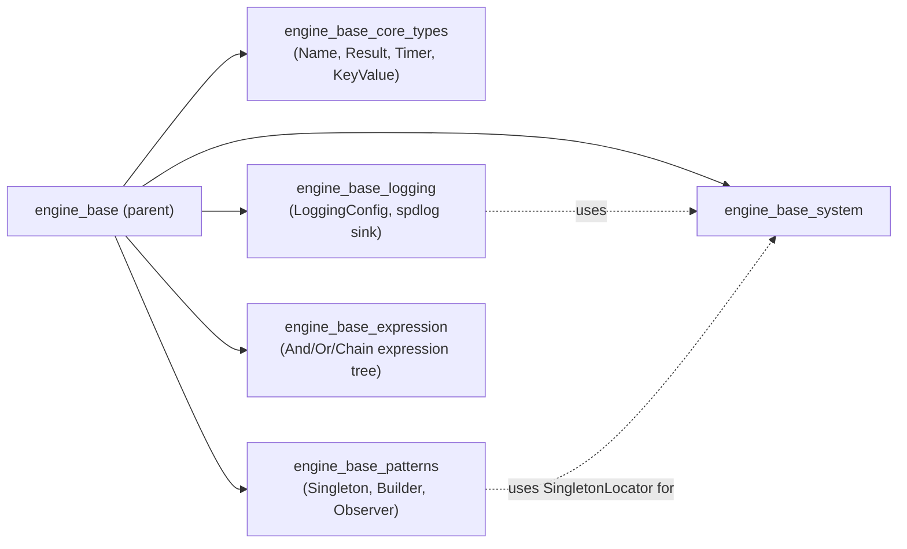
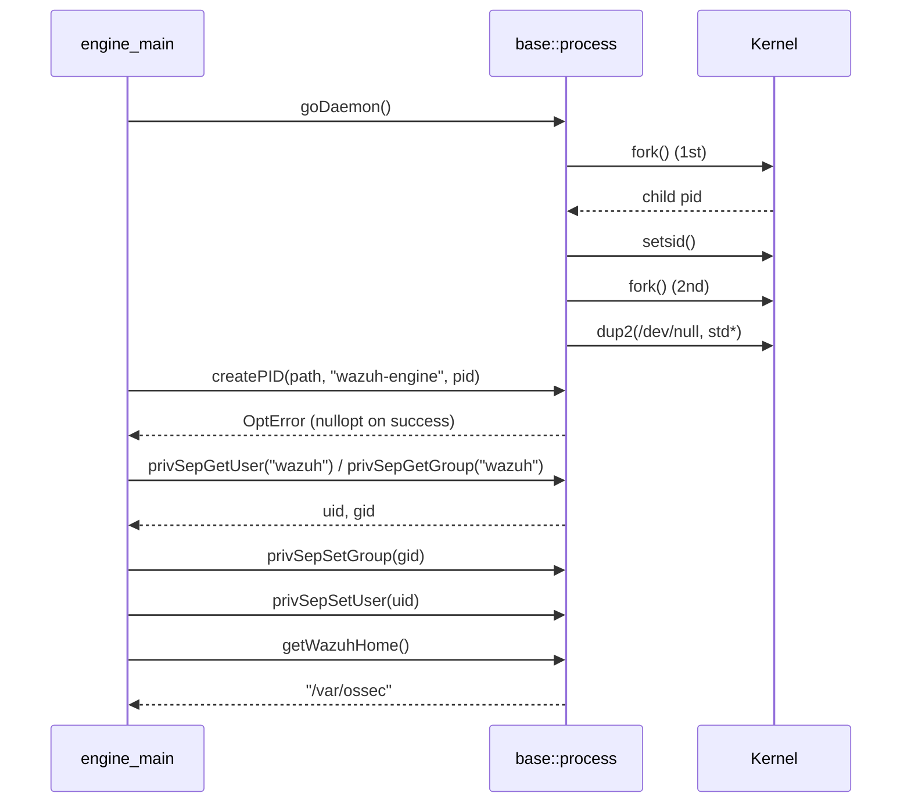
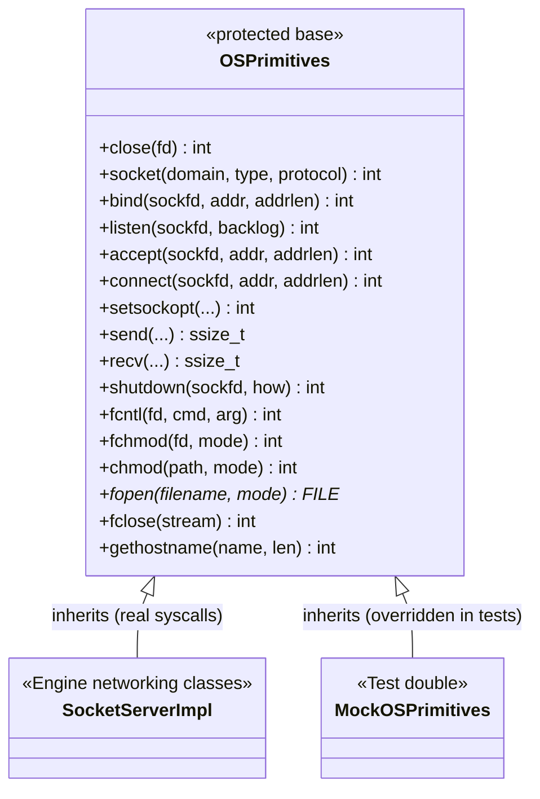
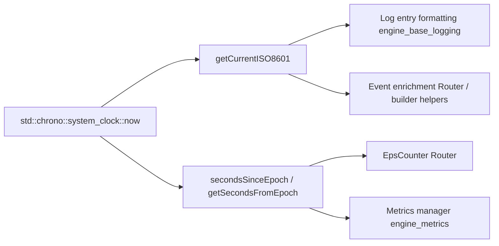
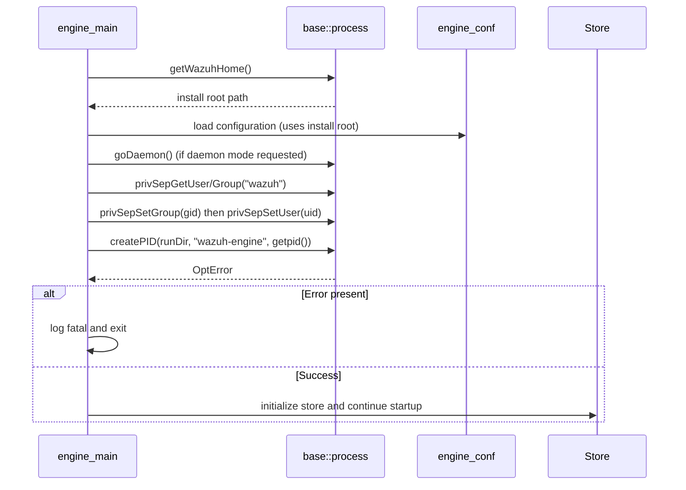
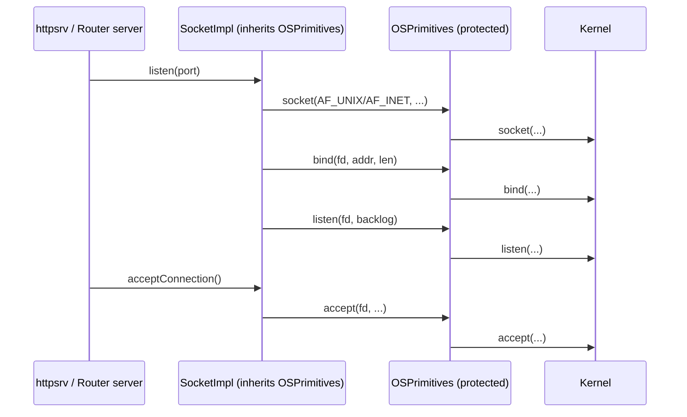

# Engine Base System

## Introduction

`engine_base_system` is the lowest-level system-abstraction layer of the **Wazuh Engine (C++)**. It isolates every direct interaction with the operating system — process lifecycle management, privilege separation, raw POSIX/OpenSSL syscalls, IP address parsing, and time formatting — behind small, focused, dependency-injectable components.

By concentrating all "dirty" OS/library calls (`fork`, `setuid`, `socket`, `RSA_*`, `EVP_*`, `inet_pton`, `gmtime`, …) in this module, the rest of the Engine (builder, router, store, API, etc.) can remain portable, unit-testable, and free of platform-specific `#include`s. Higher-level Engine components consume these primitives through inheritance (`OSPrimitives`, `OpenSSLPrimitives`) or free functions (`base::process::*`, `utils::ip::*`, `base::utils::time::*`).

This module is a child of [engine_base](engine_base.md), sitting alongside [engine_base_core_types](engine_base_core_types.md), [engine_base_logging](engine_base_logging.md), [engine_base_patterns](engine_base_patterns.md), and [engine_base_expression](engine_base_expression.md) within the [Wazuh_Engine_Core_(C++)](Wazuh_Engine_Core_(C++).md) subsystem.

---

## 1. Purpose and Scope

| Concern | Component(s) | Responsibility |
|---|---|---|
| Process lifecycle | `base/process.hpp` | Daemonize the process (double-fork), write PID files, look up UID/GID by name, drop privileges (`setuid`/`setgid`/`setgroups`), resolve the Wazuh installation home directory from `/proc/self/exe`. |
| OS syscall abstraction | `base/utils/osPrimitives.hpp` (`OSPrimitives`) | Protected wrapper around socket/file/fcntl syscalls (`socket`, `bind`, `listen`, `accept`, `connect`, `send`, `recv`, `fopen`, `chmod`, `gethostname`, …) meant to be inherited by network/file classes so unit tests can override/mock individual syscalls. |
| Cryptography primitives | `base/utils/opensslPrimitives.hpp` (`OpenSSLPrimitives`) | Protected wrapper around OpenSSL RSA/EVP/PEM/RAND calls used for message signing/encryption, isolated so higher classes (e.g., key management, secure channel) can be tested without a real OpenSSL backend. |
| IP address utilities | `base/src/utils/ipUtils.cpp` (`utils::ip::*`) | Parse/validate IPv4 & IPv6 strings, convert IPv4 to `uint32_t`, compute netmasks, detect private/special (RFC1918/loopback/link-local/ULA) addresses. |
| Time utilities | `base/src/utils/timeUtils.cpp` (`base::utils::time::*`) | Produce ISO-8601 timestamps (with milliseconds), Wazuh-style timestamps, compact timestamps, and epoch-second helpers used for logging, event timestamps, and metrics. |

These are **cross-cutting utilities**: nearly every Engine subsystem (HTTP server, router, store, kvdb, indexer connector) either daemonizes, checks privileges, opens sockets, signs data, parses an IP, or timestamps an event — and all of that ultimately funnels through this module.

---

## 2. Architecture Overview

### Relationship to sibling modules

---

## 3. Component Details

### 3.1 Process Management (`base/process.hpp`)

Provides the daemon-lifecycle building blocks used by the Engine's main executable and other native daemons.

Key functions:
- **`goDaemon()`** — Performs the classic UNIX double-fork/`setsid` sequence to detach the process from its controlling terminal, redirects `stdin`/`stdout`/`stderr` to `/dev/null`, and sets a restrictive `umask`.
- **`createPID(path, name, pid)`** — Writes a `<name>-<pid>.pid` file with `0640` permissions; returns an `Error` (see [engine_base_core_types](engine_base_core_types.md) `Result`/`Error`) rather than throwing, for graceful startup failure handling.
- **`privSepGetUser(username)` / `privSepGetGroup(groupname)`** — Wrap `getpwnam_r`/`getgrnam_r` with dynamic buffer growth (`ERANGE` handling up to `MAXSTR`), returning `INVALID_UID`/`INVALID_GID` sentinels when not found.
- **`privSepSetUser(uid)` / `privSepSetGroup(gid)`** — Drop privileges via `setgroups`, `setgid`, and `setuid`, mirroring the C-daemon convention found in `headers/privsep_op.h` and `shared/privsep_op.c` (see [Agent_&_Manager_Native_Daemons_(C)](Agent_&_Manager_Native_Daemons_(C).md)).
- **`getWazuhHome()`** — Resolves the Engine's installation root by reading `/proc/self/exe` and stripping the trailing `/bin` segment; used to locate configuration, sockets, and store directories at startup (consumed by `engine_main` and `engine_conf`).

### 3.2 OS Syscall Primitives (`OSPrimitives`)

`OSPrimitives` is a **protected-inheritance base class** exposing thin, inlined wrappers around common POSIX syscalls: `socket`, `bind`, `listen`, `accept`, `connect`, `setsockopt`, `send`, `recv`, `shutdown`, `fcntl`, `fchmod`, `chmod`, `fopen`, `fclose`, `gethostname`.

Design rationale:
- Classes that need networking or file I/O (HTTP server transport, socket clients, log rotation helpers) inherit from `OSPrimitives` instead of calling global syscalls directly.
- In unit tests, a derived **mock** class can override any of these protected methods, enabling deterministic testing of socket/file error paths without a real network/file system.
- This mirrors the equivalent pattern already used in [shared_utils](Shared_Modules_Infrastructure_(C++).md) (`shared_modules/utils/osPrimitives.hpp`, `osPrimitivesImplMac.h`) and the data-provider wrappers layer (`data_provider_wrappers_unix`, `data_provider_wrappers_windows`) — the Engine's copy specializes the same idea for its own networking code paths (see [engine_httpsrv](Wazuh_Engine_Core_(C++).md) and `Router`/`iworker.hpp`).

### 3.3 OpenSSL Primitives (`OpenSSLPrimitives`)

`OpenSSLPrimitives` follows the same protected-inheritance/mocking pattern as `OSPrimitives`, but for cryptographic operations:
- **RSA**: `RSA_size`, `RSA_free`, `RSA_public_encrypt`, `RSA_private_decrypt`, `PEM_read_RSAPrivateKey`, `PEM_read_RSA_PUBKEY`.
- **X.509 / EVP_PKEY**: `PEM_read_X509`, `X509_free`, `X509_get_pubkey`, `EVP_PKEY_free`, `EVP_PKEY_get1_RSA`, `EVP_PKEY_get_base_id`.
- **Symmetric encryption (AES-256-CBC)**: `EVP_CIPHER_CTX_new/free`, `EVP_aes_256_cbc`, `EVP_EncryptInit_ex/Update/Final_ex`, `EVP_DecryptInit_ex/Update/Final_ex`, plus `AES_BLOCK_LENGTH`.
- **Randomness & error introspection**: `RAND_bytes`, `ERR_get_error`, `ERR_reason_error_string`.

This isolates every deprecated-API warning (`RSA_*` functions are deprecated upstream, hence the `#pragma GCC diagnostic ignored "-Wdeprecated-declarations"`) into a single file, and allows components that perform message signing/verification or payload encryption (e.g., secure channel handshakes, key-store integrations — see [keystore](Shared_Modules_Infrastructure_(C++).md)) to be unit tested by mocking these calls.

### 3.4 IP Utilities (`utils::ip`)

Pure functions operating on `std::string` IP representations, built on top of `<arpa/inet.h>`:

| Function | Behavior |
|---|---|
| `IPv4ToUInt(ipStr)` | Parses `"a.b.c.d"`, validates each octet range (0–255), and packs into a big-endian `uint32_t`. Throws `std::invalid_argument` on malformed input. |
| `IPv4MaskUInt(maskStr)` | Accepts either dotted-decimal (`255.255.255.0`) or CIDR prefix-length (`24`) notation and returns the equivalent 32-bit mask. |
| `checkStrIsIPv4` / `checkStrIsIPv6` | Thin wrappers over `inet_pton` for fast validity checks. |
| `isSpecialIPv4Address` | Detects RFC1918 private ranges (`10.0.0.0/8`, `172.16.0.0/12`, `192.168.0.0/16`) and loopback (`127.0.0.0/8`). |
| `isSpecialIPv6Address` | Detects loopback, link-local (`fe80::/10`), and Unique Local Addresses (`fc00::/7`) using `IN6_IS_ADDR_*` macros. |

These utilities back the engine's **HLP `ip` parser** (`engine_hlp`: `parsers/ip.cpp`) and the **`is_ipv4`/`is_ipv6`/`public_ip` filter helpers** in [engine_builder](Wazuh_Engine_Core_(C++).md) (`opfilter/opBuilderHelperFilter.cpp`: `opBuilderHelperIsIpv4`, `opBuilderHelperIsIpv6`, `opBuilderHelperPublicIP`).

### 3.5 Time Utilities (`base::utils::time`)

Provides consistent time formatting for logs, events, and metrics:

| Function | Output | Consumers |
|---|---|---|
| `getCurrentTimestamp()` / `getTimestamp(time, utc)` | `"YYYY/MM/DD hh:mm:ss"` | Legacy Wazuh-style logs |
| `getCurrentDate(separator)` | Date-only portion of the timestamp | Log rotation naming |
| `getCompactTimestamp(time, utc)` | `"YYYYMMDDhhmmss"` | Filenames, snapshot naming |
| `getCurrentISO8601()` | `"YYYY-MM-DDThh:mm:ss.mmmZ"` (millisecond precision) | Structured/JSON logging ([engine_base_logging](engine_base_logging.md)), event timestamps |
| `timestampToISO8601(timestamp)` | Converts legacy timestamp to ISO-8601 | Migration/compat paths |
| `rawTimestampToISO8601(timestamp)` | Converts a raw epoch-seconds string to ISO-8601 | Router/event ingestion |
| `secondsSinceEpoch()` / `getSecondsFromEpoch()` | `std::chrono::seconds` / `int64_t` since epoch | Metrics (`engine_metrics`), EPS counters (`Router::epsCounter.hpp`) |

---

## 4. Data & Control Flow

### 4.1 Engine Startup Flow (Process Management)

### 4.2 Socket Class Using `OSPrimitives`

---

## 5. Design Notes & Cross-Module Relationships

- **Testability by inheritance**: Both `OSPrimitives` and `OpenSSLPrimitives` use *protected, non-virtual* method wrapping rather than a `virtual` interface, keeping call overhead minimal while still allowing derived test doubles to shadow individual methods. This is the same idiom used across [Shared_Modules_Infrastructure_(C++)](Shared_Modules_Infrastructure_(C++).md) (`shared_utils/file_os_helpers`, `data_provider_wrappers_unix`), so developers familiar with one will recognize the other.
- **Error handling convention**: `createPID` returns `base::OptError` (an `std::optional<Error>`) rather than throwing, consistent with the `Result`/`Error` types defined in [engine_base_core_types](engine_base_core_types.md). Other functions in `process.hpp` (`goDaemon`, `privSepGetUser/Group`) throw `std::runtime_error`/`std::system_error` because they represent unrecoverable startup failures.
- **Duplication vs. C daemons**: The privilege-separation logic mirrors the legacy C implementation in `src/headers/privsep_op.h` / `src/shared/privsep_op.c` (see [Agent_&_Manager_Native_Daemons_(C)](Agent_&_Manager_Native_Daemons_(C).md)). The Engine reimplements this in modern C++ (RAII-friendly buffers, `std::system_error`) rather than sharing code across the C/C++ boundary.
- **No external dependencies beyond libc/OpenSSL**: This module intentionally has minimal dependencies (`<pwd.h>`, `<grp.h>`, `<arpa/inet.h>`, OpenSSL headers, `fmt`) so it can be linked early in the Engine's build graph and used by nearly every other `engine_*` component.

---

## 6. Related Documentation

- [engine_base](engine_base.md) — parent module grouping expression trees, logging, patterns, core types, and this system module.
- [engine_base_core_types](engine_base_core_types.md) — `Result`/`Error` types consumed by `createPID`.
- [engine_base_logging](engine_base_logging.md) — logging configuration that formats timestamps produced here.
- [engine_base_patterns](engine_base_patterns.md) — `Singleton`/`SingletonLocator` patterns often used to hold OS-primitive-backed services.
- [engine_httpsrv](Wazuh_Engine_Core_(C++).md) / Router — primary consumers of `OSPrimitives` for socket handling.
- [engine_conf](Wazuh_Engine_Core_(C++).md) — uses `getWazuhHome()` to resolve configuration file locations.
- [Shared_Modules_Infrastructure_(C++)](Shared_Modules_Infrastructure_(C++).md) — sibling implementations of the OS-primitive/mocking pattern used across the broader Wazuh C++ codebase.
- [Agent_&_Manager_Native_Daemons_(C)](Agent_&_Manager_Native_Daemons_(C).md) — legacy C equivalents of privilege separation and daemonization (`privsep_op.c`, `sig_op.c`).
