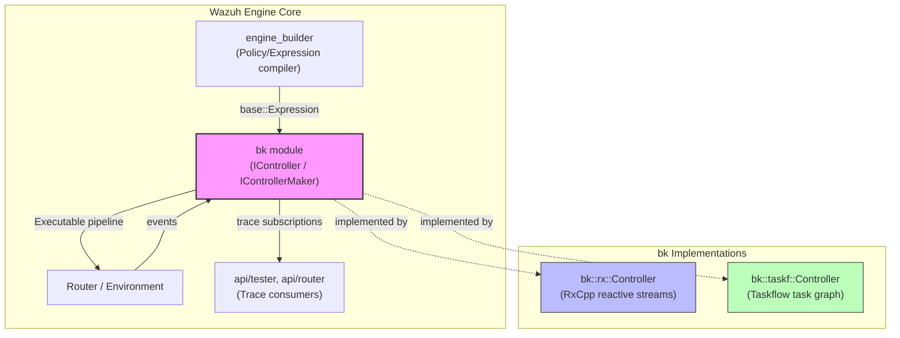
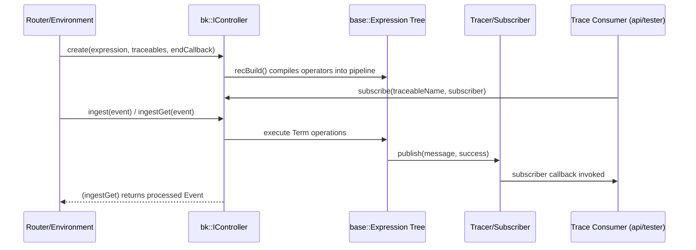

# Engine BK (Backend Execution Controllers)

## 1. Purpose and Overview

The **`bk` (backend)** module is a core low-level component of the **Wazuh Engine (C++)**. It is responsible for taking a compiled decoder/rule **`Expression`** tree (produced by the [`engine_builder`](engine_builder.md) module) and turning it into an **executable, subscribable pipeline** that can ingest events and run the associated operations (filters, maps, parsers, etc.) defined by the policy.

In other words, `bk` is the **execution engine** that sits between:
- The **declarative policy graph** (`base::Expression`, built by `engine_builder`), and
- The **runtime event flow** (managed by the [`Router`](Router.md) module), which feeds events into the pipeline and consumes the results.

The module exposes a single abstract contract, `IController` (and its factory `IControllerMaker`), and provides **two interchangeable backend implementations**:

| Implementation | Underlying technology | Sub-module |
|---|---|---|
| **rx** | [RxCpp](https://github.com/ReactiveX/RxCpp) reactive streams | [engine_bk_rx](engine_bk_rx.md) |
| **taskf** | [Taskflow](https://github.com/taskflow/taskflow) task graphs | [engine_bk_taskf](engine_bk_taskf.md) |

Both implementations compile the same `base::Expression` tree into a runnable pipeline honoring identical semantics for `And`, `Or`, `Chain`, `Broadcast`, and `Implication` operators, and both support a **tracing/subscription** mechanism that lets external consumers (e.g., the `Router`'s Tester, or the `api/tester` HTTP handlers) observe intermediate trace messages produced by named sub-expressions ("traceables").

## 2. Architecture Overview

### 2.1 Key Abstractions

- **`IController`** (interface, defined outside this module in `bk/icontroller.hpp`): the contract implemented by both backends. Exposes `ingest()`, `ingestGet()`, `start()`, `stop()`, `printGraph()`, `getTraceables()`, `subscribe()`, `unsubscribe()`, and `unsubscribeAll()`.
- **`IControllerMaker`**: factory interface used to instantiate an `IController` from a `base::Expression`, a set of traceable names, and an optional completion callback. Each backend provides its own concrete `ControllerMaker`.
- **`Tracer`** (per-backend, `rx::detail::Tracer` / `taskf::detail::Tracer`): manages subscriber registration and publishes trace messages (`message`, `success`) generated while an expression term executes.
- **`ExprBuilder`** (per-backend): recursively walks the `base::Expression` tree and compiles operators (`And`, `Or`, `Chain`, `Broadcast`, `Implication`, `Term`) into the backend-native execution primitives (RxCpp observables or Taskflow tasks).

### 2.2 Expression Operator Semantics

Both backends implement identical logical semantics for the operators defined in [`engine_base`](engine_base.md) (`base::Expression`):

| Operator | Semantics |
|---|---|
| **Term** | Leaf node; executes a `base::EngineOp` function against the event, publishes a trace message, and returns success/failure. |
| **And** | Sequentially executes operands; short-circuits (stops) on the first failure. |
| **Or** | Sequentially executes operands; short-circuits (stops) on the first success. |
| **Chain** | Executes **all** operands unconditionally (regardless of individual success/failure) and always reports success as a whole. |
| **Broadcast** | Same as Chain semantically (fan-out to all operands), used to broadcast the same input to independent branches. |
| **Implication** | Executes the "condition" operand; if successful, executes the "then" operand. The overall result reflects the condition's outcome. |

## 3. Sub-modules

This module is split into two backend-specific sub-modules that share the same conceptual design (`IController`/`ExprBuilder`/`Tracer`) but differ in the underlying execution technology:

### 3.1 [engine_bk_rx](engine_bk_rx.md) — RxCpp Reactive Backend
Implements `bk::rx::Controller` using **RxCpp observables and subjects**. Events are pushed into a `subjects::subject`, and the expression tree is compiled into a graph of chained/filtered `observable` transformations. This backend supports **asynchronous, push-based** event ingestion and is well suited for streaming/continuous operation with a persistent policy input subject.

### 3.2 [engine_bk_taskf](engine_bk_taskf.md) — Taskflow Graph Backend
Implements `bk::taskf::Controller` using **Taskflow's `tf::Taskflow` / `tf::Executor`**. The expression tree is compiled once into a static task graph (`ITask` hierarchy: `TaskTerm`, `TaskAnd`, `TaskOr`, `TaskChain`, `TaskBroadcast`, `TaskImplication`); each `ingest()` call synchronously executes the entire graph via `m_executor.run(m_tf).wait()`. This backend favors a **synchronous, per-event graph run** model and can leverage Taskflow's built-in graph visualization (`dump()`) for debugging.

## 4. How `bk` Fits Into the Overall System

- **Upstream dependency**: [`engine_builder`](engine_builder.md) produces the `base::Expression` tree (via `PolicyGraph`/`AssetBuilder`) that `bk` compiles into a runnable controller.
- **Downstream consumer**: The [`Router`](Router.md) module (`EnvironmentBuilder`, `Environment`) instantiates an `IController` per policy/environment and calls `ingest`/`ingestGet` for every event flowing through the system, and exposes `printGraph()`/trace subscriptions to the [`engine_api`](engine_api.md) (`api/tester`, `api/router` handlers) for debugging and live tracing (used by `engine_test` tooling).
- **Shared base types**: Both backends depend on [`engine_base`](engine_base.md) for `base::Expression`, `base::Event`, `base::EngineOp`, `base::Result`, and error-handling primitives (`base::RespOrError`).

## 5. Related Modules

- [engine_builder](engine_builder.md) — Builds the `base::Expression` graph consumed by `bk`.
- [engine_base](engine_base.md) — Provides `Expression`, `Result`, and other foundational types used throughout `bk`.
- [Router](Router.md) — Uses `IController`/`IControllerMaker` to run policies against incoming events.
- [engine_api](engine_api.md) — Exposes HTTP endpoints (e.g., `api/tester`, `api/router`) that leverage `bk`'s trace subscription mechanism.
