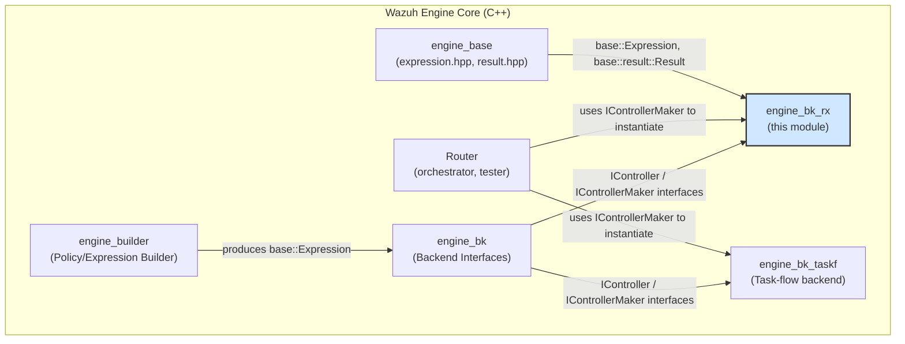
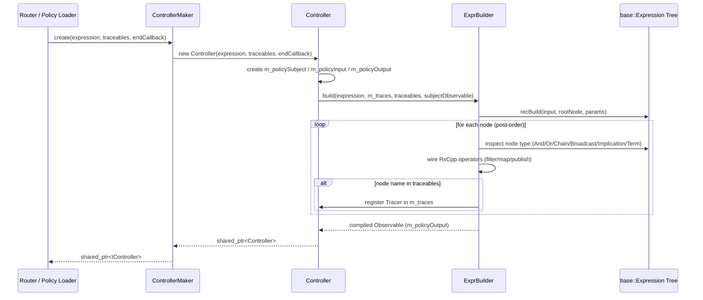
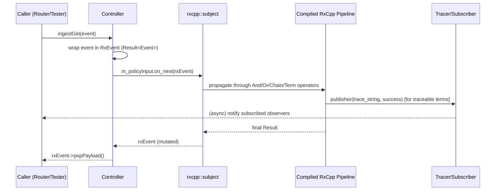
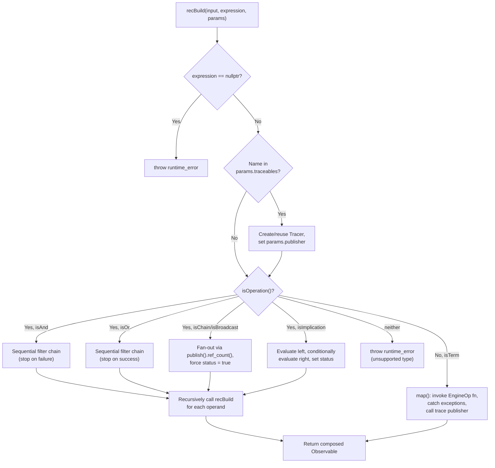

# Engine Backend RxCpp Implementation (`engine_bk_rx`)

## Introduction

The `engine_bk_rx` module is the **RxCpp-based execution backend** for the Wazuh Engine's expression evaluation system. It provides a concrete implementation of the [`bk::IController`](engine_bk.md) interface that compiles a `base::Expression` tree (the logical/operational graph produced by the [`engine_builder`](engine_builder.md) module) into a reactive-streams pipeline using the [RxCpp](https://github.com/ReactiveX/RxCpp) library.

This backend is one of two interchangeable execution engines under the parent [`engine_bk`](engine_bk.md) module — the other being the task-flow based backend, [`engine_bk_taskf`](engine_bk_taskf.md). Both implement the same `IController`/`IControllerMaker` interfaces, allowing the rest of the Engine (routing, testing, policy execution) to remain agnostic of which execution model processes events.

`engine_bk_rx` is responsible for:
- Translating a `base::Expression` (And/Or/Chain/Broadcast/Implication/Term nodes) into a graph of RxCpp observables and subscribers.
- Feeding events into the compiled pipeline and retrieving the processed result.
- Managing debug/trace subscriptions per named sub-expression ("traceable"), enabling operators like `engine-test` to observe intermediate processing states.

---

## Position in the System



For more on the surrounding components, see:
- [`engine_bk.md`](engine_bk.md) — parent module and shared interfaces (`IController`, `IControllerMaker`, `ITrace`).
- [`engine_bk_taskf.md`](engine_bk_taskf.md) — the sibling backend implementation using a task-flow model instead of RxCpp.
- [`engine_base.md`](engine_base.md) — defines `base::Expression`, the operation types (`And`, `Or`, `Chain`, `Broadcast`, `Implication`, `Term`), and `base::result::Result`.
- [`engine_builder.md`](engine_builder.md) — builds the `base::Expression` tree that this module consumes.
- [`Router.md`](Router.md) — orchestrator/tester component that drives the controller during runtime and testing.

---

## Core Components

| Component | File | Responsibility |
|---|---|---|
| `bk::rx::Controller` | `bk/include/bk/rx/controller.hpp` | Public-facing implementation of `IController`. Owns the compiled RxCpp pipeline, ingestion subject, and trace subscriptions. |
| `bk::rx::ControllerMaker` | `bk/include/bk/rx/controller.hpp` | Implementation of `IControllerMaker`. Factory that instantiates a `Controller` from an expression tree. |
| `bk::rx::TracerImpl` | `bk/include/bk/rx/controller.hpp` (forward-declared) | Private implementation detail of `Controller` that wraps a `Tracer` and exposes subscribe/unsubscribe semantics for a named traceable. |
| `bk::rx::detail::ExprBuilder` | `bk/src/rx/exprBuilder.hpp` | Recursive builder that walks a `base::Expression` tree and constructs the corresponding chain of RxCpp `observable`/`subscriber` transformations. |
| `bk::rx::detail::BuildParams` | `bk/src/rx/exprBuilder.hpp` | Internal parameter-passing struct used during the recursive build process (carries the current trace publisher, trace map, and set of traceable names). |

---

## Architecture

### Class/Component Relationships

```mermaid
classDiagram
    class IController {
        <<interface>>
        +ingest(Event) void
        +ingestGet(Event) Event
        +isAviable() bool
        +start() void
        +stop() void
        +printGraph() string
        +getTraceables() set~string~
        +subscribe(traceable, subscriber) RespOrError~Subscription~
        +unsubscribe(traceable, subscription) void
        +unsubscribeAll() void
    }

    class IControllerMaker {
        <<interface>>
        +create(expression, traceables, endCallback) shared_ptr~IController~
    }

    class Controller {
        -m_traces: unordered_map~string, shared_ptr~TracerImpl~~
        -m_traceables: unordered_set~string~
        -m_expression: base::Expression
        -m_policySubject: rxcpp::subject~RxEvent~
        -m_policyInput: rxcpp::subscriber~RxEvent~
        -m_policyOutput: rxcpp::observable~RxEvent~
        +Controller(expression, traceables, endCallback)
        +ingest(Event) void
        +ingestGet(Event) Event
        +start() void
        +stop() void
        +subscribe(traceable, subscriber) RespOrError~Subscription~
        +unsubscribe(traceable, subscription) void
        +unsubscribeAll() void
    }

    class ControllerMaker {
        +create(expression, traceables, endCallback) shared_ptr~IController~
    }

    class TracerImpl {
        <<private, forward-declared>>
    }

    class ExprBuilder {
        -recBuild(input, expression, params) Observable
        +build(expression, traces, traceables, input) Observable
    }

    class BuildParams {
        +publisher: Publisher
        +traces: unordered_map~string, shared_ptr~Tracer~~ &
        +traceables: unordered_set~string~ &
    }

    IController <|.. Controller
    IControllerMaker <|.. ControllerMaker
    ControllerMaker --> Controller : creates
    Controller *-- TracerImpl : owns (per traceable)
    Controller ..> ExprBuilder : uses during construction
    ExprBuilder ..> BuildParams : uses internally
    Controller --> "base::Expression" : compiles
```

### Key Design Points

- **`Controller`** wraps an RxCpp `subject` (`m_policySubject`) that acts as the entry point for events. `ingest`/`ingestGet` push a `RxEvent` (a `shared_ptr<base::result::Result<base::Event>>`) into this subject's subscriber (`m_policyInput`).
- The subject's observable output (`m_policyOutput`) is the result of applying `ExprBuilder::build()` on the root `base::Expression`, so any event pushed via `ingest` immediately and synchronously flows through the compiled RxCpp chain (RxCpp `subject` yields cold/synchronous forwarding in this design).
- **`ExprBuilder`** performs a **post-order recursive descent** over the expression tree, converting each `base::Operation`/`base::Term` node into RxCpp stream operators:
  - `And` → sequential `filter` chain; short-circuits on first failure (mirrors logical AND semantics).
  - `Or` → sequential `filter` chain that stops propagating on first success (mirrors logical OR semantics).
  - `Chain` / `Broadcast` → fan the same input into every operand (using `publish().ref_count()` for multicast), always forces the output status to `true`.
  - `Implication` → evaluates the left operand first; if successful, evaluates the right operand and captures the condition to set the final status.
  - `Term` → the leaf node; invokes the associated `base::EngineOp` function, catches exceptions and turns them into a `Result` failure, and calls the trace `Publisher` if this node was marked as `traceable`.
- **Tracing**: a `traceable` (identified by expression node name) gets a dedicated `Tracer` object with a `publisher()` function. `ExprBuilder` looks up this publisher for the current expression node and invokes it with the trace string and success flag after each `Term` evaluation. `Controller` exposes these traces externally via `subscribe`/`unsubscribe`/`unsubscribeAll` (implemented in `controller.cpp`, wrapped by `TracerImpl`).

---

## Data Flow

### Expression Compilation (Construction Time)



### Event Ingestion (Runtime)



---

## Process Flow: Expression Node Compilation Logic



---

## Public API Surface

### `bk::rx::Controller`

Implements all methods of [`bk::IController`](engine_bk.md):

| Method | Behavior |
|---|---|
| `ingest(Event&&)` | Fire-and-forget ingestion; discards the result. |
| `ingestGet(Event&&)` | Ingests and returns the processed `Event` payload. |
| `start()` | No-op — the RxCpp backend has no explicit start phase (pipeline is fully wired at construction time). |
| `stop()` | Completes the `m_policyInput` subscriber, ending the reactive stream. |
| `isAviable()` | Always returns `true` for this backend. |
| `printGraph()` | Currently returns the placeholder `"TODO"` (graph visualization not yet implemented for the RxCpp backend). |
| `getTraceables()` | Returns the set of traceable expression node names configured at construction. |
| `subscribe(traceable, subscriber)` | Registers a subscriber callback on a named traceable's `Tracer`; returns a `Subscription` handle or error if the traceable does not exist. |
| `unsubscribe(traceable, subscription)` | Removes a specific subscription from a traceable. |
| `unsubscribeAll()` | Clears all subscriptions across all traceables. |

### `bk::rx::ControllerMaker`

Single factory method `create(expression, traceables, endCallback)` that instantiates and returns a `Controller` as a `shared_ptr<IController>`. This is the entry point used by consumers (e.g., the [`Router`](Router.md) module's `EnvironmentBuilder`) to remain decoupled from the concrete backend implementation — the same call signature works whether the RxCpp or task-flow backend is selected.

---

## Relationship to Sibling Backend (`engine_bk_taskf`)

Both `engine_bk_rx` and `engine_bk_taskf` implement identical public interfaces (`IController`, `IControllerMaker`) but differ fundamentally in execution model:

| Aspect | `engine_bk_rx` (this module) | `engine_bk_taskf` |
|---|---|---|
| Execution model | Reactive streams (RxCpp observables/subscribers) | Task-based (custom `Task*` node types: `TaskAnd`, `TaskOr`, `TaskChain`, etc.) |
| Concurrency | Relies on RxCpp scheduler semantics | Explicit task dispatch |
| Tracing | Via `Tracer`/`Publisher` hooked into `map()` operators | Similarly modeled but implemented independently in its own `exprBuilder.hpp` |

See [`engine_bk_taskf.md`](engine_bk_taskf.md) for details on the alternative implementation.

---

## Dependencies

- **RxCpp** (`rxcpp/rx.hpp`) — third-party reactive extensions library providing `observable`, `subscriber`, `subject`, and stream operators (`map`, `filter`, `publish`, `ref_count`).
- **[`engine_base`](engine_base.md)** — `base::Expression`, `base::Operation` subclasses (`And`, `Or`, `Chain`, `Broadcast`, `Implication`), `base::Term`, and `base::result::Result` used to represent both the input expression tree and per-event processing results.
- **[`engine_bk`](engine_bk.md)** — parent module defining the `IController` / `IControllerMaker` interfaces this module implements, and the `Tracer`/`Publisher`/`Subscriber` tracing abstractions used internally.
- **Logging** (`base/logging.hpp`) — used within `ExprBuilder::recBuild` (`Term` case) to log unexpected exceptions raised during event processing.

---

## Summary

`engine_bk_rx` translates the static, declarative `base::Expression` graph produced by the Engine's policy builder into a live RxCpp reactive pipeline capable of ingesting events, executing the compiled logic (AND/OR/Chain/Broadcast/Implication/Term semantics), and exposing fine-grained tracing hooks for debugging and testing. It is a drop-in alternative to the task-flow backend (`engine_bk_taskf`), selected transparently by the Engine's `IControllerMaker` abstraction.
