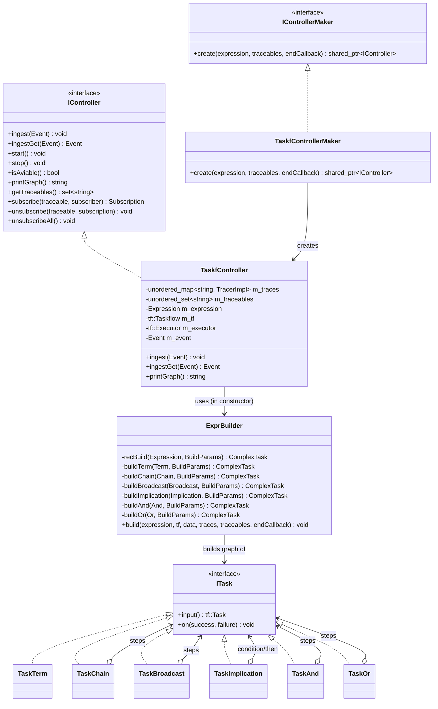
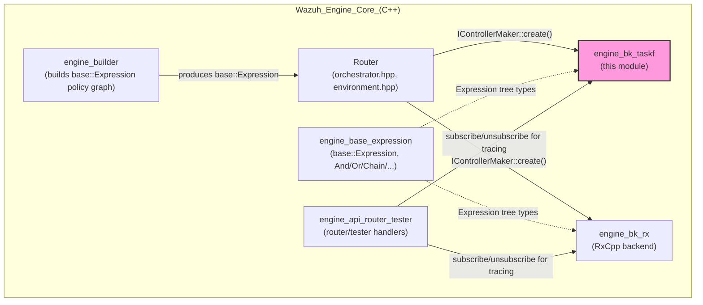
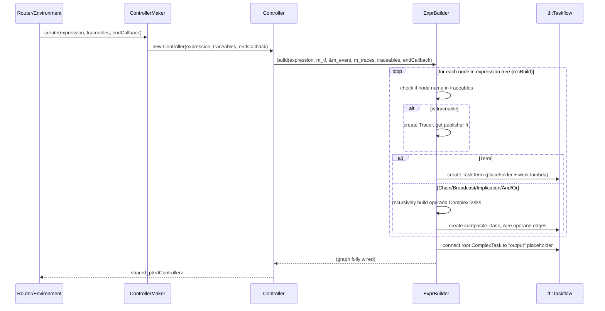
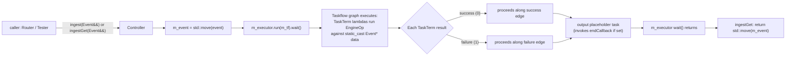
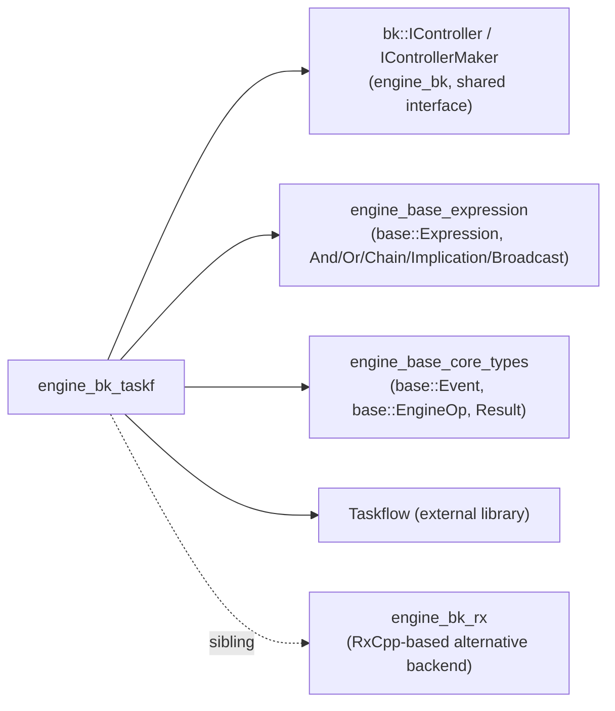

# Engine Backend — Taskflow Implementation (`engine_bk_taskf`)

## Introduction

`engine_bk_taskf` is the **Taskflow-based execution backend** for the Wazuh Engine's rule/decoder/filter evaluation pipeline. It is one of two interchangeable implementations of the engine's `IController` abstraction (the sibling being [`engine_bk_rx`](engine_bk_rx.md), which is built on RxCpp/reactive streams). This module translates a `base::Expression` tree — the logical representation of a policy's assets, filters, decoders and rules built by the [`engine_builder`](rule_module.md) module — into a [Taskflow](https://taskflow.github.io/) graph (`tf::Taskflow`) that can be executed synchronously against a single event.

Where the `rx` backend models event flow as an Rx `Observable` push-pipeline, the `taskf` backend models it as a **directed graph of tasks** with explicit success/failure edges, executed on demand via a `tf::Executor`. This makes `taskf` particularly well suited for use cases that require deterministic, single-threaded-per-event, synchronous execution (e.g., testing/tester tooling and lower-latency single-event evaluation), while `rx` is more oriented towards continuous streaming pipelines.

This document describes the module's purpose, architecture, data flow, and its relationship to other Engine Core components.

---

## 1. Purpose and Core Functionality

The module exposes exactly two public-facing pieces, mirrored 1:1 with the `rx` backend so callers can select either backend transparently through the shared `bk::IController` / `bk::IControllerMaker` interfaces:

| Component | File | Responsibility |
|---|---|---|
| `bk::taskf::Controller` | `bk/include/bk/taskf/controller.hpp` | Concrete `IController` implementation; owns the `tf::Taskflow`, the `tf::Executor`, and the tracing subscription infrastructure. Ingests one event at a time and runs the graph to completion. |
| `bk::taskf::ControllerMaker` | `bk/include/bk/taskf/controller.hpp` | Concrete `IControllerMaker` implementation (factory) that instantiates a `Controller` from a `base::Expression`, a set of traceable asset names, and an optional completion callback. |
| `bk::taskf::detail::ExprBuilder` | `bk/src/taskf/exprBuilder.hpp` | Internal (private, `detail` namespace) recursive-descent builder that walks a `base::Expression` tree and materializes it as a `tf::Taskflow` graph of `ITask` nodes. |
| `bk::taskf::detail::TaskTerm/TaskChain/TaskBroadcast/TaskImplication/TaskAnd/TaskOr` | `bk/src/taskf/exprBuilder.hpp` | Concrete `ITask` node types, one per `base::Expression` operation kind, each responsible for wiring Taskflow success/failure task edges according to the operation's short-circuit semantics. |

### Key characteristics

- **Synchronous, blocking execution**: `Controller::ingest()` runs the whole Taskflow graph to completion (`m_executor.run(m_tf).wait()`) for every event, rather than pushing events through an always-running reactive pipeline.
- **Single shared mutable event slot**: Unlike the `rx` backend which passes a `RxEvent` (a `shared_ptr<Result<Event>>`) through the pipeline, the `taskf` backend stores the in-flight event in a single `base::Event m_event` member, and every `TaskTerm`'s lambda captures a `void*` pointer to it. This is safe because execution is fully synchronous and single-event-at-a-time.
- **Explicit success/failure graph edges**: Every `ITask` exposes an `input()` task and an `on(success, failure)` method used to wire the two possible continuation edges, faithfully implementing the short-circuit boolean semantics of `And`, `Or`, `Implication`, `Chain`, and `Broadcast` (see [`engine_base_expression`](engine_base_expression.md) for the semantics of each operator).
- **Tracing/subscription support**: Like the `rx` backend, `taskf::Controller` supports subscribing to named "traceable" assets to receive trace output (success/failure and trace string) for debugging/testing (used heavily by the tester/router API in [`engine_api_router_tester`](engine_api_router_tester.md)).

---

## 2. Architecture

### 2.1 Component Relationships

### 2.2 Position in the Overall Engine

The `Router`/`Environment` layer selects one `IControllerMaker` implementation at startup/policy-build time (configurable), and all downstream code interacts only with the `IController` interface — meaning `engine_bk_taskf` and `engine_bk_rx` are fully interchangeable from the perspective of the rest of the engine.

---

## 3. Construction & Build Process

When a `Controller` is constructed from a `base::Expression`, it delegates to `detail::ExprBuilder::build()`, which performs a **recursive descent** over the expression tree, converting each node into a Taskflow sub-graph (`ComplexTask`) and wiring it into the larger graph via `precede()` edges.

### 3.1 Expression → Task Mapping

| `base::Expression` kind | Semantics ([`engine_base_expression`](engine_base_expression.md)) | Taskflow node | Wiring strategy |
|---|---|---|---|
| `Term<EngineOp>` | Leaf operation (decoder/filter/mapper) | `TaskTerm` | Runs `m_op(event)`; publishes trace if the term is a subscribed traceable; returns 0 (success) or 1 (failure) to select the Taskflow conditional edge. |
| `Chain` | Sequential execution regardless of result, always succeeds | `TaskChain` | Each step's success/failure both lead to the next step; final step connects to a shared `chain_out` task which always signals success onward. |
| `Broadcast` | Fan-out to all operands independently | `TaskBroadcast` | All operands run in parallel from a common `broadcast_in`; each converges (regardless of outcome) onto `broadcast_out`. |
| `Implication` | `if (left) then right` else short-circuit-false | `TaskImplication` | `input → condition`; condition-success leads to `then`; condition-failure leads directly to `outputFailure`; `then`'s outcome (either) leads to `outputSuccess`. |
| `And` | Short-circuit AND (stop at first failure) | `TaskAnd` | Steps chained via success edges; any step's failure jumps straight to `outputFailure`. |
| `Or` | Short-circuit OR (stop at first success) | `TaskOr` | Steps chained via failure edges; any step's success jumps straight to `outputSuccess`. |

### 3.2 Build Sequence Diagram

### 3.3 Traceable Subscription Wiring

During the recursive build, whenever a node's name matches an entry in the `traceables` set passed at construction time, a `Tracer` is created (or reused) and its `publisher()` function is attached to the corresponding `TaskTerm`. When that term executes, it invokes the publisher with the trace string and success flag, which in turn notifies any external `Subscriber` registered via `Controller::subscribe()`. This is the mechanism used by tools such as the router's tester API to retrieve per-asset execution traces.

---

## 4. Runtime Data Flow (Event Ingestion)

Because the whole graph shares the single `m_event` slot and the `Executor::run().wait()` call blocks until the graph finishes, `ingest`/`ingestGet` are effectively synchronous, reentrant-safe only for one event at a time per `Controller` instance (concurrent ingestion into the same `Controller` from multiple threads is not supported — callers typically own one `Controller` per policy/environment instance).

---

## 5. Dependencies

- **`bk::IController` / `bk::IControllerMaker`** — the shared interface contract defined at the parent [`engine_bk`](engine_bk.md) level (`bk/icontroller.hpp`), implemented identically in spirit by both `taskf` and `rx` sub-modules.
- **[`engine_base_expression`](engine_base_expression.md)** — supplies the `base::Expression`, `base::Term`, `base::And`, `base::Or`, `base::Chain`, `base::Implication`, `base::Broadcast` types that this module's `ExprBuilder` consumes.
- **[`engine_base_core_types`](engine_base_core_types.md)** — supplies `base::Event`, `base::EngineOp` (the callable signature executed by `TaskTerm`), and `base::Result`.
- **Taskflow** — third-party header-only C++ task-graph execution library providing `tf::Taskflow`, `tf::Task`, `tf::Executor`.
- **`Tracer`/`Publisher`/`Subscriber`** (local to `bk::taskf`, defined in the sibling `tracer.hpp`, not covered in this document) — provide the pub/sub mechanism used by `Controller::subscribe/unsubscribe/unsubscribeAll`.

This module is consumed by:
- **Router** (`EnvironmentBuilder`, `Environment` in the Engine Core's `Router` component) — instantiates a `Controller` per policy environment via an `IControllerMaker`.
- **[`engine_api_router_tester`](engine_api_router_tester.md)** — uses `subscribe`/`unsubscribe` to stream traces back to API clients during test sessions.
- **Engine test tooling** (Python CLI, via the API) — indirectly, to run ad-hoc event tests against a policy.

---

## 6. Comparison with `engine_bk_rx`

| Aspect | `engine_bk_taskf` (this module) | `engine_bk_rx` |
|---|---|---|
| Execution model | Blocking, graph-based, one event per `ingest()` call | Reactive/streaming, subject-based push pipeline |
| Event storage | Single shared `base::Event` member (`void*` captured by lambdas) | `RxEvent = shared_ptr<Result<Event>>` passed through the observable chain |
| Underlying library | [Taskflow](https://taskflow.github.io/) | [RxCpp](https://github.com/ReactiveX/RxCpp) |
| `printGraph()` | Returns Taskflow's native DOT dump (`m_tf.dump()`) | Returns `"TODO"` (not implemented) |
| `stop()` semantics | No-op (graph is stateless between `ingest()` calls) | Completes the underlying Rx subject |
| Best suited for | Deterministic single-event synchronous evaluation (e.g., testing tools, low-overhead per-event calls) | Continuous streaming ingestion pipelines |

Both implementations satisfy the exact same `bk::IController` / `bk::IControllerMaker` contract, so they are drop-in replacements for one another from the perspective of the Router.

---

## 7. Related Documentation

- [`engine_bk.md`](engine_bk.md) — Parent module; defines the shared `IController`/`IControllerMaker` interface and houses both backend implementations.
- [`engine_bk_rx.md`](engine_bk_rx.md) — Sibling module; the RxCpp-based alternative backend implementation.
- [`engine_base_expression.md`](engine_base_expression.md) — Defines `base::Expression` and its operation subclasses (`And`, `Or`, `Chain`, `Implication`, `Broadcast`, `Term`) consumed by this module.
- [`engine_base_core_types.md`](engine_base_core_types.md) — Defines core types `base::Event`/`base::EngineOp`/`base::Result` consumed by this module.
- [`engine_api_router_tester.md`](engine_api_router_tester.md) — Router/Tester API handlers that use `Controller::subscribe`/`unsubscribe` for retrieving execution traces.
