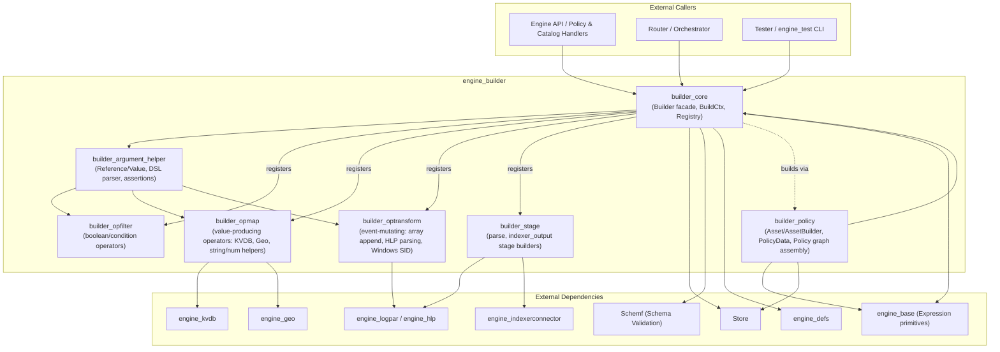
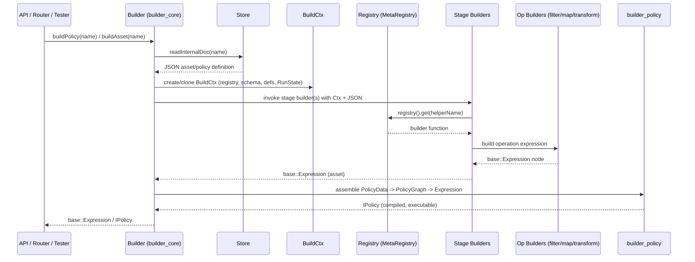

# `engine_builder` Module

## Purpose

The `engine_builder` module is the **compilation engine** of the Wazuh Engine (part of [Wazuh_Engine_Core_(C++)](Wazuh_Engine_Core_(C++).md)). Its responsibility is to transform declarative asset and policy definitions—stored as JSON/YAML documents in the [Store](Store.md)—into executable, in-memory `base::Expression` trees that the engine's backend controllers ([engine_bk](engine_bk.md)) and [Router](Router.md) evaluate against every incoming event.

In essence, `engine_builder` acts as the bridge between the **declarative content layer** (decoders, rules, filters, outputs, and policies authored by users/integrations) and the **runtime execution layer** (the compiled expression graph that actually processes events). It provides:

- A public **facade** (`Builder`) used by the API, Router, and testing tools to build and validate assets/policies from the Store.
- A **registry system** that catalogs every available operation ("helper") and stage builder, resolved by name at build time.
- A **shared build context** (`IBuildCtx`/`BuildCtx`) that threads schema validation, definitions expansion, allowed-fields policy, and tracing/run-state flags through every builder invocation.
- A rich catalog of **operator builders** split by category: filters (boolean conditions), maps (value-producing transforms), and transforms (event-mutating operations, including HLP-based parsing and array/Windows-specific helpers).
- **Stage builders** (`parse`, `indexer_output`) that assemble whole logical sections of an asset.
- A **policy assembly layer** (`builder_policy`) that reads a policy document, builds each referenced asset, arranges them into per-type dependency graphs (decoders, rules, outputs, filters), and collapses the result into a single executable `base::Expression`.

## Architecture

### Build Request Flow

## Core Components & Sub-modules

| Sub-module | Responsibility |
|---|---|
| **builder_core** | Orchestrator facade (`Builder`, `BuilderDeps`, `IPolicy`), build context (`IBuildCtx`, `BuildCtx`, `RunState`), and the registry system (`IRegistry`, `Registry`, `MetaRegistry`, `registerOpBuilders`, `registerStageBuilders`). |
| **builder_argument_helper** | Argument model (`Reference`, `Value`, `OpArg`), the helper-call/comparison DSL parser (`helperParser.hpp`), argument validation utilities (`assertSize`, `assertRef`, `assertValue`), and field-write authorization (`AllowedFields`). |
| **builder_opfilter** | Boolean/condition operator builders: existence checks, generic equality/comparison, regex and network (IP/CIDR) filters, collection/type predicates, and definition-driven lookups. |
| **builder_opmap** | Value-producing operator builders: KVDB lookups/merges, GeoIP/ASN enrichment (MMDB), the generic `map:` stage, and a large catalog of string/numeric/time/hash/JSON helper transforms. |
| **builder_optransform** | Event-mutating operator builders: array append, HLP-based field parsing (date, IP, URI, JSON, XML, CSV/DSV, key-value, etc.), and Windows SID-to-description resolution. |
| **builder_stage** | Stage-level builders for the `parse` stage (chained HLP field parsers) and the `indexer_output` stage (publishing events to the indexer backend). |
| **builder_policy** | Policy assembly: `Asset`/`AssetBuilder` (compiles one asset document into an `Asset`), `PolicyData`/`SubgraphData` (in-memory policy model), the `factory.cpp` graph/expression builders, and the top-level `Policy` class implementing `IPolicy`. |

## Relationship to the Rest of the Engine

- **Parent module:** [Wazuh_Engine_Core_(C++)](Wazuh_Engine_Core_(C++).md) — `engine_builder` is one of its core children, alongside `engine_bk`, `engine_base`, `Router`, and `Store`.
- **Consumers:** `engine_api` (policy/catalog handlers), [Router](Router.md) (via `EnvironmentBuilder`), and `engine_test` tooling all invoke `Builder`/`IPolicy` to compile and validate content.
- **Key dependencies:** [Store](Store.md) for asset/policy documents, [Schemf_(Schema_Validation)](Schemf_(Schema_Validation).md) for field type validation, `engine_defs` for definitions expansion, `engine_geo` and `engine_kvdb` for helper builder dependencies, `engine_logpar`/`engine_hlp` for log parsing, `engine_indexerconnector` for the `indexer_output` stage, and [engine_base](engine_base.md) for the `base::Expression`/`base::Name` primitives produced by every builder.