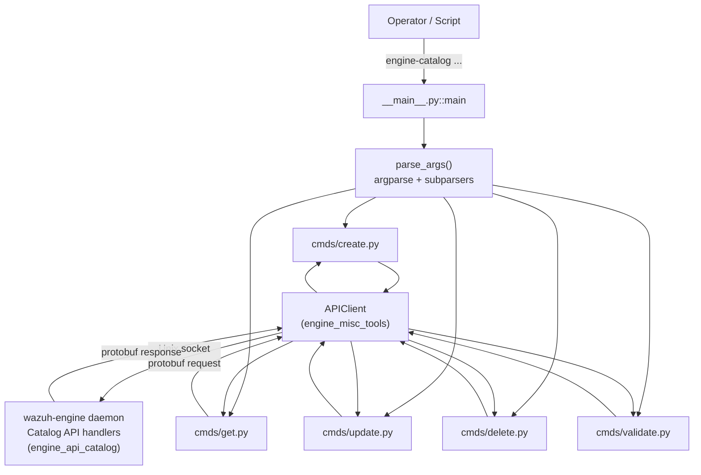
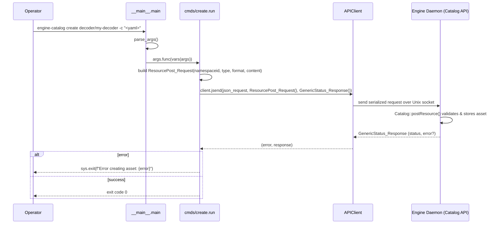

# Engine Catalog CLI (`engine_catalog`)

## 1. Introduction & Purpose

`engine_catalog` is a Python command-line tool, part of the **Engine Administration CLI Tools** suite (`engine-suite`), used to manage the **Wazuh Engine Catalog** — the store of engine assets such as decoders, rules, outputs, filters, and integrations.

The tool provides a thin, uniform CLI wrapper around the Engine's API-over-socket interface. Every sub-command builds a protobuf request, sends it through a local Unix socket to the running `wazuh-engine` daemon, and prints/returns the result. It allows administrators and integration developers to:

- **Create** new catalog assets (`create`)
- **Retrieve** an asset or list a collection (`get`)
- **Update** an existing asset's content (`update`)
- **Delete** an asset or an entire collection (`delete`)
- **Validate** an asset's content against the Engine's schema/builder rules without persisting it (`validate`)

This CLI is the primary way operators interact with the catalog outside of the Engine's own internal APIs, and it underpins higher-level workflows such as `engine_integration` and `engine_policy`, which also manipulate catalog resources programmatically.

## 2. Architecture Overview

The module follows a very small, consistent **command pattern**: a top-level argument parser (`__main__.py`) registers one sub-parser per verb, and each verb's module (`cmds/*.py`) exposes exactly two functions:

- `configure(subparsers)` – registers the sub-command, its arguments, and binds `run` as the callback (`set_defaults(func=run)`).
- `run(args)` – builds the protobuf request, sends it via `APIClient`, and handles the response/errors.



### Key design points

- **Uniform dispatch**: `__main__.py::main` parses CLI arguments and calls `args.func(vars(args))`, where `func` was bound by each command's `configure()`.
- **Shared defaults**: default socket path and namespace come from `shared.default_settings.Constants` (documented in `engine_suite_shared.md`).
- **Transport**: All commands rely on `APIClient` (see `engine_misc_tools.md`) to serialize/deserialize protobuf messages defined in `api_communication.proto.catalog_pb2` and `engine_pb2`.
- **Server side**: Requests are ultimately handled by the Engine's C++ catalog API handlers (`Catalog`/`registerHandlers` in `src/engine/source/api/catalog/`), documented as part of the Wazuh Engine Core wiki (`engine_api_catalog` sub-module).

## 3. Command Reference

| Command    | File                 | Request Message           | Response Message           | Purpose |
|------------|----------------------|----------------------------|------------------------------|---------|
| `create`   | `cmds/create.py`     | `ResourcePost_Request`     | `GenericStatus_Response`     | Create a new asset of a given `asset-type` with provided content (arg or stdin). |
| `get`      | `cmds/get.py`        | `ResourceGet_Request`      | `ResourceGet_Response`       | Retrieve a single asset or list a collection; prints `response['content']`. |
| `update`   | `cmds/update.py`     | `ResourcePut_Request`      | `GenericStatus_Response`     | Overwrite the content of an existing named asset. |
| `delete`   | `cmds/delete.py`     | `ResourceDelete_Request`   | `GenericStatus_Response`     | Delete a single asset or an entire collection (`asset-type[/asset-name[/version]]`). |
| `validate` | `cmds/validate.py`   | `ResourceValidate_Request` | `GenericStatus_Response`     | Validate asset content against the Engine's schema/builders without saving it. |

All commands share these global options (defined in `__main__.py::main`):

| Option           | Default                              | Description |
|-------------------|---------------------------------------|--------------|
| `--api-socket`    | `DefaultSettings.SOCKET_PATH`        | Path to the Engine API Unix socket. |
| `-n`, `--namespace` | `DefaultSettings.DEFAULT_NS`       | Catalog namespace to operate on. |
| `--format`        | `yml` (`json`\|`yml`\|`yaml`)        | Input/output serialization format for asset content. |
| `--version`       | —                                      | Prints the `engine-suite` package version. |

## 4. Core Components

### 4.1 `__main__.py::main`
Entry point invoked as `python -m engine_catalog` (or via the installed `engine-catalog` console script). Responsibilities:
1. Build the top-level `argparse.ArgumentParser`.
2. Register global options (`--api-socket`, `-n/--namespace`, `--format`, `--version`).
3. Register the five sub-commands by calling each `configure()` function.
4. Parse `sys.argv`, then dispatch to the bound `run` function (`args.func(vars(args))`).

### 4.2 `cmds/create.py`
- `configure(subparsers)`: adds `create <asset-type>` with an optional `-c/--content` flag.
- `run(args)`: builds a `ResourcePost_Request` (`namespaceid`, `type`, `format`, `content`), reading content from stdin if `-c` was not supplied. Sends it via `APIClient.jsend`; exits with an error message on failure.

### 4.3 `cmds/get.py`
- `configure(subparsers)`: adds `get <asset>` where `asset` is `asset-type[/asset-id]`.
- `run(args)`: builds a `ResourceGet_Request` (`namespaceid`, `name`, `format`), sends it, and prints the returned `content` field to stdout on success.

### 4.4 `cmds/update.py`
- `configure(subparsers)`: adds `update <asset-name>` with an optional `-c/--content` flag.
- `run(args)`: builds a `ResourcePut_Request` (`namespaceid`, `name`, `format`, `content`, from stdin if not provided), sends it via `APIClient.jsend`.

### 4.5 `cmds/delete.py`
- `configure(subparsers)`: adds `delete <asset>` where `asset` is `asset-type[/asset-name[/version]]` — enabling deletion of an individual item or an entire collection.
- `run(args)`: builds a `ResourceDelete_Request` (`namespaceid`, `name`), sends it via `APIClient.jsend`.

### 4.6 `cmds/validate.py`
- `configure(subparsers)`: adds `validate <asset-name>` with an optional `-c/--content` flag.
- `run(args)`: builds a `ResourceValidate_Request` (`namespaceid`, `name`, `format`, `content`), sends it via `APIClient.jsend`. Useful for CI/CD pipelines that want to check asset correctness before deployment.

## 5. Typical Data Flow (e.g. `create`)



## 6. Relationship to Other Modules

- **`engine_misc_tools.md`** — provides the `APIClient` class used by every command in this module to talk to the Engine daemon over its Unix socket, and is shared by sibling CLIs like `engine_router`, `engine_policy`, `engine_kvdb`, and `engine_geo`.
- **`engine_suite_shared.md`** — supplies `shared.default_settings.Constants` (default socket path and namespace) used to seed CLI defaults.
- **Wazuh Engine Core (`engine_api_catalog`)** — the C++ side that actually implements the catalog: `Catalog`/`Config` classes and `registerHandlers` for `ResourcePost`, `ResourceGet`, `ResourcePut`, `ResourceDelete`, and `ResourceValidate` RPCs invoked by this CLI.
- **`engine_integration.md`** and **`engine_policy.md`** — other CLIs in the `engine-suite` that build on top of catalog assets (integrations bundle decoders/rules created via `engine_catalog create`; policies reference assets by name/namespace as managed here).
- **`engine_archiver.md`**, **`engine_decoder.md`**, **`engine_router.md`**, **`engine_schema.md`**, **`engine_test.md`** — sibling CLIs within the same `engine-suite` package sharing the same `APIClient`/protobuf-based communication pattern.

## 7. Usage Examples

```bash
# Create a new decoder asset from a local YAML file
engine-catalog create decoder -c "$(cat my-decoder.yml)"

# Get an existing rule asset (prints YAML content to stdout)
engine-catalog get rule/my-rule/0

# List all assets in the "decoder" collection
engine-catalog get decoder

# Update an existing integration asset from stdin
cat integration.yml | engine-catalog update integration/my-integration

# Validate a policy asset without persisting it
engine-catalog validate policy/my-policy -c "$(cat policy.yml)"

# Delete a specific asset version
engine-catalog delete decoder/my-decoder/1

# Delete an entire collection
engine-catalog delete decoder
```

## 8. Error Handling

Every `run(args)` function follows the same defensive pattern:
1. Attempt the API call inside a `try/except`.
2. If `APIClient.jsend` returns a non-empty `error`, call `sys.exit(f"Error <action>: {error}")`.
3. Any unexpected exception (connection failure, malformed socket path, etc.) is also caught and surfaced via `sys.exit`, ensuring the CLI always returns a non-zero exit code on failure — suitable for use in scripts and CI pipelines.
