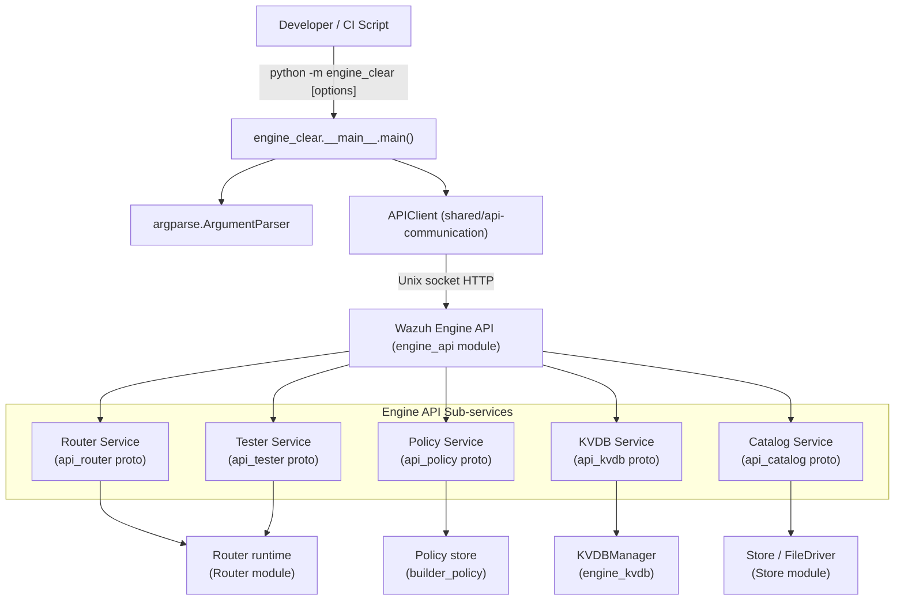
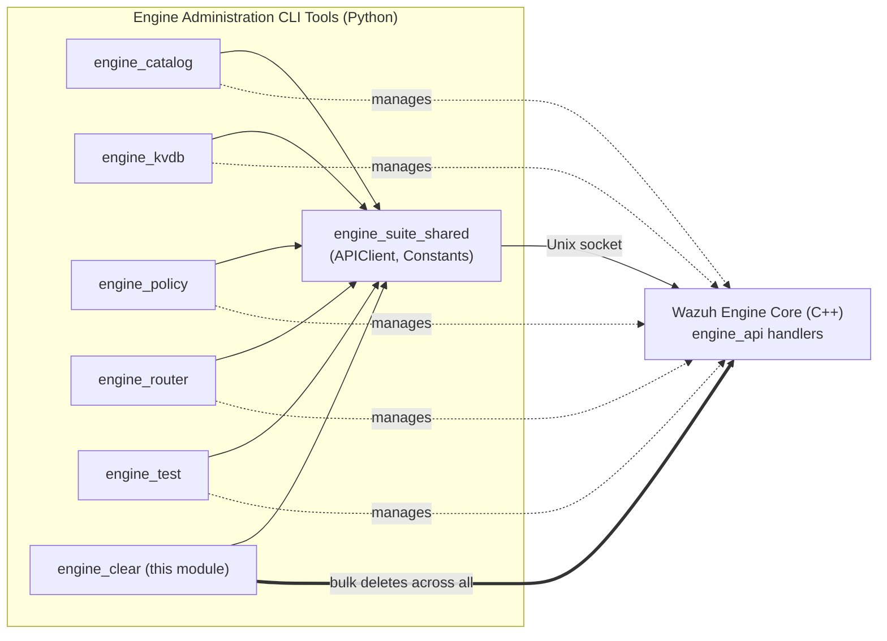
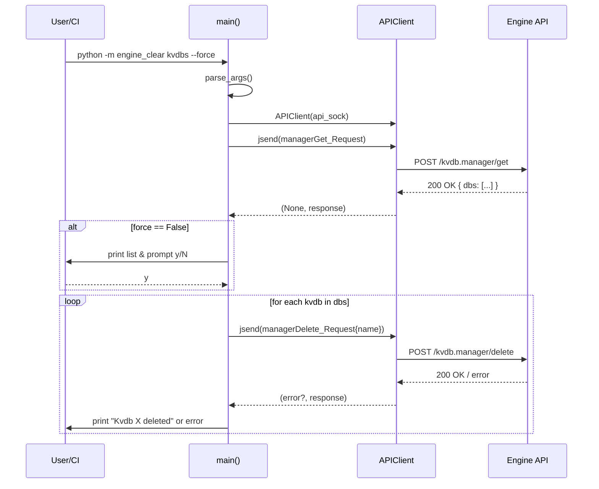
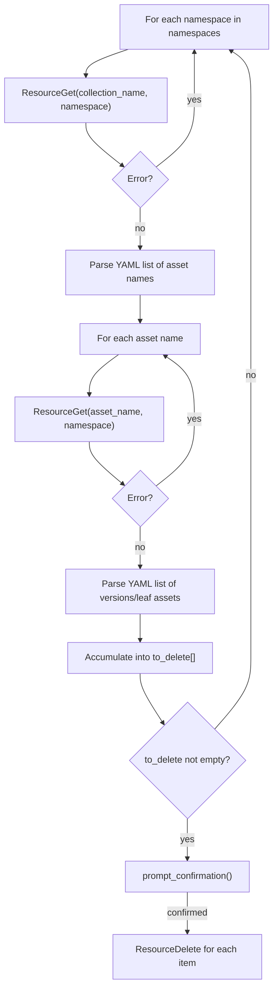

# engine_clear

## Introduction

`engine_clear` is a small but powerful command-line utility, part of the **Engine Administration CLI Tools (Python)** suite, that performs a **bulk wipe of Wazuh Engine resources**. It is the counterpart of the individual `engine-catalog`, `engine-policy`, `engine-kvdb`, `engine-router` and `engine-test` CLIs: instead of manipulating a single resource, `engine_clear` iterates over every resource type registered in the running Engine instance (routes, test sessions, policies, KVDBs, decoders, rules, outputs, filters and integrations) and deletes them, optionally asking for confirmation.

It is typically used by developers and CI/testing pipelines to reset an Engine instance to a clean state between test runs, without having to know the exact list of assets currently loaded.

## Purpose and Core Functionality

The module exposes a single entry point, `main()`, invoked through the `python -m engine_clear` console script. Its responsibilities are:

1. **Argument parsing** – reads the `--api-sock`, `--force`, `--namespaces` and positional `resources` command-line arguments.
2. **Resource discovery** – for each requested resource type, queries the Engine API to obtain the current list of instances (e.g., all routes, all policies, all KVDBs, or all catalog assets in the requested namespaces).
3. **Confirmation** – unless `--force` is supplied, prints the list of resources about to be deleted and asks the user for a y/N confirmation.
4. **Deletion** – issues one deletion request per resource instance through the Engine API and reports success/failure per item.
5. **Reporting** – prints a summary of any resource type that was requested but not recognized.

The supported resource categories and their deletion order are:

| Order | Resource key      | API service      | Notes |
|-------|--------------------|-------------------|-------|
| 1 | `routes`            | Router            | Deletes all routes returned by `TableGet` |
| 2 | `test_sessions`     | Tester            | Deletes all sessions returned by `TableGet` |
| 3 | `policies`          | Policy            | Deletes all policies returned by `PoliciesGet` |
| 4 | `kvdbs`             | KVDB              | Deletes all KVDBs returned by `managerGet` |
| 5 | `integrations`      | Catalog           | Namespace-aware, deletes all catalog integration assets |
| 6 | `decoders`          | Catalog           | Namespace-aware |
| 7 | `rules`             | Catalog           | Namespace-aware |
| 8 | `outputs`           | Catalog           | Namespace-aware |
| 9 | `filters`           | Catalog           | Namespace-aware |

By default (no positional `resources` given) **all** of the above are cleared, across the default namespaces `user`, `wazuh` and `system`.

## Architecture

`engine_clear` does not implement any business logic itself; it is a thin orchestration layer over the [engine_kvdb](engine_kvdb.md)-style Engine HTTP-over-Unix-socket API, reusing the shared [`APIClient`](engine_suite_shared.md) and the generated protobuf request/response messages for each Engine API surface (Catalog, KVDB, Router, Policy, Tester).



### Component Relationship

- **`engine_clear.__main__.main`** — the sole core component of this module. It parses CLI arguments, builds an `APIClient`, and drives the discovery/confirm/delete workflow for each resource category.
- **`APIClient`** (from [`engine_suite_shared`](engine_suite_shared.md) / `api-communication` package) — provides `jsend()`, a helper that marshals a JSON body into the appropriate protobuf request, POSTs it to the Engine's Unix domain socket, and unmarshals/validates the JSON response against the expected protobuf response type, returning `(error, response_dict)`.
- **`Constants.SOCKET_PATH`** (from `shared.default_settings`, part of [`engine_suite_shared`](engine_suite_shared.md)) — supplies the default Engine API socket path used when `--api-sock` is not specified.
- **Protobuf API contracts** (`api_communication.proto.*`) — generated messages that define the shape of requests/responses for each Engine sub-API (`catalog_pb2`, `kvdb_pb2`, `router_pb2`, `policy_pb2`, `tester_pb2`, and the shared `engine_pb2.GenericStatus_Response`). These are the same contracts used by [`engine_catalog`](engine_catalog.md), [`engine_kvdb`](engine_kvdb.md), [`engine_router`](engine_router.md), [`engine_policy`](engine_policy.md) and [`engine_test`](engine_test.md) CLIs, ensuring `engine_clear` stays in sync with each dedicated tool's semantics.
- **Wazuh Engine C++ core** ([`engine_api`](engine_api.md) handlers, backed by [`Router`](Router.md), [`builder_policy`](engine_builder.md), [`engine_kvdb`](engine_kvdb.md) internals, and the [`Store`](Store.md)) — the actual server-side implementation that owns and mutates the resources being cleared.

## How It Fits Into the Overall System

`engine_clear` is one of many CLI tools bundled in the **[Engine Administration CLI Tools (Python)](engine_administration_cli_tools.md)** package (`engine-suite`), alongside `engine_catalog`, `engine_kvdb`, `engine_policy`, `engine_router`, `engine_test`, `engine_decoder`, `engine_schema`, `engine_integration`, `engine_diff` and `engine_archiver`. All of these tools communicate with the same running **Wazuh Engine** process (the [`Wazuh_Engine_Core_(C++)`](Wazuh_Engine_Core.md) module tree) through its local HTTP-over-Unix-socket administrative API, implemented by the [`engine_api`](engine_api.md) sub-module (`api/catalog`, `api/kvdb`, `api/router`, `api/policy`, `api/tester` handlers).



Because `engine_clear` needs to understand each resource type's list/get/delete protocol, it directly depends on protobuf schemas owned by the [`engine_api`](engine_api.md) sub-modules (`engine_api_catalog`, `engine_api_resource_handlers`, `engine_api_router_tester`, `engine_api_policy`). Any change to those APIs (endpoint names, request/response shape) must be reflected here as well.

## Process Flow

The following sequence diagram illustrates the end-to-end flow for a single resource category (using **KVDBs** as a representative example; catalog assets follow a two-level list-then-expand flow described below).



### Catalog Assets (integrations, decoders, rules, outputs, filters)

Catalog resources require an extra discovery step because assets are organized hierarchically (a "collection" document lists individual asset names, and each asset may itself be a container of versions):



## Command-Line Interface

```
usage: engine-clear [-h] [--version] [--api-sock API_SOCK] [-f, --force]
                     [-n, --namespaces [NAMESPACES ...]]
                     [resources ...]

positional arguments:
  resources             Resources to clear. Default: kvdbs, decoders, rules,
                         outputs, filters, integrations, policies,
                         test_sessions, routes

options:
  -h, --help            show help message and exit
  --version             show program's version number and exit
  --api-sock API_SOCK   Path to the engine-api socket
                         (default: /var/ossec/queue/sockets/analysis)
  -f, --force           Force the execution of the command (skip confirmation)
  -n, --namespaces [NAMESPACES ...]
                         Namespaces to delete resources from
                         (default: user, wazuh, system)
```

### Usage Examples

```bash
# Interactively clear every resource type in all default namespaces
python -m engine_clear

# Force-delete only policies and KVDBs, no confirmation prompt
python -m engine_clear --force policies kvdbs

# Clear only catalog decoders/rules in the "user" namespace
python -m engine_clear -n user decoders rules
```

## Error Handling

`engine_clear` is intentionally lenient: a failure to *list* a resource type (e.g., the Engine API is unreachable or the resource type doesn't exist yet) is logged and the tool moves on to the next resource type rather than aborting. Failures to *delete* an individual resource instance are reported per-item, allowing partial clean-ups to complete rather than failing the whole run. At the end, any unrecognized resource name passed on the command line is reported back to the user together with the list of valid resource keys.

## Related Documentation

- [engine_suite_shared.md](engine_suite_shared.md) — `APIClient` and `Constants` (default socket path, timeouts) shared by all engine-suite CLIs.
- [engine_catalog.md](engine_catalog.md) — dedicated CLI for catalog asset CRUD (decoders, rules, outputs, filters, integrations); `engine_clear` reuses its request/response contracts.
- [engine_kvdb.md](engine_kvdb.md) — dedicated CLI and C++ core for Key-Value databases.
- [engine_policy.md](engine_policy.md) — dedicated CLI for policy management.
- [engine_router.md](engine_router.md) — dedicated CLI for route management; also documents the `Router` runtime referenced here.
- [engine_test.md](engine_test.md) — dedicated CLI for test sessions, whose `TableGet`/`SessionDelete` operations are invoked by `engine_clear`.
- [engine_api.md](engine_api.md) — the C++ HTTP-over-Unix-socket API handlers (`catalog`, `kvdb`, `router`, `policy`, `tester`) that back every operation performed by this module.
- [Wazuh_Engine_Core.md](Wazuh_Engine_Core.md) — overall architecture of the Wazuh Engine C++ core that `engine_clear` administers.
