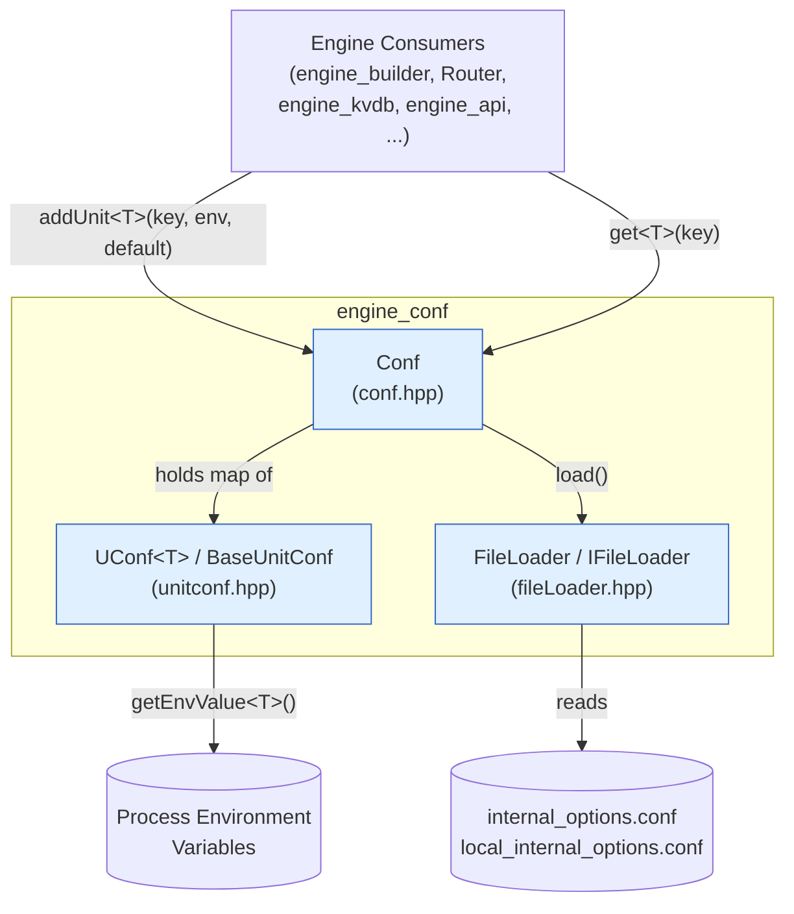
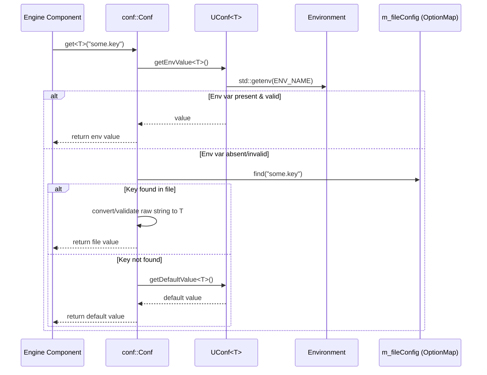

# Engine Configuration (`engine_conf`)

## 1. Purpose

The `engine_conf` module provides a small, self-contained **configuration management library** for the Wazuh Engine (`wazuh-engine` daemon and its sub-systems, see [engine_main.md](engine_main.md)). It centralizes how every engine component declares, loads, validates, and retrieves its configurable parameters, offering a single, type-safe API (`conf::Conf`) that other engine modules (`engine_builder`, `Router`, `engine_kvdb`, `engine_api`, etc.) use to read their settings instead of parsing files or environment variables themselves.

Its main responsibilities are:

- Define **configuration units** (`UConf<T>`) with a name, an associated environment-variable name, and a default value for a given C++ type (`int`, `int64_t`, `bool`, `std::string`, `std::vector<std::string>`).
- Load raw key/value pairs from **configuration files** (`internal_options.conf` / `local_internal_options.conf`) via a pluggable `IFileLoader` interface (`FileLoader` is the disk-backed implementation).
- Resolve the **effective value** of any registered key following a strict priority chain: **environment variable → configuration file → compiled-in default**.
- Perform **type validation and conversion** (numbers, booleans, comma-separated lists) with clear error reporting through the engine's logging facility ([engine_base.md](engine_base.md)).

Because the module only depends on generic engine utilities (JSON handling, logging, string utilities), it sits at a low level of the engine dependency graph and is consumed by almost every higher-level engine component that needs runtime-tunable behavior.

## 2. Architecture Overview

### Component Relationships

| Component | File | Responsibility |
|---|---|---|
| `conf::Conf` | `conf.hpp` | Public facade. Registers units (`addUnit`), triggers file loading (`load`), and resolves values (`get<T>`). |
| `conf::internal::BaseUnitConf` / `conf::internal::UConf<T>` | `unitconf.hpp` | Strongly-typed storage of a single configuration parameter: its environment variable name, its default value, and logic to parse/validate the environment variable value. |
| `conf::IFileLoader` / `conf::FileLoader` | `fileLoader.hpp` | Abstraction for reading the raw `OptionMap` (flat key→string map) from the on-disk `internal_options.conf` and `local_internal_options.conf` files. Injected into `Conf` to allow testing with mock loaders. |

## 3. Resolution Flow (`Conf::get<T>`)

Key design points:

- **Registration must happen before loading.** `addUnit<T>` throws if called after `load()` has already populated `m_fileConfig`, and it enforces that both the configuration key and the environment-variable name are unique across all registered units.
- **Type safety via templates.** Each `UConf<T>` is specialized for exactly one of the supported types (`int`, `int64_t`, `bool`, `std::string`, `std::vector<std::string>`); `BaseUnitConf::as<T>()` performs a checked `dynamic_pointer_cast` and raises a descriptive error on mismatch.
- **List parsing.** `std::vector<std::string>` values (from either file or environment) are parsed as comma-separated, backslash-escaped lists; JSON-style bracket notation (`[...]`) is explicitly rejected to avoid ambiguity with the escaping scheme.
- **Boolean parsing** is case-insensitive and only accepts the literals `"true"`/`"false"`.
- All fallbacks and conversion failures are reported through the engine's structured logger (`LOG_DEBUG` / `LOG_WARNING`), aiding operational troubleshooting without throwing on non-fatal issues (e.g., a malformed env var falls back to the file/default rather than crashing).

## 4. File Loading

`FileLoader` (the concrete `IFileLoader`) reads two files, mirroring the legacy Wazuh convention of internal options:

- `/var/ossec/etc/internal_options.conf` — baseline/internal defaults shipped with the product.
- `/var/ossec/etc/local_internal_options.conf` — local overrides.

Both are merged into a single `OptionMap` (`std::unordered_map<std::string, std::string>`) keyed by the full dotted option name. The `IFileLoader` interface (with its private virtual `load()` and public `operator()`) allows the engine's test suite to substitute an in-memory loader instead of touching the filesystem.

## 5. Relationship to Other Modules

- **[engine_base.md](engine_base.md)** — `engine_conf` relies on `engine_base`'s JSON utilities (`base/json.hpp`), the shared logging macros (`base/logging.hpp`), and generic string helpers (`base/utils/stringUtils.hpp`) for trimming, case conversion, and escaped-string splitting.
- **[engine_main.md](engine_main.md)** — the engine daemon entry point constructs a `conf::Conf` instance at startup (via a `FileLoader`) and distributes configuration values to the various subsystems (KVDB, Router, Store, HTTP server, etc.).
- **Consumers across the Engine** — modules such as `engine_builder.md`, `engine_kvdb.md`, `engine_api.md`, `Router.md`, `Store.md`, and `engine_httpsrv.md` call `Conf::get<T>` with module-specific keys (e.g., queue sizes, thread counts, socket paths) instead of implementing their own parsing logic, ensuring consistent precedence rules and error handling engine-wide.

Because `engine_conf` has no sub-modules of significant independent complexity (it consists of three small, tightly coupled headers implementing a single cohesive responsibility), no further sub-module documentation was generated for this module.
