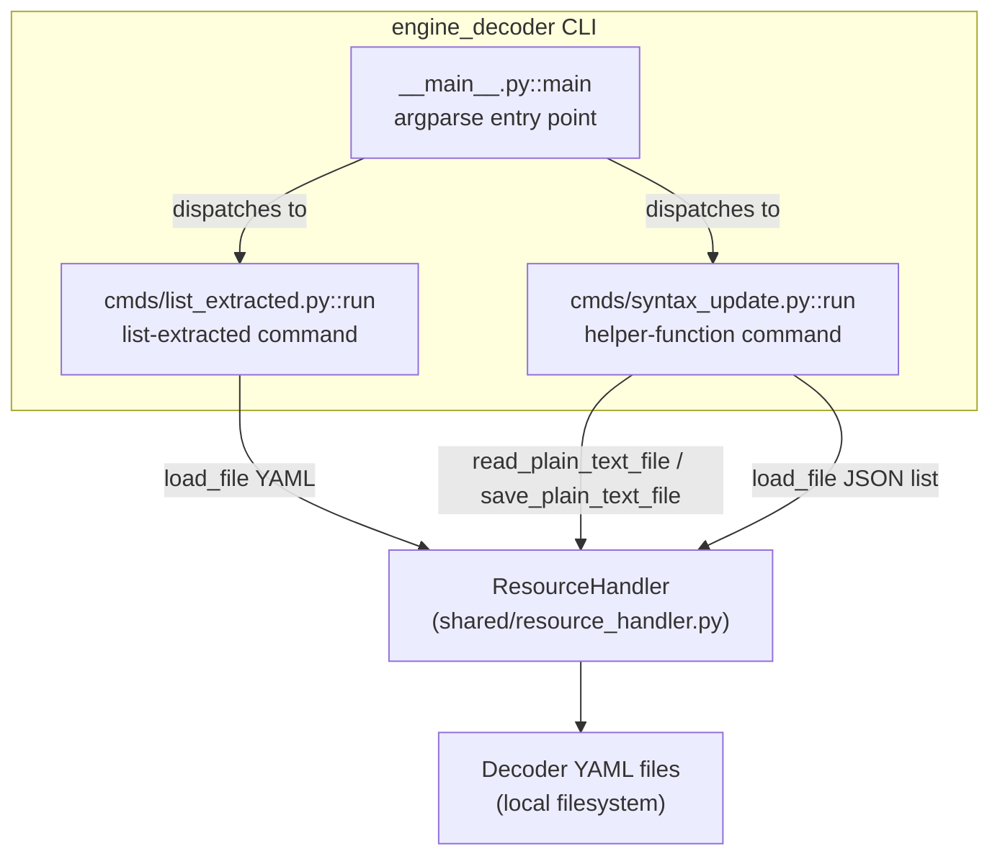
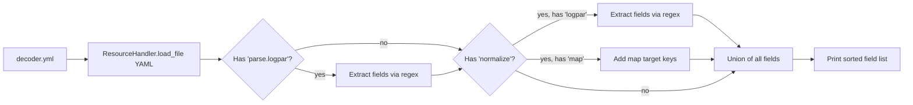
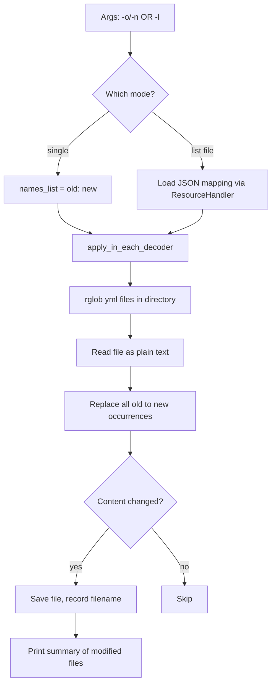

# Engine Decoder CLI (`engine_decoder`)

## 1. Purpose

`engine_decoder` is a small Python command-line utility that ships as part of the
**engine-suite** toolset (see [Engine_Administration_CLI_Tools_(Python)](Engine_Administration_CLI_Tools_(Python).md)).
It provides maintenance and inspection helpers for **decoder assets** used by the
[Wazuh Engine](Wazuh_Engine_Core_(C++).md) — the YAML documents that define how raw
log events are parsed into normalized fields (via the `parse` / `normalize` /
`logpar` stages consumed by the engine's [`engine_logpar`](engine_logpar.md) and
[`builder_optransform_hlp`](builder_optransform_hlp.md) components).

The tool does **not** talk to the running engine daemon or its HTTP API (contrast
with tools like `engine_catalog` or `engine_policy`, which use
[`api-communication`](engine_misc_tools.md) to reach the engine's
[`engine_api`](engine_api.md)). Instead, it operates directly on local decoder
**YAML files on disk**, making it useful for:

- **Auditing** a decoder to see exactly which fields it extracts (`list-extracted`).
- **Bulk-refactoring** helper function names across an entire directory of decoder
  files (`helper-function`), e.g. when a builder helper is renamed in the engine
  (see [`builder_opmap`](engine_builder.md) helper catalog).

## 2. Architecture Overview

The module follows the same lightweight CLI pattern used by all `engine_*` tools in
the engine-suite package: an `argparse`-based entry point (`__main__.py`) that wires
together one or more sub-command modules under `cmds/`. Each sub-command exposes a
`configure(subparsers)` function (to register its arguments) and a `run(args,
resource_handler)` function (to execute the command).



The module depends on the shared `ResourceHandler` utility (documented in
[`engine_suite_shared`](engine_suite_shared.md)) for all file I/O, keeping the
command implementations focused purely on decoder-specific logic (regex field
extraction, string substitution).

## 3. Components

### 3.1 CLI Entry Point — `__main__.py`

| Component | Responsibility |
|---|---|
| `main()` | Parses CLI arguments via `argparse`, builds a `ResourceHandler`, and dispatches to the selected sub-command's `run` function (stored as `args.func`). |
| `parse_args()` | Registers the `engine-decoder` program, `--version` flag (read from the `engine-suite` package metadata), and the two sub-command parsers (`list-extracted`, `helper-function`). |

Invocation pattern:
```bash
engine-decoder list-extracted <decoder.yml>
engine-decoder helper-function -o <old_name> -n <new_name> -d <directory>
engine-decoder helper-function -l <mapping.json> -d <directory>
```

### 3.2 `list-extracted` Command — `cmds/list_extracted.py`

Inspects a single decoder YAML file and prints every field name that the decoder
would extract or set at runtime, sorted alphabetically.

**Core function:** `run(args, resource_handler)`
**Helper:** `get_logpar_fields(expr)` — applies the regex
`<([\w\.@~]+)?[\/\w\s:]*>` to a `logpar` expression string to pull out field names
enclosed in `<...>` capture syntax (the same syntax parsed by the engine's
[`engine_logpar`](engine_logpar.md) grammar).

**Logic flow:**
1. Load the decoder YAML via `resource_handler.load_file(path, Format.YML)`.
2. If the decoder has a `parse.logpar` section, extract fields from each expression.
3. If the decoder has a `normalize` section, iterate each block:
   - For nested `logpar` entries, extract fields the same way.
   - For `map` entries, add the target field name directly (the key of each map
     entry) since `map` operations always write directly to a known field, as
     opposed to a parsing expression.
4. Print the deduplicated, sorted set of field names.



### 3.3 `helper-function` Command — `cmds/syntax_update.py`

Performs a bulk find-and-replace of **helper function names** (the `+function_name`
tokens used inside decoder `map`/`logpar`/`check` expressions, corresponding to
helpers registered in the engine's [`builder_opmap`](engine_builder.md) /
[`builder_opfilter`](engine_builder.md) registries) across every `.yml` file in a
target directory tree.

**Core function:** `run(args, resource_handler)`
**Helpers:**
- `apply_in_each_decoder(resource_handler, directory, method)` — recursively walks
  the directory (`Path.rglob('*.yml')`), reads each file as plain text, applies a
  transformation `method`, and writes back only the files that actually changed.
- `name_replace_helper_function(names_list_content)` — returns a closure that
  performs literal string substitution of `+old_name` → `+new_name` for every pair
  in the provided mapping, ensuring both names are prefixed with `+` (the helper
  function marker in decoder syntax).

**Two invocation modes** (mutually exclusive, enforced in `run`):
1. **Single rename**: `-o/--old-name` and `-n/--new-name` supply a single mapping.
2. **Batch rename**: `-l/--list-file` supplies a JSON file of `{old: new}` pairs
   (loaded via `resource_handler.load_file(path, Format.JSON)`).

The `-d/--directory` flag controls the scan root (defaults to a hard-coded engine
ruleset path).



> ⚠️ The replacement is a **plain string substitution**, not a YAML-aware parse —
> this preserves comments and key ordering in the decoder file (a deliberate
> trade-off noted in the source), but means the search string `+old_name` must not
> collide with unrelated text elsewhere in the file.

## 4. Relationship to the Wider System

- **Engine Suite siblings**: `engine_decoder` is one of many CLI tools under
  `engine-suite` alongside [`engine_catalog`](Engine_Administration_CLI_Tools_(Python).md),
  [`engine_policy`](Engine_Administration_CLI_Tools_(Python).md),
  [`engine_router`](Engine_Administration_CLI_Tools_(Python).md),
  [`engine_kvdb`](engine_kvdb.md), and [`engine_geo`](engine_geo.md). Most of those
  tools talk to the live engine API; `engine_decoder` is unique in operating purely
  on local files.
- **Shared utilities**: File I/O (`load_file`, `read_plain_text_file`,
  `save_plain_text_file`) is provided by `ResourceHandler`, documented in
  [`engine_suite_shared`](engine_suite_shared.md).
- **Consumers of decoders**: The YAML files this tool inspects/modifies are the
  same assets built and executed by the engine's C++ core — see
  [`engine_builder`](engine_builder.md) (asset/policy compilation),
  [`engine_logpar`](engine_logpar.md) (log-parsing grammar), and
  [`engine_api_catalog`](engine_api_catalog.md) (catalog storage/retrieval of these
  same decoder documents when managed through the running engine rather than
  directly on disk).

## 5. Usage Summary

| Command | Purpose | Key Args |
|---|---|---|
| `list-extracted` | Print all fields a decoder extracts/sets | `decoder` (path to YAML) |
| `helper-function` | Rename helper function references across decoders | `-o/-n` (single) or `-l` (JSON mapping), `-d` (directory) |
