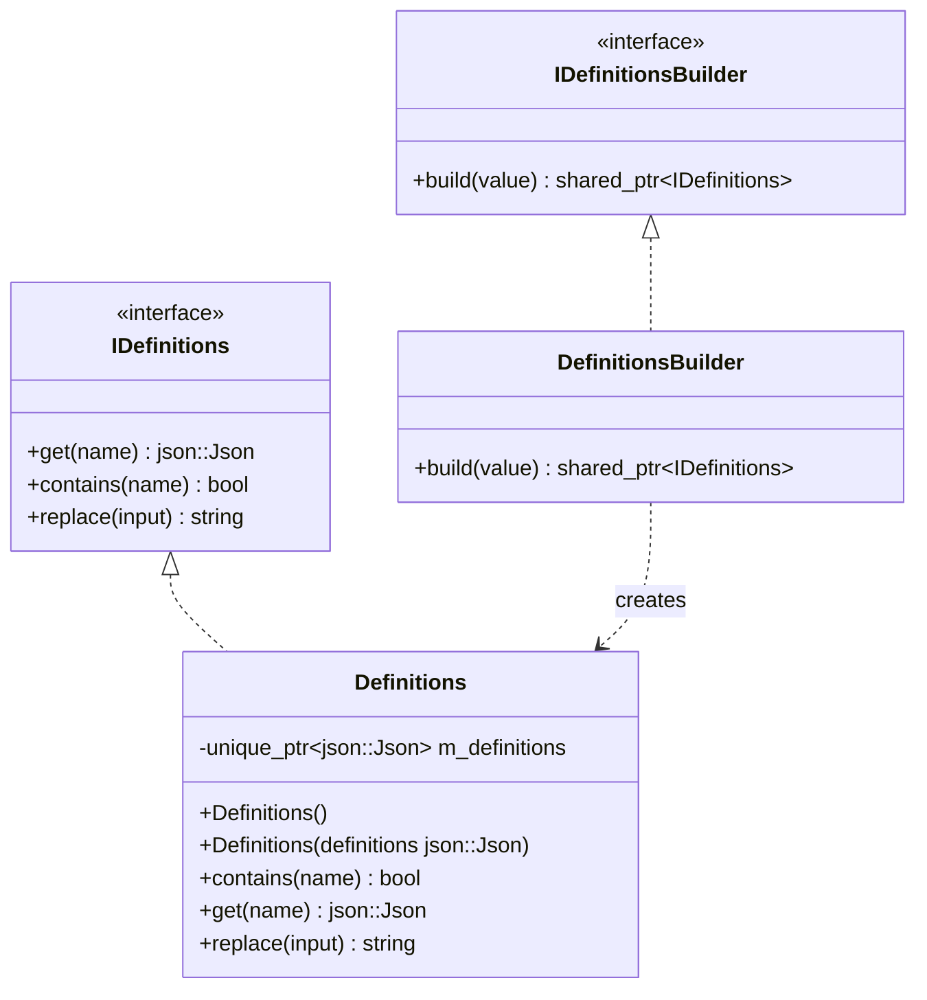
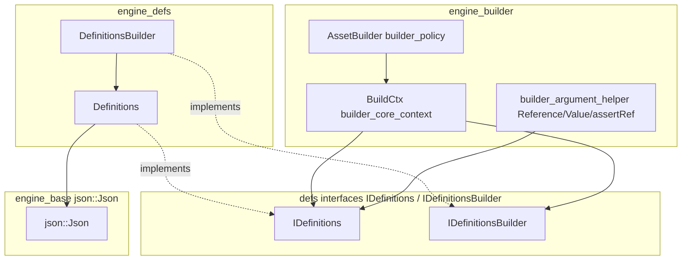
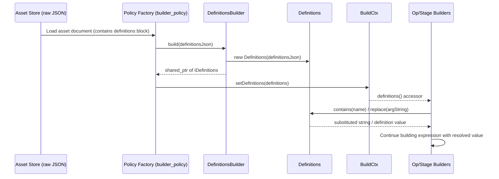
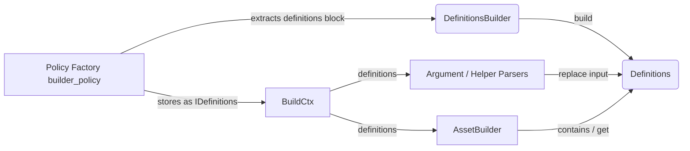

# Engine Defs Module

## Introduction

The **`engine_defs`** module is a small but foundational component of the **Wazuh Engine** (`Wazuh_Engine_Core_(C++)`). It provides the concrete implementation of the *Definitions* concept: a named collection of JSON values ("variables") that can be declared once inside a decoder, rule, or policy asset and then referenced — and automatically substituted — anywhere in that asset's helper arguments and field values.

Definitions let asset authors avoid duplicating literal values (IP lists, thresholds, regular expressions, etc.) by writing a single `definitions` block and referring to its entries with a special syntax (e.g. `$my_var`) that is expanded at build time. This module implements the storage, lookup and substitution logic behind that feature, and exposes a builder so that the rest of the Engine's construction pipeline can instantiate a `Definitions` object generically through an interface.

Because `engine_defs` only *implements* an interface declared elsewhere (`defs::IDefinitions` / `defs::IDefinitionsBuilder`), it has minimal code but sits at a key extension point used pervasively by the [`engine_builder`](engine_builder.md) module when constructing assets and policies.

---

## Purpose and Core Functionality

| Responsibility | Description |
|---|---|
| **Store definitions** | Wraps a `json::Json` object holding all definitions declared in an asset (typically found under a `definitions` key in the asset's raw document). |
| **Lookup by dot-path** | `get(name)` and `contains(name)` allow the builder pipeline to resolve a definition by its dot-separated path name. |
| **String substitution** | `replace(input)` scans a string for definition references and replaces them with their corresponding JSON values serialized back into the string. This is the mechanism that allows helper arguments such as `is_array($my_list)` to be expanded before the helper is actually built. |
| **Builder factory** | `DefinitionsBuilder` implements `IDefinitionsBuilder::build()`, producing a `std::shared_ptr<IDefinitions>` from a raw `json::Json` value. This indirection allows the `engine_builder` module to be decoupled from the concrete `Definitions` implementation, depending only on the interface. |

### Core Components

- **`Definitions`** (`defs::Definitions`) — Concrete implementation of `IDefinitions`. Holds a `std::unique_ptr<json::Json>` with the definitions payload and implements `contains`, `get`, and `replace`.
- **`DefinitionsBuilder`** (`defs::DefinitionsBuilder`) — Concrete implementation of `IDefinitionsBuilder`. Its `build()` method constructs a new `Definitions` instance wrapped behind the `IDefinitions` interface.

### Related Interfaces (declared outside this module, consumed here)

- **`IDefinitions`** — Abstract interface exposing `get`, `contains`, and `replace`.
- **`IDefinitionsBuilder`** — Abstract interface exposing `build(const json::Json&)`.

These interfaces live in the `defs` interface headers (`defs/idefinitions.hpp`) and are the contract that the rest of the Engine (primarily `engine_builder`) programs against, making `engine_defs` a swappable/mockable implementation detail.

---

## Architecture



### Position in the Engine

`engine_defs` is a leaf implementation module. It has almost no outgoing dependencies (aside from the base `json::Json` utility from [`engine_base`](engine_base.md) and the `defs` interfaces), but it is depended upon by the asset/policy construction pipeline in [`engine_builder`](engine_builder.md), specifically by the build context (`BuildCtx`).



---

## Data Flow: How Definitions Are Resolved

When the Engine builds a decoder, rule, or output asset, the raw asset document may contain a `definitions` object. The build pipeline (in `engine_builder`) extracts this object, feeds it to `DefinitionsBuilder::build()`, and stores the resulting `IDefinitions` instance inside the shared `BuildCtx` for the duration of that asset's construction. Every helper-argument parser (see `builder_argument_helper`) then calls `replace()` on raw argument strings before parsing them into `Reference`/`Value` objects.



---

## Component Interaction

`BuildCtx` (part of `engine_builder`'s `builder_core_context` sub-module) holds a `std::shared_ptr<const defs::IDefinitions>` and exposes it via `definitions()`/`setDefinitions()`. This is the primary integration point: `engine_defs` types are never referenced directly by name outside of the factory/build-context wiring — all consumers program against `IDefinitions`.



---

## Usage Context

1. **Asset authoring**: A decoder or rule YAML/JSON document may declare:
   ```yaml
   definitions:
     my_threshold: 100
   check:
     - field: $my_threshold
   ```
2. **Build time**: The [`engine_builder`](engine_builder.md) module's `Params`/`PolicyData` structures (see `factory.hpp`) carry the asset definitions through the pipeline; `BuildCtx::setDefinitions()` installs the `Definitions` instance for that asset's build scope.
3. **Argument resolution**: Helper-argument builders (`builder_argument_helper`, e.g. `Reference`, `Value`, `assertRef`) call `IDefinitions::replace()` prior to interpreting an argument as a literal or a field reference, allowing `$my_threshold` to be transparently expanded into `100`.
4. **Validation**: `contains()` allows builders to short-circuit with a clear build error when a referenced definition name does not exist in the asset.

---

## Relationship to Other Modules

| Module | Relationship |
|---|---|
| [`engine_builder`](engine_builder.md) | Primary consumer. `BuildCtx` (in `builder_core_context`) stores and exposes the `IDefinitions` instance produced by `DefinitionsBuilder`; helper/argument builders call `replace()`/`contains()`/`get()` while constructing expressions. |
| [`engine_base`](engine_base.md) | Provides the `json::Json` type used to store and query definition values. |
| [`engine_conf`](engine_conf.md) | Indirectly related: overall Engine configuration flows through `conf`, but `engine_defs` itself is configuration-agnostic — it only operates on the `definitions` JSON payload passed in per-asset. |
| [`Store`](Store.md) | Supplies the raw asset documents (including `definitions` blocks) that are parsed and passed to `DefinitionsBuilder`. |

---

## Summary

`engine_defs` is a narrowly-scoped module that implements the `IDefinitions`/`IDefinitionsBuilder` contract used throughout asset construction in the Wazuh Engine. Its two classes — `Definitions` and `DefinitionsBuilder` — provide JSON-backed storage, dot-path lookup, and string substitution for user-declared definitions, enabling reusable, DRY authoring of decoders, rules, and policies. All external interaction happens through the abstract interfaces, keeping this implementation swappable and isolated from the rest of the [`engine_builder`](engine_builder.md) pipeline that consumes it.
