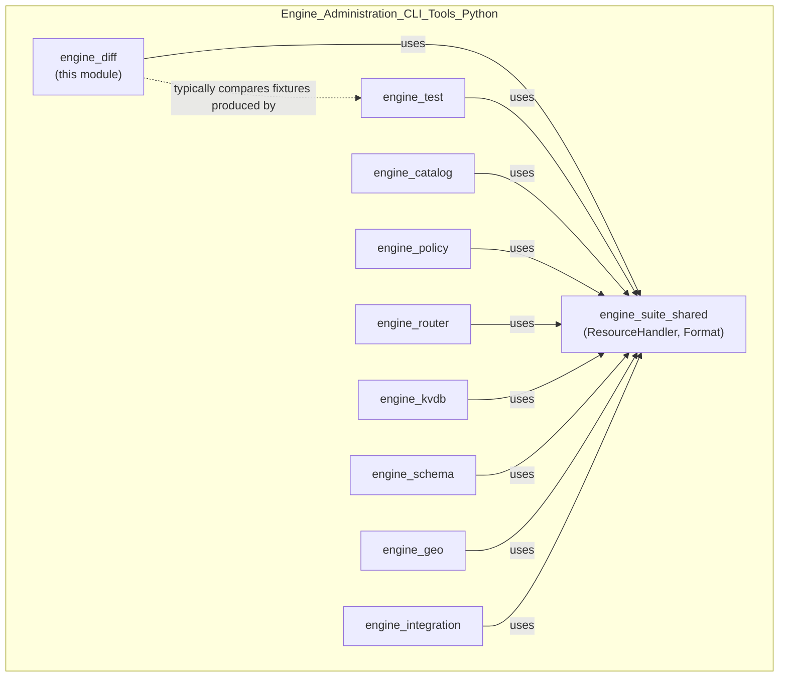
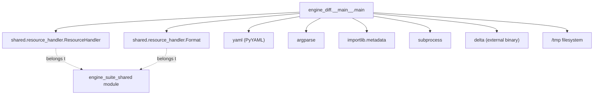
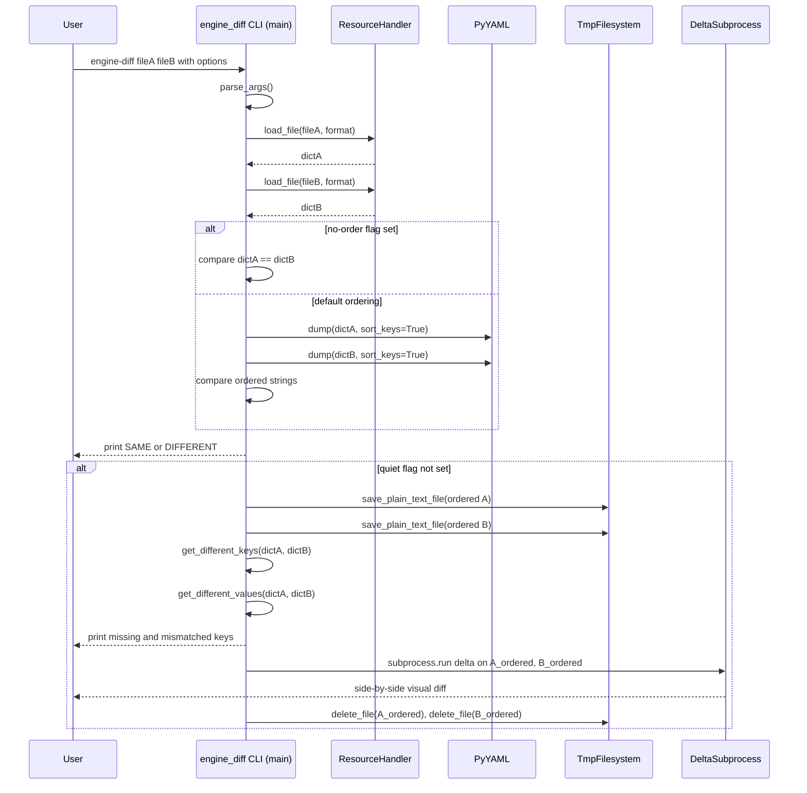

# engine_diff Module

## Introduction

`engine_diff` is a small, standalone command-line utility that is part of the **Engine Administration CLI Tools (Python)** suite (`engine-suite`) used to operate and troubleshoot the Wazuh Engine (see [Wazuh_Engine_Core_(C++).md](Wazuh_Engine_Core_(C++).md)). Its single responsibility is to compare two serialized events (JSON or YAML) — typically outputs captured while testing rules, decoders, or integrations with tools such as `engine-test` (see [engine_test.md](engine_test.md)) — and report whether they are `SAME` or `DIFFERENT`. When differences exist, it produces a human-friendly, side-by-side diff (via the external `delta` tool) plus a structured summary of which keys were added, removed, or changed in value.

This tool is intentionally minimal: it has no persistent state, no network or API dependency, and a single entry point (`main`). It exists purely to support engineers validating pipeline output equivalence (e.g., comparing an actual engine output against an expected fixture) during development and CI of the Wazuh Engine.

## Objectives

- Provide a fast, scriptable way to determine equality between two event documents (JSON/YAML).
- Normalize (sort) both documents before comparison so that key ordering does not cause false positives.
- Surface actionable details about *why* two documents differ (missing keys on either side, and keys with differing values).
- Delegate rich visual diffing to the well-known `delta` CLI tool, avoiding reinventing diff rendering.

## Module Location in the System

`engine_diff` lives under `src/engine/tools/engine-suite/src/engine_diff/` and is one of many independent CLI entry points bundled in the `engine-suite` Python package, alongside tools such as `engine_test`, `engine_catalog`, `engine_policy`, `engine_kvdb`, `engine_router`, `engine_schema`, `engine_geo`, `engine_integration`, `engine_archiver`, `engine_decoder`, and `engine_clear`. All of these tools share common utility code from `engine_suite_shared` (see [engine_suite_shared.md](engine_suite_shared.md)), most notably `ResourceHandler` and `Format` from `shared/resource_handler.py`, which `engine_diff` uses directly to load input files.



## Core Component

| Component | File | Description |
|---|---|---|
| `main` | `src/engine/tools/engine-suite/src/engine_diff/__main__.py` | CLI entry point: parses arguments, loads two files, normalizes/orders them, prints `SAME`/`DIFFERENT`, and (unless `--quiet`) shows a detailed diff and key-level differences. |
| `parse_args` | same file | Builds and parses the `argparse` CLI schema (positional files, `--input`, `--quiet`, `--no-order`). |
| `get_different_keys` | same file | Computes the set of keys present in one dict but missing in the other. |
| `get_different_values` | same file | Computes the set of keys present in both dicts but whose values differ. |

## Architecture

`engine_diff` follows a simple linear pipeline architecture typical of CLI tools: **parse → load → normalize → compare → report → cleanup**. It has no classes; all logic is expressed as small functions orchestrated by `main()`.

```mermaid
flowchart LR
    A[CLI Args: fileA, fileB, --input, --quiet, --no-order] --> B[parse_args]
    B --> C["ResourceHandler.load_file fileA, format"]
    B --> D["ResourceHandler.load_file fileB, format"]
    C --> E{--no-order?}
    D --> E
    E -->|yes| F["Direct dict equality: dictA == dictB"]
    E -->|no| G["yaml.dump sort_keys=True on both"]
    G --> H["String equality of ordered YAML"]
    F --> I["Print SAME / DIFFERENT"]
    H --> I
    I --> J{--quiet?}
    J -->|yes| Z[Exit]
    J -->|no| K["Save ordered YAML to /tmp"]
    K --> L["get_different_keys / get_different_values"]
    L --> M["Print key-level diff summary"]
    M --> N["subprocess.run delta on ordered files"]
    N --> O["Cleanup: delete temp files"]
    O --> Z
```



## Dependencies

- **`shared.resource_handler`** (module: [engine_suite_shared.md](engine_suite_shared.md)) — provides:
  - `ResourceHandler.load_file(path, format)` to parse JSON/YAML input files into Python dicts.
  - `ResourceHandler.save_plain_text_file(dir, name, content)` to write the normalized YAML representations to `/tmp`.
  - `ResourceHandler.delete_file(path)` to clean up temp artifacts after the diff is shown.
  - `Format` enum (`Format.JSON`, `Format.YML`) to select the input parser.
- **PyYAML** (`yaml`, with `CDumper`/`Dumper` fallback) — used to serialize dictionaries into a canonical, key-sorted YAML string for comparison and for feeding into `delta`.
- **`argparse`** and **`importlib.metadata`** — standard library, used for CLI argument parsing and reading the installed `engine-suite` package version for `--version`.
- **External `delta` binary** (https://github.com/dandavison/delta) — invoked via `subprocess.run` to render a side-by-side visual diff. This is an optional external dependency; if not installed, `engine_diff` still prints the `SAME`/`DIFFERENT` verdict and the key-level summary, but the visual diff step fails gracefully with an instructional message.
- **Filesystem (`/tmp`)** — used as scratch space for the two ordered YAML documents that are passed to `delta`.



## Data Flow

1. **Input acquisition**: two file paths (`fileA`, `fileB`) and an `--input` format flag (`json` default, or `yaml`) are supplied on the command line.
2. **Parsing**: `ResourceHandler.load_file` reads and parses each file into a Python `dict` according to the selected `Format`.
3. **Normalization** (default, unless `--no-order` is passed): each dict is serialized to YAML with `sort_keys=True`, producing a canonical string representation immune to key-order differences.
4. **Comparison**:
   - With `--no-order`: raw dict equality (`dictA == dictB`).
   - Without `--no-order`: string equality of the two ordered YAML dumps.
5. **Verdict output**: `SAME` or `DIFFERENT` is printed to stdout — this is the primary machine-readable signal for scripting/CI usage.
6. **Detailed reporting** (skipped if `--quiet`):
   - Ordered YAML for both files is persisted to `/tmp/<name>_ordered.yml`.
   - `get_different_keys` reports keys unique to `fileA` vs `fileB` (structural differences).
   - `get_different_values` reports keys common to both but with mismatched values.
   - `delta` is invoked as a subprocess with `DELTA_FEATURES=+side-by-side delta` to render a rich visual diff of the two ordered YAML files.
7. **Cleanup**: the temporary ordered YAML files are deleted (best-effort, exceptions are swallowed).



## Command-Line Interface

| Argument | Required | Default | Description |
|---|---|---|---|
| `fileA` | Yes (positional) | — | Path to the first file to compare. |
| `fileB` | Yes (positional) | — | Path to the second file to compare. |
| `-in`, `--input` | No | `json` | Input serialization format of both files: `json` or `yaml`. |
| `-q`, `--quiet` | No | `False` | Suppress the detailed diff/summary output; only prints `SAME`/`DIFFERENT`. |
| `--no-order` | No | `False` | Skip key-sorting normalization and compare the raw parsed dictionaries directly. |
| `--version` | No | — | Prints the installed `engine-suite` package version and exits. |

Example usage:

```bash
engine-diff expected_event.json actual_event.json
engine-diff expected.yml actual.yml --input yaml --quiet
engine-diff a.json b.json --no-order
```

Exit behavior: `main()` returns `0` on success, and `-1` if file loading or temp-file saving fails (caught exceptions are printed to stdout/stderr as `Error: {e}`). The `SAME`/`DIFFERENT` verdict itself is not reflected in the process exit code — callers must parse stdout for that signal (there is no dedicated non-zero/zero mapping for equality state).

## Error Handling

- **File load failures** (missing file, malformed JSON/YAML): caught around `ResourceHandler.load_file`; an `Error: {e}` message is printed and the function returns `-1` immediately, skipping comparison.
- **Temp file write failures**: caught around the `save_plain_text_file` calls used to persist ordered YAML for `delta`; also results in an early `-1` return.
- **`delta` invocation failures** (binary not installed, non-zero exit): caught broadly; prints the exception followed by a hint to install `delta` from its GitHub repository. This does not abort the overall verdict already printed.
- **Temp file cleanup failures**: silently ignored (best-effort deletion), since this is a non-critical, cosmetic step.

## Relationship to Other Modules

- **[engine_suite_shared.md](engine_suite_shared.md)** — supplies the `ResourceHandler`/`Format` abstraction reused by nearly every CLI tool in the `engine-suite` package, including `engine_diff`. Refer to that document for details on supported formats and file I/O semantics.
- **[engine_test.md](engine_test.md)** — commonly the producer of the event fixtures/outputs that get compared with `engine_diff` while validating decoder/rule pipelines end-to-end.
- **Sibling CLI tools** (`engine_catalog`, `engine_policy`, `engine_router`, `engine_kvdb`, `engine_schema`, `engine_geo`, `engine_integration`, `engine_archiver`, `engine_decoder`, `engine_clear`) — all part of the same `engine-suite` distribution and installed together; `engine_diff` does not depend on them directly but is typically used alongside them in engine content-development workflows.
- **[Wazuh_Engine_Core_(C++).md](Wazuh_Engine_Core_(C++).md)** — the broader C++ engine whose JSON/YAML event outputs (from router/tester components, catalog assets, etc.) are the typical subjects being diffed by this tool.

## Summary

`engine_diff` is a lightweight, dependency-light comparison utility that plugs into the Wazuh Engine content-authoring and testing workflow. By normalizing input documents and delegating rich visual diffing to `delta`, it gives engineers a quick way to validate whether two events (real vs. expected) are equivalent, and if not, precisely where they diverge — either structurally (missing keys) or in value.
