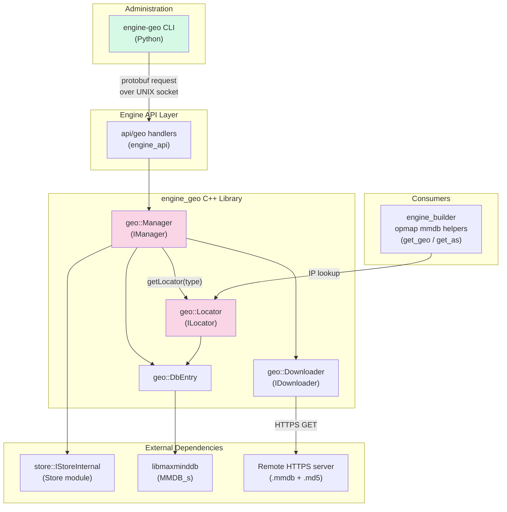
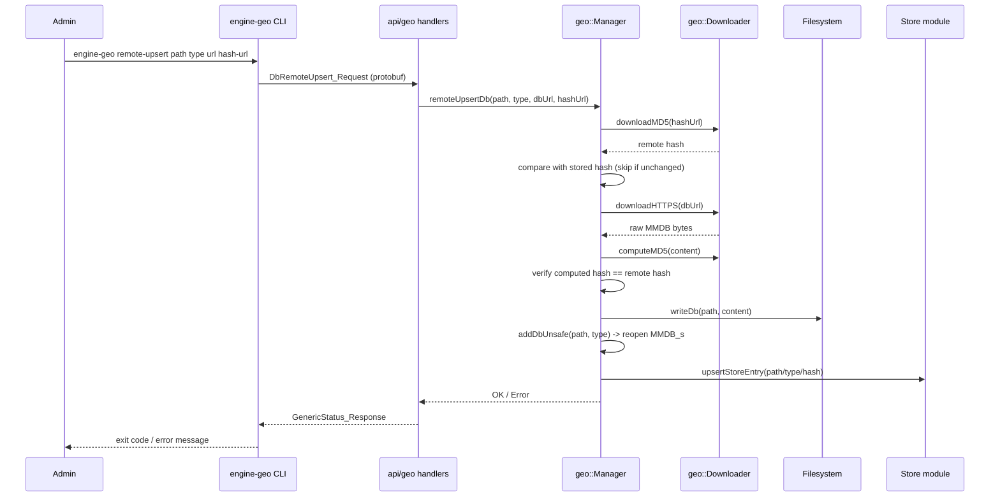
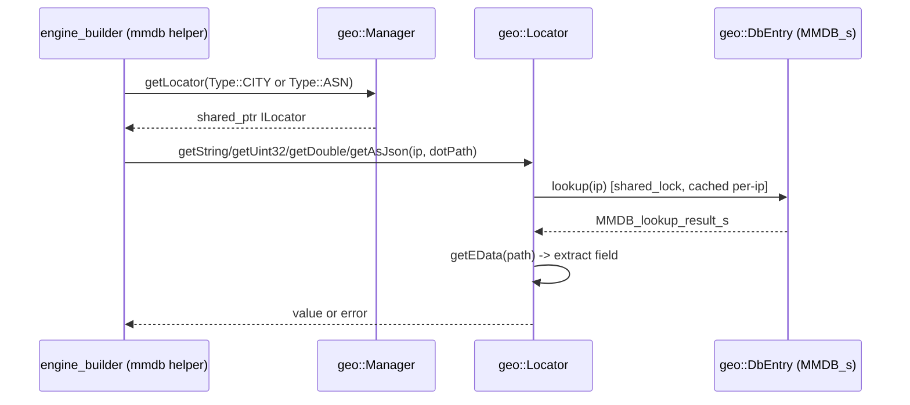

# Engine GeoIP Module (`engine_geo`)

## 1. Introduction & Purpose

The **`engine_geo`** module provides GeoIP enrichment capabilities for the Wazuh Engine. It allows the engine to
resolve geographic (city/country/coordinates) and network (ASN) information for a given IP address by querying
local **MaxMind DB (MMDB)** files. The module is composed of two cooperating parts:

1. A **C++ runtime library** (`src/engine/source/geo`) that is linked into the `wazuh-engine` daemon. It manages
   the lifecycle of MMDB database files (add/remove/list/remote-download-and-update) and exposes thread-safe
   "locator" objects used by the [Builder](engine_builder.md) pipeline (specifically the `builder_opmap_mmdb_geo`
   helpers `get_geo` / `get_as`) to enrich events at runtime.
2. A **Python CLI tool** (`engine_geo` console script, part of the
   [Engine Administration CLI Tools](Engine_Administration_CLI_Tools_(Python).md)) that lets administrators manage
   the GeoIP databases known to a running engine instance through the Engine [API](engine_api.md), without needing
   to interact with the engine process directly.

Typical use cases:
- Registering a locally-placed MMDB file with the engine (`engine-geo add`).
- Downloading/refreshing a MMDB database from a remote URL, verifying its integrity via an MD5 hash file
  (`engine-geo remote-upsert`).
- Listing databases currently loaded by the engine (`engine-geo list`).
- Removing a database registration (`engine-geo delete`).
- Programmatically looking up city/ASN data for an IP address during log/event processing
  (via `geo::ILocator`, consumed by the [engine_builder](engine_builder.md) `mmdb` helper functions).

## 2. Architecture Overview

### Component responsibilities

| Component | Responsibility |
|---|---|
| `geo::IManager` / `geo::Manager` | Central registry of GeoIP databases. Adds, removes, lists databases; persists metadata (path/type/hash) in the [Store](Store.md); orchestrates remote download+verification+atomic replace via `remoteUpsertDb`. Thread-safe (`std::shared_mutex`). |
| `geo::DbEntry` | RAII wrapper around an open `MMDB_s` handle plus its own per-database read/write mutex, enabling concurrent lookups while an update is in progress. |
| `geo::Locator` (`ILocator`) | Lightweight, per-query handle obtained from the `Manager` that performs the actual MMDB lookup for an IP and extracts a field (string/uint32/double/JSON) via a dot-path. Caches the last lookup result per IP to avoid repeated MMDB lookups for multiple field extractions on the same event. |
| `geo::Downloader` (`IDownloader`) | Performs HTTPS downloads of the `.mmdb` file and its corresponding `.md5` hash file, and computes MD5 checksums used to validate downloaded content and to detect when an update is actually needed. |
| `engine_geo` Python CLI | Thin protobuf-based client (`add`, `delete`, `list`, `remote-upsert` sub-commands) that talks to the engine's `api/geo` handlers over the API UNIX socket using the shared `api_communication.client.APIClient`. |

## 3. Data / Control Flow

### 3.1 Adding / Updating a database (CLI-driven)

### 3.2 Runtime lookup (engine pipeline)

## 4. Sub-modules

The module naturally splits along the language/runtime boundary:

| Sub-module | Description | Documentation |
|---|---|---|
| **GeoIP C++ Core Library** | The `geo::Manager`, `geo::Downloader`, `geo::DbEntry`, `geo::Locator` classes and the `IManager`/`DbInfo`/`Type` interface that together implement database lifecycle management and MMDB-backed IP lookups inside the engine daemon. | [engine_geo_cpp_core.md](engine_geo_cpp_core.md) |
| **GeoIP CLI Tool** | The Python `engine-geo` command-line tool (`add`, `delete`, `list`, `remote-upsert` sub-commands) used by administrators to manage GeoIP databases remotely through the Engine API. | [engine_geo_cli.md](engine_geo_cli.md) |

## 5. Relationship to Other Modules

- **[engine_api](engine_api.md)** — Specifically the `api/geo` handlers (`registerHandlers`) expose the `Manager`'s
  operations (`DbPost`, `DbDelete`, `DbList`, `DbRemoteUpsert`) as protobuf RPCs consumed by the CLI. This is the
  only sanctioned way for the CLI/administrators to reach the `geo::Manager` instance living inside the engine
  process.
- **[engine_builder](engine_builder.md)** — The `builder_opmap_mmdb_geo` sub-module (`getMMDBGeoBuilder`,
  `getMMDBASNBuilder` in `opmap/mmdb.cpp`) is the primary runtime consumer of `geo::ILocator`, using it to enrich
  events with city/ASN data during policy evaluation.
- **[Store](Store.md)** — `geo::Manager` persists per-database metadata (path, type, MD5 hash) as internal store
  documents so that database registrations survive engine restarts and so hash comparisons can short-circuit
  unnecessary re-downloads.
- **[Engine Administration CLI Tools (Python)](Engine_Administration_CLI_Tools_(Python).md)** — `engine_geo` is one
  of several sibling CLI tools (alongside `engine_kvdb`, `engine_catalog`, `engine_policy`, etc.) built on the same
  shared scaffolding (`shared.default_settings`, `api_communication.client.APIClient`) used to script/manage a
  running Wazuh Engine.
- **[engine_kvdb](engine_kvdb.md)** — A structurally similar CLI+manager pair (KVDB management) that follows the
  same add/delete/list pattern against the engine API; useful as a reference for understanding the conventions used
  by `engine_geo`.

## 6. Key Design Notes

- **Thread-safety**: The `Manager` uses a `std::shared_mutex` to guard its map of databases, allowing concurrent
  read access (`getLocator`, `listDbs`) while serializing structural modifications (`addDb`, `removeDb`,
  `remoteUpsertDb`). Each `DbEntry` additionally has its own `shared_mutex` so that a database can be safely
  swapped/reloaded without blocking unrelated lookups on other databases.
- **Weak-pointer locators**: `Locator` holds a `std::weak_ptr<DbEntry>` rather than a strong reference, ensuring
  that a database removed from the `Manager` while a `Locator` is still alive will not keep stale MMDB handles
  open indefinitely, and lookups will safely fail once the entry has expired.
- **Hash-based short-circuiting**: `remoteUpsertDb` downloads the remote MD5 hash first and compares it to the
  currently stored hash before downloading the (potentially large) database file, minimizing unnecessary network
  transfer and disk I/O when a database is already up to date.
- **One database per type**: The `Manager` keeps a `m_dbTypes` map from `Type` (`CITY`/`ASN`) to database name,
  implying only one active database per type is used for `getLocator` at any given time, even though multiple
  databases can be registered simultaneously.
