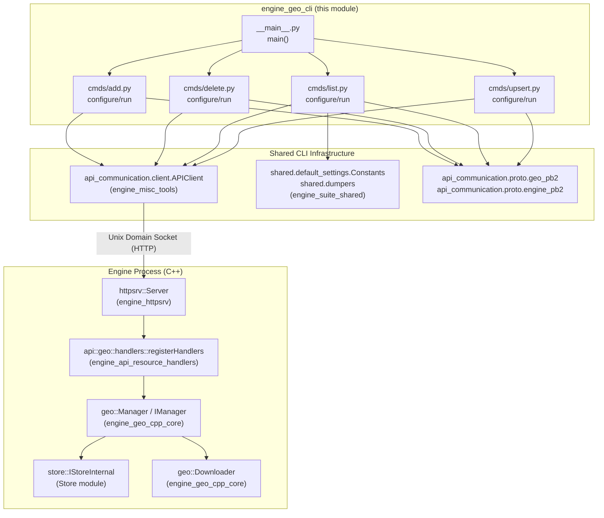
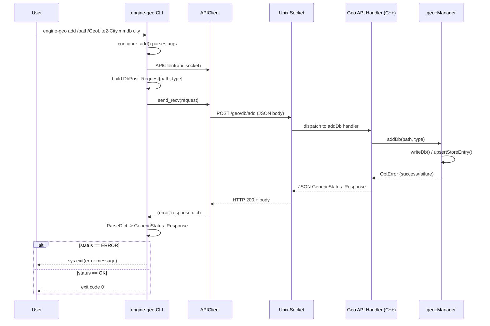
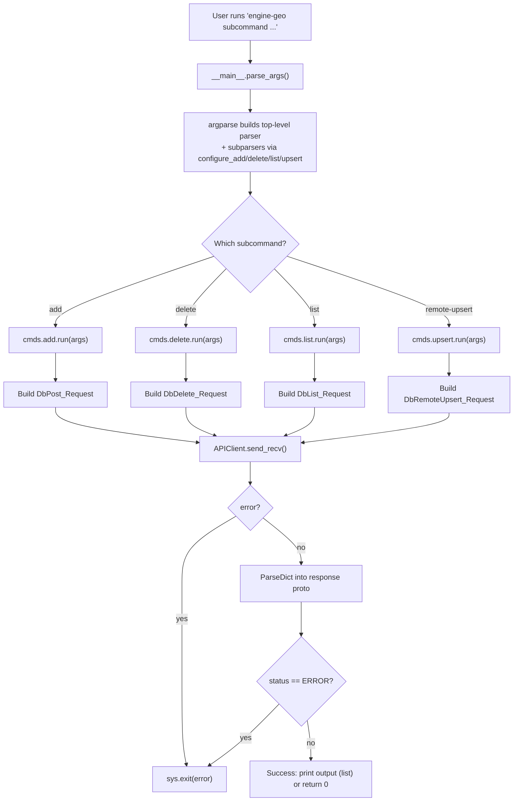
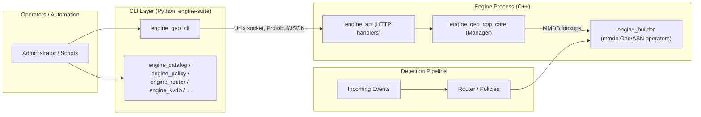

# Engine Geo CLI (`engine-geo`)

## Introduction

`engine_geo_cli` is the Python command-line front-end for managing **GeoIP (MaxMind MMDB) databases** used by the Wazuh Engine. It is one of the `engine-suite` administration tools and is installed as the `engine-geo` executable. The CLI does not implement any GeoIP logic itself — it is a thin, protocol-buffer based client that talks to the Engine's HTTP-over-Unix-socket API, which is served by the C++ **Geo API module** (`engine_api_resource_handlers` → `api/geo/handlers.hpp`) backed by the **Geo core module** (`engine_geo_cpp_core`, see [engine_geo.md](engine_geo.md)).

This tool allows administrators and automation scripts to:
- **Add** a local GeoIP database file to the running engine.
- **Delete** a previously registered GeoIP database.
- **List** all GeoIP databases currently tracked by the engine.
- **Remote-upsert** (download and update/insert) a GeoIP database from a remote URL with hash verification.

## Purpose and Core Functionality

The `engine-geo` tool is part of the broader `Engine_Administration_CLI_Tools_(Python)` module family (siblings: `engine_catalog`, `engine_policy`, `engine_router`, `engine_kvdb`, `engine_test`, etc.), all of which follow the same architectural pattern: a small `argparse`-based CLI that serializes a request into a Protobuf message, sends it over a Unix domain socket to the running `wazuh-engine` process, and prints/validates the JSON response.

Its exclusive responsibility is the **lifecycle management of GeoIP database registrations** inside the Engine, enabling helpers such as the `get_mmdb_asn`/`get_mmdb_geo` operators (`builder_opmap_mmdb_geo`, part of [engine_builder.md](engine_builder.md)) to enrich events with geolocation/ASN data.

## Architecture



## Component Relationships

| Component | Responsibility |
|---|---|
| `__main__.py::main` | Entry point; builds the `argparse` parser, registers subcommands (`add`, `delete`, `list`, `remote-upsert`), dispatches to the selected subcommand's `run` function. |
| `cmds/add.py` | Registers the `add <path> <type>` subcommand. Builds a `DbPost_Request` and sends it to the `/geo/db/add` endpoint. |
| `cmds/delete.py` | Registers the `delete <path>` subcommand. Builds a `DbDelete_Request` and sends it to the `/geo/db/del` endpoint. |
| `cmds/list.py` | Registers the `list` subcommand. Builds a `DbList_Request`, sends it to `/geo/db/list`, and pretty-prints the resulting database entries as YAML. |
| `cmds/upsert.py` | Registers the `remote-upsert <path> <type> <url> <url-hash>` subcommand. Builds a `DbRemoteUpsert_Request` and sends it to `/geo/db/remoteUpsert`, instructing the engine to download and verify a database from a remote source. |

All four subcommands share the same interaction pattern:
1. Parse CLI arguments (including the global `--api-socket` option, defaulting to `shared.default_settings.Constants.SOCKET_PATH`).
2. Instantiate `api_communication.client.APIClient` bound to the API socket.
3. Build the appropriate Protobuf request message (from `api_communication.proto.geo_pb2`).
4. Call `client.send_recv(request)` to perform the request/response cycle over the Unix socket.
5. Parse the JSON response into a `GenericStatus_Response` (or `DbList_Response` for `list`) and exit with an error message on failure.

For details on the `APIClient` implementation itself (shared across all `engine-suite` tools), see the [Engine_Administration_CLI_Tools_(Python).md](Engine_Administration_CLI_Tools_(Python).md) documentation (`engine_misc_tools` → `api-communication/src/api_communication/client.py`).

## Data Flow



## Process Flow: Command Dispatch



## Subcommand Reference

### `add`
```
engine-geo add <path> <type>
```
- `path`: filesystem path to a GeoIP MMDB file already present on the manager's filesystem.
- `type`: either `asn` or `city`.
- Sends `egeo.DbPost_Request` to `/geo/db/add`.

### `delete`
```
engine-geo delete <path>
```
- `path`: path of a database previously added, to be removed from the engine's tracking.
- Sends `egeo.DbDelete_Request` to `/geo/db/del`.

### `list`
```
engine-geo list
```
- Takes no positional arguments.
- Sends `egeo.DbList_Request` to `/geo/db/list`.
- Prints the returned `entries` collection formatted as YAML using `shared.dumpers.dict_to_str_yml`.

### `remote-upsert`
```
engine-geo remote-upsert <path> <type> <url> <url-hash>
```
- `path`: local path where the downloaded database will be stored.
- `type`: `asn` or `city`.
- `url`: remote URL to download the MMDB file from.
- `url-hash`: URL of a companion hash file used to verify integrity of the downloaded database.
- Sends `egeo.DbRemoteUpsert_Request` to `/geo/db/remoteUpsert`. On the engine side this triggers `geo::Manager::remoteUpsertDb`, which uses the `geo::Downloader` to fetch and validate the file before installing it (adding or replacing an existing entry for that path).

## Global Options

| Option | Default | Description |
|---|---|---|
| `--api-socket` | `Constants.SOCKET_PATH` (see [Engine_Administration_CLI_Tools_(Python).md](Engine_Administration_CLI_Tools_(Python).md) `engine_suite_shared`) | Path to the Wazuh Engine API Unix domain socket used for all communication. |
| `--version` | n/a | Prints the `engine-suite` package version and exits. |

## Dependencies

- **`engine_geo_cpp_core`** ([engine_geo.md](engine_geo.md)) — the C++ `geo::Manager`/`geo::IManager`/`geo::Downloader` implementation that this CLI ultimately controls. The CLI's `type` values (`asn`, `city`) correspond directly to the `geo::Type` enum consumed by the manager.
- **`engine_api_resource_handlers`** (part of [Wazuh_Engine_Core_(C++).md](Wazuh_Engine_Core_(C++).md), `engine_api`) — exposes the `/geo/db/*` HTTP routes via `api::geo::handlers::registerHandlers`, wiring HTTP requests to the `geo::Manager` methods (`addDb`, `removeDb`, `listDbs`, `remoteUpsertDb`).
- **`engine_httpsrv`** — the underlying `httpsrv::Server`/`IServer` abstraction that accepts connections on the Unix socket and routes requests to registered handlers.
- **`engine_misc_tools`** (`api-communication/src/api_communication/client.py::APIClient`) — shared low-level HTTP-over-UDS client used by every `engine-suite` CLI tool (`engine_catalog`, `engine_policy`, `engine_router`, `engine_kvdb`, `engine_test`, `engine_archiver`, etc.) to talk to the engine's API socket using Protobuf-described request/response bodies.
- **`engine_suite_shared`** (`shared/default_settings.py`, `shared/dumpers.py`) — provides `Constants.SOCKET_PATH` (default socket location) and YAML dumping helpers reused across all engine-suite CLIs.

## How This Module Fits Into the Overall System

`engine_geo_cli` sits at the operational/administration layer of the Wazuh Engine ecosystem:



By registering, updating, or removing GeoIP databases through this CLI, operators directly control the data available to the engine's `get_mmdb_geo`/`get_mmdb_asn` builder helpers (see [Wazuh_Engine_Core_(C++).md](Wazuh_Engine_Core_(C++).md), section `builder_opmap_mmdb_geo`), which enrich security events with geolocation and Autonomous System information during policy evaluation.

## Related Documentation

- [engine_geo.md](engine_geo.md) — parent module covering both the C++ core (`engine_geo_cpp_core`) and this CLI (`engine_geo_cli`).
- [Wazuh_Engine_Core_(C++).md](Wazuh_Engine_Core_(C++).md) — overall Engine architecture, including `engine_api`, `engine_httpsrv`, and `engine_builder`.
- [Engine_Administration_CLI_Tools_(Python).md](Engine_Administration_CLI_Tools_(Python).md) — sibling CLI tools (`engine_catalog`, `engine_policy`, `engine_router`, `engine_kvdb`, etc.) and shared infrastructure (`api_communication`, `shared`).
