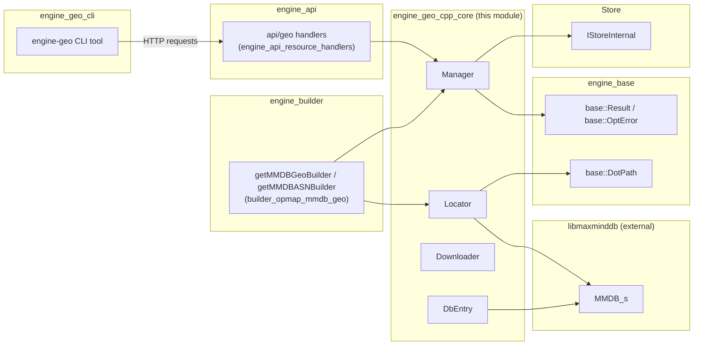
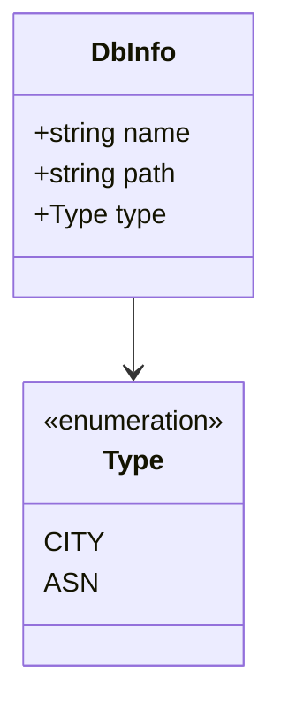
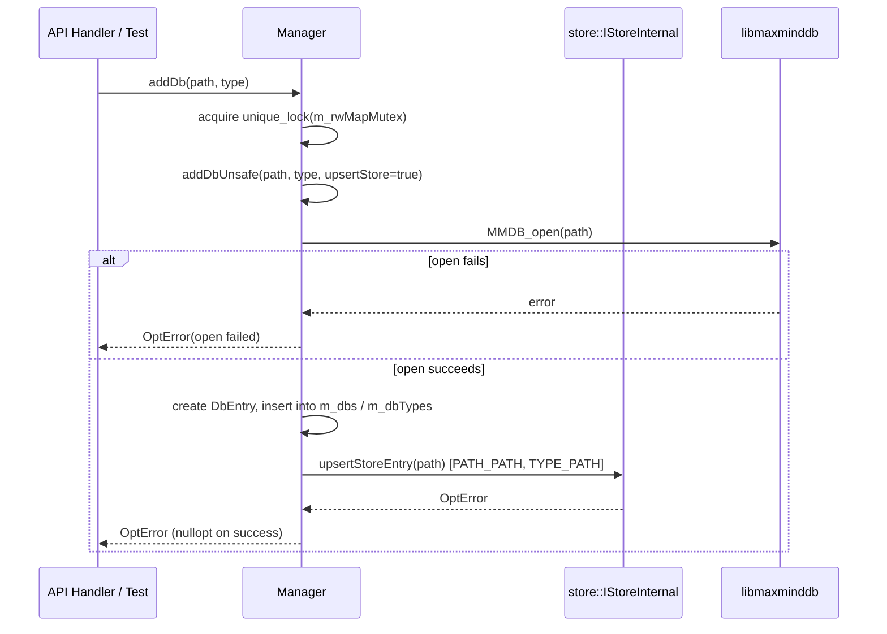
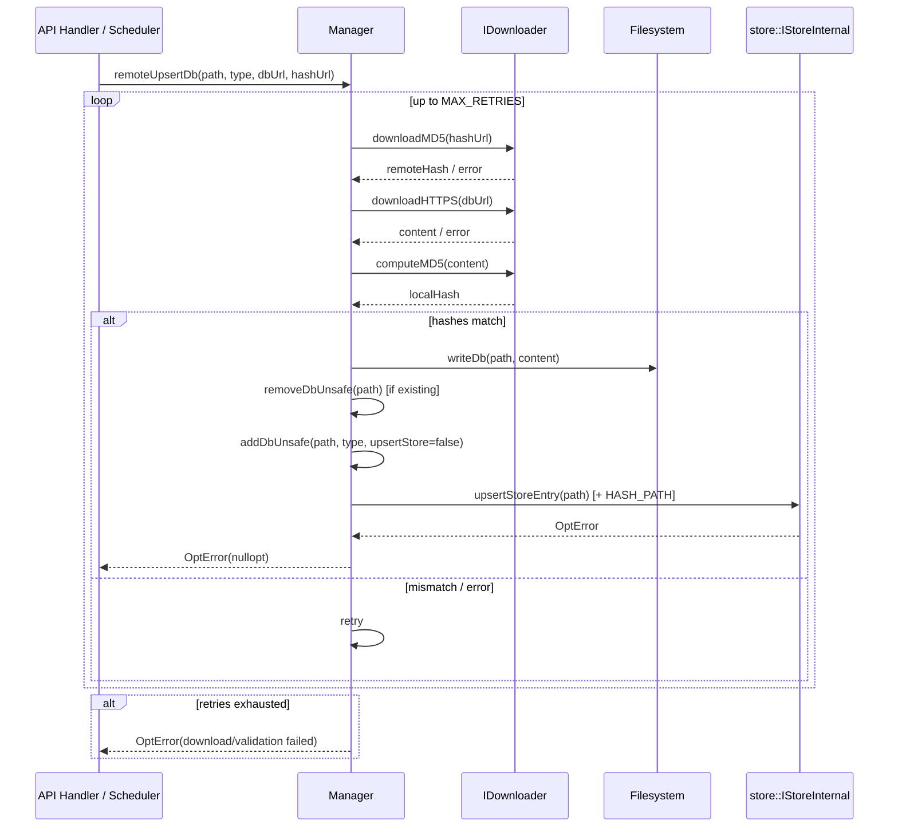
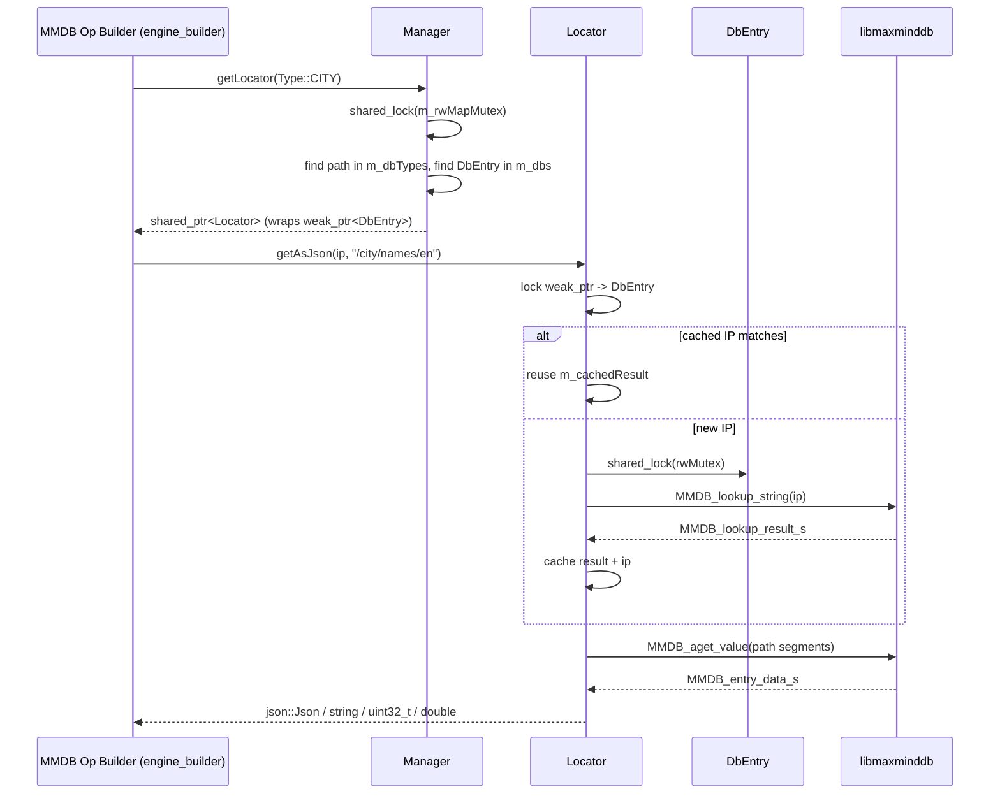
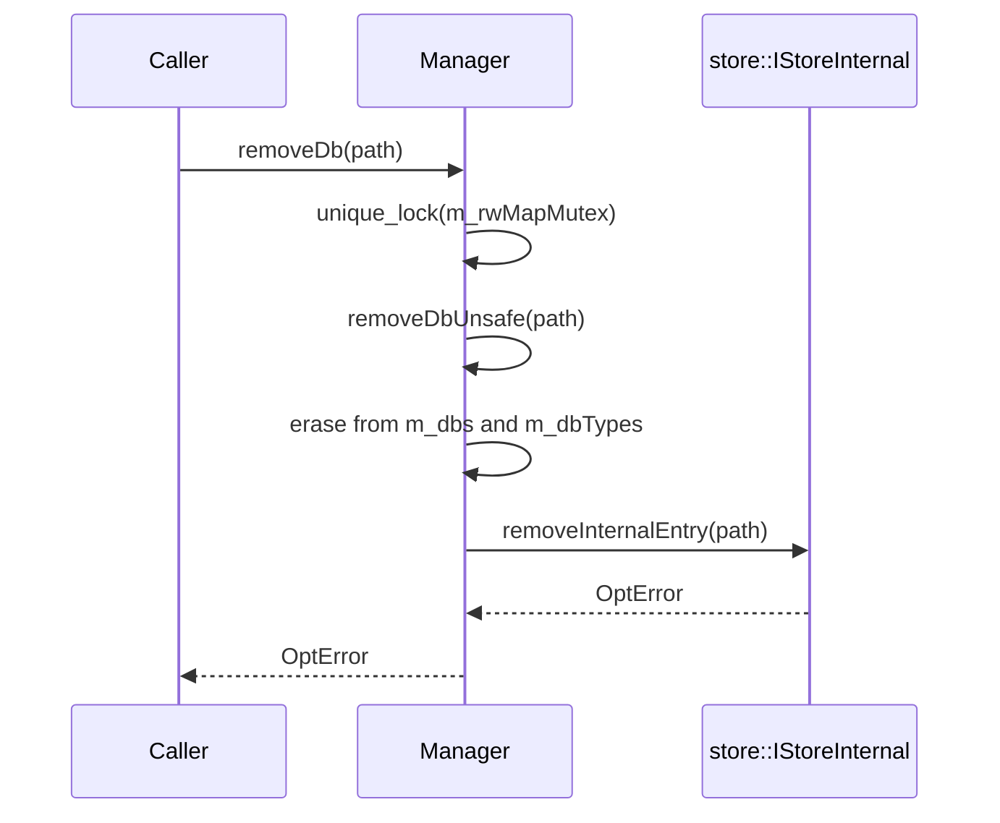
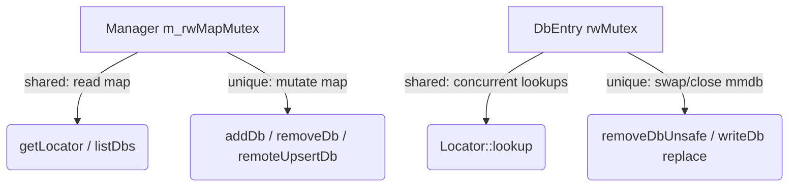

# Engine Geo C++ Core

## Introduction

The **Engine Geo C++ Core** module is the native (C++) implementation of the Wazuh Engine's geolocation subsystem. It is responsible for managing MaxMind (`.mmdb`) geolocation databases (City and ASN types), keeping them synchronized with remote sources, and providing fast, thread-safe lookups that translate an IP address into geographic or autonomous-system metadata (country, city, coordinates, ASN, organization, etc.).

This module is consumed internally by the Wazuh Engine's rule/decoder pipeline — specifically by the `getMMDBGeoBuilder` / `getMMDBASNBuilder` operators in the [`engine_builder`](engine_builder.md) module (sub-group `builder_opmap_mmdb_geo`) — to enrich events with geo-IP information at runtime. It is also exposed to operators through the Engine's HTTP API via handlers registered in [`engine_api`](engine_api.md) (`engine_api_resource_handlers`), and administered from the command line through the sibling module `engine_geo_cli` (the `engine-geo` Python tool).

This document focuses exclusively on the **C++ core** (`src/engine/source/geo/`): the `Manager`, `Locator`, `Downloader` and their supporting types. The CLI tool that talks to this core through the API is documented separately in `engine_geo_cli.md`.

---

## Purpose and Core Functionality

The module provides three main capabilities:

1. **Database lifecycle management** — adding, removing, listing, and remotely upserting (download + verify + replace) MMDB databases, while keeping a durable record of them in the Engine's [Store](Store.md).
2. **Remote synchronization** — downloading a database and its MD5 hash over HTTPS, validating integrity, and persisting the file to disk, with retry logic.
3. **Thread-safe querying** — exposing a lightweight, per-lookup `ILocator` object that can resolve a dotted-path field (`DotPath`) from a City or ASN database for a given IP, with an internal one-entry cache to avoid redundant lookups for the same IP within a single locator's lifetime.

---

## Architecture Overview

### Component Relationships

```mermaid
classDiagram
    class IManager {
        <<interface>>
        +addDb(path, type) OptError
        +removeDb(path) OptError
        +listDbs() vector~DbInfo~
        +remoteUpsertDb(path, type, dbUrl, hashUrl) OptError
        +getLocator(type) RespOrError~ILocator~
    }

    class Manager {
        -map~string, DbEntry~ m_dbs
        -map~Type, string~ m_dbTypes
        -shared_mutex m_rwMapMutex
        -shared_ptr~IStoreInternal~ m_store
        -shared_ptr~IDownloader~ m_downloader
        +addDb(path, type) OptError
        +removeDb(path) OptError
        +listDbs() vector~DbInfo~
        +remoteUpsertDb(...) OptError
        +getLocator(type) RespOrError~ILocator~
        -addDbUnsafe(...)
        -removeDbUnsafe(...)
        -upsertStoreEntry(...)
        -removeInternalEntry(...)
        -writeDb(...)
    }

    class DbEntry {
        +string path
        +Type type
        +shared_mutex rwMutex
        +unique_ptr~MMDB_s~ mmdb
    }

    class ILocator {
        <<interface>>
        +getString(ip, path) RespOrError~string~
        +getUint32(ip, path) RespOrError~uint32_t~
        +getDouble(ip, path) RespOrError~double~
        +getAsJson(ip, path) RespOrError~Json~
    }

    class Locator {
        -weak_ptr~DbEntry~ m_weakDbEntry
        -string m_cachedIp
        -MMDB_lookup_result_s m_cachedResult
        +getString(...)
        +getUint32(...)
        +getDouble(...)
        +getAsJson(...)
        -lookup(ip, dbEntry)
        -getEData(path)
    }

    class IDownloader {
        <<interface>>
        +downloadHTTPS(url) RespOrError~string~
        +computeMD5(data) string
        +downloadMD5(url) RespOrError~string~
    }

    class Downloader {
        +downloadHTTPS(url) RespOrError~string~
        +computeMD5(data) string
        +downloadMD5(url) RespOrError~string~
    }

    class DbInfo {
        +string name
        +string path
        +Type type
    }

    IManager <|.. Manager
    IDownloader <|.. Downloader
    ILocator <|.. Locator
    Manager "1" o-- "*" DbEntry : owns (shared_ptr)
    Manager --> IDownloader : uses
    Manager ..> DbInfo : returns
    Manager --> "store::IStoreInternal" : persists metadata
    Locator --> DbEntry : weak_ptr (borrowed)
    Manager ..> Locator : creates
```

### Key Types

| Component | File | Responsibility |
|---|---|---|
| `IManager` | `interface/geo/imanager.hpp` | Public contract for database lifecycle and locator retrieval. Also declares `Type` (`CITY`, `ASN`), `DbInfo`, and helper functions `typeName`/`typeFromName`/`validTypeNames`. |
| `Manager` | `include/geo/manager.hpp` | Concrete, thread-safe implementation of `IManager`. Owns all loaded `DbEntry` instances, coordinates persistence through the Store, and drives remote downloads through `IDownloader`. |
| `DbEntry` | `src/dbEntry.hpp` | RAII wrapper around a single `MMDB_s` handle (the libmaxminddb structure), plus its own `shared_mutex` for fine-grained read/write locking independent of the manager-wide map lock. |
| `IDownloader` / `Downloader` | `include/geo/downloader.hpp` | Abstracts HTTPS download and MD5 computation/validation so the `Manager` can be tested without real network access. |
| `ILocator` / `Locator` | `src/locator.hpp` | Lightweight, short-lived query object bound to one `DbEntry` (via `weak_ptr`) that performs MMDB lookups and extracts typed values (`string`, `uint32_t`, `double`, `json::Json`) from a dotted path. Caches the last IP lookup result to optimize repeated field access for the same IP. |

---

## Dependencies



- **[`engine_base`](engine_base.md)**: supplies the `base::Result` / `base::OptError` / `base::RespOrError` error-handling primitives and `base::DotPath` used throughout the public API.
- **[`Store`](Store.md)**: `Manager` persists database metadata (path, hash, type) under the internal namespace `geo` so that databases survive Engine restarts; see `INTERNAL_NAME`, `PATH_PATH`, `HASH_PATH`, `TYPE_PATH` constants.
- **[`engine_builder`](engine_builder.md)** (`builder_opmap_mmdb_geo`): the `getMMDBGeoBuilder`/`getMMDBASNBuilder` map operators use `IManager::getLocator()` to enrich events at policy-evaluation time.
- **[`engine_api`](engine_api.md)** (`engine_api_resource_handlers` / `api/geo`): exposes `addDb`, `removeDb`, `listDbs`, `remoteUpsertDb` over the Engine's control API.
- **`engine_geo_cli`** (sibling module, Python): the `engine-geo` CLI (`add`, `delete`, `list`, `upsert` sub-commands) is a thin client that calls the API handlers above; it does not link directly against this C++ core.
- **libmaxminddb** (external C library): provides `MMDB_s`, `MMDB_lookup_result_s`, and the lookup/open primitives wrapped by `DbEntry` and `Locator`.

---

## Data Model

### `Type` and `DbInfo`



- `Type` currently supports two database kinds, `CITY` and `ASN`. Only **one database per type** may be active in the manager at a time (`m_dbTypes` maps `Type -> path`).
- `typeName(Type)` / `typeFromName(string_view)` provide bidirectional string conversion (`"city"`, `"asn"`) used by the API/CLI layers and for Store keys.
- `validTypeNames()` returns a human-readable comma-separated list of valid type names, useful for validation error messages.

---

## Process Flows

### 1. Adding a Local Database (`addDb`)



### 2. Remote Upsert (`remoteUpsertDb`)



### 3. Obtaining and Using a Locator (Enrichment Path)



### 4. Removing a Database



---

## Concurrency and Thread Safety

The module uses a **two-level locking strategy** to balance safety and performance:

1. **Manager-level lock** (`std::shared_mutex m_rwMapMutex`): protects the `m_dbs` / `m_dbTypes` maps against concurrent structural changes (add/remove/upsert vs. `listDbs`/`getLocator`). Reads (`listDbs`, `getLocator`) take a shared lock; mutating operations take a unique lock.
2. **Per-database lock** (`std::shared_mutex DbEntry::rwMutex`): protects each individual `MMDB_s` handle during lookups, allowing multiple concurrent `Locator` reads on the *same* database, independent of other databases, and independent of the manager-level map lock (which is only briefly held to fetch the `DbEntry` shared_ptr).

`Locator` holds a `std::weak_ptr<DbEntry>` rather than a `shared_ptr`, so that a database being swapped out (e.g., during `remoteUpsertDb`) does not keep old `MMDB_s` data alive indefinitely, while in-flight lookups on already-locked `DbEntry` instances still complete safely.



---

## Error Handling

All public mutating operations return `base::OptError` (empty on success, populated with an error message on failure), while query operations that produce a value return `base::RespOrError<T>` — both defined in [`engine_base`](engine_base.md). Typical failure modes include:

- MMDB file not found or corrupt (`MMDB_open` failure).
- Hash mismatch between the downloaded database and its published MD5 (after `MAX_RETRIES` attempts).
- Store persistence failures (e.g., namespace conflicts) when writing `PATH_PATH`, `HASH_PATH`, `TYPE_PATH` entries.
- Requesting a `Locator` for a `Type` that has no database currently registered.
- Path traversal errors when resolving a `DotPath` that does not exist in the looked-up MMDB entry.

---

## Related Documentation

- [`engine_base.md`](engine_base.md) — core result/error types (`base::Result`, `base::OptError`, `base::RespOrError`) and `base::DotPath` used across the geo API.
- [`Store.md`](Store.md) — the internal key/value store used to persist database metadata across restarts.
- [`engine_builder.md`](engine_builder.md) — consumer of this module via the `getMMDBGeoBuilder` / `getMMDBASNBuilder` map operators (`builder_opmap_mmdb_geo`).
- [`engine_api.md`](engine_api.md) — HTTP API handlers (`api/geo`) that expose `Manager` operations to external clients.
- `engine_geo_cli.md` — the Python `engine-geo` command line tool that drives the API handlers above (`add`, `delete`, `list`, `upsert` commands).
