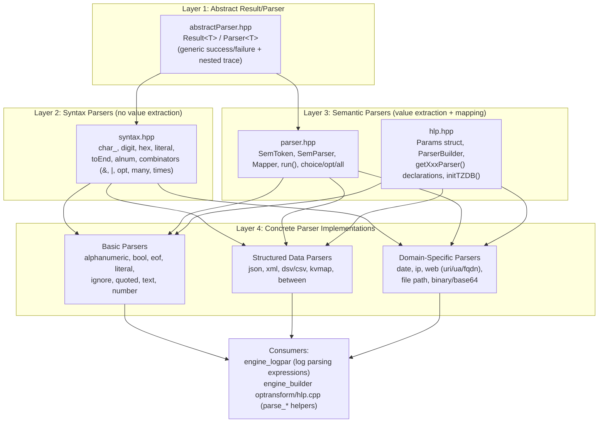
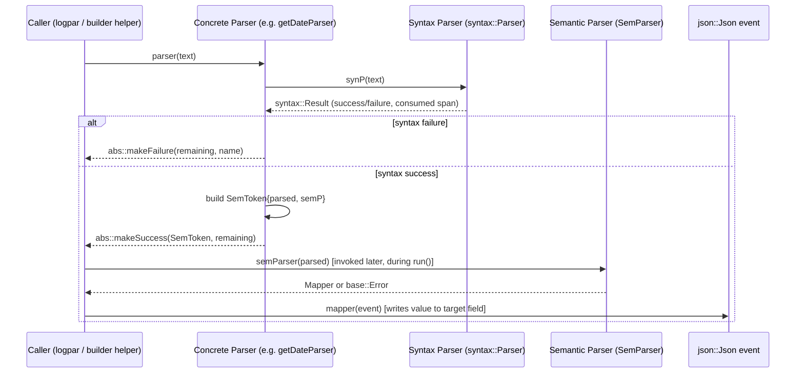
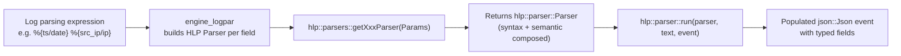

# Engine HLP (High Level Parsers)

## 1. Introduction and Purpose

The **HLP (High Level Parsers)** module is a foundational C++ library within the [Wazuh Engine Core](Wazuh_Engine_Core_(C++).md). It provides a composable **parser-combinator** framework used to extract structured, typed data (numbers, dates, IPs, URLs, JSON/XML fragments, key-value pairs, etc.) out of raw, unstructured or semi-structured log text.

HLP parsers are the building blocks used by the [engine_logpar](engine_logpar.md) module (which turns log-parsing expressions like `%{field}` into HLP parser pipelines) and by the [engine_builder](engine_builder.md) module's `parse` stage builders, which expose HLP parsers as engine "helper functions" (`parse_date`, `parse_ip`, `parse_json`, etc.) usable inside decoder/rule assets.

Key responsibilities of this module:
- Define the generic **syntax parsing** primitives (character/token level, no value extraction).
- Define the generic **semantic parsing** layer that extracts typed values and produces **mappers** that write results into a `json::Json` event.
- Implement a catalog of **concrete parsers**: numbers, booleans, dates, IP addresses, URLs/URIs, user agents, FQDNs, file paths, JSON, XML, CSV/DSV, key-value maps, quoted strings, literals, alphanumeric tokens, base64/binary blobs, and end-of-input/ignore helpers.
- Provide a uniform **`Params`** contract (name, target field, stop tokens, options) so that every parser can be built, configured, and invoked identically by upstream consumers (logpar, builder helpers).

## 2. Architecture Overview

HLP is organized in three conceptual layers, from the most generic to the most specific:

### Parsing Pipeline

Every concrete parser follows the same two-stage pipeline, orchestrated by `hlp::parser::run()`:

1. **Syntax stage**: a `syntax::Parser` validates and consumes a prefix of the input string, without producing any value (fast, cheap validation/tokenization using combinators like `&`, `|`, `opt`, `many1`, `times`, `toEnd`).
2. **Semantic stage**: a `SemParser` receives the consumed substring and either fails (`base::Error`, e.g. invalid number) or returns a `Mapper` — a closure that, given a `json::Json&` event, writes the extracted, typed value into `targetField`.
3. **Mapping stage**: `hlp::parser::run()` walks the (possibly nested) `Result` tree, collects all `Mapper`s from children that had a value, and finally applies them to the event.

This split allows constructing composite parsers (e.g., DSV/CSV, XML, JSON) that internally use lower-level syntax parsers while deferring all JSON event mutation to the mapping phase, and lets failures short-circuit early without touching the event.

## 3. Sub-modules

This module is documented in four parts, reflecting its layered design:

| Sub-module | Description | Doc |
|---|---|---|
| **Core Framework** | The `Result<T>`/`Parser<T>` abstraction, syntax-level combinators/primitives, the semantic `SemToken`/`Mapper`/`run()` pipeline, and the `Params` contract shared by every concrete parser. | [engine_hlp_core.md](engine_hlp_core.md) |
| **Basic Parsers** | Low-level, generic-purpose parsers: alphanumeric tokens, booleans, numbers (byte/long/float/double/scaled-float), literals, quoted strings, free text up to a stop token, end-of-input, and ignore/skip parsers. | [engine_hlp_basic_parsers.md](engine_hlp_basic_parsers.md) |
| **Structured Data Parsers** | Parsers that decode nested/structured payloads embedded in log lines: JSON, XML (with a Windows-Event module), CSV/DSV, key-value maps, and "between two delimiters" extraction. | [engine_hlp_structured_parsers.md](engine_hlp_structured_parsers.md) |
| **Domain-Specific Parsers** | Parsers that encode domain knowledge about common log fields: dates/timestamps (with timezone DB handling), IPv4/IPv6 addresses, URIs/URLs, user agents, FQDNs, filesystem paths, and base64/binary blobs. | [engine_hlp_domain_parsers.md](engine_hlp_domain_parsers.md) |

## 4. Relationship to Other Modules

- **[engine_logpar](engine_logpar.md)**: The log-parsing expression engine (`Logpar`) compiles `%{field}` style patterns into sequences of HLP parsers built via the `ParserBuilder`/`Params` contract defined here.
- **[engine_builder](engine_builder.md)**: The `optransform/hlp.cpp` builders (`dateParseBuilder`, `ipParseBuilder`, `jsonParseBuilder`, `uriParseBuilder`, `xmlParseBuilder`, etc., part of [builder_optransform](builder_optransform.md)) wrap HLP parsers as engine helper functions callable from decoder/rule assets via the `parse` stage.
- **[engine_base](engine_base.md)**: HLP relies on `base::Error` for semantic-parsing failures and on the engine's `json::Json` type for building mapped event fields.
- **[engine_parsec](engine_parsec.md)**: A related, more general-purpose parser-combinator library in the engine; HLP implements its own lightweight `abs::Result`/`abs::Parser` abstraction rather than depending on `parsec` directly, tailored specifically to log field extraction.

## 5. Typical Usage Flow

Each `getXxxParser(const Params&)` factory validates its `Params.options`/`Params.stop` at build time (throwing `std::runtime_error` on invalid configuration), then returns a closure implementing the two-stage syntax/semantic pipeline described above. This "build once, run many times" pattern amortizes parser configuration cost across repeated invocations on incoming events.
