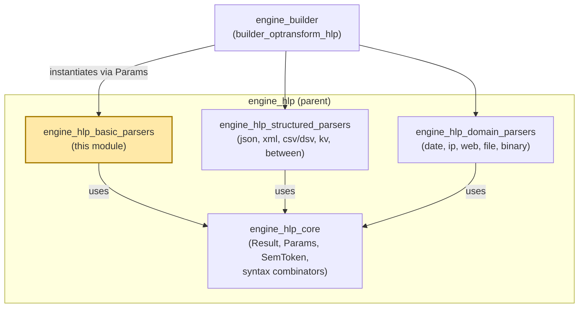
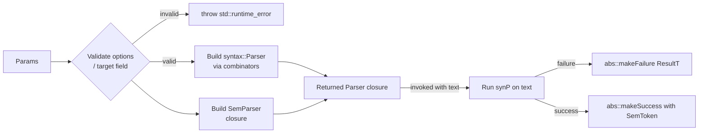
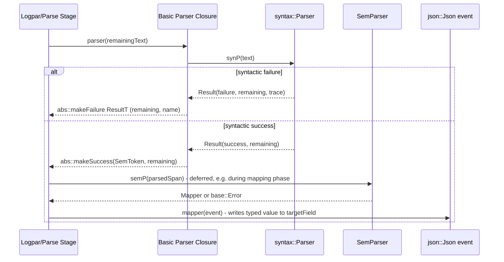
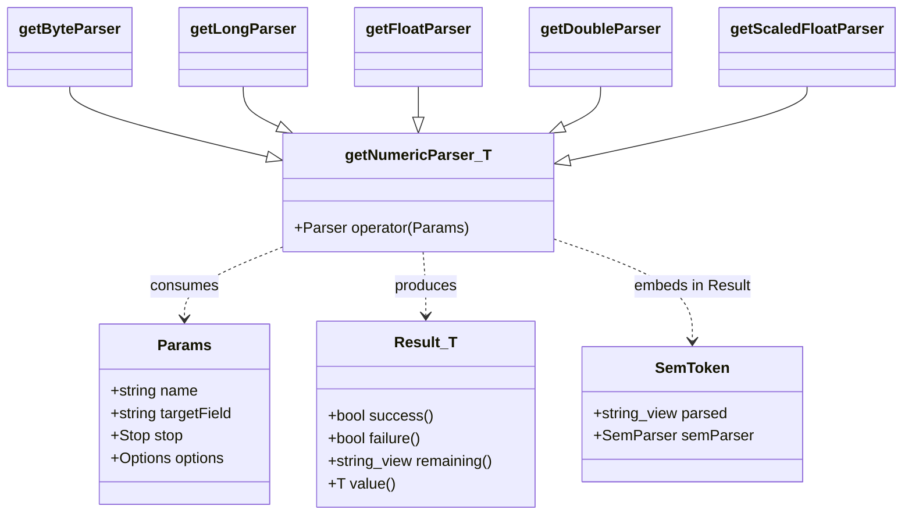
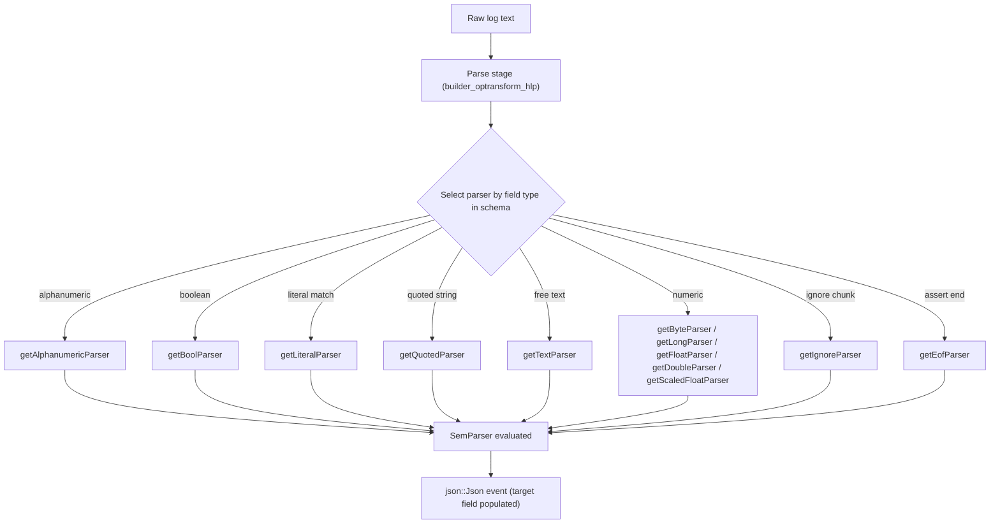

# Engine HLP Basic Parsers

## Introduction

The **engine_hlp_basic_parsers** module is a leaf component of the Wazuh Engine's High-Level Parser (HLP) library. It provides the collection of foundational, "atomic" field parsers that the log-parsing engine composes together to extract typed values out of raw log text. These parsers handle the simplest but most frequently used data shapes: alphanumeric tokens, booleans, literal strings, quoted strings, free text up to a stop token, end-of-input markers, ignorable substrings, and numeric types (byte/int8, long/int64, float, double, and scaled float).

Every parser in this module follows the same two-phase design used throughout the HLP library: a **syntactic** phase that validates and consumes characters from the input according to a grammar, and a **semantic** phase that converts the consumed text into a typed value and (optionally) writes it into the output JSON event. This module builds directly on the core abstractions defined in `engine_hlp_core` (the sibling module documented in `engine_hlp_core.md`) and is, in turn, consumed by the higher-level parser combinators and stage builders documented in `engine_builder.md` (specifically `builder_optransform_hlp`).

## Purpose and Scope

This module's sole responsibility is to implement `Parser` factory functions—functions that take a `Params` struct and return a closure conforming to the `hlp::parser::Parser` signature (`std::string_view -> Result`). Each factory:

1. Validates the parser-specific `Params` (options, target field, stop tokens) at construction time, throwing `std::runtime_error` for invalid configurations.
2. Builds a **syntactic parser** (`syntax::Parser`) using combinators from `engine_hlp_core`'s `syntax.hpp` (e.g., `many1`, `opt`, `literal`, `digit`, `alnum`).
3. Builds a **semantic parser** (`SemParser`) that, given the raw parsed text, returns either a `Mapper` (a function that writes a value into a `json::Json` event) or a `base::Error`.
4. Returns a closure that runs the syntactic parser first; on success it packages the parsed span and semantic parser into a `SemToken`, wrapped in a successful `Result`; on failure it returns a failed `Result` carrying trace/name information for diagnostics.

The basic parsers in this module are intentionally simple and dependency-free with respect to each other — they only depend on the shared core types (`Result`, `Params`, `SemToken`, syntax combinators) from `engine_hlp_core`.

## Components Covered

| Component | File | Purpose |
|---|---|---|
| `getAlphanumericParser` | `alphanumeric.cpp` | Parses one-or-more alphanumeric characters (optionally with extra allowed characters). |
| `getBoolParser` | `bool.cpp` | Parses the literals `true`/`false` into a JSON boolean. |
| `getEofParser` | `eof.cpp` | Succeeds only if the input is fully consumed (end of field/string). |
| `getIgnoreParser` | `ignore.cpp` | Consumes one-or-more repetitions of a literal without producing output. |
| `getLiteralParser` | `literal.cpp` | Matches an exact literal string. |
| `getQuotedParser` | `quoted.cpp` | Parses a quoted string with configurable quote/escape characters, unescaping the content. |
| `getTextParser` | `text.cpp` | Consumes text up to one of several configurable stop sequences (or to end of input). |
| `getByteParser`, `getLongParser`, `getFloatParser`, `getDoubleParser`, `getScaledFloatParser` | `number.cpp` / `number.hpp` | Generic numeric parsing template (`getNumericParser<T>`) instantiated for `int8_t`, `int64_t`, `float`, `double`. |

## Architecture

### Layered Position

See `engine_hlp_core.md` for the shared `Result`, `Params`, `SemToken`, `Mapper`/`SemParser` type definitions and the `syntax` combinator library. See `engine_builder.md` for how these parsers are registered and invoked as part of the `parse` stage builder (`optransform/hlp.cpp`).

### Parser Construction Pattern

Every file in this module follows an identical construction pattern, split into a **syntactic** parser and a **semantic** parser, combined in the returned `Parser` closure:

### Sequence: Parsing a Field at Runtime

Note the two-step evaluation: the syntactic pass runs immediately to determine whether the input matches, while the semantic conversion (`SemParser` -> `Mapper`) is deferred and only invoked when the caller decides to materialize the result into the output event. This lets the engine backtrack over parser choices cheaply without paying the cost of value conversion until a parse branch is committed.

## Component Details

### `getAlphanumericParser` (alphanumeric.cpp)

- **Options**: 0 or 1 — an optional string of additional characters to accept beyond alphanumerics.
- **Syntax**: `many1(alnum(additional))` — requires at least one matching character.
- **Semantics**: writes the matched span as a string to `targetField` via `event.setString`.
- **Errors**: throws if more than 1 option is supplied.

### `getBoolParser` (bool.cpp)

- **Options**: none accepted.
- **Syntax**: tries `literal("true", caseSensitive=false)` first, then `literal("false", ...)`.
- **Semantics**: two separate semantic parsers (`trueSemP`/`falseSemP`) each producing a `Mapper` that calls `event.setBool(true/false, targetField)`.
- **Failure**: if neither literal matches, returns a failure result with the parser name in the trace.

### `getEofParser` (eof.cpp)

- **Options**: none accepted (throws otherwise).
- **Behavior**: succeeds with an empty/no-op semantic parser only if `txt.empty()`; otherwise fails. Used to assert full consumption of a field.

### `getIgnoreParser` (ignore.cpp)

- **Options**: exactly 1, non-empty — the literal substring to repeatedly discard.
- **targetField**: must be empty (parser does not write output) — throws otherwise.
- **Syntax**: `many1(literal(options[0]))` — consumes one-or-more repetitions.
- **Semantics**: no-op (`noSemParser()`), purely used to skip uninteresting input.

### `getLiteralParser` (literal.cpp)

- **Options**: exactly 1 — the literal text to match exactly (case-sensitive).
- **Semantics**: if `targetField` is set, writes the literal string itself to the event; otherwise no mapping occurs.

### `getQuotedParser` (quoted.cpp)

- **Options**: 0, 1, or 2 — quote character (default `"`) and escape character (default `\`). Both must be single characters and must differ from each other.
- **Syntax**: hand-written scanner that walks the input character-by-character honoring escape sequences and requiring a matching closing quote.
- **Semantics**: strips the surrounding quotes and removes escape characters from the content, then writes the unescaped string to `targetField`.

### `getTextParser` (text.cpp)

- **Requires**: at least one stop token in `params.stop` (throws otherwise); does not accept `options`.
- **Syntax**: builds a chain of `toEnd(stopToken)` parsers combined with the choice combinator (`|`) for each stop string in `params.stop`; an empty stop string maps to `toEnd()` (consume everything to end of input).
- **Semantics**: writes the consumed span to `targetField` as a string.
- Frequently used as a catch-all/fallback field in log parsing definitions.

### Numeric Parsers (number.cpp / number.hpp)

This is the most structurally interesting file in the module: it implements a **single generic template**, `getNumericParser<T>`, in `number.hpp`, which is instantiated for five public factory functions in `number.cpp`:

| Factory | Type `T` | JSON setter |
|---|---|---|
| `getByteParser` | `int8_t` | `event.setInt` |
| `getLongParser` | `int64_t` | `event.setInt64` |
| `getFloatParser` | `float_t` | `event.setFloat` |
| `getDoubleParser` | `double_t` | `event.setDouble` |
| `getScaledFloatParser` | `double_t` (same as double) | `event.setDouble` |

Key implementation details:
- `utils::from_chars` overloads wrap both `std::from_chars` (for integral types) and `fast_float::from_chars` (for floating-point types) behind a uniform interface, normalizing to `std::from_chars_result`.
- `utils::setNumber` overloads dispatch to the correct `json::Json` setter based on type.
- The syntax parser (`getSynParser<T>`) is built with `syntax::combinators`: for integral `T` it disallows scientific notation (`opt('-') & many1(digit()) & opt('.') & many(digit())`), while for floating-point `T` it additionally allows an exponent suffix (`e`/`E`, optional sign, digits).
- The semantic parser attempts `from_chars` on the matched span; a `std::errc::result_out_of_range` becomes a distinct `base::Error {"Number is out of range"}`, while any other conversion failure yields `base::Error {"Expected a number"}`.
- None of the numeric parsers accept `options`; they throw if any are supplied.

## Data Flow: From Log Line to Typed Event Field

## Relationships to Other Modules

- **`engine_hlp_core`** (`engine_hlp_core.md`): Supplies the foundational types this module depends on directly — `hlp::abstractParser::Result`, `hlp::hlp::Params`, `hlp::parser::SemToken`/`choice`, and the `syntax` namespace combinators (`hex`, `opt`, `toEnd`, `many`, `many1`, `literal`, `digit`, `alnum`, etc.) defined in `syntax.hpp`. This module cannot function without those abstractions.
- **`engine_hlp_structured_parsers`**: Sibling module implementing more complex parsers (JSON, XML, CSV/DSV, key-value, between) that sometimes internally reuse basic syntax primitives from `engine_hlp_core` in the same manner as this module, but are documented separately due to their higher structural complexity.
- **`engine_hlp_domain_parsers`**: Sibling module for domain-specific parsers (date, IP, URI/FQDN/user-agent, file path, binary/base64) — conceptually parallel to this module but specialized for semantically richer data types.
- **`engine_builder` / `builder_optransform_hlp`** (`engine_builder.md`): The consumer of this module. The `hlp.cpp` builder file (`alphanumericParseBuilder`, `boolParseBuilder`, `byteParseBuilder`, `doubleParseBuilder`, `floatParseBuilder`, `longParseBuilder`, `quotedParseBuilder`, etc.) wraps each factory function from this module into a stage/operation builder usable in policy YAML definitions (e.g., `parse|alphanumeric`, `parse|byte`).
- **`engine_logpar`**: Uses the HLP parsers (including this module's) to compile log-parsing patterns (`logpar.hpp`) into executable parser pipelines for decoders.
- **`engine_parsec`**: A more generic parser-combinator interface (`parsec.hpp`) that conceptually parallels the `syntax` combinator layer used internally here, though `engine_hlp` maintains its own dedicated combinator implementation for HLP-specific needs.

## Design Notes and Conventions

1. **Fail-fast configuration validation**: All parsers validate their `Params` (arity/content of `options`, presence/absence of `targetField`, presence of `stop`) at *factory construction time* (i.e., when the policy/decoder is compiled), not at parse time. This surfaces configuration errors early, during policy loading, rather than at runtime during log ingestion.
2. **Optional field mapping**: Most parsers treat an empty `targetField` as "parse but don't map" — they still validate syntax but produce a `noSemParser()`/`noMapper()` no-op, useful for validating log structure without capturing every field.
3. **Deferred semantic evaluation**: Splitting syntax and semantics allows the engine to attempt multiple candidate parsers cheaply (only the syntactic phase runs during backtracking); actual value conversion/allocation happens only once a parse path is confirmed.
4. **Uniform error reporting**: All parsers return failures via `abs::makeFailure<ResultT>(remaining, name)`, embedding the parser's configured `name` (from `Params::name`) so that trace/diagnostic output can pinpoint which parser in a composed pipeline failed.
5. **No cross-dependencies within the module**: Each file (`alphanumeric.cpp`, `bool.cpp`, `eof.cpp`, `ignore.cpp`, `literal.cpp`, `quoted.cpp`, `text.cpp`, `number.cpp`) is self-contained aside from shared core includes (`hlp.hpp`, `syntax.hpp`), making the module easy to extend with additional simple parsers without risk of regressions elsewhere.

## Extension Points

To add a new basic parser to this module:
1. Create a new `.cpp` file defining a `getXParser(const Params&) -> Parser` factory in the `hlp::parsers` namespace.
2. Validate `params.options`/`params.targetField`/`params.stop` and throw `std::runtime_error` on invalid configuration.
3. Compose a `syntax::Parser` using combinators from `engine_hlp_core`'s `syntax.hpp`.
4. Define a `SemParser` (or reuse `noSemParser()`) that converts the parsed span into a `Mapper` writing to `json::Json`.
5. Register the new builder function in `engine_builder`'s `optransform/hlp.cpp` so it becomes available as a `parse|x` operation in policy definitions.

For more complex parsing needs (nested/structured formats, domain-specific semantics), prefer extending `engine_hlp_structured_parsers` or `engine_hlp_domain_parsers` instead, keeping this module focused on simple, single-pass, non-recursive parsers.
