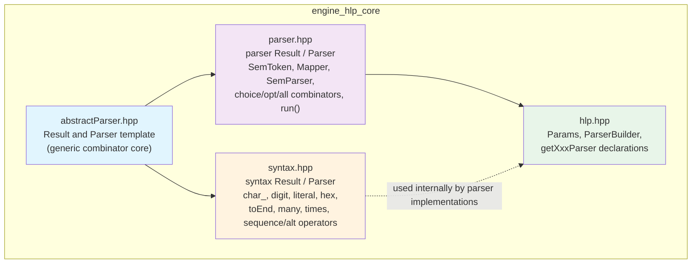
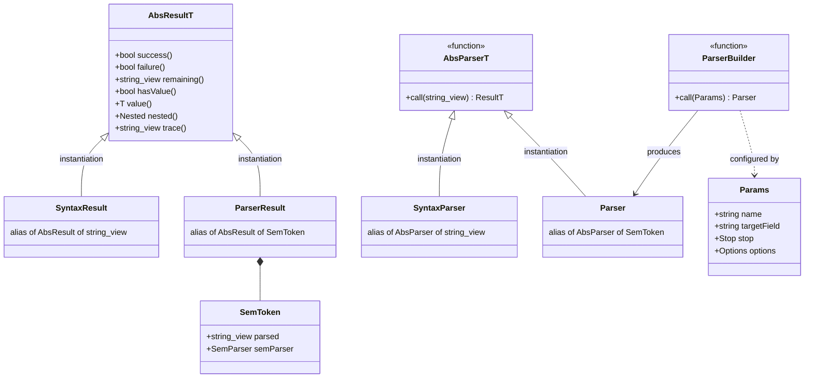
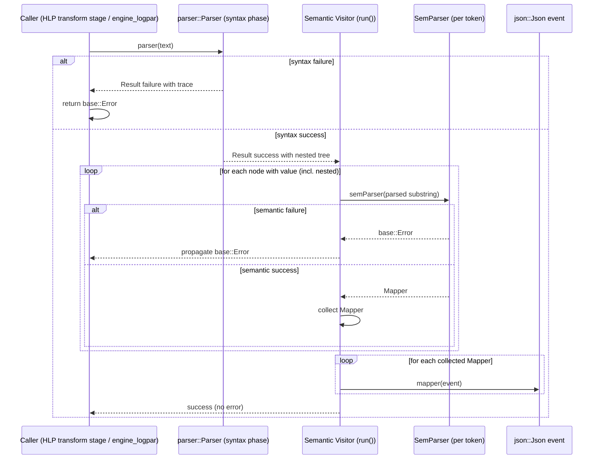
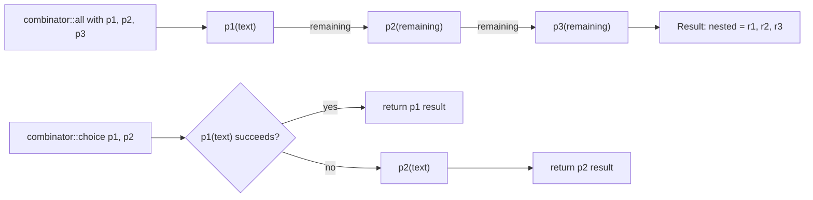

# Engine HLP Core

## Introduction

`engine_hlp_core` is the foundational layer of the Wazuh Engine's **High Level Parser (HLP)** subsystem. It defines the generic parser-combinator abstraction, the two concrete parsing frameworks built on top of it (a low-level *syntax* parser and a higher-level *semantic* parser), and the public contract (`Params`, `ParserBuilder`, and the declarations of every concrete parser factory) that all HLP parser implementations must follow.

This module does not implement any specific field parser (IP, date, URI, JSON, etc.) itself — those live in sibling modules under [engine_hlp.md](engine_hlp.md) (basic, structured, and domain parsers). Instead, `engine_hlp_core` provides the **types, combinators, and pipeline** that make those parsers composable, testable, and pluggable into the Wazuh Engine's decoder/parsing stages (see [engine_logpar.md](engine_logpar.md) and [builder_optransform_hlp.md](builder_optransform_hlp.md)).

## Purpose and Core Functionality

The module solves three problems for the HLP subsystem:

1. **Generic parsing abstraction** (`abstractParser.hpp`): A reusable, type-safe `Result<T>` / `Parser<T>` pair implementing the classic *parser combinator* pattern in C++, independent of what is being parsed or extracted.
2. **Two specializations of that abstraction**:
   - **Syntax parsing** (`syntax.hpp`): Cheap, value-less character/string matching primitives (`any`, `char_`, `digit`, `literal`, `hex`, `toEnd`, `many`, `times`, etc.) plus algebraic combinators (sequence, alternative, `opt`). Used to validate/consume raw text quickly before deeper semantic work is attempted.
   - **Semantic parsing** (`parser.hpp`): A three-phase pipeline (syntax → semantic → mapping) built around `SemToken`, producing `Mapper` functions that know how to write extracted values into a `json::Json` event. This is the parser type actually used by field/log parsers.
3. **Public parser contract** (`hlp.hpp`): Defines `Params` (parser configuration: name, target field, stop tokens, options) and `ParserBuilder`, plus the declarations for every concrete parser factory function (`getDateParser`, `getIPParser`, `getJSONParser`, `getCSVParser`, etc.) that are implemented in the sibling HLP modules.

## Architecture

The module is organized in layers, each building on the previous one.

- **`abstractParser.hpp`** is the only file with no dependency on the others; it is a self-contained generic library (namespace `hlp::abs`).
- **`syntax.hpp`** instantiates `hlp::abs::Result<std::string_view>` / `hlp::abs::Parser<std::string_view>` as `hlp::syntax::Result` / `hlp::syntax::Parser`, adding combinators that only track "consumed vs. remaining" text, without extracting typed values.
- **`parser.hpp`** instantiates the abstraction again with a richer value type, `SemToken` (namespace `hlp::parser`), adding the concept of deferred semantic evaluation and JSON mapping.
- **`hlp.hpp`** sits on top of `parser.hpp`, defining the `Params` struct used to configure any concrete parser and declaring the factory functions (`ParserBuilder`-compatible) that sibling modules implement.

## Core Components

### 1. `hlp::abs::Result<T>` / `hlp::abs::Parser<T>` (abstractParser.hpp)

The generic building block of the whole HLP framework.

- `Result<T>` encapsulates: extracted `value()`, `remaining()` unconsumed input, `success()`/`failure()` status, a `trace()` string for error diagnostics, `hasValue()` flag, and a recursive `nested()` vector of child results (used to build parse trees, e.g. for logpar fields).
- `Parser<T>` is simply `std::function<Result<T>(std::string_view)>` — a function from input to a result.
- Helper factories `makeSuccess<T>(...)` and `makeFailure<T>(...)` simplify constructing results without dealing with the constructor overloads directly.

This type is deliberately generic (templated on `T`) so it can be reused for different parsing "flavors" without code duplication — this is exactly how `syntax::Result`/`syntax::Parser` and `parser::Result`/`parser::Parser` are derived (see below).

### 2. Syntax Parsers (`syntax.hpp`)

A specialization where `T = std::string_view` and no semantic value is carried — only whether the input was matched and how much was consumed.

Key pieces:
- **Primitive parsers**: `any()`, `char_(c)`, `digit()`, `hex()`, `literal(str, caseSensitive)`, `alnum(additional)`.
- **Positional parsers**: `toEnd(char)`, `toEnd(string)`, `toEnd()` (rest of input), `toEnd(vector<string>)` (first of multiple possible stop tokens).
- **Combinators** (namespace `combinators`): sequence operator (both must succeed), alternative operator (first success wins), `opt` (optional, always succeeds), `times`/`many`/`many1`/`repeat` (repetition with min/max bounds).

These are used internally by concrete parser implementations (basic, structured, and domain parsers under [engine_hlp.md](engine_hlp.md)) to efficiently pre-validate or scan raw text before/while extracting semantic values, and by the `logpar` field tokenizer (see [engine_logpar.md](engine_logpar.md)).

### 3. Semantic Parsers (`parser.hpp`)

The parser type actually consumed by the rest of the Engine. Specializes `hlp::abs` with `T = SemToken`:

- **`SemToken`**: pairs the raw parsed substring (`parsed`) with a `SemParser` — a function that lazily interprets that substring and returns either a `Mapper` (a function that writes the value into a `json::Json` event) or a `base::Error`.
- **`Mapper`** / **`noMapper()`**: type and no-op implementation for functions that mutate a JSON event with an extracted field.
- **`SemParser`** / **`noSemParser()`**: type and no-op implementation for the semantic interpretation step.
- **`parser::Result` / `parser::Parser`**: aliases of `abs::Result<SemToken>` / `abs::Parser<SemToken>`.
- **`combinator::choice(lhs, rhs)`**: tries `lhs`, falls back to `rhs` on failure (alternative).
- **`combinator::opt(parser)`**: always succeeds, returning empty success if the wrapped parser fails.
- **`combinator::all(parsers)`**: sequences a list of parsers, short-circuiting on first failure and nesting all sub-results.
- **`run(parser, text, event)`**: the orchestration function implementing HLP's **three-phase pipeline**:
  1. **Syntax phase** — invoke the parser to validate/consume `text`.
  2. **Semantic phase** — recursively visit the (possibly nested) result tree, invoking each node's `SemParser` to produce a `Mapper` or propagate a `base::Error`.
  3. **Mapping phase** — apply all collected `Mapper`s to the target `event` (a `json::Json`; see [engine_base.md](engine_base.md) for `base::Error`/JSON foundations).

This separation allows a parser to fully validate syntax before committing to (potentially expensive) semantic interpretation, and keeps JSON mutation isolated to the final mapping step.

### 4. Public Parser Contract (`hlp.hpp`)

- **`Params`**: the configuration structure passed to every parser factory — `name` (for error messages), `targetField` (JSON field to populate; empty means "parse but discard"), `stop` (list of end tokens), and `options` (parser-specific extra arguments).
- **`ParserBuilder`**: `std::function<parser::Parser(const Params&)>` — the factory signature that every `getXxxParser` function conforms to. This is the extension point used by:
  - Basic parsers (alphanumeric, bool, byte/long/float/double, text, quoted, literal, eof, ignore)
  - Structured-data parsers (JSON, XML, CSV/DSV, key-value, between)
  - Domain-specific parsers (date, IP, FQDN, URI, user-agent, file path, binary/base64)
  - [engine_builder.md](engine_builder.md)'s HLP transform stage builders (see [builder_optransform_hlp.md](builder_optransform_hlp.md)), which wrap these parser factories into pipeline transform stages.
  - [engine_logpar.md](engine_logpar.md), which uses HLP parsers to tokenize log lines according to a log pattern.
- `initTZDB(...)`: initializes the timezone database used by the date parser family; declared here as part of the HLP module's initialization contract even though implemented in the domain-parsers sub-module.

## Component Relationships

## Parsing Pipeline (Data Flow)

The `run()` function in `parser.hpp` is the primary entry point invoked by consumers (parse stage builders, logpar) once a `parser::Parser` has been built via a `ParserBuilder`.

Key properties of this pipeline:
- **Fail fast**: if syntax parsing fails, no semantic work or JSON mutation happens.
- **Deferred semantics**: a successful syntax match does not guarantee a successful *value* interpretation (e.g., a numeric string that overflows); semantic failures are still reported as `base::Error` after syntax success.
- **Atomic mapping**: `Mapper`s are only applied to the `event` after **all** semantic parsers in the tree have succeeded, avoiding partially-mutated events on failure.

## Combinator Composition Example (Conceptual)

## How This Module Fits Into the System

`engine_hlp_core` is consumed by, and provides the contract for, several other Engine components:

| Consumer | Relationship |
|---|---|
| [engine_hlp.md](engine_hlp.md) (basic/structured/domain parser sub-modules) | Implement `ParserBuilder` factories for primitive, structured, and domain-specific types using the `parser::Parser` type and `syntax` combinators defined here. |
| [builder_optransform_hlp.md](builder_optransform_hlp.md) | Wraps `ParserBuilder` factories declared in `hlp.hpp` into policy "parse" stage transforms, using `Params` derived from asset configuration. |
| [engine_logpar.md](engine_logpar.md) | Uses HLP parsers (via the same `Parser`/`Params` contract) to tokenize raw log lines into structured fields according to a `logpar` pattern. |
| [engine_base.md](engine_base.md) | Supplies `base::Error` and `json::Json` types used throughout `parser.hpp`'s semantic/mapping phases. |
| [engine_builder.md](engine_builder.md) | Registers HLP-based transform builders alongside other operation builders (filter/map/transform) that make up the Engine's asset pipeline. |

Because all concrete parsers share the exact same `Params` → `Parser` → `run()` contract defined in this module, the Engine's builder can treat every HLP parser uniformly, regardless of whether it parses a date, an IP address, or a JSON blob — enabling declarative configuration of log parsing pipelines from policy assets.

## Design Notes

- **Parser combinator pattern**: The module is a textbook C++ implementation of parser combinators, favoring composition of small functions (`Parser<T>`) over inheritance hierarchies.
- **Separation of syntax and semantics**: Keeping `syntax::Parser` (cheap, value-less) distinct from `parser::Parser` (value-carrying, JSON-mapping) allows performance-sensitive scanning (e.g., finding stop tokens) without paying the cost of semantic interpretation until syntax is confirmed.
- **Deferred, composable mapping**: By deferring `Mapper` application until after full semantic success, the framework guarantees that a partially-failed parse never leaves the target JSON event in an inconsistent state.
- **Extensibility via `ParserBuilder`**: New field parsers can be added to the Engine simply by implementing a function matching `ParserBuilder`'s signature and registering it (see `registerParsers` in [engine_logpar.md](engine_logpar.md) and the registry described in [engine_builder.md](engine_builder.md)).
