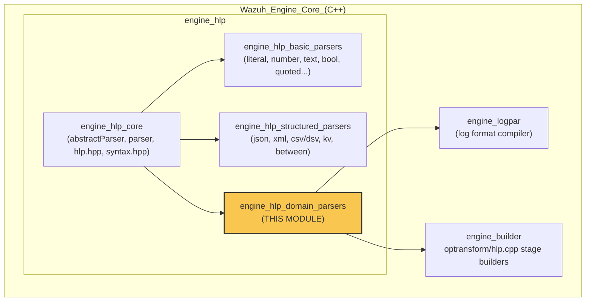
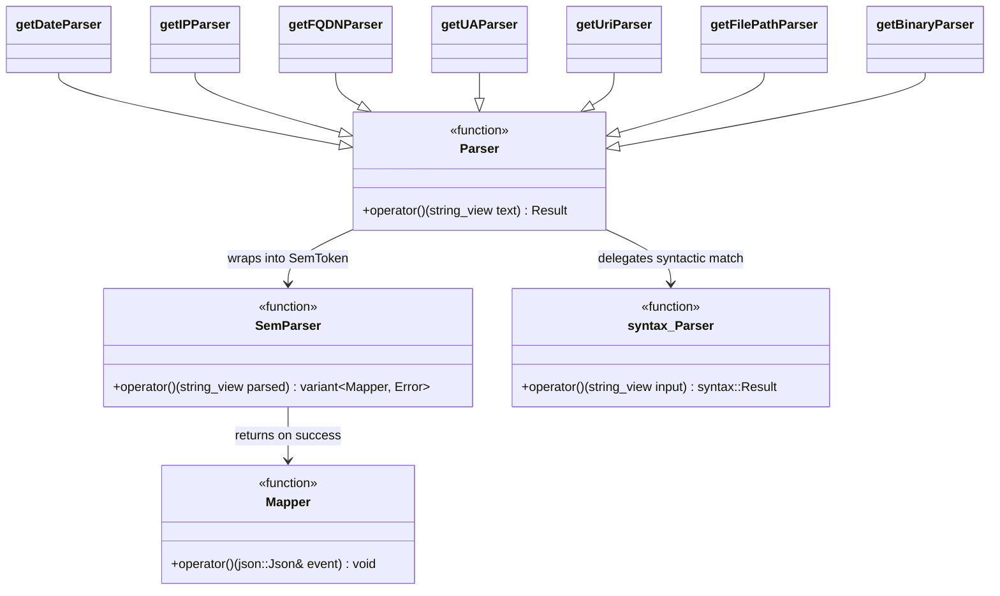
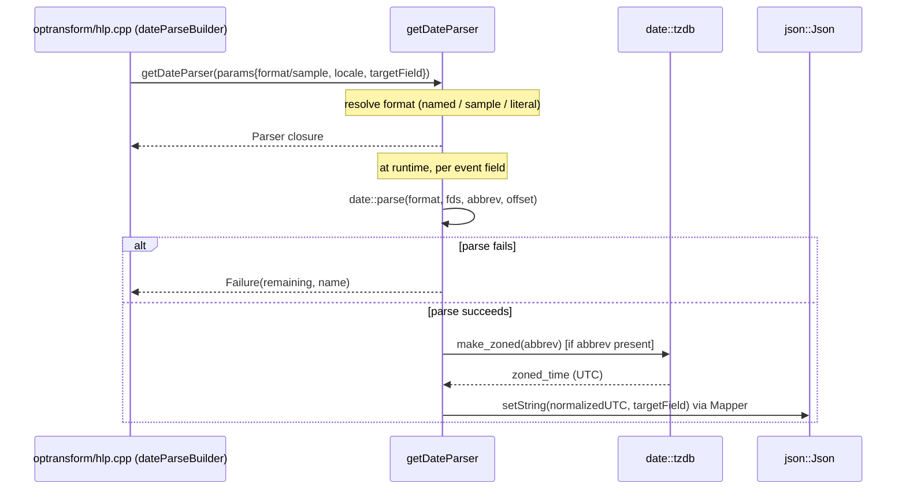
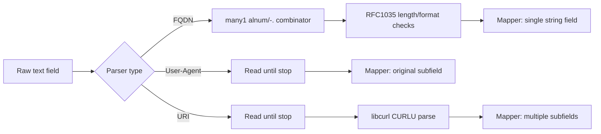
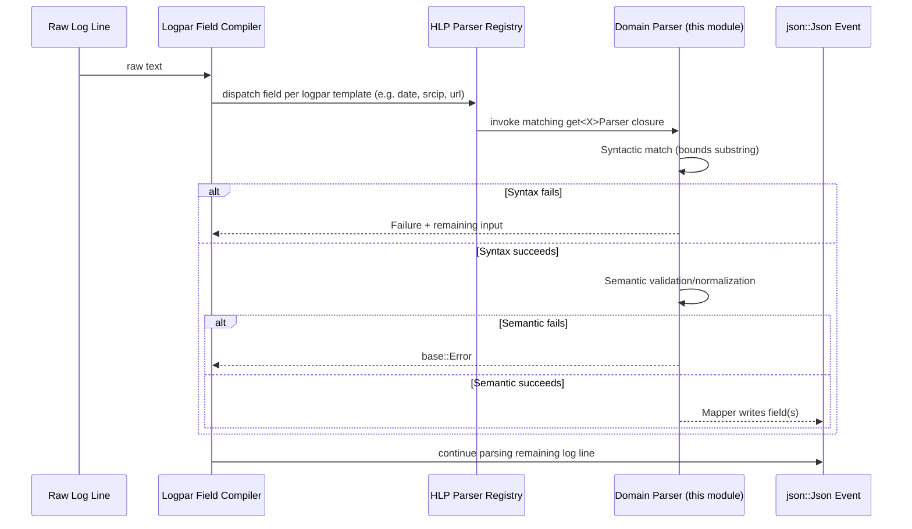
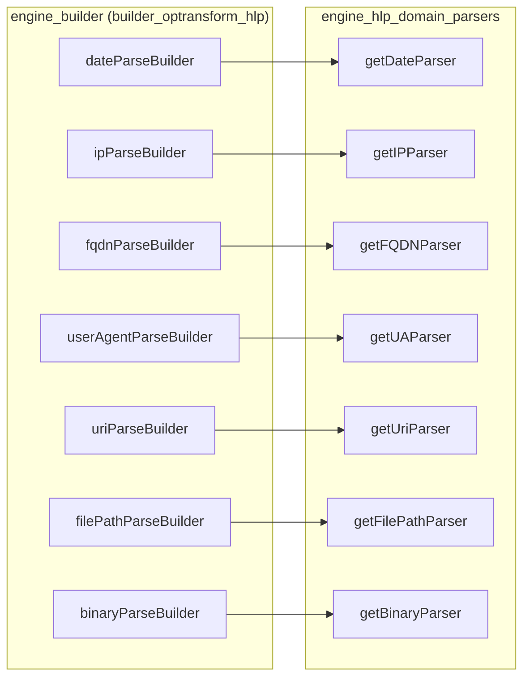
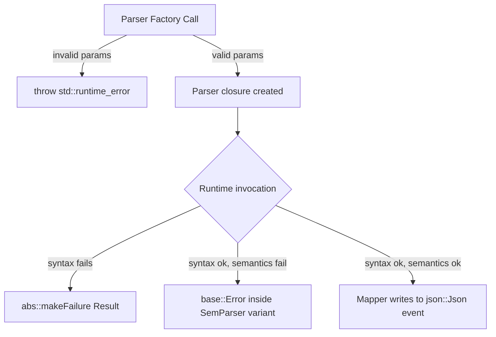

# Engine HLP Domain Parsers

## Introduction

The **`engine_hlp_domain_parsers`** module is a specialized sub-component of the Wazuh **High-Level Parser (HLP)** library (see [engine_hlp.md](engine_hlp.md)). While the broader HLP library provides generic parsing primitives (literals, numbers, quoted strings, structured formats such as JSON/XML/CSV), this module implements parsers for **semantically rich, domain-specific data types** that appear pervasively in security logs and network telemetry:

| Parser | Purpose | Source File |
|---|---|---|
| `getDateParser` | Parses dates/timestamps in dozens of well-known formats (RFC822, ISO8601, syslog, etc.) and normalizes them to UTC `strict_date_optional_time` | `date.cpp` |
| `getIPParser` | Validates and extracts IPv4 / IPv6 / mixed addresses | `ip.cpp` |
| `getFQDNParser` | Validates fully-qualified domain names (RFC 1035 compliant) | `web.cpp` |
| `getUAParser` | Captures a raw User-Agent string into `original` field | `web.cpp` |
| `getUriParser` | Decomposes a URI into its constituent parts (scheme, host, path, query, etc.) using libcurl | `web.cpp` |
| `getFilePathParser` | Splits a filesystem path into drive letter, path, file name and extension (Windows and POSIX separators) | `file.cpp` |
| `getBinaryParser` | Validates/extracts Base64-encoded binary blobs | `encodings.cpp` |

These parsers are consumed by the **Logpar** log-parsing engine and by the **Builder**'s `optransform/hlp.cpp` stage builders, which expose them to policy authors as HLP helper functions (`date`, `ip`, `fqdn`, `user_agent`, `url`, `file`, `binary`, etc.) inside decoder/rule assets.

This document describes the internal architecture of the domain parsers, how they integrate with the rest of the HLP subsystem, and the data/control flow when an event field is parsed.

---

## 1. Position in the System



Related documentation:
- Parent overview & shared primitives: [engine_hlp_core.md](engine_hlp_core.md)
- Sibling generic-value parsers: [engine_hlp_basic_parsers.md](engine_hlp_basic_parsers.md)
- Sibling structured-format parsers: [engine_hlp_structured_parsers.md](engine_hlp_structured_parsers.md)
- Consumers: [engine_logpar.md](engine_logpar.md), [engine_builder.md](engine_builder.md) (specifically `builder_optransform_hlp`)
- Base utilities used throughout (e.g. `base::Error`, logging): [engine_base.md](engine_base.md)

---

## 2. Architectural Overview

Every parser in this module follows the same two-stage design mandated by the HLP core (`engine_hlp_core`):

1. **Syntactic stage (`syntax::Parser`)** — a fast, allocation-light combinator-based scanner that determines *how much* of the input text belongs to this field, without necessarily validating full domain semantics (except when the syntax itself encodes the constraint, as with FQDN/IP grammars).
2. **Semantic stage (`SemParser` / `Mapper`)** — invoked only on the substring matched by the syntactic stage. It performs domain-specific validation/normalization (e.g., timezone conversion, URI decomposition, IPv4/IPv6 conformity via `inet_pton`) and produces a `Mapper` closure that, when invoked with the target `json::Json` event, writes the resulting value(s) into the event.



All seven factory functions share the signature `Parser get<X>Parser(const hlp::Params& params)` defined by `hlp::hlp.hpp` (see `engine_hlp_core`). `Params` conveys:
- `options`: parser-specific configuration (e.g., date format string / locale)
- `stop`: a delimiter/stop-sequence used by variable-length parsers (URI, User-Agent, File path)
- `targetField`: JSON pointer path where the mapper should write results
- `name`: parser name used for error reporting

---

## 3. Component Details

### 3.1 `getDateParser` (date.cpp)

Parses a date/time value according to either:
- A named well-known format (e.g. `"ISO8601"`, `"RFC3339"`, `"SYSLOG"`), resolved via the static `TIME_FORMAT` table, or
- A raw `strftime`-style format string (contains `%`), or
- A **sample date string**, from which the format is inferred by trial-matching against every entry in `TIME_FORMAT` (`formatDateFromSample`). Ambiguous or unmatched samples throw at parser-build time.

An optional second parameter selects the parsing **locale** (default `_auto` → classic C/POSIX locale).

At parse time, the [HowardHinnant `date` library](https://github.com/HowardHinnant/date) extracts `date::fields` plus a timezone abbreviation and UTC offset. The semantic stage:
1. Fills in the current year if the format lacked one.
2. If a timezone abbreviation was captured, resolves it via the IANA **timezone database** (loaded/auto-updated through `initTZDB`, which can download and install the database using libcurl and `date::remote_download/remote_install`).
3. Emits the timestamp normalized to `%Y-%m-%dT%H:%M:%SZ` (UTC) into the target field.



### 3.2 `getIPParser` / `in_addr` / `in6_addr` (ip.cpp)

- **Syntax**: built from `syntax::combinators` — grammars for IPv4 (dotted-quad), IPv6 (colon-hex groups), and IPv4-mapped/mixed notation, combined with `|` (alternation).
- **Semantics**: revalidates the matched text using POSIX `inet_pton` against both `AF_INET` and `AF_INET6` (hence the `in_addr`/`in6_addr` struct usage) to guarantee strict conformity beyond what the syntactic grammar alone captures (e.g., octet range 0-255).
- On success, writes the original textual IP into the target field unmodified.

### 3.3 Web Parsers — `getFQDNParser`, `getUAParser`, `getUriParser` (web.cpp)

| Function | Syntax stage | Semantic stage |
|---|---|---|
| `getFQDNParser` | `many1(alnum + "-.")`, then manual checks (RFC 1035 length ≤253, no leading dot, no `..`) | Simple string mapper (no attribute decomposition) |
| `getUAParser` | Reads up to a configured `stop` sequence | Writes raw string into `<targetField>/original` |
| `getUriParser` | Reads up to a configured `stop` sequence | Uses **libcurl's URL API** (`curl_url()`, `curl_url_set`, `curl_url_get`) to decompose into `/original`, `/domain`, `/path`, `/scheme`, `/username`, `/password`, `/port`, `/query`, `/fragment` |



### 3.4 `getFilePathParser` (file.cpp)

Handles both POSIX (`/`) and Windows (`\`) path separators (auto-detected from the matched text). Extracts:
- `/drive_letter` (Windows only, if the first char is an uppercase letter)
- `/path` — directory portion
- `/name` — file name
- `/ext` — lower-cased file extension

The syntax stage simply reads up to the configured `stop` delimiter (inherited from `syntax::parsers::toEnd`, shared with URI/User-Agent parsers); the semantic stage (`parseFp`) performs the actual splitting logic.

### 3.5 `getBinaryParser` (encodings.cpp)

Implements a Base64 validator/extractor:
- Syntax stage scans characters accepted by the Base64 alphabet (`A-Z a-z 0-9 + /`), then consumes up to two `=` padding characters, and finally asserts the total consumed length is a multiple of 4 (valid Base64 block size). Any violation causes a syntactic failure.
- Semantic stage simply forwards the matched substring into the target field (no further decoding is performed; this parser validates *shape*, not content decoding).

---

## 4. Data Flow: From Log Line to Structured Event

The domain parsers are invoked as part of the **Logpar** field-extraction pipeline, which itself is generated by the **Builder**'s `parse` stage (see `builder_stage`) using op-transform HLP builders (see `builder_optransform_hlp`).



---

## 5. Integration with the Builder (HLP Helper Functions)

The `builder_optransform_hlp` component (`src/engine/source/builder/src/builders/optransform/hlp.cpp`) wraps each domain parser factory into a **helper function** callable from decoder/rule assets, e.g.:

```yaml
check:
  - event.original: parse_date($_field, ISO8601)
  - source.ip: parse_ip($_field)
  - url.full: parse_uri($_field)
  - file.path: parse_file($_field)
```



For the full catalogue of transform helpers (numeric, string, array, Windows-specific, etc.) that coexist with these domain parsers at the builder layer, see [builder_optransform.md](builder_optransform.md).

---

## 6. External Dependencies

| Dependency | Used by | Purpose |
|---|---|---|
| `date`/`date-tz` (Howard Hinnant) | `date.cpp` | Calendar/timezone-aware parsing and formatting |
| `libcurl` | `date.cpp` (remote tz DB download), `web.cpp` (URL API) | Timezone DB retrieval; RFC 3986 URI decomposition |
| POSIX `arpa/inet.h` (`inet_pton`) | `ip.cpp` | Strict IPv4/IPv6 syntactic validation |
| `fmt` | all files | Error message formatting |
| `engine_hlp_core` (`syntax.hpp`, `abstractParser.hpp`, `parser.hpp`, `hlp.hpp`) | all files | Combinator primitives, `Result`/`SemToken`/`Params` types |
| `engine_base` (`base/logging.hpp`, `base::Error`) | `date.cpp` | Structured logging and error propagation |

---

## 7. Error Handling Model

All parsers return a `Result` (defined in `engine_hlp_core`, see `abstractParser.hpp`) that is either:
- **Success**, carrying a `SemToken` (matched substring + deferred `SemParser`) and the remaining unconsumed input, or
- **Failure**, carrying the (possibly rewound) remaining input and the parser `name` for diagnostic/tracing purposes.

Semantic-stage failures are surfaced as `base::Error` values (see [engine_base.md](engine_base.md)) rather than exceptions, allowing the caller (Logpar/Builder) to aggregate parsing diagnostics without unwinding the stack. Constructor-time misconfiguration (e.g., invalid date locale, missing `stop` string for URI/UA/File parsers, unsupported parser options) is reported via `std::runtime_error` thrown during parser *construction* (build time), distinct from per-event parsing failures.



---

## 8. Summary

`engine_hlp_domain_parsers` extends the generic HLP parsing framework with battle-tested, security-log-relevant extractors for **dates, IP addresses, domain names, user agents, URIs, file paths, and Base64 blobs**. It cleanly separates fast syntactic scanning from richer semantic validation/normalization, integrates with third-party libraries (`date`, `libcurl`, POSIX networking) for correctness, and plugs into the Logpar/Builder pipeline via the shared `hlp::Parser` contract defined in [engine_hlp_core.md](engine_hlp_core.md). For related generic-value and structured-format parsers, see [engine_hlp_basic_parsers.md](engine_hlp_basic_parsers.md) and [engine_hlp_structured_parsers.md](engine_hlp_structured_parsers.md) respectively; for how these parsers are exposed as policy-authoring helpers, see [engine_builder.md](engine_builder.md).
