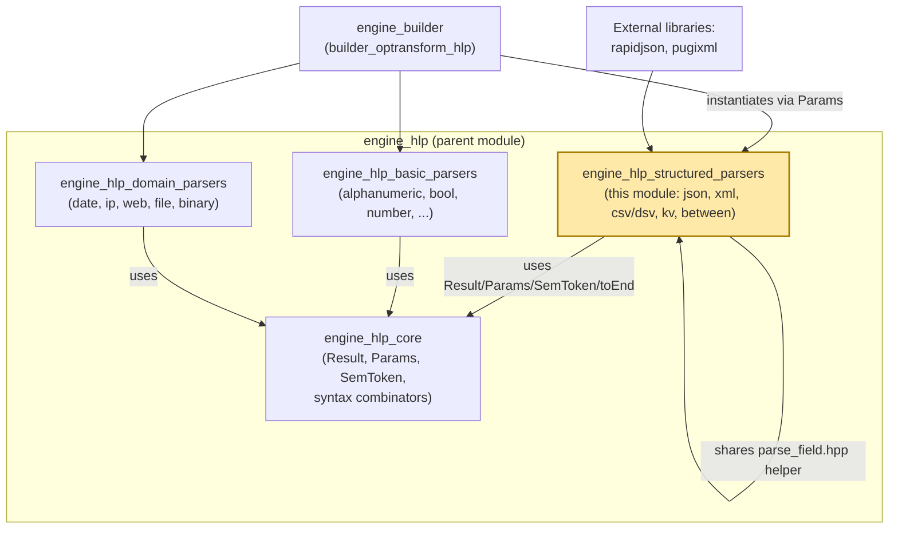
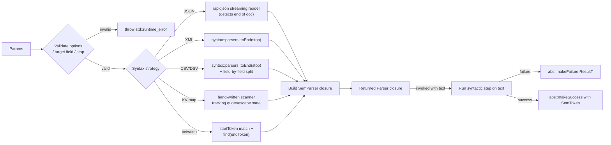
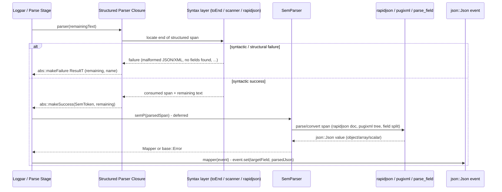
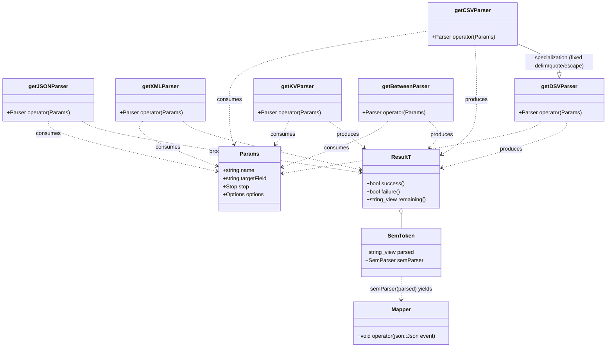

# Engine HLP Structured Parsers

## Introduction

The **engine_hlp_structured_parsers** module is part of the Wazuh Engine's High-Level Parser (HLP) library. It provides the collection of parsers that decode **structured or semi-structured payloads embedded inside raw log text** — full JSON documents, XML fragments (including a specialized Windows-Event dialect), delimiter-separated values (CSV/DSV), inline key-value maps, and generic "extract everything between two delimiters" spans.

Unlike the [engine_hlp_basic_parsers](engine_hlp_basic_parsers.md) module, which handles single scalar tokens (numbers, booleans, literals), the parsers in this module produce **nested JSON objects/arrays** or perform **non-trivial internal tokenization** (quoting, escaping, nested braces) before mapping the result into the output event. They are the parsers of choice whenever a log field itself contains an embedded document (e.g., a JSON payload inside a syslog message, a Windows Event XML blob, a CSV audit line, or an `key1=value1;key2=value2` style string).

Every parser in this module follows the same two-phase design used throughout the HLP library: a **syntactic** phase that validates and consumes characters from the input according to a grammar, and a **semantic** phase that converts the consumed text into a typed (usually structured) value and writes it into the output JSON event via a `Mapper`. This module builds directly on the core abstractions defined in [engine_hlp_core](engine_hlp_core.md) and is, in turn, consumed by the higher-level parser combinators and stage builders documented in [builder_optransform_hlp](builder_optransform_hlp.md) (part of [engine_builder](engine_builder.md)).

## Purpose and Scope

This module's responsibility is to implement `Parser` factory functions — functions that take a `Params` struct and return a closure conforming to the `hlp::parser::Parser` signature (`std::string_view -> Result`) — specifically for **structured data formats**. Each factory:

1. Validates the parser-specific `Params` (options, target field, stop tokens) at construction time, throwing `std::runtime_error` for invalid configurations (e.g., CSV requiring at least two header names, DSV requiring delimiter/quote/escape single characters, XML requiring a stop token).
2. Builds a **syntactic parser** — either reusing `syntax::parsers::toEnd()` from [engine_hlp_core](engine_hlp_core.md) (JSON, XML, CSV/DSV) or implementing a hand-rolled scanner that must track quoting/escaping state itself (key-value maps, `between`).
3. Builds a **semantic parser** (`SemParser`) that parses the consumed span into a structured `json::Json` value (via `rapidjson`, `pugixml`, or manual tokenization) and produces a `Mapper` that calls `event.set(targetField, parsed)`.
4. Returns a closure that runs the syntactic parser first; on success it packages the parsed span and semantic parser into a `SemToken` wrapped in a successful `Result`; on failure it returns a failed `Result` carrying trace/name information for diagnostics.

Compared to the basic parsers, the structured parsers in this module are **not entirely self-contained**: `dsv_csv.cpp` and `kvmap.cpp` both depend on a shared private helper header, `parse_field.hpp` (declaring `getField`/`updateDoc`), which implements the common logic for splitting a raw field into a `(start, len, isQuoted, isEscaped)` descriptor and inserting it (unescaped, and type-coerced when possible) into a `json::Json` document at a given path.

## Components Covered

| Component | File | Purpose |
|---|---|---|
| `getJSONParser` | `json.cpp` | Parses a full RFC-8259 JSON document (object, array, or scalar) embedded in the input, using `rapidjson`'s streaming reader to detect where the JSON ends. |
| `getXMLParser` | `xml.cpp` | Parses an XML fragment up to a stop token into a nested `json::Json` structure, using `pugixml`; supports a pluggable "module" (`default` or `windows`) that customizes the XML → JSON conversion rules. |
| `getCSVParser` | `dsv_csv.cpp` | Parses one line of comma-separated values with fixed header names, using `,` as delimiter and `"` as both quote and escape character. |
| `getDSVParser` | `dsv_csv.cpp` | Generalized version of CSV allowing a custom single-character delimiter, quote, and escape character, plus explicit header names, all supplied via `Params::options`. |
| `getKVParser` | `kvmap.cpp` | Parses an inline `key<sep>value<delim>key<sep>value...` map (e.g. `a=1,b=2`) into a JSON object, honoring quoting/escaping of keys and values. |
| `getBetweenParser` | `between.cpp` | Extracts (and optionally maps) the substring found between a configurable `start` token and `end` token, without any further structural parsing. |

## Architecture

### Layered Position



See [engine_hlp_core.md](engine_hlp_core.md) for the shared `Result`, `Params`, `SemToken`, `Mapper`/`SemParser` type definitions and the `syntax` combinator library (in particular `syntax::parsers::toEnd`, reused by the JSON, XML and CSV/DSV parsers). See [engine_hlp_basic_parsers.md](engine_hlp_basic_parsers.md) for the sibling module of scalar-value parsers, and [builder_optransform_hlp.md](builder_optransform_hlp.md) for how these parsers are registered and invoked as part of the `parse` stage builder (`optransform/hlp.cpp`).

### Parser Construction Pattern

All five parsers follow the standard HLP construction pattern (validate `Params` → build syntax parser → build semantic parser → compose into a `Parser` closure), but they differ in how "syntactic" validation is performed:



### Sequence: Parsing a Structured Field at Runtime



Note that, unlike most basic parsers, the semantic phase here can itself fail (e.g., malformed XML detected only when `pugixml` attempts to load the buffer) even though the syntactic phase already succeeded — this is because for XML the "end" is determined purely by the configured stop token, not by structural well-formedness. JSON, in contrast, detects structural validity **during** the syntactic phase because `rapidjson`'s streaming reader itself determines where the document ends by tracking brace/bracket nesting.

## Component Details

### `getJSONParser` (json.cpp)

- **Options**: none accepted — throws `std::runtime_error` if any are supplied.
- **Syntax + Semantics are fused**: this parser does not build a separate `syntax::Parser`; instead it feeds the raw input directly into a `rapidjson::Reader` bound to a `rapidjson::StringStream`, parsing with the `kParseStopWhenDoneFlag` flag so that parsing halts as soon as one complete JSON value has been consumed (rather than requiring the entire remaining input to be valid JSON).
- On `doc.HasParseError()`, the parser fails immediately with `abs::makeFailure<ResultT>(txt, name)`.
- On success, `ss.Tell()` gives the number of bytes consumed; `parsed` is the exact JSON text and `remaining` is everything after it.
- **Mapping**: if `targetField` is non-empty, the resulting `rapidjson::Document` is moved into a `json::Json` wrapper and set at `targetField` via `event.set(...)`; if empty, no mapping occurs (`noSemParser()`).
- Because JSON detection is purely structural (matching braces/brackets/quotes), this parser can safely appear mid-line, extracting an embedded JSON object without requiring the rest of the line to also be JSON.

### `getXMLParser` (xml.cpp)

- **Requires**: `params.stop` must be non-empty (throws otherwise) — the XML segment is delimited purely by a configured **stop token**, not by matching the outermost XML tag.
- **Options**: 0 (defaults to the `"default"` module) or exactly 1, selecting an XML-processing module by name (currently `"default"` and `"windows"`); throws `std::runtime_error` if the module name is unknown or if more than one option is given.
- **Syntax**: `syntax::parsers::toEnd(params.stop)`, shared with [engine_hlp_core](engine_hlp_core.md) — simply scans until the stop token.
- **Semantics** (`getSemParser`): loads the consumed span into a `pugi::xml_document` via `xmlDoc.load_buffer`; if `pugixml` reports a parse failure, returns `base::Error {"Invalid XML"}`. Otherwise it recursively walks the tree with `xmlToJson`, building a nested `json::Json` structure:
  - Each XML element becomes a JSON object keyed by its tag name under a `/`-separated path.
  - Repeated sibling elements with the same tag name are automatically converted into a JSON array.
  - Element text content is stored under a `#text` sub-key; attributes are stored under `@attributeName` sub-keys.
  - The **`windows` module** (`xmlWinModule`) implements Windows Event Log XML conventions: `<Data Name="X">value</Data>` elements are flattened directly into `.../X` (or appended as an array element when unnamed), and the top-level `<Event>` wrapper element is skipped from the resulting path (so fields land directly under the target, not nested under `Event`).
- **Mapping**: if `targetField` is empty, the parser still validates/parses the XML but returns `noMapper()` (parse-only, no side effect); otherwise the converted `json::Json` tree is written to `targetField`.

### `getDSVParser` and `getCSVParser` (dsv_csv.cpp)

Both factories share a private implementation, `dsvParserFunction`, differing only in configuration:

| Aspect | `getCSVParser` | `getDSVParser` |
|---|---|---|
| Delimiter | fixed `,` | configurable, `options[0]` (must be a single char) |
| Quote char | fixed `"` | configurable, `options[1]` (must be a single char) |
| Escape char | fixed `"` | configurable, `options[2]` (must be a single char) |
| Headers | all of `options` (≥2 required) | `options[3..]` (≥2 headers plus the 3 delimiter chars, ≥5 options total) |

- **Requires**: `params.stop` must be non-empty for both (`toEnd` needs at least one stop token) — throws `"CSV/DSV parser needs a stop string"` otherwise.
- **Syntax**: `syntax::parsers::toEnd(endTokens)` from [engine_hlp_core](engine_hlp_core.md) determines the full extent of the delimited row; the row is then tokenized field-by-field using the shared `getField()` helper (declared in `parse_field.hpp`), which understands quoting and escaping per field and reports each field's `(start, len, isQuoted, isEscaped)`.
- **Semantics**: for each header (in declared order), the corresponding field value is extracted with `getField`, unescaped/unquoted as needed, and inserted into a `json::Json` document at path `/{header}` via the shared `updateDoc()` helper (which also attempts basic type coercion, e.g. numeric strings become JSON numbers where applicable).
- **Failure modes**:
  - `"No fields found"` if the first field cannot be split at all (`start == 0` after attempting the first field).
  - A failure at the exact position where field extraction stops short, if fewer fields were found than headers declared (`headers.size() != i`).
  - A failure if, after consuming exactly `headers.size()` fields, there is leftover unconsumed text within the row (`start - 1 != parsed.size()`), meaning there were **more** fields in the input than headers — this enforces a strict one-to-one mapping between configured headers and CSV/DSV columns.
- **Mapping**: builds a `Mapper` via `getSemParser` that calls `event.set(targetField, doc)`, or `noSemParser()` if `targetField` is empty.

### `getKVParser` (kvmap.cpp)

- **Requires**: exactly 4 single-character options — `separator` (between key and value, e.g. `=`), `delimiter` (between pairs, e.g. `,` or `;`), `quote` character, and `escape` character. All must individually be exactly one character, and `separator != delimiter` (throws `std::runtime_error` otherwise).
- **Syntax** (`getSynParser`): a hand-written scanner (no reliance on `syntax::parsers::toEnd`) that walks the input, tracking an `inQuotes` state machine to correctly find the next unquoted/unescaped occurrence of the separator or delimiter character (`findNext`). It repeatedly validates `key<sep>value` pairs (`validateKeyValue`), stopping either at end-of-input or when it can no longer parse a well-formed pair; it fails outright if quotes are left unclosed at end-of-input, or if no key-value pair could be parsed at all.
- **Semantics** (`getSemParser`): re-scans the (already validated) parsed span with the same quote/escape-aware `findNext` logic, splitting it into `key`/`value` substrings on each `sep`/`delim` occurrence. For each pair, `processKeyValue`:
  - Strips a single layer of surrounding quotes from the value (and from the key, if quoted).
  - Detects whether the value contains internal escape sequences (`esc` followed by `quote`, `sep`, `delim`, or `esc` itself).
  - Delegates to the shared `updateDoc()` helper (from `parse_field.hpp`, the same helper used by CSV/DSV) to insert the unescaped value into the resulting `json::Json` document at path `/{key}`.
- **Mapping**: if `targetField` is empty, returns `noMapper()`; otherwise wraps the built document in a `Mapper` that calls `event.set(targetField, doc)`.
- Typical use case: parsing inline audit/log key-value strings such as `user=admin action=login result=success`.

### `getBetweenParser` (between.cpp)

- **Requires**: exactly 2 options — `start` and `end` tokens (substrings, not necessarily single characters); both cannot be empty simultaneously (throws `std::runtime_error` otherwise).
- **Syntax** (`getSynParser`): checks that the input begins with the `start` token; if so, searches (via `std::string_view::find`) for the first occurrence of `end` after the `start` token. Fails if either condition is not met. On success, the "remaining" text is everything after the matched `end` token.
- **Semantics** (`getSemParser`): given the whole matched span (including the `start`/`end` delimiters themselves), strips off the delimiter lengths from both ends and writes the **inner** substring as a plain string to `targetField` via `event.setString`.
- **Mapping**: if `targetField` is empty, `noSemParser()` is used — the parser is effectively used only to consume/skip a delimited span without extracting it.
- This is the simplest parser in the module — it performs no further structural interpretation of the captured content (unlike JSON/XML/CSV/KV), making it useful as a lightweight "extract raw substring between markers" primitive, e.g., for content wrapped in brackets, parentheses, or custom sentinel strings.



## Data Flow: From Log Line to Structured Event Field

```mermaid
flowchart TD
    LOG[Raw log text with embedded structured payload] --> PARSE["Parse stage (builder_optransform_hlp)"]
    PARSE --> SELECT{Select parser by field type in schema}
    SELECT -->|embedded JSON doc| JSON["getJSONParser<br/>(rapidjson streaming reader)"]
    SELECT -->|embedded XML / Windows Event XML| XML["getXMLParser<br/>(pugixml + default/windows module)"]
    SELECT -->|comma-separated row| CSV["getCSVParser<br/>(fixed , / \" / \")"]
    SELECT -->|custom-delimited row| DSV["getDSVParser<br/>(configurable delim/quote/escape)"]
    SELECT -->|inline key=value map| KV["getKVParser<br/>(quote/escape-aware scanner)"]
    SELECT -->|raw span between markers| BETWEEN["getBetweenParser<br/>(start/end substring match)"]

    JSON --> SEM[SemParser builds json::Json value]
    XML --> SEM
    CSV --> SEM
    DSV --> SEM
    KV --> SEM
    BETWEEN --> SEM

    SEM --> EVT["json::Json event<br/>(target field populated with<br/>object / array / string)"]
```

## Relationships to Other Modules

- **[engine_hlp_core](engine_hlp_core.md)**: Supplies the foundational types this module depends on directly — `hlp::abs::Result`/`Parser`, `hlp::parser::SemToken`/`Mapper`/`SemParser`/`noSemParser`/`noMapper`, `hlp::hlp::Params`, and the `syntax` namespace combinators (`syntax::parsers::toEnd`, `syntax::Result`) used by the XML and CSV/DSV parsers to locate the end of a structured span. This module cannot function without those abstractions.
- **[engine_hlp_basic_parsers](engine_hlp_basic_parsers.md)**: Sibling module implementing scalar-value parsers (alphanumeric, boolean, number, literal, quoted, text, ignore, eof). Structured parsers here are typically more complex/heavier-weight than basic parsers and rely on third-party libraries (`rapidjson`, `pugixml`) rather than pure hand-written combinators, except for `kvmap.cpp` and `between.cpp`, which implement their own lightweight scanners similar in spirit to the basic module's approach.
- **[engine_hlp_domain_parsers](engine_hlp_domain_parsers.md)**: Sibling module for domain-specific scalar parsers (date, IP, URI/FQDN/user-agent, file path, binary/base64) — conceptually parallel but focused on semantically rich scalar values rather than nested structures.
- **[engine_builder](engine_builder.md) / `builder_optransform_hlp`** ([builder_optransform_hlp.md](builder_optransform_hlp.md)): The direct consumer of this module. The `hlp.cpp` builder file (`jsonParseBuilder`, `xmlParseBuilder`, `csvParseBuilder`, `dsvParseBuilder`, `keyValueParseBuilder`, `betweenParseBuilder`) wraps each factory function from this module into a stage/operation builder usable in policy YAML definitions (e.g., `parse_json`, `parse_xml`, `parse_csv`, `parse_dsv`, `parse_key_value`, `parse_between`).
- **[engine_logpar](engine_logpar.md)**: Uses the HLP parsers (including this module's) to compile log-parsing patterns (`logpar.hpp`) into executable parser pipelines for decoders — e.g., a `%{payload/json}` field expression resolves to `getJSONParser`.
- **[engine_base](engine_base.md)**: This module's semantic parsers return `base::Error` on failure (e.g., invalid XML, malformed KV pair) and operate on the engine's `json::Json` type (from `engine_base_core_types`) for building the mapped, potentially nested, event fields.
- **[engine_parsec](engine_parsec.md)**: A more generic parser-combinator interface (`parsec.hpp`) that conceptually parallels the `syntax` combinator layer used internally by the XML/CSV/DSV parsers, though `engine_hlp` maintains its own dedicated combinator implementation and third-party integrations (`rapidjson`, `pugixml`) tailored specifically to structured log-field extraction.

## Design Notes and Conventions

1. **Fail-fast configuration validation**: Every parser validates its `Params` (arity/content of `options`, presence/absence of `targetField`, presence of `stop`) at *factory construction time* (i.e., when the policy/decoder is compiled), not at parse time. This surfaces configuration errors (e.g., a CSV declared with only one header, or a `between` parser with two empty markers) early, during policy loading, rather than at runtime during log ingestion.
2. **Optional field mapping**: All parsers treat an empty `targetField` as "parse but don't map" — they still validate/parse the structured content but produce a `noSemParser()`/`noMapper()` no-op, useful for validating log structure (e.g., "is this a well-formed JSON blob?") without capturing it into the event.
3. **Structural vs. token-level syntax checking**: JSON detects the end of its span *structurally* (via `rapidjson`'s streaming reader tracking nested braces/brackets), whereas XML and CSV/DSV rely purely on a configured **stop token** to know where the structured span ends, deferring actual structural validation (well-formedness) to the semantic phase. The KV map and `between` parsers implement their own hand-written scanners that combine both syntactic delimiting and quote/escape-awareness in a single pass.
4. **Shared low-level helpers**: `dsv_csv.cpp` and `kvmap.cpp` both depend on a private `parse_field.hpp` header providing `getField()` (locates and classifies one delimited/quoted field) and `updateDoc()` (writes an unescaped value into a `json::Json` document, with light type coercion). This avoids duplicating quote/escape-handling logic between the two "map-like" structured formats.
5. **Strict arity enforcement for tabular data**: `getCSVParser`/`getDSVParser` require an *exact* match between the number of configured headers and the number of columns present in each parsed row — both too few and too many columns are treated as parse failures, ensuring schema drift in log sources is caught rather than silently truncating or misaligning fields.
6. **Deferred semantic evaluation**: As in the rest of HLP, splitting syntax and semantics allows the engine to attempt multiple candidate parsers cheaply (only the syntactic phase runs during backtracking); actual JSON/XML tree construction happens only once a parse path is confirmed and the result is actually mapped.
7. **Uniform error reporting**: All parsers return failures via `abs::makeFailure<ResultT>(remaining, name)`, embedding the parser's configured `name` (from `Params::name`) so that trace/diagnostic output can pinpoint which parser in a composed pipeline failed.

## Extension Points

To add a new structured parser to this module:
1. Create a new `.cpp` file defining a `getXParser(const Params&) -> Parser` factory in the `hlp::parsers` namespace (declared in `engine_hlp_core`'s `hlp.hpp`).
2. Validate `params.options` / `params.targetField` / `params.stop` and throw `std::runtime_error` on invalid configuration, following the existing parsers' pattern (e.g., "requires N options", "requires end token").
3. Decide on a syntax strategy: reuse `syntax::parsers::toEnd()` if the structured span is delimited by a known stop token, integrate a third-party streaming parser (like `rapidjson`) if the format has self-describing boundaries, or write a dedicated scanner (as in `kvmap.cpp`/`between.cpp`) if quoting/escaping rules require custom handling.
4. Build a `SemParser` that converts the validated span into a `json::Json` value and returns a `Mapper` (or `base::Error` on structural failure discovered only during full parsing, e.g. malformed XML).
5. If the new format shares field-splitting/quoting logic with CSV/DSV or KV maps, extend or reuse `parse_field.hpp` rather than duplicating the scanner logic.
6. Register the new factory as a declaration in `hlp.hpp` ([engine_hlp_core](engine_hlp_core.md)) and wire it up to a builder function in `builder_optransform_hlp` ([builder_optransform_hlp.md](builder_optransform_hlp.md)) so it becomes usable as a `parse_<name>` helper in decoder/rule assets.
