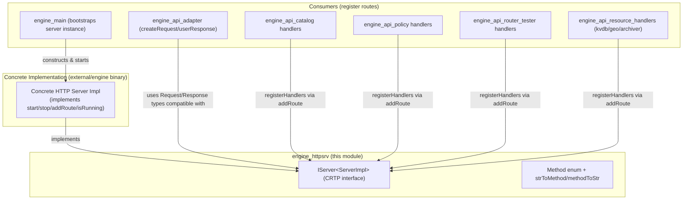
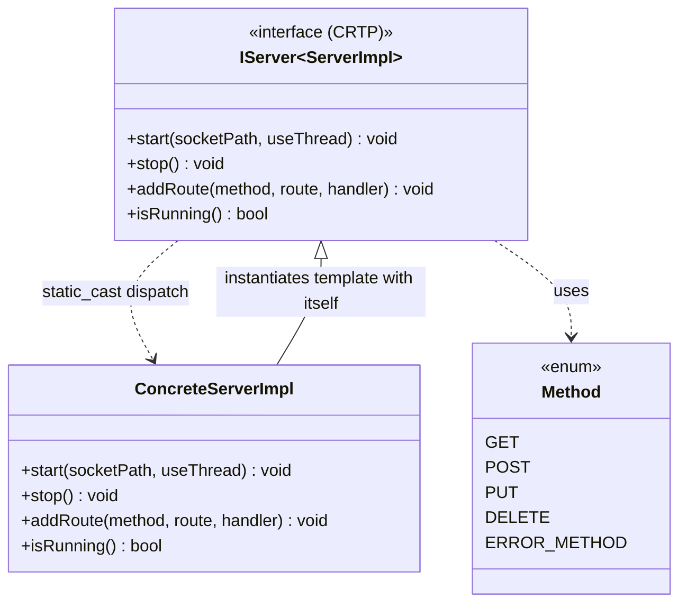
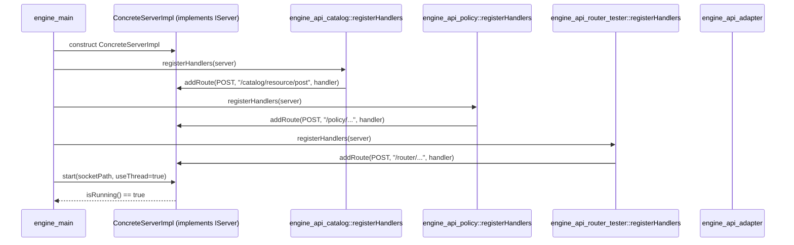
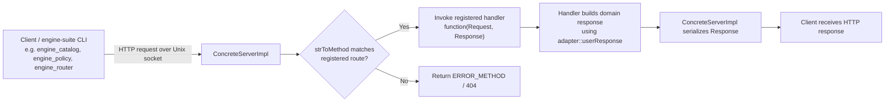
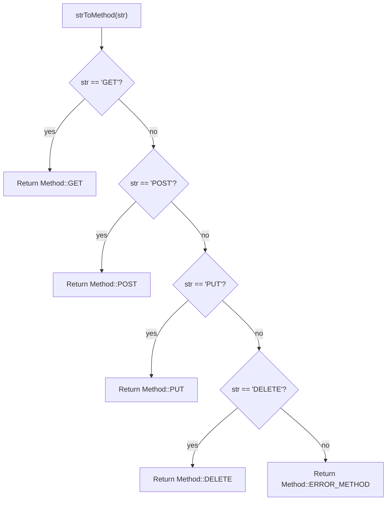

# Engine HTTP Server Interface (`engine_httpsrv`)

## Introduction

The `engine_httpsrv` module defines the **abstract HTTP transport contract** used by the Wazuh Engine to expose its administrative and operational API over a local HTTP(S)-like interface (in practice, a Unix domain socket speaking HTTP semantics). It is a very small, header-only module — a single interface file, `iserver.hpp` — but it plays a foundational architectural role: every other Engine subsystem that needs to expose or consume HTTP-style routes (catalog, policy, router, KVDB, tester, geo, archiver management endpoints, etc.) programs against this interface rather than against a concrete HTTP server implementation.

By isolating the HTTP transport behind `httpsrv::IServer`, the Engine achieves:

- **Decoupling**: The API layer (`engine_api`) registers routes and handlers without knowing which concrete HTTP server library implements the socket/transport logic.
- **Testability**: Components that depend on `IServer` can be unit-tested against mock/stub servers.
- **Compile-time polymorphism**: The interface uses the Curiously Recurring Template Pattern (CRTP) instead of virtual dispatch, avoiding vtable overhead in a hot request path while still enforcing a consistent contract.

This document describes the interface's structure, its position in the Engine architecture, and how it is expected to interact with the rest of the `Wazuh_Engine_Core_(C++)` subsystems.

---

## Module Purpose & Core Functionality

The module exposes two core elements:

1. **`httpsrv::Method`** — an enum representing supported HTTP verbs (`GET`, `POST`, `PUT`, `DELETE`, `ERROR_METHOD`), along with two `constexpr` helper functions:
   - `methodToStr(Method)`: converts an enum value to its string representation.
   - `strToMethod(const char*)`: parses a string into a `Method` enum value (returning `ERROR_METHOD` for unrecognized input).

2. **`httpsrv::IServer<ServerImpl>`** — a CRTP-based interface template that defines the contract any concrete HTTP server implementation must fulfill:
   - `start(socketPath, useThread)`: starts the server listening on a given Unix socket path, optionally on a background thread.
   - `stop()`: stops the server.
   - `addRoute(method, route, handler)`: registers a handler function for a given HTTP method + route path combination. The handler receives a templated `Request` and `Response` pair.
   - `isRunning()`: reports whether the server is currently active.

Because `IServer` uses CRTP (`static_cast<ServerImpl*>(this)->...`), there is **no runtime polymorphism cost** — the compiler resolves calls to the concrete implementation at compile time, while still giving downstream code a single, uniform API surface (`IServer<ConcreteServer>`) to program against.

---

## Architecture

### Interface Position in the Engine

### CRTP Interface Pattern

This pattern mirrors similar CRTP/strategy abstractions used elsewhere in the Engine codebase, such as `engine_base_patterns` (`Builder`, `AbstractHandler`, `Singleton`, `SingletonLocator`), reflecting a consistent design philosophy across `Wazuh_Engine_Core_(C++)` of favoring compile-time composition over heavyweight runtime polymorphism.

---

## Component Interaction & Data Flow

### Route Registration Flow

### Request Processing Flow

This request flow underlies every administrative operation exposed by the Engine: catalog CRUD (`engine_api_catalog`), policy management (`engine_api_policy`), router/tester operations (`engine_api_router_tester`), and resource handlers for KVDB, Geo, and Archiver (`engine_api_resource_handlers`). All of these ultimately call `IServer::addRoute` to bind their business logic to an HTTP method + path pair.

---

## Method Resolution Logic

Both `methodToStr` and `strToMethod` are `constexpr`, allowing method/string translation to potentially be resolved at compile time when literal method values are used (e.g., in route registration macros), and cheaply at runtime otherwise (e.g., when parsing an incoming raw HTTP request line).

---

## Relationships to Other Modules

| Related Module | Relationship |
|---|---|
| [engine_api.md](engine_api.md) | The API layer's `registerHandlers` functions (catalog, policy, router, tester, kvdb, geo, archiver) are the primary consumers of `IServer::addRoute`. They bind Engine business logic to HTTP routes exposed through this interface. |
| `engine_api_adapter` (see [engine_api.md](engine_api.md)) | Provides `createRequest`/`userResponse` helpers that produce the `Request`/`Response` objects passed through `IServer::addRoute` handlers. |
| [engine_main.md](engine_main.md) | The Engine's main entry point is responsible for constructing the concrete `IServer` implementation, wiring in all API handler registrations, and calling `start()`/`stop()` as part of the daemon lifecycle. |
| [Router.md](Router.md) | The Router/Tester subsystem exposes control-plane operations (route add/delete/reload, EPS control, session testing) through routes registered via this interface. |
| [engine_kvdb.md](engine_kvdb.md), [engine_geo.md](engine_geo.md) | KVDB and Geo management CLIs (`engine_kvdb`, `engine_geo` Python tools) communicate with the Engine daemon over HTTP routes implemented through handlers registered on an `IServer` instance. |
| [engine_base.md](engine_base.md) (`engine_base_patterns`) | Shares the same design philosophy of compile-time composition patterns (`Builder`, `AbstractHandler`, `Singleton`) used throughout `Wazuh_Engine_Core_(C++)`. |
| [Engine_Administration_CLI_Tools_(Python).md](Engine_Administration_CLI_Tools_(Python).md) | Python CLI tools such as `engine_catalog`, `engine_policy`, `engine_router`, and `api-communication`'s `APIClient` act as HTTP clients issuing requests against routes registered through this server interface. |

---

## Design Notes

- **Header-only / interface-only module**: There is no `.cpp` implementation file in this module — `iserver.hpp` purely defines the contract. Concrete server implementations (e.g., built atop a third-party HTTP/Unix-socket library) live outside this interface module and are wired together at the `engine_main` composition root.
- **Templated Request/Response**: `addRoute` is templated on `Request`/`Response` types, allowing different concrete server implementations to use different underlying request/response representations (e.g., wrapping a third-party library's types) while still conforming to a uniform signature.
- **Socket-based transport**: `start()` takes a `std::filesystem::path` socket path rather than a host/port pair, reflecting the Engine's use of Unix domain sockets for local inter-process administration rather than network-exposed HTTP.
- **Threading model**: The `useThread` parameter on `start()` indicates the interface supports both blocking (foreground) and non-blocking (background thread) startup modes, letting `engine_main` decide whether the server loop should occupy the calling thread or run independently while the main daemon performs other work (e.g., running the `Router`/`Orchestrator`).

---

## Summary

`engine_httpsrv` is a minimal but architecturally important interface module. It defines the single abstraction point (`IServer`) through which all Engine administrative HTTP functionality — catalog, policy, router, tester, KVDB, geo, and archiver management — is exposed, without coupling those subsystems to any particular HTTP server implementation. Its CRTP-based design keeps this abstraction free of runtime dispatch overhead, consistent with the broader compile-time-composition patterns used throughout the `Wazuh_Engine_Core_(C++)` codebase.
