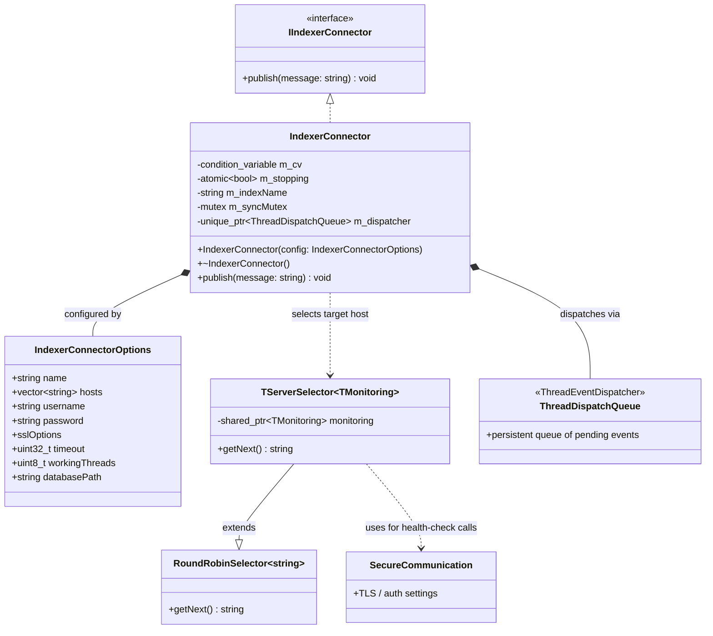
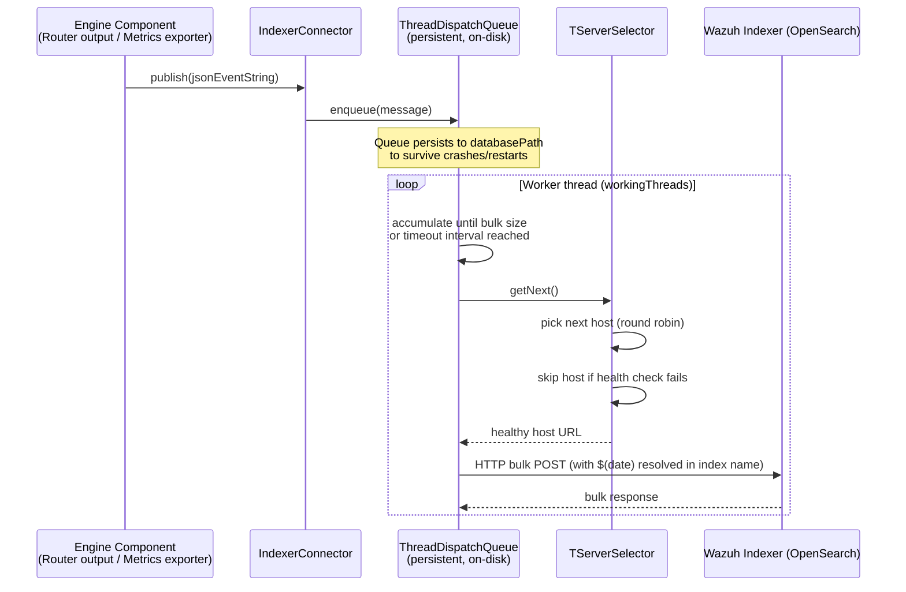
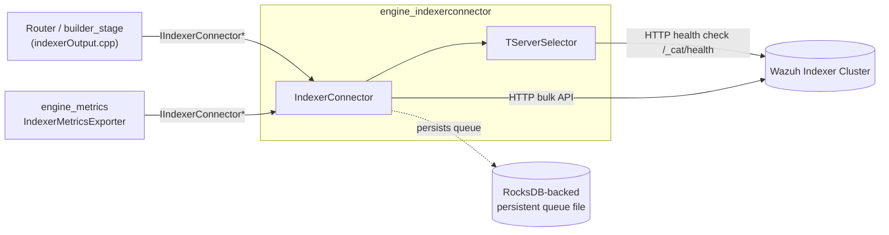

# Engine Indexer Connector

## 1. Purpose and Overview

The **Engine Indexer Connector** (`engine_indexerconnector`) is a small, self-contained C++ library within the [Wazuh Engine Core](Wazuh_Engine_Core_(C++).md) that provides the Wazuh Engine with a reliable, asynchronous client for publishing JSON documents (alerts, archived events, metrics, etc.) to a **Wazuh Indexer** cluster (an OpenSearch-compatible search/analytics engine).

It is intentionally decoupled from the rest of the engine through the `IIndexerConnector` interface, so that any engine subsystem that needs to write data to the indexer — the [Router](Router.md) output stage (via the `indexer_output` builder in [engine_builder](engine_builder.md)) or the [engine_metrics](engine_metrics.md) exporter — depends only on the abstract interface, not on this concrete implementation. This keeps the publishing logic (batching, retries, server failover, TLS) isolated and independently testable.

Key responsibilities:
- Accept single JSON event strings via a simple `publish()` API and enqueue them for delivery.
- Batch queued events into **bulk** OpenSearch API requests to minimize network overhead.
- Persist the pending-event queue to disk so that events are not lost across restarts (crash resiliency).
- Perform **health-checked, round-robin server selection** across multiple configured indexer hosts, automatically routing traffic away from unhealthy nodes.
- Support secure (TLS/mTLS) and authenticated (basic-auth) communication with the indexer cluster.
- Substitute a `$(date)` placeholder in the configured index name with the current date, enabling automatic daily index rotation (e.g., `wazuh-alerts-2024.05.01`).

A companion CLI tool (`indexerconnector_tool`) is included for manual testing: it can load a configuration file and either replay a JSON events file or auto-generate random documents matching an index template's field mappings, then publish them through the same `IndexerConnector` class used in production.

## 2. Architecture Overview

The module is composed of three files that work together as a single logical unit:

| File | Responsibility |
|---|---|
| `include/indexerConnector/indexerConnector.hpp` | Public API: `IndexerConnector` class (implements `IIndexerConnector`), `IndexerConnectorOptions` configuration struct. |
| `src/serverSelector.hpp` | Internal `TServerSelector<TMonitoring>` template: round-robin server selection combined with health monitoring. |
| `tool/main.cpp` | Standalone CLI executable for manual/integration testing of the connector. |



### Data flow: publishing an event



### Component relationships within the Wazuh Engine



## 3. Core Components

### 3.1 `IndexerConnectorOptions`

A plain configuration struct passed to the `IndexerConnector` constructor. Notable fields:

- `name`: target index name (may embed a `$(date)` placeholder for daily rotation).
- `hosts`: list of indexer endpoints (e.g., `https://localhost:9200`) used for round-robin failover.
- `username` / `password`: basic-auth credentials.
- `sslOptions` (nested): `cacert`, `cert`, `key`, and `skipVerifyPeer` for TLS/mTLS configuration.
- `timeout`: connection timeout in milliseconds (default 60000).
- `workingThreads`: number of worker threads dequeuing and sending bulk requests (default 1).
- `databasePath`: filesystem path for the persistent event queue.

### 3.2 `IndexerConnector`

The main class, implementing the `IIndexerConnector` interface (declared in `iindexerconnector.hpp`, shared with the sibling [Shared Modules Infrastructure (C++)](Shared_Modules_Infrastructure_(C++).md) `indexer_connector` component — see relationship notes below). Responsibilities:

- On construction: sets up credentials/SSL, builds a `TServerSelector` over the configured hosts, and starts a `ThreadEventDispatcher` (`ThreadDispatchQueue`) backed by a persistent, disk-stored queue.
- `publish(message)`: pushes a JSON string onto the dispatch queue; returns immediately (asynchronous/non-blocking from the caller's perspective).
- Internally, the dispatcher batches messages (up to 1000 per bulk request or every 5 seconds, whichever comes first) and sends them to the currently healthy indexer host selected via `TServerSelector`.
- Destructor gracefully stops the dispatcher and joins its worker threads, ensuring queued-but-unsent events remain persisted for the next startup.

### 3.3 `TServerSelector<TMonitoring>`

A template class combining:
- `RoundRobinSelector<std::string>` — cycles through the configured host list.
- A `TMonitoring` instance (default health-check monitor) — periodically probes each host's `/_cat/health` endpoint.

`getNext()` returns the next round-robin host **only if** it is currently marked healthy by the monitor; unhealthy hosts are skipped. If every host in a full cycle is unavailable, it throws `std::runtime_error("No available server")`, causing the pending bulk send to fail (and be retried on the next dispatch cycle since the message queue is persistent).

### 3.4 CLI Tool (`tool/main.cpp`)

A developer/operator utility (`main`) that:
1. Parses command-line arguments (log path, config file, optional events file or template file, wait time).
2. Loads an `IndexerConnectorOptions`-equivalent JSON configuration (`fillConfiguration`).
3. Instantiates a real `IndexerConnector`.
4. Either replays JSON events from a file, or generates random documents matching a given index-template's field `properties` (`fillWithRandomData`, supporting `keyword`, `long`, `float`, and `date` field types), publishing each through `IndexerConnector::publish`.
5. Waits (fixed duration or interactive) before exiting, allowing time for the asynchronous dispatcher to flush.

This tool is useful for load-testing indexer connectivity and validating index mappings without running the full engine.

## 4. Relationship to Other Modules

- **Interface contract**: `IndexerConnector` implements `IIndexerConnector`, the same abstraction consumed by [engine_builder](engine_builder.md)'s `indexerOutput` stage builder (`getIndexerOutputBuilder`) and by [engine_metrics](engine_metrics.md)'s `IndexerMetricsExporter`. Both of these components hold only a `shared_ptr<IIndexerConnector>`, so they are agnostic to which concrete connector implementation (this one) is injected — a classic dependency-inversion pattern that keeps the engine's core decoupled from indexer transport details.
- **Sibling implementation**: The broader [Shared Modules Infrastructure (C++)](Shared_Modules_Infrastructure_(C++).md) tree contains an analogous `indexer_connector` component (`src/shared_modules/indexer_connector/`) used by non-engine daemons (e.g., inventory/vulnerability modules). Both share the same design (round-robin + health-checked server selection, secure communication, persistent queue) but are compiled/linked independently for their respective process boundaries.
- **Utility dependencies**: Relies on generic utilities from [engine_base](engine_base.md) (e.g., `ThreadEventDispatcher`, `RoundRobinSelector`, `Singleton`/`SingletonLocator` patterns) for its dispatch and selection primitives.

## 5. Usage Summary

```cpp
IndexerConnectorOptions options;
options.name = "wazuh-alerts-$(date)";
options.hosts = {"https://localhost:9200"};
options.username = "admin";
options.password = "admin";
options.sslOptions.cacert = "/path/to/ca.pem";
options.workingThreads = 2;
options.databasePath = "/var/lib/wazuh-engine/indexer_queue";

IndexerConnector connector(options);
connector.publish(R"({"id":"1","operation":"INSERT","data":{"field":"value"}})");
```

Consumers only need the `IIndexerConnector` interface pointer; the engine's dependency injection wires in this concrete `IndexerConnector` at startup (see [engine_main](engine_main.md)).

## 6. Related Documentation

- [Wazuh_Engine_Core_(C++)](Wazuh_Engine_Core_(C++).md) — parent module overview and full engine architecture.
- [engine_builder](engine_builder.md) — builds the policy stage (`indexerOutput`) that publishes processed events through this connector.
- [engine_metrics](engine_metrics.md) — exports engine metrics through this connector via `IndexerMetricsExporter`.
- [engine_base](engine_base.md) — shared utilities (dispatch queue, round-robin selector, singleton patterns) used internally.
- [Shared_Modules_Infrastructure_(C++)](Shared_Modules_Infrastructure_(C++).md) — sibling module tree containing the analogous non-engine `indexer_connector`.
