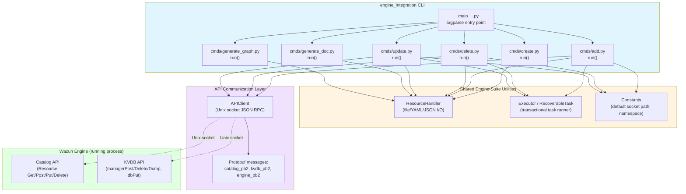
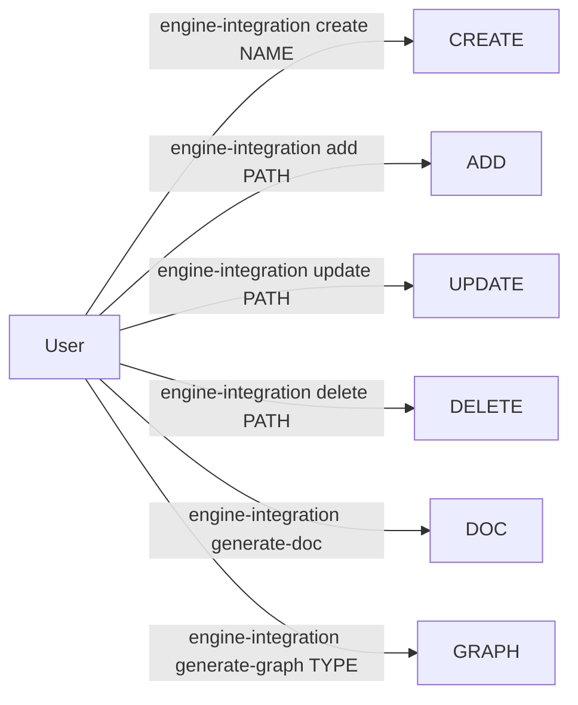
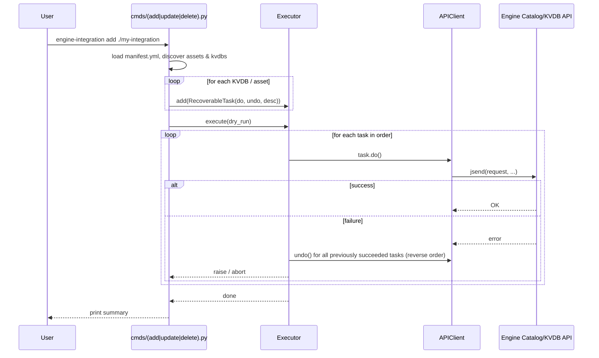
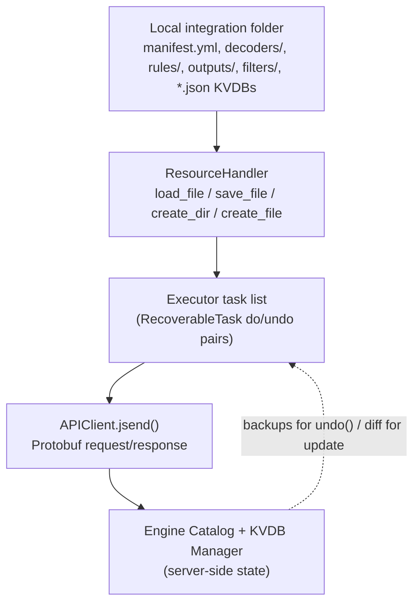

# Engine Integration (`engine-integration` CLI)

## 1. Purpose

`engine_integration` is a Python command-line tool, part of the **engine-suite** collection
(see [Engine Administration CLI Tools (Python)](engine_suite_overview.md) if available, and
sibling tools such as [`engine_catalog`](engine_catalog.md) and [`engine_kvdb`](engine_kvdb.md)).

It is the primary tool an administrator or content developer uses to **package, publish,
update, remove and document Wazuh Engine "integrations"** — bundles of decoders, rules,
outputs, filters and KVDBs that are grouped together under a single `manifest.yml`.

Unlike lower-level tools that operate on a single asset (`engine-catalog`) or a single KVDB
(`engine-kvdb`), `engine-integration` orchestrates **multi-asset, multi-KVDB workflows** against
the running Engine's HTTP/Unix-socket API, providing:

- Scaffolding of a new integration directory structure (`create`).
- Bulk publishing of an integration's assets and KVDBs to the catalog (`add`).
- Safe removal of a previously published integration (`delete`).
- Idempotent reconciliation between a local integration folder and what is currently stored
  in the catalog — adding new assets, updating changed ones, and removing obsolete ones
  (`update`).
- Generation of a `README.md` for an integration (`generate-doc`).
- Generation of a Graphviz dependency graph of an integration's decoders/rules/outputs
  (`generate-graph`).

All catalog/KVDB mutating operations are implemented as **reversible tasks**: if any step in a
multi-step operation fails, previously applied steps are automatically rolled back, keeping the
Engine's catalog consistent.

## 2. Architecture Overview

**Key external dependencies (documented in other modules):**

| Dependency | Provided by | Role |
|---|---|---|
| `ResourceHandler`, `Format` | [`engine_suite_shared`](engine_suite_shared.md) (`shared/resource_handler.py`) | Loads/saves YAML, JSON and plain-text files (manifests, asset definitions, documentation) |
| `Executor`, `RecoverableTask` | [`engine_suite_shared`](engine_suite_shared.md) (`shared/executor.py`) | Runs a list of `do`/`undo` steps; rolls back on failure |
| `Constants` | [`engine_suite_shared`](engine_suite_shared.md) (`shared/default_settings.py`) | Default API socket path and default namespace |
| `APIClient` | [`engine_misc_tools`](engine_misc_tools.md) (`api-communication/src/api_communication/client.py`) | Sends JSON requests over the Engine's Unix domain socket and parses protobuf responses |
| Catalog protobuf API (`catalog_pb2`) | [`engine_api_catalog`](engine_api_catalog.md) (`api/catalog/handlers.hpp`, `catalog.hpp`) | Server-side resource CRUD used to store/retrieve decoders, rules, outputs, filters, and integrations |
| KVDB protobuf API (`kvdb_pb2`) | [`engine_kvdb`](engine_kvdb.md) (`kvdb/kvdbManager.hpp`, C++ core) and its own [`engine_kvdb_cli`](engine_kvdb.md) | Server-side key-value database management used by integrations for enrichment lookups |

## 3. Command Reference

The tool is invoked as `engine-integration <subcommand> [options]`. Sub-command wiring happens
in `__main__.py::main`, which builds an `argparse` parser with one sub-parser per command
(`create`, `add`, `delete`, `update`, `generate-doc`, `generate-graph`), then dispatches to the
selected command's `run(args, resource_handler)` function.

### 3.1 `create` — Scaffold a new integration

**File:** `cmds/create.py::run`

Creates the on-disk skeleton for a new integration:

- `<name>/` directory
- `<name>/test/` directory with an empty `engine-test.conf` (`{}`)
- `<name>/documentation.yml` — a documentation template (title, overview, compatibility,
  configuration, `event.module` / `event.dataset` placeholders)
- `<name>/manifest.yml` — contains `name: integration/<name>/0`

This command only touches the local filesystem; it does **not** talk to the Engine API.

### 3.2 `add` — Publish a new integration to the catalog

**File:** `cmds/add.py::run` → `add_integration`

Publishes an integration that does **not yet exist** in the catalog:

1. Resolves the integration path and loads `manifest.yml`.
2. Connects to the Engine API via `APIClient(api_socket)`.
3. Verifies the integration does not already exist (`ResourceGet_Request`); aborts if found
   (unless `--dry-run`).
4. For each asset type present in the manifest (`decoders`, `rules`, `outputs`, `filters`):
   - Locates every asset `*.yml` file under the corresponding ruleset directory
     (`<ruleset_root>/<asset_type>/...`) whose `name` is listed in the manifest.
   - For each asset's parent directory, if it contains `*.json` KVDB files not yet scheduled,
     schedules an **Add KVDB** task (`add_kvdb_task`) — one task per KVDB file.
   - Schedules an **Add asset** task (`add_asset_task`) that posts the asset content
     (`ResourcePost_Request`) to the catalog namespace.
5. Schedules a final **Add asset** task for the integration manifest itself.
6. Prints the task list, then executes them through `Executor.execute(dry_run)`.

Each task pairs a `do()` (perform the API call) with an `undo()` (reverse it — e.g. delete the
KVDB or asset that was just added) so that a failure partway through leaves the catalog
unchanged.

### 3.3 `delete` — Remove an integration from the catalog

**File:** `cmds/delete.py::run`

Removes a previously published integration:

1. Loads the local `manifest.yml` to obtain the integration name.
2. Fetches the **remote** integration definition (`ResourceGet_Request`, YAML format) to get the
   authoritative list of assets currently registered under that integration.
3. For every asset in the remote definition:
   - Schedules a **Delete asset** task (`delete_asset_task`), which first fetches a JSON backup
     of the asset (for `undo()`), then deletes it (`ResourceDelete_Request`).
   - Searches the local `decoders/` tree for a decoder file whose `name` matches the asset; if
     found, all `*.json` KVDB files colocated with that decoder are deleted directly via
     `managerDelete_Request` (KVDB deletion here is **not** wrapped in a recoverable task).
4. Schedules a final **Delete asset** task for the integration manifest itself.
5. Executes the task list through the `Executor`.

### 3.4 `update` — Reconcile local changes with the catalog

**File:** `cmds/update.py::run`

The most complex command: brings the catalog in line with the current state of the local
integration folder, supporting three kinds of changes simultaneously — added, modified, and
removed assets.

1. Loads the **updated** local manifest and the **current** remote manifest
   (`ResourceGet_Request`, parsed with `yaml.safe_load`).
2. For each asset type in the updated manifest:
   - For every KVDB colocated with a manifest asset, schedules an **Update KVDB** task
     (`update_kvdb_task`): backs up all existing entries (paginated `managerDump_Request`),
     then on `do()` deletes and recreates the KVDB from the local file; on `undo()` deletes and
     recreates it, restoring the backed-up entries via `dbPut_Request`.
   - For every asset, schedules an **Update asset** task (`update_asset_task`): backs up the
     current JSON content, then `do()` performs a `ResourcePut_Request` with the new YAML
     content; `undo()` deletes and restores the JSON backup.
3. Schedules an **Update asset** task for the manifest itself.
4. Compares the current remote manifest against the updated one: any asset present remotely but
   no longer declared locally is scheduled for **Delete asset** (`delete_asset_task`).
5. Executes all scheduled tasks via the `Executor`.

> **Caution (documented in the tool's own runtime message):** KVDBs in use by an active route or
> test session cannot be deleted, so updates to those KVDBs will fail; KVDBs no longer used by
> the updated integration are intentionally **not** garbage-collected by `update`.

### 3.5 `generate-doc` — Build integration README

**File:** `cmds/generate_doc.py::run`

Run from inside an integration directory. Reads `documentation.yml` for the free-text sections
(title, overview, compatibility, configuration, `event.module`/`event.dataset`), then walks the
sibling `decoders/`, `rules/` and `outputs/` directories (relative to the ruleset root),
filtering assets whose names are declared in the integration's `manifest.yml`, and appends a
Markdown table (`Name | Description`) for each asset type found. The result is written to
`README.md`.

### 3.6 `generate-graph` — Visualize asset lineage

**File:** `cmds/generate_graph.py::run`

Run from inside an integration directory with a required `type` argument (`decoders`, `rules`,
or `outputs`). Walks all `*.yml` files of that type under the ruleset root, keeps only those
listed in `manifest.yml`, and builds a `(name, parents)` list from each asset's `parents` field.
Uses `graphviz` (`neato` engine) to render a dependency graph and writes it as a `.dot` file
named after the asset type (e.g. `decoders.dot`).

## 4. Transactional Task Pattern

`add`, `delete`, and `update` all rely on the same execution model provided by
[`shared.executor`](engine_suite_shared.md): a list of `RecoverableTask(do, undo, description)`
objects is built up first, then executed in order. If a `do()` call fails, the `Executor` invokes
`undo()` for all tasks that already succeeded, in reverse order, so partial failures do not leave
the Engine's catalog/KVDBs in an inconsistent state. Every command also supports `--dry-run`,
which prints the planned task list without invoking the API at all.

## 5. Data Flow Summary

## 6. Relationship to Other Modules

- **[`engine_catalog`](engine_catalog.md)** — the lower-level, single-asset CLI counterpart to
  the catalog operations performed in bulk here (`ResourceGet/Post/Put/Delete`).
- **[`engine_kvdb`](engine_kvdb.md)** — the lower-level, single-KVDB CLI counterpart to the KVDB
  operations (`managerPost/Delete/Dump`, `dbPut`) performed in bulk here; the underlying C++
  KVDB engine is documented under `engine_kvdb_cpp_core`.
- **[`engine_api_catalog`](engine_api_catalog.md)** — the C++ server-side handlers
  (`registerHandlers`) that implement the Catalog protobuf API this tool calls into.
- **[`engine_suite_shared`](engine_suite_shared.md)** — shared `ResourceHandler`, `Executor`,
  and `Constants` utilities reused by every engine-suite CLI tool, including this one.
- **[`engine_misc_tools`](engine_misc_tools.md)** — home of the `APIClient` used to communicate
  with the Engine's Unix-socket API.
- **[`engine_test`](engine_test.md)** — the `test/engine-test.conf` scaffold generated by
  `create` is consumed by the `engine-test` tool when testing an integration's assets.
