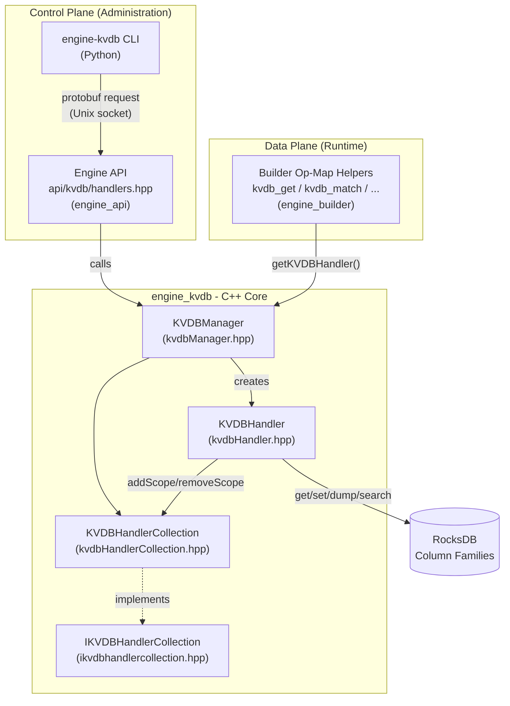
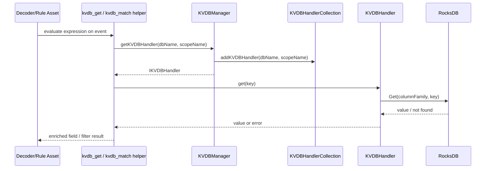
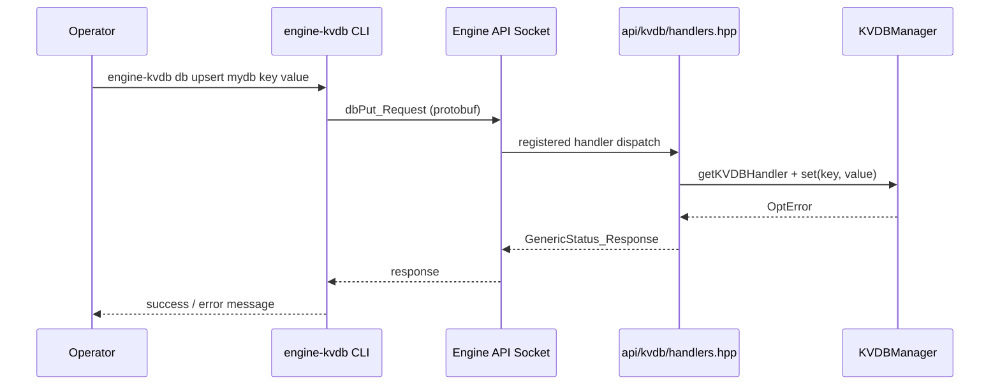

# Engine KVDB Module

## 1. Introduction and Purpose

The **`engine_kvdb`** module implements the **Key-Value Database (KVDB)** subsystem of the Wazuh Engine (the C++ analysis engine, see [Wazuh_Engine_Core_(C++)](Wazuh_Engine_Core_(C++).md)). It provides a persistent, on-disk key/value store — backed by **RocksDB** — that the Engine's decoder/rule pipeline (see [engine_builder](engine_builder.md)) uses to enrich, filter and transform events at runtime (e.g. `kvdb_get`, `kvdb_match`, `kvdb_decode_bitmask` helper functions).

The module is composed of two cooperating layers:

1. **C++ Core Library** (`src/engine/source/kvdb/`) — the actual database engine embedded inside the `wazuh-engine` daemon. It owns the RocksDB instance, exposes per-database "handlers" to callers, and tracks reference counts so databases are only closed once no component still needs them.
2. **Python CLI Tool** (`src/engine/tools/engine-suite/src/engine_kvdb/`) — the `engine-kvdb` command-line utility that administrators use to manage KVDBs (create, delete, dump, search, get/upsert/remove key-value pairs) by talking to the running Engine over its API socket.

This separation means the module has both an **in-process, high-performance data-plane** (used by the rule/decoder pipeline while processing events) and an **out-of-process, human-facing control-plane** (used by operators/administrators through the Engine's [engine_api](engine_api.md)).

## 2. Architecture Overview

### Key Design Points

- **One RocksDB instance, many "databases".** Each logical KVDB is mapped to a RocksDB *Column Family* inside a single shared `rocksdb::DB` instance owned by `KVDBManager`.
- **Scoped handlers with reference counting.** Callers (e.g. a decoder asset, or the CLI through the API) never talk to RocksDB directly. They request a `KVDBHandler` from `KVDBManager::getKVDBHandler(dbName, scopeName)`. The `KVDBHandlerCollection` tracks which "scopes" (e.g. policies, assets) are using which database, so a database is only safe to unload when its scope set becomes empty.
- **Two independent consumers.** The runtime data plane (rule/decoder helpers in [engine_builder](engine_builder.md)) and the administrative control plane (the [engine_api](engine_api.md) KVDB handlers, driven by the CLI documented here) both go through the same `IKVDBManager`/`IKVDBHandler` interfaces, guaranteeing consistent behavior regardless of the caller.
- **CLI is a thin protobuf client.** The Python CLI does not touch RocksDB or the Engine internals at all — it serializes requests (`dbGet`, `dbPut`, `dbDelete`, `dbSearch`, `managerGet`, `managerPost`, `managerDelete`, `managerDump`) and sends them over the Engine's Unix domain socket using the shared `APIClient` (see [Engine_Administration_CLI_Tools_(Python)](Engine_Administration_CLI_Tools_(Python).md)), then pretty-prints the YAML/JSON response.

## 3. Sub-Modules

| Sub-module | Description | Documentation |
|---|---|---|
| **C++ KVDB Core** | RocksDB-backed manager, handler and handler-collection classes that implement database lifecycle, key-value CRUD, pagination, and reference counting inside the Engine process. | [engine_kvdb_cpp_core.md](engine_kvdb_cpp_core.md) |
| **KVDB CLI Tool** | Python `engine-kvdb` command-line tool (`db get/search/remove/upsert`, `manager list/create/delete/dump`) used to administer KVDBs via the Engine API. | [engine_kvdb_cli.md](engine_kvdb_cli.md) |

## 4. High-Level Data Flow

### 4.1 Runtime lookup (Data Plane)

### 4.2 Administrative operation (Control Plane)

## 5. Relationship to Other Modules

- **[engine_builder](engine_builder.md)** — specifically the `builder_opmap_kvdb` component (`opBuilderKVDBGet`, `opBuilderKVDBMatch`, `opBuilderHelperKVDBDecodeBitmask`, etc.) is the primary in-process consumer of `IKVDBManager`/`IKVDBHandler` during event decoding/filtering.
- **[engine_api](engine_api.md)** — the `engine_api_resource_handlers` component (`api/kvdb/handlers.hpp::registerHandlers`) exposes the KVDB Manager's operations as API endpoints that the CLI (and other API clients) invoke.
- **[Engine_Administration_CLI_Tools_(Python)](Engine_Administration_CLI_Tools_(Python).md)** — the `engine_kvdb` CLI shares the `shared.dumpers` (YAML/JSON formatting) and `api_communication.client.APIClient` infrastructure documented for the broader engine-suite tools; see `engine_suite_shared` and `engine_misc_tools` there.
- **[Wazuh_Engine_Core_(C++)](Wazuh_Engine_Core_(C++).md)** — `engine_kvdb` is one of the constituent libraries of the Engine, alongside `engine_base`, `Store`, `Router`, etc., all of which are wired together in `engine_main`.

## 6. Summary

`engine_kvdb` provides a self-contained, embeddable key-value store that:

- Persists data in RocksDB Column Families under a single shared database file.
- Exposes a scoped, reference-counted handler abstraction to decouple callers' lifecycles from the underlying database lifecycle.
- Is reachable both from inside the Engine (decoders/rules) and from outside the Engine (the `engine-kvdb` CLI via the Engine API).

For implementation details of each layer, see the sub-module documentation linked above.
