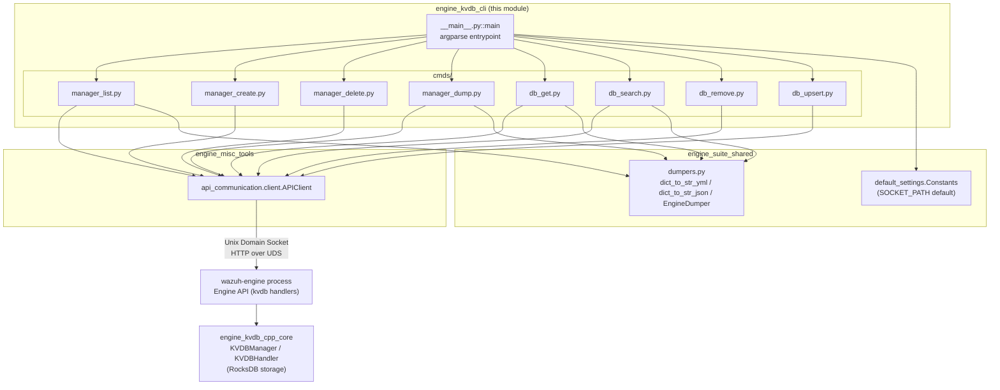
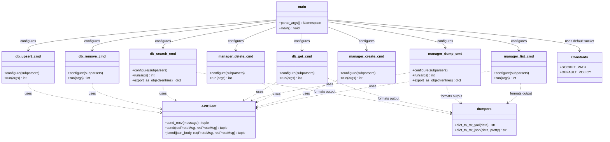
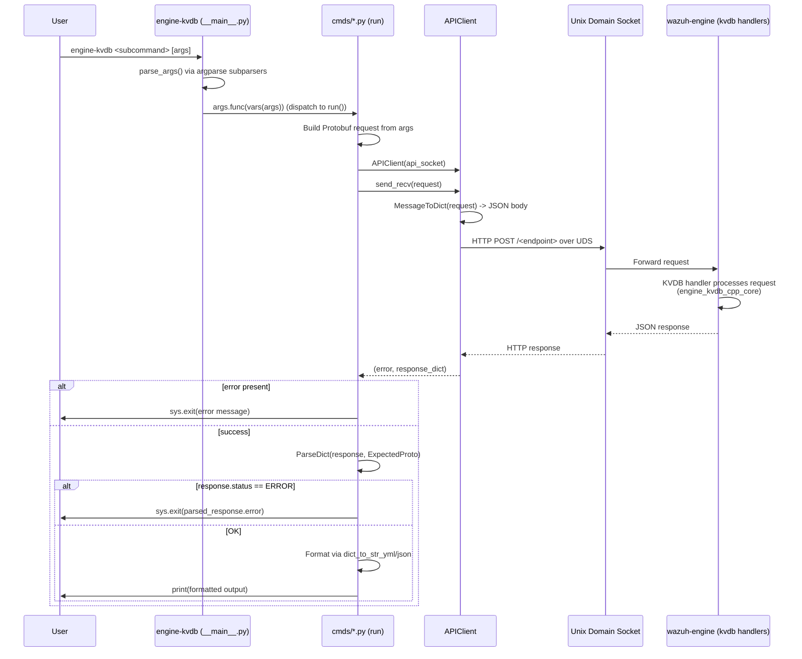
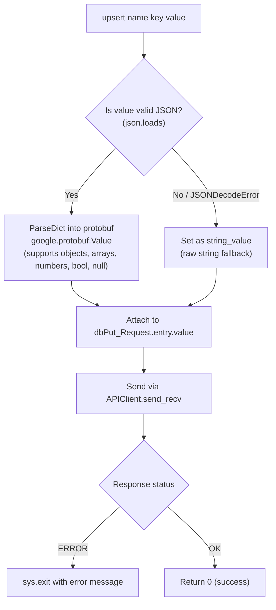
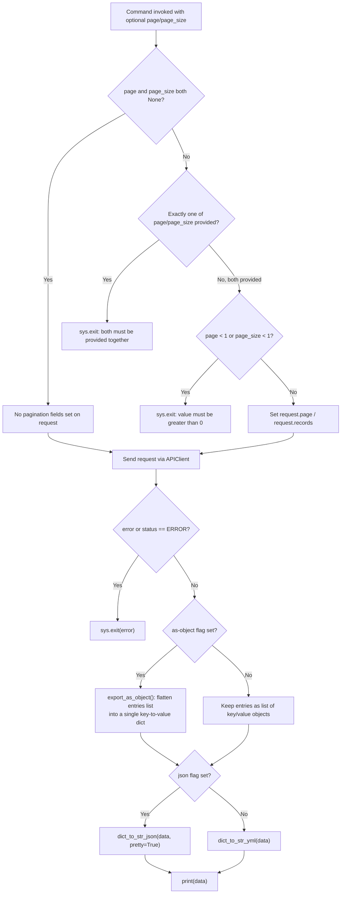
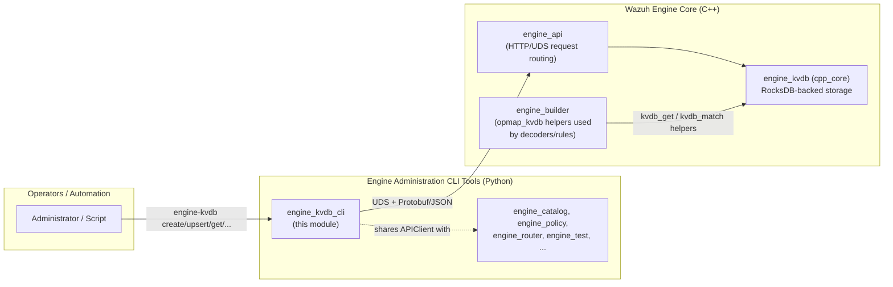

# engine_kvdb_cli

## Introduction

`engine_kvdb_cli` is the Python command-line front-end for managing the Wazuh Engine's **Key-Value Database (KVDB)** subsystem. It provides the `engine-kvdb` executable, an argparse-based tool that lets administrators, integration developers, and automation scripts create, delete, inspect, and mutate KVDB instances and their key-value entries without writing code against the Engine's native API.

The tool does not implement any database logic itself. Instead, it is a thin, well-structured client that:

1. Parses CLI arguments into subcommands (`list`, `create`, `delete`, `dump`, `get`, `search`, `remove`, `upsert`).
2. Builds Protocol Buffer request messages defined by the Engine API contract (`api_communication.proto.kvdb_pb2`).
3. Sends those requests over a Unix domain socket to the running `wazuh-engine` process using the shared `APIClient`.
4. Parses/validates the Protobuf response and renders the result as human-readable YAML or JSON.

This module is the CLI counterpart to the C++ KVDB engine core (`engine_kvdb_cpp_core`), which implements the actual on-disk RocksDB-backed key-value storage and exposes it through the Engine's internal API handlers.

---

## Purpose and Core Functionality

| Responsibility | Description |
|---|---|
| **Database (manager) lifecycle** | `manager_list`, `manager_create`, `manager_delete`, `manager_dump` — create/enumerate/remove named KVDB instances and dump their full contents. |
| **Entry-level operations** | `db_get`, `db_search`, `db_remove`, `db_upsert` — read, prefix-search, delete, and insert/update individual key-value pairs within a named database. |
| **API transport** | Delegates all socket I/O, request/response (de)serialization, and error normalization to the shared `APIClient` (`engine_misc_tools`/`engine_suite_shared` ecosystem). |
| **Output formatting** | Uses the shared `EngineDumper`/`dict_to_str_yml`/`dict_to_str_json` helpers (see `engine_suite_shared`) to render Protobuf responses as YAML (default) or JSON (`-j/--json` flag), including pagination and an "as object" export mode for `search`/`dump`. |

Because the CLI is a pure client, its "business logic" is limited to:
- Argument validation (e.g., pagination `page`/`page_size` must be provided together, JSON value parsing for `upsert`).
- Translating CLI flags into Protobuf request fields.
- Translating Protobuf/JSON error responses into actionable CLI error messages and non-zero exit codes.

---

## Architecture Overview

For details on the native storage layer that ultimately services these requests, see [engine_kvdb_cpp_core.md](engine_kvdb_cpp_core.md) and the broader [Wazuh_Engine_Core_(C++).md](Wazuh_Engine_Core_(C++).md) for the `api/kvdb` request handlers (`registerHandlers`).

---

## Component Relationships

---

## Command Reference

| Subcommand | File | Protobuf Request | Protobuf Response | Purpose |
|---|---|---|---|---|
| `list` | `manager_list.py` | `ekvdb.managerGet_Request` | `ekvdb.managerGet_Response` | Lists all KVDB instances known to the engine. |
| `create` | `manager_create.py` | `ekvdb.managerPost_Request` | `engine.GenericStatus_Response` | Creates a new named KVDB, optionally seeded from a server-side file path. |
| `delete` | `manager_delete.py` | `ekvdb.managerDelete_Request` | `engine.GenericStatus_Response` | Deletes a named KVDB instance. |
| `dump` | `manager_dump.py` | `ekvdb.managerDump_Request` | `ekvdb.managerDump_Response` | Dumps all entries of a KVDB, with optional pagination and object/YAML/JSON export. |
| `get` | `db_get.py` | `ekvdb.dbGet_Request` | `ekvdb.dbGet_Response` | Retrieves the value for a specific key. |
| `search` | `db_search.py` | `ekvdb.dbSearch_Request` | `ekvdb.dbSearch_Response` | Searches entries by key prefix, with optional pagination. |
| `remove` | `db_remove.py` | `ekvdb.dbDelete_Request` | `engine.GenericStatus_Response` | Removes a single key-value pair. |
| `upsert` | `db_upsert.py` | `ekvdb.dbPut_Request` | `engine.GenericStatus_Response` | Inserts or updates a key-value pair; value is parsed as JSON when possible, otherwise treated as a raw string. |

All commands accept a global `--api-socket` argument (default: `Constants.SOCKET_PATH`, typically `/var/ossec/queue/sockets/analysis`) that overrides which Engine API Unix socket to talk to — useful for testing against non-default Engine instances.

---

## Data Flow: Command Execution

---

## Process Flow: `upsert` Value Type Resolution

The `upsert` command has special handling to allow both structured (JSON) and plain string values to be stored transparently:

---

## Process Flow: Paginated Read Commands (`search` / `dump`)

`db_search.py` and `manager_dump.py` share nearly identical pagination and export logic:

---

## Dependencies

### Upstream (consumed by this module)
- **`engine_misc_tools`** — provides `api_communication.client.APIClient`, the shared HTTP-over-Unix-socket transport used by *all* `engine-suite` CLI tools (not just KVDB). See [Engine_Administration_CLI_Tools_(Python).md](Engine_Administration_CLI_Tools_(Python).md).
- **`engine_suite_shared`** — provides:
  - `shared.default_settings.Constants` for the default API socket path and other shared constants.
  - `shared.dumpers` (`EngineDumper`, `dict_to_str_yml`, `dict_to_str_json`) for consistent YAML/JSON rendering across all engine-suite tools.
- **Protobuf contracts** (`api_communication.proto.engine_pb2`, `api_communication.proto.kvdb_pb2`) — generated message classes defining the wire format for KVDB requests/responses and the generic `GenericStatus_Response` / `ERROR` status enum shared by all Engine API endpoints.

### Downstream (serves requests from this module)
- **`engine_kvdb_cpp_core`** (sibling module) — the C++ implementation (`KVDBManager`, `KVDBHandler`, `KVDBHandlerCollection`) that backs the actual database operations invoked by this CLI. See [engine_kvdb_cpp_core.md](engine_kvdb_cpp_core.md).
- **`engine_api_resource_handlers`** — the Engine-side HTTP/UDS handler registration (`api/kvdb/include/api/kvdb/handlers.hpp::registerHandlers`) that receives and routes the JSON/Protobuf requests sent by this CLI to the KVDB core. See [Wazuh_Engine_Core_(C++).md](Wazuh_Engine_Core_(C++).md).
- **`engine_builder`** — the `opmap_kvdb` builders (`getOpBuilderKVDBGet`, `getOpBuilderKVDBMatch`, etc.) consume the same KVDB instances managed by this CLI when evaluating decoder/rule pipelines, meaning changes made via `engine-kvdb upsert/remove` directly affect live rule evaluation. See [Wazuh_Engine_Core_(C++).md](Wazuh_Engine_Core_(C++).md).

---

## How It Fits Into the Overall System

`engine_kvdb_cli` is one of several sibling CLI tools under **Engine_Administration_CLI_Tools_(Python)** (alongside `engine_catalog`, `engine_policy`, `engine_router`, `engine_test`, etc.). All of them share the same transport (`APIClient`) and formatting (`shared.dumpers`) infrastructure, giving operators a consistent experience across the entire Engine toolchain. Within the KVDB feature area specifically, this CLI is the operational counterpart to:

- **`engine_kvdb_cpp_core`** — the actual storage engine.
- **`builder_opmap_kvdb`** — the rule/decoder-time consumers of KVDB data (`kvdb_get`, `kvdb_match`, etc., defined in `src/engine/source/builder/src/builders/opmap/kvdb.cpp`), which read the same databases this CLI manages.

Typical usage patterns include:
- Bootstrapping reference-data databases (e.g., IP reputation lists, asset inventories) via `create` + `upsert`/bulk import.
- Debugging rule behavior by using `get`/`search` to inspect what a `kvdb_get`/`kvdb_match` helper would see at rule-evaluation time.
- Exporting/backing up KVDB contents via `dump --as-object --json` for version control or migration.
- Cleaning up stale databases via `delete`/`remove` as part of configuration lifecycle management.
