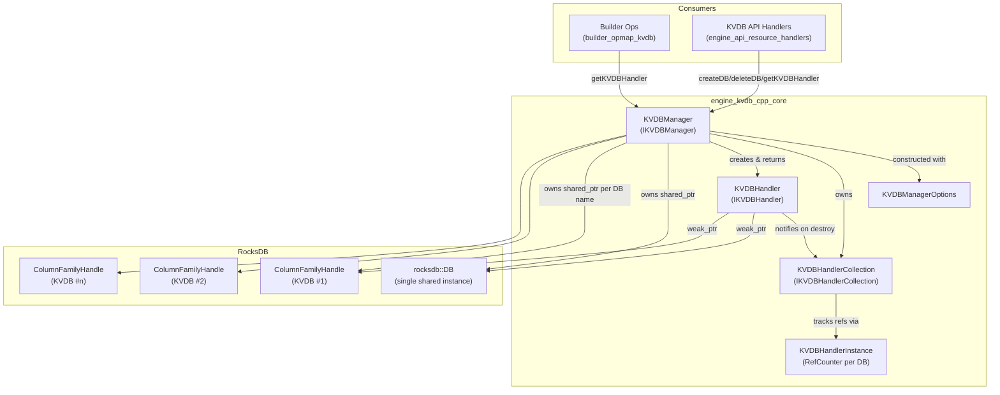
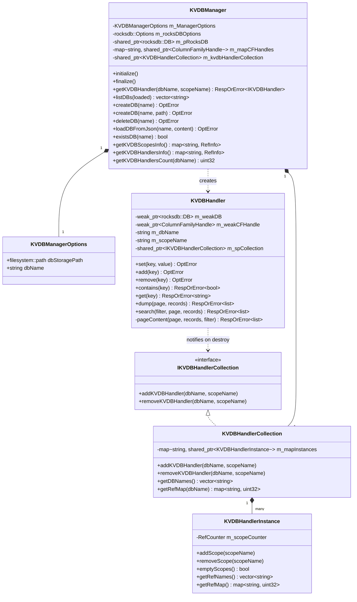
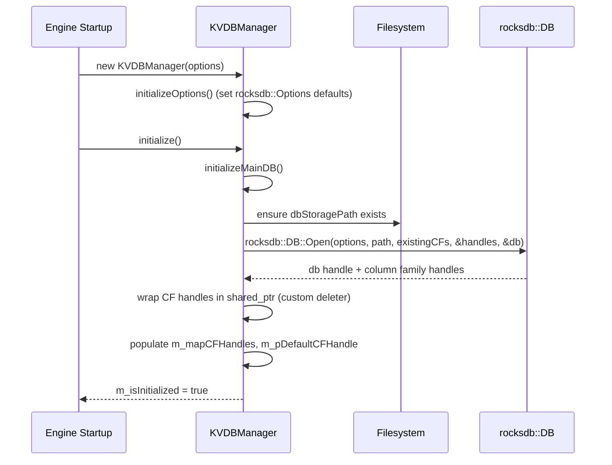
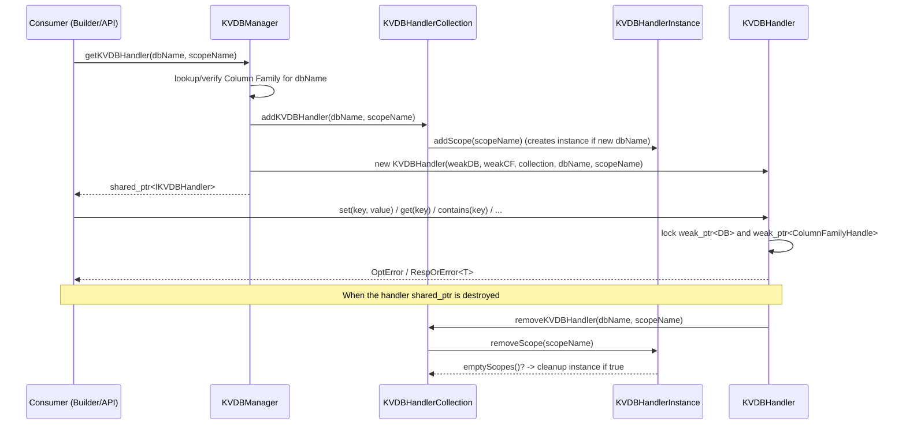
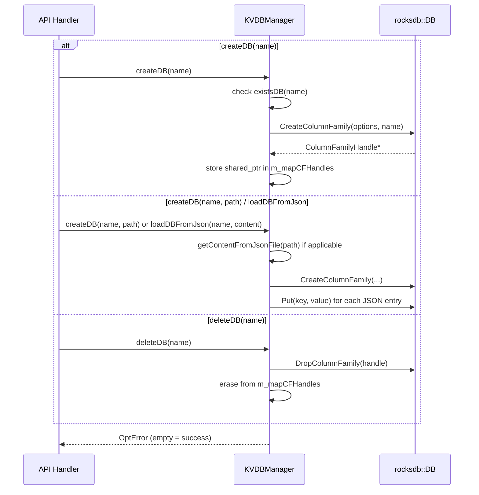

# Engine KVDB C++ Core

## Introduction

The **Engine KVDB C++ Core** module implements the native (C++) Key-Value Database subsystem used by the Wazuh Engine (`wazuh-engine`). It provides a thread-safe, reference-counted abstraction over [RocksDB](https://rocksdb.org/) Column Families, allowing multiple independent logical "databases" (KVDBs) to be created, opened, queried and destroyed while the Engine is running — without requiring a database file per KVDB.

This module is the foundational storage layer that other Engine subsystems build upon, most notably:

* The **Decoder/Rule Builder** operations (`kvdb_get`, `kvdb_match`, `kvdb_decode_bitmask`, etc.) documented in [builder_opmap_kvdb.md](builder_opmap_kvdb.md), which use KVDB lookups to enrich or filter events during ruleset execution.
* The **KVDB REST API handlers** (`registerHandlers`) documented in [engine_api_resource_handlers.md](engine_api_resource_handlers.md), which expose KVDB CRUD operations over the Engine's HTTP/Unix-socket API.
* The **`engine-kvdb` CLI tool**, documented in [engine_kvdb_cli.md](engine_kvdb_cli.md), a Python front-end that talks to the API handlers above to manage KVDBs from the command line.

Architecturally, this module is a child of the broader [engine_kvdb](engine_kvdb.md) grouping and is a peer of `engine_kvdb_cli`. It sits within the larger [Wazuh_Engine_Core_(C++)](Wazuh_Engine_Core_(C++).md) codebase, alongside sibling subsystems such as [engine_builder](engine_builder.md), [engine_base](engine_base.md), and [Store](Store.md).

## Purpose and Core Functionality

The module solves three related problems:

1. **Multiplexing many logical databases onto a single RocksDB instance.** Rather than opening one RocksDB database per KVDB (which would be expensive and hard to manage), each KVDB is mapped 1:1 to a RocksDB **Column Family** inside a single, shared RocksDB instance located at a configured storage path.
2. **Safe concurrent access across "scopes".** Multiple independent consumers ("scopes" — e.g., different policy assets, decoders, or API sessions) can request a handler to the same KVDB simultaneously. The module reference-counts these requests per scope so that the underlying Column Family is only closed/dropped when no scope still needs it.
3. **A uniform CRUD interface over KVDB entries.** Each KVDB stores simple key → value pairs (values may be empty, a raw string, or a JSON document). The module exposes `set`, `add`, `remove`, `contains`, `get`, `dump`, and `search` (prefix filter) operations, all funneled through the handler abstraction.

## Architecture Overview

The core is organized around four collaborating classes plus their interfaces:

| Component | Role |
|---|---|
| `KVDBManager` | Entry point / façade. Owns the single RocksDB instance, the map of Column Family handles (one per KVDB), and orchestrates DB lifecycle (create, delete, list, load from JSON, exists) and handler issuance. |
| `KVDBManagerOptions` | Simple configuration struct (`dbStoragePath`, `dbName`) used to construct a `KVDBManager`. |
| `KVDBHandlerCollection` (impl of `IKVDBHandlerCollection`) | Tracks, per DB name, which scopes currently hold a handler to it (via `KVDBHandlerInstance`), enabling reference-counted handler lifecycle management. |
| `KVDBHandlerInstance` | Helper wrapping a `RefCounter` that tracks how many times each scope has requested a handler for one specific DB. |
| `KVDBHandler` (impl of `IKVDBHandler`) | The object actually returned to callers. Wraps weak pointers to the RocksDB `DB` and `ColumnFamilyHandle`, and implements the CRUD/query operations against that Column Family. On destruction, it notifies the collection so reference counts can be decremented. |
| `IKVDBHandlerCollection` | Interface implemented by `KVDBHandlerCollection`, decoupling `KVDBHandler` from the concrete collection implementation. |

### Component Diagram

### Class Relationships

## Key Workflows

### 1. Manager Initialization

### 2. Acquiring a Handler (Reference-Counted)

### 3. Database Lifecycle (Create / Delete / Load)

## Core Component Details

### `KVDBManagerOptions`
A plain configuration structure containing:
- `dbStoragePath`: filesystem path where the shared RocksDB instance's data files live.
- `dbName`: name/identifier of the main RocksDB instance.

### `KVDBManager`
The single entry point implementing `IKVDBManager`. Responsibilities:
- **Lifecycle**: `initialize()` / `finalize()` open and close the underlying RocksDB instance and set up/tear down internal maps.
- **DB management**: `createDB`, `deleteDB`, `existsDB`, `listDBs`, `loadDBFromJson` operate at the Column Family level — each "DB" the rest of the Engine sees is actually a Column Family within one physical RocksDB instance (`DEFAULT_CF_NAME` reserved for the default CF).
- **Handler issuance**: `getKVDBHandler(dbName, scopeName)` is the primary API used by consumers; it validates the DB exists, registers the scope in `KVDBHandlerCollection`, and returns a new `KVDBHandler` bound to weak pointers of the DB and its Column Family (so a handler never keeps RocksDB resources alive past manager shutdown).
- **Introspection**: `getKVDBScopesInfo`, `getKVDBHandlersInfo`, `getKVDBHandlersCount` expose reference-count telemetry, used e.g. by the API's `kvdb` status/list endpoints.
- Internally uses custom-deleter `shared_ptr<rocksdb::ColumnFamilyHandle>` (`createSharedCFHandle`) so that the RocksDB C API `DestroyColumnFamilyHandle` is invoked correctly on cleanup.

### `IKVDBHandlerCollection` / `KVDBHandlerCollection`
Decouples handler bookkeeping from the manager. `KVDBHandlerCollection` maintains `m_mapInstances: map<dbName, shared_ptr<KVDBHandlerInstance>>`, guarded by a `shared_mutex` for concurrent read/write safety. Adding/removing a handler for a `(dbName, scopeName)` pair updates the corresponding `KVDBHandlerInstance`.

### `KVDBHandlerInstance`
A thin wrapper around a generic `RefCounter` utility, scoped to one DB. Tracks which scope names are currently referencing the DB and how many times each. `emptyScopes()` tells the manager/collection when a Column Family is completely unreferenced (candidate for potential future cleanup logic), and `getRefMap()`/`getRefNames()` support introspection APIs.

### `IKVDBHandler` / `KVDBHandler`
The object returned to end consumers (builder helper functions, API handlers). It stores **weak** pointers to the RocksDB `DB` and `ColumnFamilyHandle` (the `KVDBManager` owns the strong references), so operations must lock the weak pointer before use, gracefully failing with a `base::Error` if the DB has since been finalized/dropped. Supported operations:

| Method | Description |
|---|---|
| `set(key, value)` | Insert/overwrite a key with a string or JSON value. |
| `add(key)` | Insert a key with an empty value (existence marker). |
| `remove(key)` | Delete a key. |
| `contains(key)` | Check key existence. |
| `get(key)` | Retrieve the string value for a key. |
| `dump(page, records)` | Paginated listing of all key/value pairs (via `pageContent`). |
| `search(filter, page, records)` | Paginated listing filtered by key-prefix (via `pageContent` with a filter predicate). |

On destruction, `~KVDBHandler()` calls back into `IKVDBHandlerCollection::removeKVDBHandler` to decrement the scope's reference count — this is the mechanism that ties handler object lifetime to reference counting correctness.

## Integration Points

- **Builder / Ruleset Operations** ([builder_opmap_kvdb.md](builder_opmap_kvdb.md)): helper functions such as `getOpBuilderKVDBGet`, `getOpBuilderKVDBMatch`, `getOpBuilderHelperKVDBDecodeBitmask` acquire an `IKVDBHandler` (typically scoped to the asset/policy name) via the manager and call `get`/`contains` during event processing.
- **API Handlers** ([engine_api_resource_handlers.md](engine_api_resource_handlers.md)): `api/kvdb/handlers.hpp::registerHandlers` exposes manager operations (`createDB`, `deleteDB`, `dump`, `search`, `set`, `remove`, etc.) as RPC endpoints consumed by the CLI.
- **CLI Tooling** ([engine_kvdb_cli.md](engine_kvdb_cli.md)): the Python `engine-kvdb` tool (`db_get`, `db_upsert`, `db_remove`, `db_search`, `manager_create`, `manager_delete`, `manager_dump`, `manager_list`) is a thin client over the API handlers described above, ultimately driving this C++ core.
- **Base Utilities** ([engine_base.md](engine_base.md)): return types (`base::OptError`, `base::RespOrError<T>`) come from the shared Engine `base` library's error/result types.
- **Store** ([Store.md](Store.md)): while conceptually similar (both are Engine persistence subsystems), `Store` manages the Engine's asset/policy documents, whereas KVDB manages arbitrary user/decoder key-value data; they are independent subsystems that do not share storage.

## Concurrency & Safety Notes

- The `KVDBManager` and `KVDBHandlerCollection` use `std::mutex`/`std::shared_mutex` to guard their internal maps, allowing concurrent handler acquisition/release from multiple Engine worker threads.
- `KVDBHandler` never holds strong ownership of RocksDB resources — using `weak_ptr<rocksdb::DB>` and `weak_ptr<ColumnFamilyHandle>` ensures that a `finalize()` of the manager (e.g., during Engine shutdown or hot-reload) cannot be blocked or invalidated unsafely by outstanding handler objects; operations on a handler whose underlying resources have been released will simply fail with an error rather than crash.
- Reference counting is **per scope name per DB name**, not per handler instance, allowing multiple handler objects for the same `(dbName, scopeName)` pair to be created (e.g., re-entrant lookups) without prematurely tearing down the Column Family while any scope still references it.
