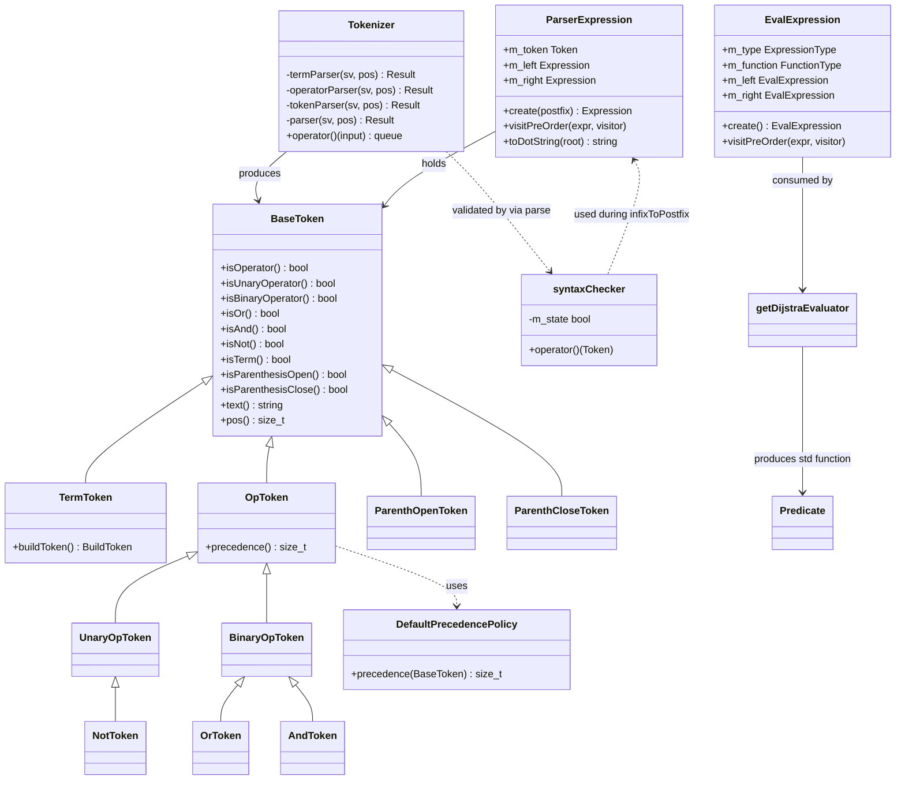
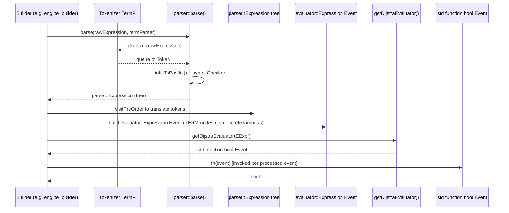

# Engine LogicExpr Module

## 1. Purpose & Overview

`engine_logicexpr` is a small, self-contained, **header-only C++ template library** that lives inside the [Wazuh Engine Core](Wazuh_Engine_Core_(C++).md). Its single responsibility is to turn a **textual logic expression** — composed of terms combined with the `AND`, `OR`, `NOT` operators and parenthesis — into an **executable boolean predicate** that can be evaluated against an arbitrary runtime `Event` type.

Typical use case inside the engine: a decoder/rule stage declares a condition such as

```
(is_windows() AND has_field("user")) OR NOT is_linux()
```

`engine_logicexpr` is responsible for:
1. **Tokenizing** the raw string into a stream of typed tokens (terms, operators, parentheses).
2. **Parsing** that token stream (validating syntax) into a binary **expression tree** using the Shunting-Yard algorithm.
3. **Compiling/Evaluating** that tree into a single `std::function<bool(Event)>` that can be invoked per-event with near-zero overhead (using an iterative, Dijkstra two-stack style evaluator instead of tree recursion).

The library is fully generic over:
- The **`Event`** type being evaluated (e.g. a JSON document, a base `Event` object, etc.).
- The **term parser** (`TermP`), which knows how to recognize and build a domain-specific "term" (leaf predicate) out of a substring — this is supplied by the caller (typically the [engine_builder](engine_builder.md) module, e.g. its `opfilter`/`opmap` helper builders).

Because it has no dependency on any specific event representation, `engine_logicexpr` is reused wherever the engine needs generic boolean-expression parsing — most notably by the filter/condition builders in `engine_builder` and by stage builders that accept logical conditions in their configuration (e.g. `allow`/`ignore` conditions, KVDB match filters, etc.). It also builds on `engine_parsec` (a lightweight parser-combinator library) for its low-level string parsing primitives.

## 2. Architecture

The module is composed of exactly four public headers under `src/engine/source/logicexpr/interface/logicexpr/`, forming a clear linear pipeline:

```
token.hpp        -> defines the Token hierarchy (BaseToken, TermToken<T>, OpToken, OrToken, AndToken, NotToken, Parenthesis tokens)
tokenizer.hpp     -> Tokenizer<TermP>: raw string -> std::queue<Token>
parser.hpp        -> parse(): std::queue<Token> -> Expression tree (via Shunting-Yard / infixToPostfix) with syntax validation
evaluator.hpp     -> Expression<Event> + getDijstraEvaluator(): Expression tree -> std::function<bool(Event)>
```

### 2.1 High-level pipeline

```mermaid
flowchart LR
    A["Raw expression string\n e.g. '(A AND B) OR NOT C'"] --> B["Tokenizer TermP\n(tokenizer.hpp)"]
    B -->|"queue of Token"| C["parser::parse()\n(parser.hpp)"]
    C -->|"Shunting-Yard\n(infixToPostfix)"| D["parser::Expression tree\n(binary tree of Tokens)"]
    D --> E["evaluator::Expression Event\n(re-shaped tree, evaluator.hpp)"]
    E --> F["getDijstraEvaluator()\n builds flattened operator list"]
    F --> G["std::function bool(Event)\n compiled predicate"]
    G -->|"invoked per event"| H["bool result"]
```



### 2.2 Component relationship diagram



## 3. Core Components

### 3.1 `token.hpp` — Token Hierarchy

Defines the polymorphic **token** model used by both the tokenizer and the parser:

| Component | Responsibility |
|---|---|
| `BaseToken` | Abstract base for every token; carries `text()`/`pos()` (for error messages) and a family of `isXxx()` predicates (`isTerm`, `isOperator`, `isUnaryOperator`, `isBinaryOperator`, `isOr`, `isAnd`, `isNot`, `isParenthesisOpen`, `isParenthesisClose`). Provides `getPtr<Derived>()` for safe down-casting. |
| `TermToken<BuildToken>` | Leaf token wrapping a caller-supplied `BuildToken` (e.g. the compiled predicate function/handle produced by the domain-specific term parser). |
| `OpToken` (+ `DefaultPrecedencePolicy`) | Base for all operator tokens; exposes `precedence()` used by the Shunting-Yard algorithm. `DefaultPrecedencePolicy` assigns `OR=1 < AND=2 < NOT=3`. |
| `UnaryOpToken` / `BinaryOpToken` | Distinguish arity of operators. |
| `OrToken`, `AndToken`, `NotToken` | Concrete operator tokens. |
| `ParenthOpenToken`, `ParenthCloseToken` | Grouping tokens. |
| `traits::is_term_token<T>` | Compile-time trait to detect `std::shared_ptr<TermToken<T>>` specializations. |

`Token` is simply `std::shared_ptr<BaseToken>`, allowing heterogeneous storage in queues/stacks.

### 3.2 `tokenizer.hpp` — `Tokenizer<TermP>`

Converts a `std::string_view` into a `std::queue<Token>`.

- Templated on `TermP`, a **parsec** parser (statically asserted via `parsec::traits::is_parser`) supplied by the caller to recognize domain-specific terms (e.g., a helper-function call syntax used by rule/decoder conditions).
- Internally tries `termParser()` **before** `operatorParser()` at every position, ensuring that a term is never partially mis-tokenized as an operator keyword.
- `operatorParser()` recognizes the literal keywords `OR`, `AND`, `NOT`, `(`, `)` (see `opstr` namespace).
- Skips whitespace between tokens and produces detailed `parsec::Trace` error information (via `fmt`) if tokenization fails, surfaced as a `std::runtime_error`.

### 3.3 `parser.hpp` — Expression Tree Construction

- `syntaxChecker` — a small state machine (expects "operand" vs "operator") that validates token ordering while scanning the infix token queue, throwing descriptive `std::runtime_error`s on malformed input (e.g., two consecutive binary operators, unbalanced parenthesis).
- `infixToPostfix()` — classic **Shunting-Yard algorithm** implementation that converts the infix `std::queue<Token>` into a postfix `std::stack<Token>`, using `OpToken::precedence()` for operator ordering and validating parenthesis balance.
- `parser::Expression` — binary tree node (`m_token`, `m_left`, `m_right`) built directly from the postfix stack (recursive-descent consumption). Provides:
  - `visitPreOrder()` for tree traversal.
  - `toDotString()` to export a Graphviz representation of the tree (useful for debugging/visual documentation of compiled conditions).
- `parse(rawExpression, termParser)` — the main entry point: tokenizes, converts to postfix, and builds the `Expression` tree, wrapping any internal failure into a single `std::runtime_error` with context.

### 3.4 `evaluator.hpp` — Compilation to a Boolean Predicate

- `evaluator::Expression<Event>` — a **second**, evaluation-oriented expression tree (`ExpressionType`: `TERM | OR | AND | NOT`) whose term nodes hold a `std::function<bool(Event)>`. This tree is typically built by the caller (e.g., `engine_builder`) by walking the `parser::Expression` tree and swapping each `TermToken<BuildToken>` for a concrete evaluation function derived from `BuildToken`.
- `getDijstraEvaluator(expression)` — **flattens** the expression tree (via `visitPreOrder`) into a linear vector of `{type, function}` operator records, then returns a `std::function<bool(Event)>` closure that evaluates the flattened program using an **iterative two-stack (operand stack) algorithm** — avoiding recursive tree-walking at evaluation time for every event, which is important for the engine's per-event hot path performance.
- Supports `NOT` (unary), `AND`/`OR` (binary, short-circuit is **not** applied — both operands are always evaluated because the flattening happens ahead of time; this is a deliberate trade-off for compiled evaluation speed).

## 4. Data Flow / Sequence



## 5. Design Notes & Rationale

- **Header-only / templated**: no compiled translation unit; all types are resolved at the call site, allowing zero-cost abstraction and full inlining opportunities for the hot evaluation path.
- **Two distinct expression trees**: `parser::Expression` (syntax-level, holds `Token`s) is deliberately decoupled from `evaluator::Expression<Event>` (semantics-level, holds `std::function<bool(Event)>`). This separation lets a caller reuse the syntax tree to build different evaluators for different `Event` types, or to statically analyze/print the expression (`toDotString`) independently from evaluation.
- **Error reporting**: All failures (`tokenizer`, `syntaxChecker`, unbalanced parenthesis) surface as `std::runtime_error` with the offending token text and character position, formatted via `fmt::format`, which propagates up to whatever configuration file loader raised the original expression string (typically the [engine_builder](engine_builder.md) / [Store](Store.md) config validation path).
- **Performance-oriented evaluator**: `getDijstraEvaluator` intentionally pre-flattens the tree once (at build/compile time) so that the runtime cost per event is a single linear pass over a `std::vector` plus a small `std::stack<bool>`, with no tree pointer chasing during evaluation.

## 6. Relationship to Other Modules

- **[engine_builder](engine_builder.md)**: The primary consumer. Builders such as `builder_opfilter` (filter/condition helpers) and stage builders that accept logical conditions rely on `logicexpr::parser::parse` + `logicexpr::evaluator::getDijstraEvaluator` to compile user/administrator supplied condition strings into executable predicates used inside the expression graph built by [engine_base](engine_base.md) (`And`, `Or`, `Not`, `Chain` combinators).
- **[engine_parsec](engine_parsec.md)**: Supplies the generic parser-combinator primitives (`parsec::Result`, `parsec::Trace`, `parsec::traits::is_parser`) that `Tokenizer<TermP>` is built upon, and that the caller-supplied `TermP` term parser itself is expected to be implemented with.
- **[engine_base](engine_base.md)**: Provides the runtime `Expression` graph primitives (`And`, `Or`, `Chain`, `Implication`, `Broadcast`) used by the wider engine pipeline; `engine_logicexpr`'s compiled predicates are typically embedded as leaf/decision nodes feeding into that graph.
- **[engine_hlp](engine_hlp.md)**: Not a direct dependency, but sibling library used for a related purpose (parsing values out of raw log text) — often the `TermP` term parser plugged into `Tokenizer` is itself composed with `engine_hlp`/`engine_parsec` parsers when the condition terms need to parse structured values.

## 7. Usage Summary (Conceptual)

```cpp
// 1. Domain-specific term parser (supplied by caller), a parsec::Parser<BuildToken>
auto termParser = /* ... */;

// 2. Parse raw string into a syntax tree
auto syntaxTree = logicexpr::parser::parse(rawExpression, termParser);

// 3. Caller rebuilds an evaluator::Expression<Event> tree, mapping each TermToken's
//    BuildToken into a concrete std::function<bool(Event)>
auto evalTree = /* build evaluator::Expression<Event> from syntaxTree */;

// 4. Compile to a single reusable predicate
auto predicate = logicexpr::evaluator::getDijstraEvaluator<Event>(evalTree);

// 5. Hot path: evaluate per event
bool matched = predicate(event);
```
