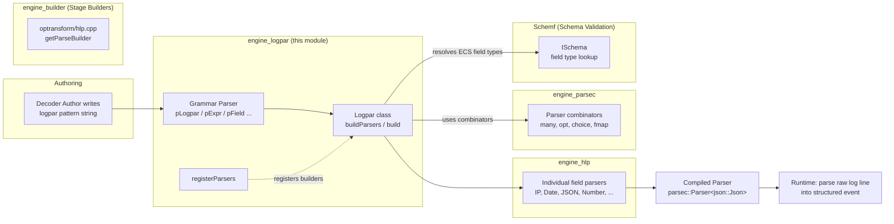
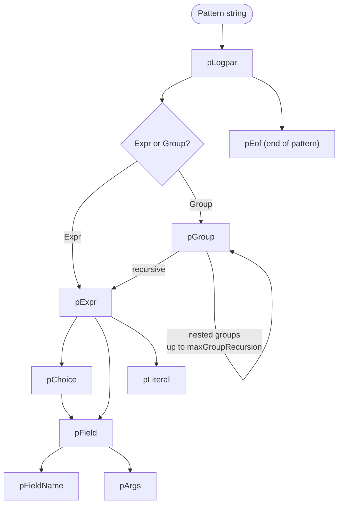
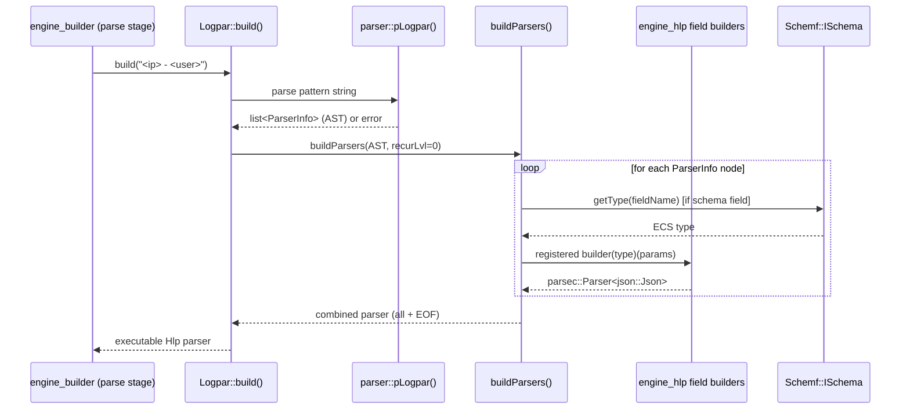

# Engine Logpar Module

## 1. Purpose

The **Logpar** module (`src/engine/source/logpar`) is a small but critical component of the [Wazuh Engine Core (C++)](Wazuh_Engine_Core_(C++).md) responsible for **parsing "logpar" expressions** — a domain-specific mini-language used throughout Wazuh decoders to describe how raw log lines should be broken down into structured fields.

A logpar expression looks like this:

```
<source.ip> - <user.name> [<@timestamp/date/ISO8601>] "<http.request.method> <url.path>"
```

Logpar's job is twofold:

1. **Grammar parsing** — parse the *logpar expression string itself* (the pattern written by decoder authors) into an abstract syntax tree (AST) of literals, fields, choices, and groups.
2. **Parser generation** — compile that AST into an executable [HLP (High-Level Parser)](engine_hlp.md) pipeline (a `parsec::Parser<json::Json>`) that, when run against an actual incoming log line, extracts the described fields into a JSON document.

In short, Logpar turns a *declarative pattern string* into a *composed, runnable parser*, bridging decoder authoring (human-readable patterns) and the engine's low-level parsing primitives.

## 2. Where Logpar Fits in the System

Logpar sits between the **decoder/asset building pipeline** and the **HLP parser primitives**:



- **Upstream caller**: `engine_builder`'s `optransform/hlp.cpp` (the `parse` stage builder) invokes `Logpar::build()` to compile a decoder's `parse|...` pattern into a runnable parser. See [engine_builder](engine_builder.md) (specifically `builder_optransform` sub-module).
- **Downstream dependency**: Logpar does not implement field-level parsing itself; it *delegates* to the field parser builders defined in [engine_hlp](engine_hlp.md) (e.g., `getIPParser`, `getDateParser`, `getJSONParser`, `getLongParser`, etc.), wiring them together via `registerParsers()`.
- **Combinators**: All parser composition (sequencing, optionality, alternation, mapping) is built using primitives from [engine_parsec](engine_parsec.md).
- **Schema awareness**: When a field in a pattern corresponds to a known ECS field (e.g., `source.ip`), Logpar consults the [Schemf (Schema Validation)](Schemf_(Schema_Validation).md) module (`ISchema`) to automatically pick the correct parser type for that field, unless overridden.

## 3. Core Components

| Component | File | Responsibility |
|---|---|---|
| `hlp::ParserType` (enum) & `parserTypeToStr` / `strToParserType` | `logpar.hpp` | Enumerates all supported field parser types (numeric, string, format, encoding, other) and provides string ⇄ enum conversion used both in pattern parsing and schema-type mapping. |
| `hlp::logpar::syntax` (namespace of constants) | `logpar.hpp` | Defines the grammar's special characters: `<`, `>`, `?`, `\`, `/`, `(`, `)`, `~`, `.`, and allowed extended field-name characters. |
| Grammar AST types: `Literal`, `FieldName`, `Field`, `Choice`, `Group`, `ParserInfo` (variant) | `logpar.hpp` | Structured representation of a parsed logpar expression: plain text, a `<field>` capture, a `<a>|<b>` choice, or a `(...)` optional group (possibly nested). |
| Grammar parser combinators: `pChar`, `pNotChar`, `pEscapedChar`, `pRawLiteral(1)`, `pCharAlphaNum`, `pLiteral`, `pArgs`, `pFieldName`, `pField`, `pChoice`, `pExpr`, `pGroup`, `pLogpar`, `pEof<T>` | `logpar.hpp` (declared) / `logpar.cpp` (defined) | Hand-written recursive-descent parser (built with `engine_parsec` combinators) that turns the raw pattern string into the `ParserInfo` AST list defined above. |
| `hlp::logpar::Logpar` (class) | `logpar.hpp` / `logpar.cpp` | The main entry point. Holds the ECS-type→parser-type table, per-field overrides, and the registry of parser builders. Exposes `build()` to compile a pattern string end-to-end into an executable `parsec::Parser<json::Json>`, and `registerBuilder()` to wire in concrete field-parser implementations. |
| `hlp::registerParsers()` | `registerParsers.hpp` | Convenience free function that registers all standard [engine_hlp](engine_hlp.md) parser builders (numeric, string, date, ip, uri, json, xml, csv/dsv, kv, bool, user-agent, file path, alphanumeric, ignore, binary) onto a `Logpar` instance in one call. Typically invoked once at engine startup. |

## 4. Grammar Overview

Logpar expressions are composed of four kinds of elements, matching the `ParserInfo` variant:

- **Literal** — plain text that must match exactly (e.g., `" - "`, `"["`).
- **Field** — `<name>` or `<?name>` (optional) or `<name/parser/arg1/arg2>` to specify parser type/arguments and, optionally, a target field path (dots create nested JSON, e.g. `<source.ip>`). The special name `~` (wildcard) discards the captured value instead of assigning it to a field.
- **Choice** — `<a>|<b>`, tries the left field first, falls back to the right.
- **Group** — `(...)`, an optional (possibly nested, up to `maxGroupRecursion`) sub-sequence of the above elements, e.g. `(<a>:<b>)?` style constructs used for optional trailing sections.



## 5. Compilation Pipeline (`Logpar::build`)

`Logpar::build(logpar)` performs two sequential phases:

1. **Parse the pattern** with `parser::pLogpar()`, producing a `std::list<ParserInfo>` AST. Any grammar error throws a `std::runtime_error` with a formatted trace (via `parsec::formatTrace`).
2. **Compile the AST** with the private `buildParsers()` method (recursively), which:
   - For each **Literal**, builds a literal-matching parser (`buildLiteralParser`) via the registered `P_LITERAL` builder.
   - For each **Field**, resolves the concrete `ParserType` — either from an explicit override (`m_fieldParserOverrides`), an inline argument (`<name/type/...>` for custom, non-schema fields), or by looking up the field's ECS type via `Schemf::ISchema::getType()` and the internal `m_typeParsers` table (`buildFieldParser`). It computes the correct **end tokens** (the literal(s) that terminate the field's capture) by inspecting the *next* element(s) in the AST, including special handling when a group immediately follows a field.
   - For each **Choice**, builds two field parsers and combines them with `hlp::parser::combinator::choice` (`buildChoiceParser`).
   - For each **Group**, recursively compiles its children and wraps the result in `hlp::parser::combinator::opt` (`buildGroupOptParser`), enforcing `m_maxGroupRecursion`.
   - Combines all top-level parsers sequentially with `hlp::parser::combinator::all`.
3. Appends an EOF parser (`hlp::parsers::getEofParser`) to guarantee the whole log line is consumed.

The result is a single `hlp::parser::Parser` (i.e., `parsec::Parser<json::Json>`) that can be invoked repeatedly at runtime against incoming log lines, producing a JSON object with the extracted/typed fields.



## 6. Field Type Resolution Rules

When compiling a `Field` node, Logpar decides which concrete parser to use following this precedence:

1. **Explicit per-field override** — supplied at `Logpar` construction time via the `fieldParserOverrides` JSON config (`/fields/<field>` = parser-type string).
2. **Non-schema (custom) field** — if the field name isn't a known ECS field, the pattern itself may specify the parser as the first argument (`<myField/long>`); if omitted, defaults to `P_TEXT`.
3. **Schema (ECS) field** — the field's ECS type is looked up via `Schemf::ISchema::getType()`, then mapped to a `ParserType` using the internal table (e.g., `BOOLEAN→P_BOOL`, `IP→P_IP`, `DATE→P_DATE`, `KEYWORD/TEXT/WILDCARD→P_TEXT`, `SCALED_FLOAT→P_SCALED_FLOAT`, etc.). Types like `OBJECT`, `NESTED`, and `GEO_POINT` are intentionally unsupported (`ERROR_TYPE`) and raise a runtime error if used directly. Array-typed schema fields are also rejected as unsupported in logpar patterns.

## 7. Relationship to Other Modules

- **[engine_builder](engine_builder.md)** (`builder_optransform` → `optransform/hlp.cpp`): the primary consumer. The `parse` stage builder (`getParseBuilder`) parses the decoder's `parse|` pattern list and calls into `Logpar::build()` for each pattern, chaining fallbacks if multiple patterns are given.
- **[engine_hlp](engine_hlp.md)**: supplies all concrete field parser implementations (`getIPParser`, `getDateParser`, `getJSONParser`, `getXMLParser`, `getCSVParser`, `getKVParser`, `getBoolParser`, `getUAParser`, `getFilePathParser`, `getAlphanumericParser`, `getIgnoreParser`, `getLongParser`, `getDoubleParser`, `getFloatParser`, `getScaledFloatParser`, `getByteParser`, `getBinaryParser`, `getTextParser`, `getLiteralParser`, `getQuotedParser`, `getBetweenParser`, `getUriParser`, `getFQDNParser`). `registerParsers()` in this module is the single place that wires all of them into a `Logpar` instance.
- **[engine_parsec](engine_parsec.md)**: provides the generic parser-combinator primitives (`fmap`, `many`, `many1`, `opt`, `tag`, etc.) that both the grammar parser (`logpar.cpp`) and the compiled field parsers (`hlp::parser::combinator::*`) build upon.
- **[Schemf_(Schema_Validation)](Schemf_(Schema_Validation).md)**: consulted via `ISchema` to resolve ECS field types (`getType`, `hasField`, `isArray`), enabling schema-driven, type-safe field extraction without requiring decoder authors to always specify parser types explicitly.
- **[engine_base](engine_base.md)**: uses `json::Json` (from `engine_base_core_types`) as the structured output type produced by the compiled parser, and `fmt`-based formatting utilities for error messages.

## 8. Error Handling

Logpar is strict and fails fast with descriptive `std::runtime_error` exceptions in the following situations (all surfaced at **build time**, i.e., when a decoder/policy is loaded, not at runtime per-event):

- Malformed pattern syntax (reported with a formatted parse trace pointing to the failure position).
- Unknown/unsupported parser type name in overrides or inline field arguments.
- Reference to an ECS field whose type has no mapped parser (`OBJECT`, `NESTED`, `GEO_POINT`) or which is an array field.
- Exceeding `maxGroupRecursion` (nested optional groups deeper than configured).
- A `Group` not preceded/followed by a resolvable literal end-token when required to disambiguate parsing.
- Requesting a parser type that was never registered via `registerBuilder`/`registerParsers`.

## 9. Summary

Logpar is the **glue** between human-authored log-pattern strings and the engine's composable parsing primitives. It has no sub-modules because its three files form one indivisible unit: grammar definitions and AST types (`logpar.hpp`), the recursive-descent grammar parser and compiler (`logpar.cpp`), and a one-shot registration helper (`registerParsers.hpp`) for wiring in the standard [engine_hlp](engine_hlp.md) parser catalog. Any future field parser type must be both added to `ParserType` here and given a builder function in `engine_hlp`, then registered via `registerParsers()`.
