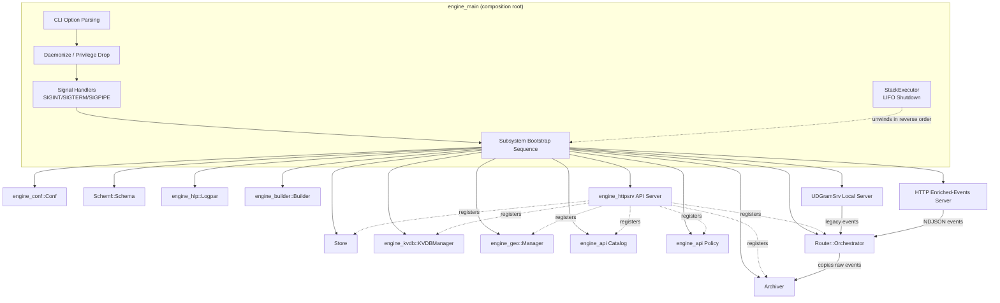
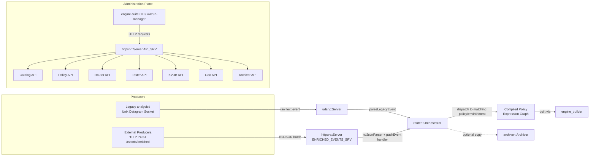
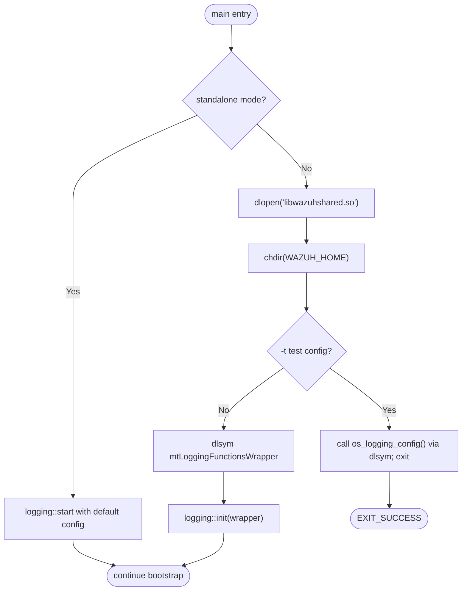
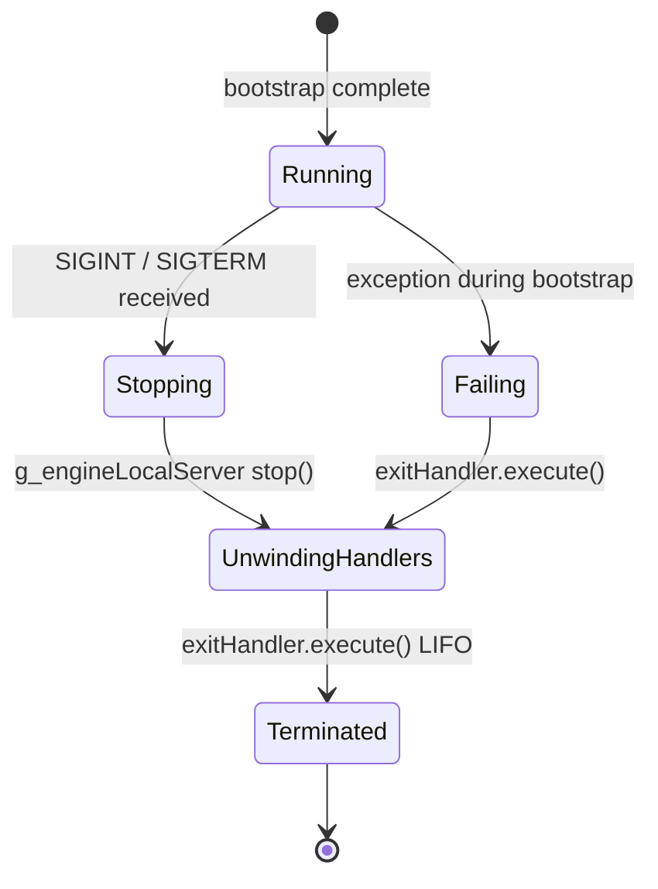

# Engine Main (`engine_main`)

## Introduction

`engine_main` is the **bootstrap and orchestration entry point** of the Wazuh Engine — the modern C++ analysis engine that replaces/augments the legacy `analysisd` pipeline. It lives in a single translation unit, [`src/engine/source/main.cpp`](../src/engine/source/main.cpp), but its responsibility spans the entire lifetime of the `wazuh-engine` process: parsing CLI options, initializing every engine subsystem in the correct dependency order, wiring the public APIs, starting the network servers that receive events and administrative requests, and performing an orderly shutdown when the process is signaled to stop.

Because almost every other Engine module ([engine_base](engine_base.md), [engine_conf](engine_conf.md), [engine_builder](engine_builder.md), [engine_api](engine_api.md), [Router](Router.md), [Store](Store.md), [engine_kvdb](engine_kvdb.md), [engine_geo](engine_geo.md), [Schemf_(Schema_Validation)](Schemf_(Schema_Validation).md), [engine_hlp](engine_hlp.md), [engine_httpsrv](engine_httpsrv.md), [UDGramSrv](UDGramSrv.md), [Queue](Queue.md), [engine_bk](engine_bk.md), [eMessage_Utility](eMessage_Utility.md)) is instantiated and composed here, `engine_main` acts as the **composition root** of the whole C++ Engine. Understanding this module is the fastest way to understand how the Engine's independent building blocks fit together at runtime.

---

## 1. Purpose & Responsibilities

| Responsibility | Description |
|---|---|
| **CLI parsing** | Parses `-f` (foreground), `-t` (test configuration), `-d` (increase debug verbosity), `-h` (help). |
| **Process mode detection** | Detects whether the Engine runs in *standalone* mode or embedded inside the legacy Wazuh manager (`libwazuhshared.so`), and adapts logging/initialization accordingly. |
| **Daemonization** | Forks into the background unless `-f` is given. |
| **Configuration loading** | Instantiates [`conf::Conf`](engine_conf.md) with a `FileLoader` and loads all engine configuration keys. |
| **Signal handling** | Installs handlers for `SIGINT`/`SIGTERM` (graceful stop of the local UDS server) and ignores `SIGPIPE`. |
| **Subsystem bootstrap** | Creates, in dependency order: privilege drop, logging level, Store, KVDB Manager, Geo Manager, Schema, HLP (logpar), Builder, Catalog, Policy Manager, Router/Orchestrator, Archiver. |
| **API wiring** | Creates the HTTP API server and registers handler groups for Catalog, Geo, KVDB, Policy, Router, Tester, and Archiver ([engine_api](engine_api.md)). |
| **Event ingestion servers** | Starts a local Unix-domain socket server ([UDGramSrv](UDGramSrv.md)) for legacy-format events and an HTTP server for enriched/NDJSON events. |
| **PID file management** | Writes the process PID file used by the manager's process-control utilities. |
| **Graceful shutdown** | On exit (normal or exception), unwinds every initialized subsystem via a `StackExecutor` (LIFO exit handler stack). |

---

## 2. High-Level Architecture



---

## 3. Dependency Graph

`engine_main` does not implement business logic itself; it depends on (and glues together) the following modules. See each linked document for internal details.

| Dependency | Role in `engine_main` |
|---|---|
| [engine_base](engine_base.md) | Provides `base::process` (daemonize, privilege separation, PID file), `base::logging`, `base::Event`, singleton locator utilities. |
| [engine_conf](engine_conf.md) | `conf::Conf` + `conf::FileLoader` supply every tunable (`conf::key::*`) used during bootstrap. |
| [Store](Store.md) | `store::Store` backed by `store::drivers::FileDriver`; persists/retrieves all Engine assets (decoders, rules, outputs, schema docs). |
| [engine_kvdb](engine_kvdb.md) | `kvdbManager::KVDBManager` supplies the Key-Value DB engine used by builder helper functions. |
| [engine_geo](engine_geo.md) | `geo::Manager` + `geo::Downloader` provide GeoIP lookups to the builder. |
| [Schemf_(Schema_Validation)](Schemf_(Schema_Validation).md) | `schemf::Schema` validates field types against the indexer mapping schema. |
| [engine_hlp](engine_hlp.md) | `hlp::logpar::Logpar` (High-Level Parsers) registered for log parsing stages. |
| [engine_builder](engine_builder.md) | `builder::Builder` compiles assets (decoders/rules/outputs) into runtime `Expression` graphs, using `BuilderDeps` (logpar, kvdb, geo). |
| [engine_api](engine_api.md) | Catalog, Policy, Router, Tester, Geo, KVDB, Archiver HTTP handler groups registered on the API server. |
| [Router](Router.md) | `router::Orchestrator` — runtime environment manager that runs compiled policies against incoming events; owns the production and test event queues. |
| [engine_bk](engine_bk.md) | `bk::rx::ControllerMaker` — the backend expression-execution controller factory injected into the Router. |
| [Queue](Queue.md) | `base::queue::ConcurrentQueue` (with custom `QueueTraits`) used as the production/test event queues feeding the Router. |
| [engine_httpsrv](engine_httpsrv.md) | `httpsrv::Server` — generic HTTP server used both for the administrative API and the enriched-events HTTP endpoint. |
| [UDGramSrv](UDGramSrv.md) | `udsrv::Server` — Unix datagram socket server that receives legacy-format events from `wazuh-analysisd`'s local socket. |
| Archiver (`archiver::Archiver`, part of [engine_api](engine_api.md) API surface) | Persists raw/forwarded events to disk when enabled. |
| [eMessage_Utility](eMessage_Utility.md) | `eMessage::ShutdownEMessageLibrary()` called during API server shutdown to release protobuf-based message resources. |
| [engine_metrics](engine_metrics.md) *(currently disabled/commented)* | Metrics manager wiring is present but disabled pending unification with the indexer connector. |
| [engine_indexerconnector](engine_indexerconnector.md) *(currently disabled/commented)* | Indexer Connector wiring is present but disabled for the same reason. |

---

## 4. Startup Sequence

The following sequence diagram shows the ordered initialization performed inside `main()`. Order matters: later subsystems consume references to earlier ones (e.g., the `Builder` needs `Store`, `Schema`, `Logpar`, `KVDBManager`, and `GeoManager` already constructed).

```mermaid
sequenceDiagram
    participant OS as OS / Process Manager
    participant Main as engine_main::main
    participant Conf as engine_conf::Conf
    participant Store as Store
    participant KVDB as KVDBManager
    participant Geo as geo::Manager
    participant Schema as schemf::Schema
    participant HLP as hlp::Logpar
    participant Builder as builder::Builder
    participant Catalog as api::catalog::Catalog
    participant Policy as api::policy::Policy
    participant Router as router::Orchestrator
    participant Archiver as archiver::Archiver
    participant API as httpsrv::Server (API)
    participant UDS as udsrv::Server (local events)
    participant HTTPEvt as httpsrv::Server (enriched events)

    OS->>Main: exec wazuh-engine [-f|-t|-d|-h]
    Main->>Main: parseOptions()
    alt standalone mode
        Main->>Main: logging::start()
    else embedded mode
        Main->>Main: dlopen(libwazuhshared.so)
        Main->>Main: chdir(WAZUH_HOME)
        Main->>Main: logging::init(wrapper)
    end
    Main->>Main: goDaemon() (unless -f)
    Main->>Conf: load()
    Main->>Main: install SIGINT/SIGTERM/SIGPIPE handlers
    Main->>Main: privSepSetGroup/User (drop privileges)
    Main->>Main: apply configured log level
    Main->>Store: construct(FileDriver)
    Main->>KVDB: construct + initialize()
    Main->>Geo: construct(Downloader, Store)
    Main->>Schema: construct + load(schema/engine-schema/0)
    Main->>HLP: initTZDB(); construct(overrides, schema); registerParsers()
    Main->>Builder: construct(Store, Schema, Defs, AllowedFields, BuilderDeps)
    Main->>Catalog: construct(Store, Builder)
    Main->>Policy: construct(Store, Builder)
    Main->>Router: construct(Options{threads, Store, Builder, ControllerMaker, queues}); start()
    Main->>Archiver: construct(path, enabled)
    Main->>API: construct("API_SRV")
    Main->>API: registerHandlers(Catalog, Geo, KVDB, Policy, Router, Tester, Archiver)
    Main->>API: start(SERVER_API_SOCKET)
    Main->>UDS: construct(callback -> Orchestrator::postEvent); start(threads)
    Main->>HTTPEvt: construct("ENRICHED_EVENTS_SRV"); addRoute(/events/enriched); start(socket)
    Main->>Main: createPID(pidPath, exeName, pid)
    loop while UDS server running
        Main->>Main: sleep 100ms
    end
    OS-->>Main: SIGINT/SIGTERM
    Main->>UDS: stop()
    Main->>Main: exitHandler.execute() (LIFO unwind)
```

---

## 5. Runtime Data Flow (Event Ingestion)

Once bootstrap completes, `engine_main`'s wiring enables two ingestion paths into the [Router](Router.md), both of which may also feed the Archiver:



The **Router API** and **Tester API** (registered here) allow external tools — e.g. the Python CLI suite in [Engine_Administration_CLI_Tools_(Python)](engine_router.md), [engine_policy](engine_policy.md), [engine_test](engine_test.md), [engine_catalog](engine_catalog.md) — to manage routes, policies, and run test sessions against the running Engine process bootstrapped by this module.

---

## 6. Process Modes: Standalone vs. Embedded

`engine_main` supports two operating modes, detected via `logging::standaloneModeEnabled()`:



* **Standalone mode**: The Engine runs independently with its own logging sink; used for development/testing or for the pure-C++ engine deployment path.
* **Embedded mode**: The Engine binary dynamically loads `libwazuhshared.so` — the legacy C shared library — to reuse the manager's logging pipeline (`mtLoggingFunctionsWrapper`) and configuration reader (`os_logging_config`), keeping log output unified with other daemons documented in [Agent_&_Manager_Native_Daemons_(C)](Agent_&_Manager_Native_Daemons_(C).md).

---

## 7. Signal Handling & Shutdown



* `SIGPIPE` is ignored globally to avoid crashes from broken-pipe conditions inside networking libraries (uvw/libuv).
* `SIGINT`/`SIGTERM` invoke `sigintHandler`, which stops the local `udsrv::Server` (`g_engineLocalServer`); the main loop polls `isRunning()` every 100ms and exits once the server has stopped.
* All resource cleanup (KVDB finalize, Orchestrator stop, API server stop + `eMessage::ShutdownEMessageLibrary()`, enriched-events server stop, logging stop, `dlclose`) is registered incrementally into a `cmd::details::StackExecutor` and executed in **reverse order of registration** — guaranteeing safe teardown regardless of where an exception occurs.

---

## 8. Configuration Keys Consumed

`engine_main` reads a large number of keys from [`conf::Conf`](engine_conf.md) (see `conf::key::*` constants), including but not limited to:

| Category | Example keys |
|---|---|
| Process | `SKIP_USER_CHANGE`, `USER`, `GROUP`, `PID_FILE_PATH` |
| Logging | `STANDALONE_LOGGING_LEVEL`, `LOGGING_LEVEL` |
| Store/KVDB | `STORE_PATH`, `KVDB_PATH` |
| HLP | `TZDB_PATH`, `TZDB_AUTO_UPDATE`, `TZDB_FORCE_VERSION_UPDATE` |
| Router/Queues | `ORCHESTRATOR_THREADS`, `QUEUE_SIZE`, `QUEUE_FLOOD_FILE`, `QUEUE_FLOOD_ATTEMPS`, `QUEUE_FLOOD_SLEEP`, `QUEUE_DROP_ON_FLOOD` |
| Archiver | `ARCHIVER_PATH`, `ARCHIVER_ENABLED` |
| Servers | `SERVER_API_SOCKET`, `SERVER_API_TIMEOUT`, `SERVER_EVENT_SOCKET`, `SERVER_EVENT_THREADS`, `SERVER_ENRICHED_EVENTS_SOCKET` |
| Metrics/Indexer *(currently disabled)* | `METRICS_*`, `INDEXER_*` |

Refer to [engine_conf](engine_conf.md) for the full key catalogue and loading mechanics.

---

## 9. Key Types Defined in This Module

| Component | Description |
|---|---|
| `Options` | Simple struct holding parsed CLI flags: `runForeground`, `testConfig`, `debugCount`. |
| `QueueTraits` | A `moodycamel::ConcurrentQueueDefaultTraits` specialization (custom `BLOCK_SIZE`/`IMPLICIT_INITIAL_INDEX_SIZE`) used to tune the production event queue defined in [Queue](Queue.md). |
| `sigintHandler` | Signal handler function stopping the global `udsrv::Server` instance (`g_engineLocalServer`). |
| `main` | The process entry point implementing the full bootstrap/shutdown sequence described above. |

---

## 10. How This Module Fits Into the Overall System

`engine_main` produces the running `wazuh-engine` process, which is one of several cooperating processes/daemons in the broader Wazuh architecture:

* Agents and the legacy `wazuh-analysisd`/`remoted` pipeline ([Agent_&_Manager_Native_Daemons_(C)](Agent_&_Manager_Native_Daemons_(C).md)) forward events to the Engine's local Unix socket, bootstrapped here via [UDGramSrv](UDGramSrv.md).
* The [API_&_Management_Framework_(Python)](api_core_infrastructure.md) (Wazuh API/Framework) and the [Engine_Administration_CLI_Tools_(Python)](engine_router.md) communicate with the Engine's HTTP API server (also bootstrapped here) to manage catalog assets, policies, routes, and to run tests.
* Compiled policies produced by [engine_builder](engine_builder.md) execute inside the [Router](Router.md)'s environments, which this module starts and owns for the lifetime of the process.
* Downstream, alerts/results flow toward the indexer via the (currently disabled-in-this-file) Indexer Connector wiring — see [engine_indexerconnector](engine_indexerconnector.md) — and archived raw events are persisted via the `Archiver`.

In short, `engine_main` is the **single place to look** when answering "in what order are Engine subsystems created, and how do they reference each other at runtime?"
