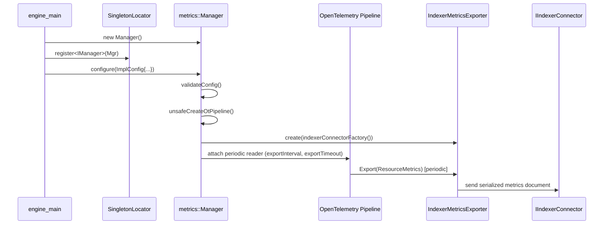
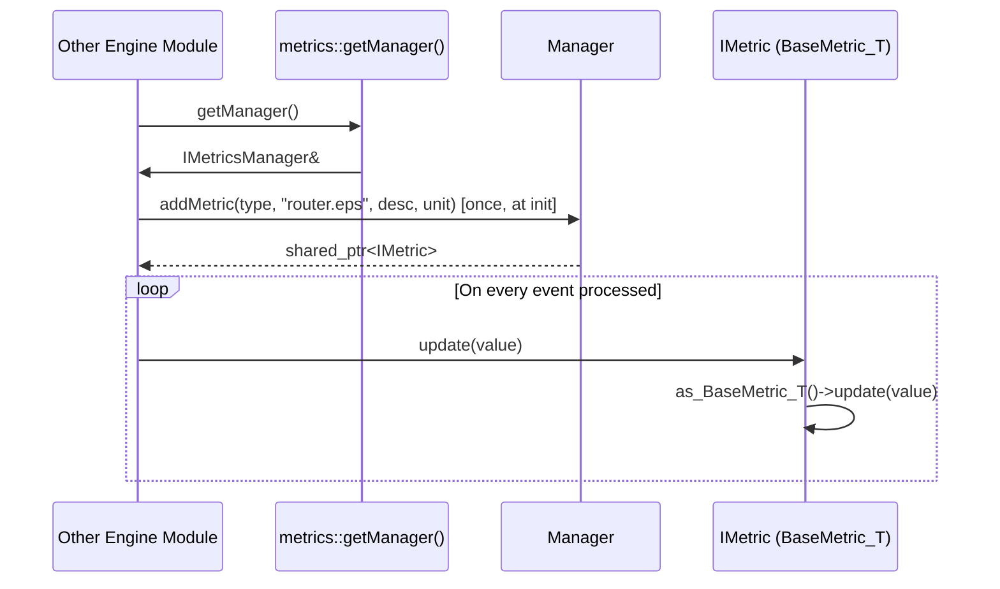

# Engine Metrics Module

## 1. Introduction & Purpose

The **Engine Metrics** module is the observability backbone of the Wazuh Engine (`src/engine`). It provides a
lightweight, thread-safe façade over [OpenTelemetry](https://opentelemetry.io/) metric primitives, allowing every
other Engine component (router, builder, KVDB, HTTP server, etc.) to register, update, enable/disable and export
counters and histograms **without depending on OpenTelemetry types directly**.

Its main responsibilities are:

- Expose a small, stable **interface** (`IManager` / `IMetric`) that the rest of the Engine codebase depends on,
  decoupling business logic from the underlying telemetry SDK.
- Provide a concrete **`Manager`** implementation that creates/destroys the OpenTelemetry metrics pipeline,
  keeps a registry of named metrics (`module.metric` dot-path convention), and allows runtime enable/disable of
  individual metrics or whole modules.
- Periodically **export** collected metrics to the Wazuh Indexer through the `IndexerMetricsExporter`, reusing the
  `IIndexerConnector` abstraction defined in the `engine_indexerconnector` module.

Because the Engine follows a **Singleton Locator** pattern for cross-cutting services, `IManager` is registered once
at process start-up (see `engine_main`) and retrieved anywhere in the code via `metrics::getManager()`.

## 2. Architecture Overview

The module is intentionally small (4 header files) and is split into two conceptual layers:

1. **Interface layer** — pure abstract contracts with zero OpenTelemetry dependency, safe to include from any
   Engine subsystem.
2. **Implementation layer** — the concrete `Manager` and the `IndexerMetricsExporter`, which are the only pieces
   that touch the OpenTelemetry SDK (`otsdk`) and the Indexer Connector.

```mermaid
graph TB
    subgraph "Interface Layer (metrics/interface)"
        IManager["IManager / IMetricsManager<br/>(imanager.hpp)"]
        IMetric["IMetric / BaseMetric&lt;T&gt;<br/>(imetric.hpp)"]
    end

    subgraph "Implementation Layer (metrics/src, metrics/include)"
        Manager["Manager<br/>(manager.hpp)"]
        Exporter["IndexerMetricsExporter<br/>(indexerMetricsExporter.hpp)"]
    end

    subgraph "External Dependencies"
        OT["OpenTelemetry SDK<br/>(otsdk::*)"]
        Indexer["IIndexerConnector<br/>(engine_indexerconnector)"]
        Singleton["SingletonLocator<br/>(engine_base)"]
        DotPath["DotPath<br/>(engine_base)"]
    end

    Manager -->|implements| IManager
    Manager -->|manages instances of| IMetric
    Manager -->|creates & owns| Exporter
    Exporter -->|pushes data via| Indexer
    Exporter -->|implements| OT
    Manager -->|drives| OT
    IManager -->|located through| Singleton
    IManager -->|keys metrics by| DotPath

    Consumers["Other Engine Modules<br/>(router, builder, kvdb, httpsrv, ...)"] -->|metrics::getManager()| IManager
    Consumers -->|IMetric::update(value)| IMetric
```

### Key design decisions

| Decision | Rationale |
|---|---|
| Split `IManager`/`IMetric` from `Manager` | Consumers only need the interface headers, avoiding a hard dependency on OpenTelemetry and the Indexer Connector for the vast majority of the codebase. |
| `DotPath` naming (`module.metric`) | Enables hierarchical enable/disable (`enableModule`/`disableModule`) without a nested registry. |
| Template `update<T>()` on `IMetric` | Lets callers use a single dynamic type (`IMetric`) while still getting type-safe updates via a runtime `dynamic_pointer_cast` to `BaseMetric<T>`. |
| `shared_mutex` in `Manager` | Metrics are read (updated) far more often than they are (re)configured, so a reader/writer lock optimizes the hot update path. |
| Export via `IIndexerConnector` | Reuses the same resilient, secured connection logic already built for indexing security events, avoiding a second HTTP client implementation. |

## 3. Core Components

### 3.1 `IManager` / `IMetricsManager` (Interface)
*File: `src/engine/source/metrics/interface/metrics/imanager.hpp`*

- `IMetricsManager` defines the minimal read/write contract: `addMetric()` and `getMetric()`.
- `IManager` extends it with lifecycle operations: `configure()`, `enable()`/`disable()` (global),
  `isEnabled()` (global or per-metric), `reload()` (hot config swap), and `enableModule()`/`disableModule()`
  (bulk toggle by dot-path prefix).
- `IManager::Config` is an empty polymorphic base that concrete managers extend (see `Manager::ImplConfig`).
- The free function `metrics::getManager()` resolves the singleton instance registered through
  `SingletonLocator` (from the `engine_base` module), throwing if the manager was never instantiated —
  this is the primary entry point used by all other Engine modules.

### 3.2 `IMetric` / `BaseMetric<T>` (Interface)
*File: `src/engine/source/metrics/interface/metrics/imetric.hpp`*

- `MetricType` enumerates the supported OpenTelemetry instrument kinds: `UINTCOUNTER`, `DOUBLECOUNTER`,
  `UINTHISTOGRAM`, `DOUBLEHISTOGRAM`, `INTUPDOWNCOUNTER`.
- `IMetric` is the type-erased handle returned to consumers. Its templated `update<T>(value)` method internally
  downcasts (via `enable_shared_from_this` + `dynamic_pointer_cast`) to `detail::BaseMetric<T>` and forwards the
  call — this is the mechanism that lets `Manager::addMetric()` return a single common type regardless of the
  concrete OpenTelemetry instrument wrapped underneath.
- `detail::IManagedMetric` (internal, not part of the public interface) adds lifecycle hooks
  (`create()`, `destroy()`, `enable()`, `disable()`, `isEnabled()`) that only the `Manager` needs to invoke.
- `detail::BaseMetric<T>` is the templated abstract base that concrete metric wrapper classes (instantiated
  internally by `Manager`, not shown among the core components) implement for `T = uint64_t` or `T = double`.

### 3.3 `Manager` (Implementation)
*File: `src/engine/source/metrics/include/metrics/manager.hpp`*

- Concrete singleton-friendly implementation of `IManager`.
- `ImplConfig` (extends `IManager::Config`) carries:
  - `indexerConnectorFactory`: a factory function producing `std::shared_ptr<IIndexerConnector>` lazily, so the
    Manager does not need to know how the connector is constructed (decoupling from `engine_indexerconnector`
    internals).
  - `exportInterval` / `exportTimeout`: control how often the OpenTelemetry periodic exporter pushes data and how
    long it waits for the push to complete.
  - `logLevel`: verbosity used by the internal OpenTelemetry pipeline logger (see the `engine_base` module).
- Internally keeps `m_metrics`, an `unordered_map<DotPath, shared_ptr<IManagedMetric>>` protected by a
  `shared_mutex` (`m_mutex`), plus an `m_enabled` flag for the global on/off switch.
- Private `unsafe*` methods (`unsafeEnable`, `unsafeDisable`, `unsafeConfigure`, `unsafeCreateOtPipeline`,
  `unsafeDestroyOtPipeline`, `unsafeEnabled`) implement the actual logic assuming the lock is already held,
  while the public methods acquire the appropriate (shared or exclusive) lock before delegating — a common
  pattern to avoid deadlocks/duplication between read and write paths.
- `configure()` validates the config (`validateConfig`) and (re)builds the OpenTelemetry pipeline
  (`unsafeCreateOtPipeline`/`unsafeDestroyOtPipeline`), wiring the `IndexerMetricsExporter` as the pipeline's
  push exporter.
- `addMetric()` / `getMetric()` implement the `IMetricsManager` contract, creating a concrete metric wrapper
  based on `MetricType` and registering it under its `DotPath` name.
- `reload()` allows swapping the whole configuration (e.g. changing export interval, or the indexer connector)
  without restarting the Engine process.

### 3.4 `IndexerMetricsExporter` (Implementation)
*File: `src/engine/source/metrics/src/exporter/indexerMetricsExporter.hpp`*

- A concrete `otsdk::PushMetricExporter` that the `Manager` plugs into the OpenTelemetry periodic-export
  pipeline.
- Wraps a `std::shared_ptr<IIndexerConnector>` (throws at construction time if null) and forwards serialized
  metric batches to the Wazuh Indexer through that connector — reusing the exact same resilient
  indexing/connection logic used elsewhere in the Engine (see the `engine_indexerconnector` module).
- Implements the four methods required by the OpenTelemetry SDK contract:
  - `Export(const ResourceMetrics&)`: serializes and sends one batch of collected metrics.
  - `GetAggregationTemporality(InstrumentType)`: reports which aggregation temporality (delta/cumulative) this
    exporter expects for a given instrument type.
  - `ForceFlush(timeout)`: best-effort flush of any buffered/in-flight data.
  - `Shutdown(timeout)`: releases exporter resources during pipeline teardown.

## 4. Data & Control Flow

### 4.1 Initialization / Configuration



### 4.2 Runtime Metric Update (hot path)



### 4.3 Enable / Disable Semantics

```mermaid
flowchart LR
    A["enable() / disable()"] --> B{"Global flag m_enabled"}
    C["enableModule(name) / disableModule(name)"] --> D{"Iterate m_metrics<br/>matching DotPath prefix"}
    D --> E["Toggle each matching<br/>IManagedMetric::enable/disable"]
    B --> F["isEnabled&#40;&#41; overall check"]
    D --> G["isEnabled&#40;name&#41; per-metric check"]
```



## 5. Integration with the Rest of the System

| Consumer / Dependency | Relationship |
|---|---|
| `engine_base` module | Supplies `DotPath` (metric naming), `logging::Level` (`ImplConfig::logLevel`), and the `SingletonLocator` mechanism used to publish/retrieve the `IManager` instance. |
| `engine_indexerconnector` module | Provides `IIndexerConnector`, the transport used by `IndexerMetricsExporter` to persist metric batches into the Wazuh Indexer. `Manager::ImplConfig::indexerConnectorFactory` decouples metric configuration from connector construction details. |
| `engine_main` | Owns the Manager's lifecycle: instantiates it, registers it with `SingletonLocator`, calls `configure()` at start-up and `reload()` on configuration changes, and disposes of it at shutdown. |
| `Router` module | Uses `metrics::getManager()` to publish EPS (events-per-second) and per-environment counters (see `EpsCounter`), a primary consumer of this module's public interface. |
| Other Engine subsystems (`engine_builder`, `engine_kvdb`, `engine_httpsrv`, `engine_api`, etc.) | May call `metrics::getManager().addMetric(...)` / `IMetric::update(...)` to instrument their own operations without any compile-time dependency on OpenTelemetry or the Indexer Connector. |

## 6. Summary of Files

| File | Core Components | Role |
|---|---|---|
| `interface/metrics/imanager.hpp` | `Config`, `IManager` (+ `IMetricsManager`, `getManager()`) | Public contract for configuring, enabling/disabling and reloading the metrics subsystem. |
| `interface/metrics/imetric.hpp` | `BaseMetric<T>` (+ `IMetric`, `MetricType`, `IManagedMetric`) | Public contract for individual metrics and internal lifecycle hooks. |
| `include/metrics/manager.hpp` | `ImplConfig`, `Manager` | Concrete, thread-safe implementation backed by OpenTelemetry. |
| `src/exporter/indexerMetricsExporter.hpp` | `IndexerMetricsExporter` | OpenTelemetry push exporter that ships metric batches to the Wazuh Indexer. |

## 7. Notes for Maintainers

- Any change to the `IManager`/`IMetric` interfaces has a wide blast radius since virtually every Engine
  subsystem depends on `metrics::getManager()`; prefer additive changes over breaking signature changes.
- The `Manager` is **not** copyable or movable (deleted copy/move constructors) — it is meant to be constructed
  once and accessed through the `SingletonLocator`.
- Only `uint64_t` and `double` are supported as metric value types (`BaseMetric<T>` template), matching the
  OpenTelemetry instrument value types used by counters and histograms.
- Because `IndexerMetricsExporter` throws on construction if given a null connector, callers of
  `Manager::configure()` must ensure `ImplConfig::indexerConnectorFactory` never returns `nullptr` once metrics
  export is enabled.
