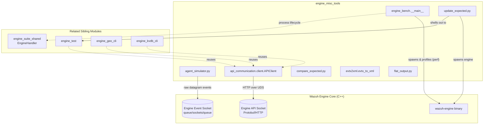
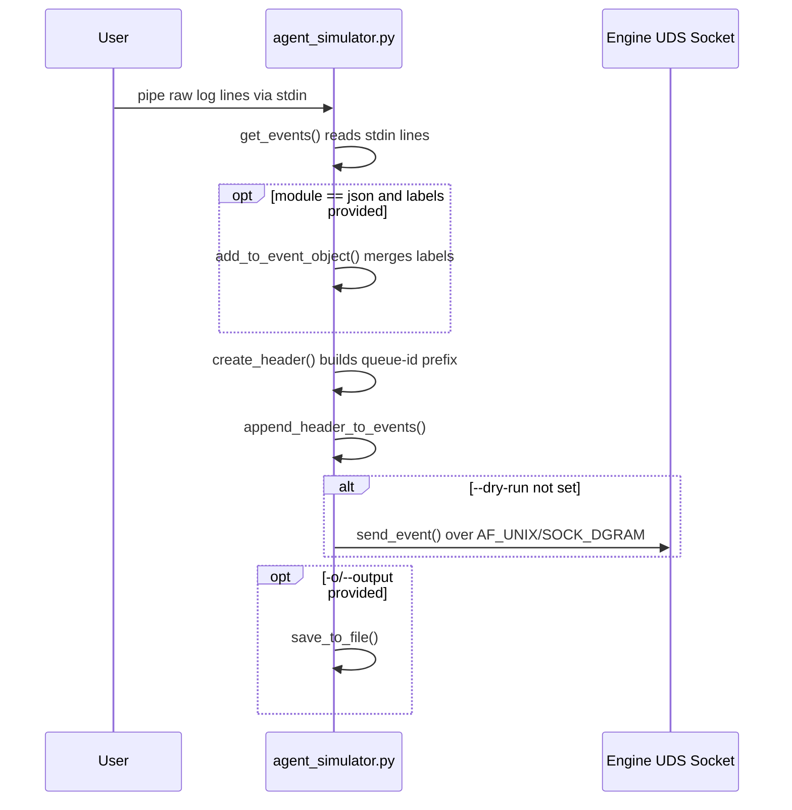
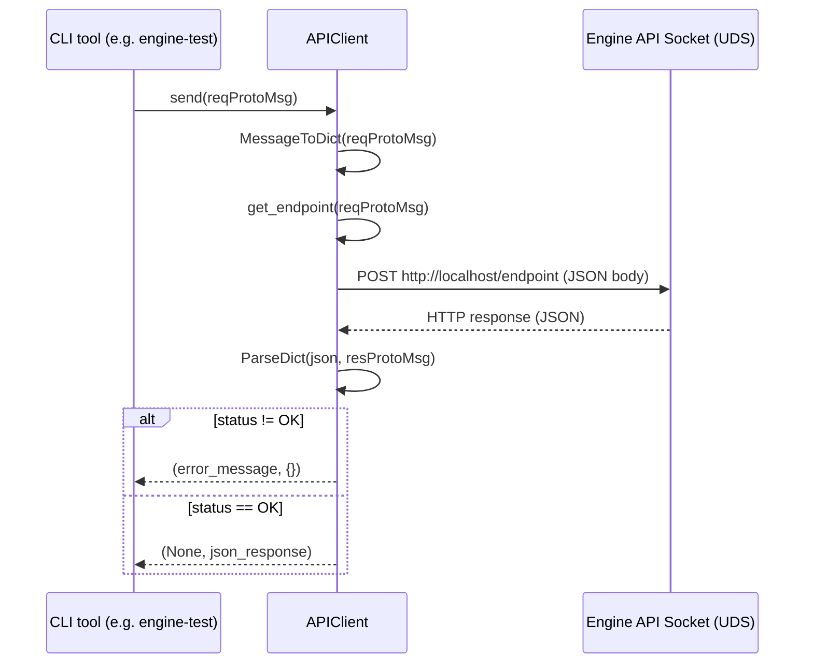
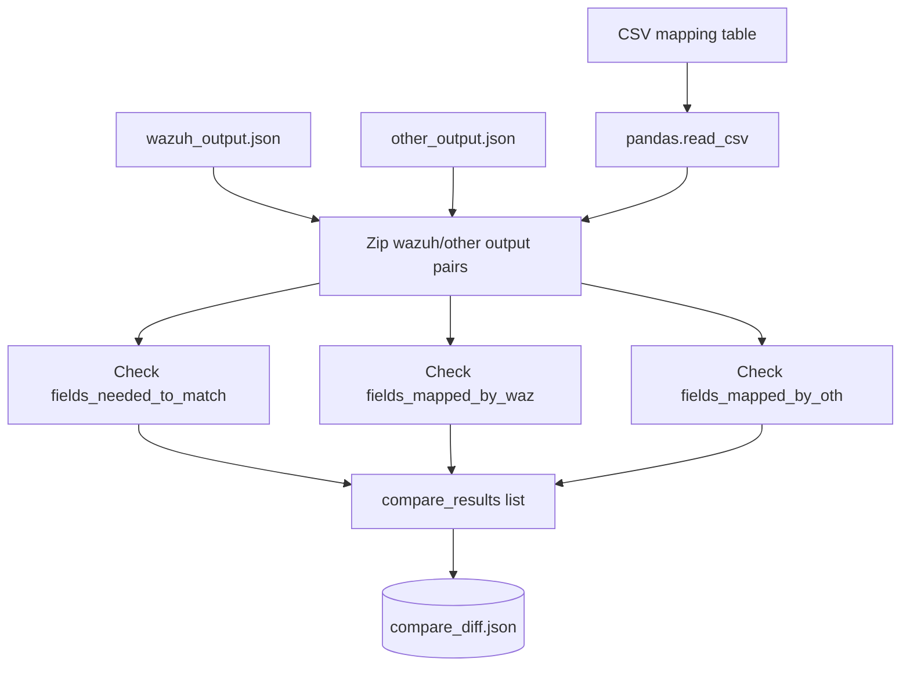
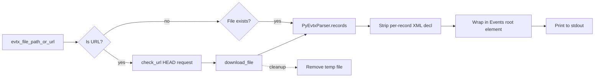
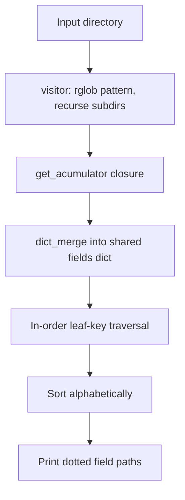
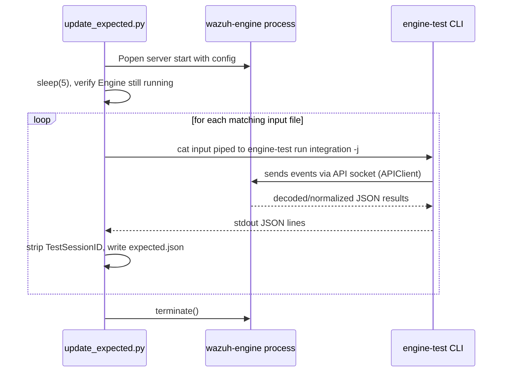

# Engine Misc Tools

## 1. Purpose

`engine_misc_tools` is a loose collection of small, standalone Python utilities that support the
development, testing, benchmarking, and diagnostics of the **Wazuh Engine** (see
[`Wazuh_Engine_Core_(C++)`](Wazuh_Engine_Core_(C++).md)). Unlike the structured CLI suites found in
`engine-suite` (documented separately, e.g. [`engine_test.md`](engine_test.md),
[`engine_suite_shared.md`](engine_suite_shared.md), [`engine_geo_cli.md`](engine_geo_cli.md),
[`engine_kvdb_cli.md`](engine_kvdb_cli.md)), the tools in this module live directly under
`src/engine/tools/` and are typically invoked ad-hoc by engineers and CI pipelines rather than
packaged as installable console commands.

Each tool addresses a distinct, self-contained problem:

| Tool | File | Responsibility |
|---|---|---|
| Agent Simulator | `agent_simulator.py` | Crafts and injects synthetic agent events (with Wazuh queue headers) directly into the Engine's Unix socket, simulating `logcollector`/`remote-syslog` traffic. |
| API Communication Client | `api-communication/src/api_communication/client.py` | Reusable low-level HTTP-over-Unix-socket client (`APIClient`) for talking to the Engine's Protobuf-based HTTP API. |
| Expected-Output Comparator | `compare_expected.py` | Diffs two sets of JSON "expected results" (e.g. Wazuh vs. a third-party reference) field-by-field, guided by a CSV mapping table. |
| Engine Benchmark | `engine-bench/src/engine_bench/__main__.py` | Drives the Engine binary under `perf record`, then produces a flamegraph SVG for CPU profiling. |
| EVTX → XML Converter | `evtx2xml/evtx2xml/evtx_to_xml.py` | Converts Windows `.evtx` binary event log files (local or downloaded via URL) into a single well-formed XML document. |
| Output Flattener | `flat_output.py` | Recursively merges/flattens a directory of expected-output JSON files into a sorted list of dotted field paths — useful for schema/field-coverage analysis. |
| Expected-Output Updater | `update_expected.py` | Regenerates "golden" expected JSON files by piping sample inputs through a running Engine instance via `engine-test`. |

These tools are consumed primarily by **engine developers and QA/CI processes** validating decoder/parser
behavior, engine performance, and cross-tool output parity — they are not part of the production runtime.

## 2. Architecture Overview

The tools are independent entry points; none of them import from one another. Their only meaningful
internal reuse is that several testing utilities operate on the same "expected output JSON" convention
produced by the Engine's `engine-test` tool (see [`engine_test.md`](engine_test.md)), and the benchmarking
tool reuses the shared `EngineHandler` process-management helper from
[`engine_suite_shared.md`](engine_suite_shared.md). The `APIClient` is also the same client class reused
by the `engine-test`/`engine-*` CLI suites for protobuf/HTTP communication with the Engine API socket.



### Categorization

For clarity, the seven tools can be grouped into three functional clusters (documented in detail below):

1. **Engine Interaction Tools** — talk directly to a live Engine process (socket or API).
   - Agent Simulator (`agent_simulator.py`)
   - API Communication Client (`api_communication/client.py`)
   - Engine Benchmark (`engine_bench`)
2. **Test-Expectation Workflow Tools** — operate on JSON files produced by `engine-test` runs, entirely
   offline (no live Engine required, except for `update_expected.py` which starts one).
   - Expected-Output Comparator (`compare_expected.py`)
   - Output Flattener (`flat_output.py`)
   - Expected-Output Updater (`update_expected.py`)
3. **Format Conversion Tools** — pure data-format utilities, no Engine dependency.
   - EVTX → XML Converter (`evtx2xml`)

## 3. Tool Details

### 3.1 Agent Simulator (`agent_simulator.py`)

**Purpose**: Emulates a Wazuh agent (or `logcollector`/`remote-syslog` module) by reading raw log lines
from `stdin`, wrapping them in the correct Wazuh internal queue protocol header, and sending them as UDP
datagrams to the Engine's Unix domain socket (default `/var/ossec/queue/sockets/queue`). This lets
developers inject arbitrary test events without running a full agent.

**Core function**: `main()`

**Key internal helpers** (not separately listed as core components, but essential to the flow):
- `get_queue_from_module(module)` — maps a logical module name (`syslog`, `json`, `eventchannel`,
  `command`, `fim`, `syscollector`, etc.) to its corresponding Wazuh internal queue ID byte.
- `create_header(...)` — builds the `<queue_id>:[<agent_id>] (<agent_name>) <agent_ip>-><location>:`
  prefix (or the simplified `<queue_id>:<syslog_ip>:` form for remote-syslog) that the Engine/analysisd
  protocol expects.
- `add_to_event_object(events_list, labels)` — for the `json` sub-module, merges a user-supplied JSON
  `labels` object into each event's `event` key (creating an `event.original` wrapper if the input isn't
  already JSON).
- `send_event(event_list, socket_address)` — opens an `AF_UNIX`/`SOCK_DGRAM` socket and sends each
  formatted event.
- `save_to_file(...)` / `get_events()` — optional persistence and stdin collection helpers.

**CLI shape** (argparse):
```
agent_simulator.py [-i AGENT_ID] [-n AGENT_NAME] [-a AGENT_IP] [--dry-run]
                   [-e ENGINE_SOCKET] [-o OUTPUT_FILE]
                   {logcollector,remote-syslog} ...
```
- `logcollector` subcommand requires `-L/--location` and a further module subcommand
  (`audit`, `command`, `eventchannel`, `eventlog`, `full_command`, `json` [+ `-l/--labels`], `macos`,
  `multi_line`, `multi_line_regex`, `mysql_log`, `syslog`).
- `remote-syslog` subcommand requires `-R/--remote_ip`.

**Data flow**:


### 3.2 API Communication Client (`api_communication/client.py`)

**Purpose**: Provides `APIClient`, a thin wrapper around `httpx` configured to speak HTTP over a Unix
Domain Socket transport (`httpx.HTTPTransport(uds=...)`), used to interact with the Engine's Protobuf/JSON
HTTP API (the same API surface consumed by `engine_api` in
[`Wazuh_Engine_Core_(C++)`](Wazuh_Engine_Core_(C++).md) and by every `engine-*` CLI tool, e.g.
[`engine_test.md`](engine_test.md), [`engine_geo_cli.md`](engine_geo_cli.md),
[`engine_kvdb_cli.md`](engine_kvdb_cli.md), [`engine_catalog.md`](engine_catalog.md)).

**Core component**: `APIClient`

**Key methods**:
- `send_recv(message: Message)` — converts a protobuf `Message` to a JSON dict (`MessageToDict`),
  resolves the target endpoint via `get_endpoint(message)`, POSTs it, and returns the raw JSON response.
- `jsend(json_body, reqProtoMsg, resProtoMsg=GenericStatus_Response())` — lower-level send that accepts a
  pre-built JSON body, parses the response back into a protobuf message, and treats a non-`OK`
  `ReturnStatus` as an application-level error (returning `(error_message, {})`).
- `send(reqProtoMsg, resProtoMsg=GenericStatus_Response())` — convenience wrapper: converts the request
  message to a dict and delegates to `jsend`.
- `_set_error_msg(error)` — normalizes `httpx` exception hierarchies (`TimeoutException`,
  `NetworkError`, and subclasses) into human-readable strings.

**Error handling contract**: every public method returns a `Tuple[Optional[str], dict]` — `(error, {})`
on failure, `(None, response_json)` on success — which is the convention every consumer (`engine-test`,
`engine-geo`, `engine-kvdb`, etc.) relies on.



### 3.3 Engine Benchmark (`engine_bench/__main__.py`)

**Purpose**: Automates a CPU-profiling session of a running Engine binary using Linux `perf`, producing a
flamegraph SVG for performance analysis.

**Core function**: `main()` (Click command)

**Flow**:
1. Verifies `perf` is installed (`is_perf_available()`) and that the script is running with root
   privileges (required by `perf record`).
2. Prepares the output directory.
3. Starts the Engine process using `EngineHandler` (shared helper documented in
   [`engine_suite_shared.md`](engine_suite_shared.md)), pointing at `config.env` inside the given
   environment directory, and logs to `logs/engine.log`.
4. Runs `perf record -g -p <engine_pid> -o perf.data` in the background, sleeps 10 seconds to collect
   samples, then stops the Engine.
5. Post-processes with `perf script`, then Perl scripts `stackcollapse-perf.pl` and `flamegraph.pl`
   (bundled resources under `engine_bench.scripts`) to produce `flamegraph.svg`.

**CLI shape**:
```
engine-bench --environment <env_dir> --output <output_dir>
```


### 3.4 Expected-Output Comparator (`compare_expected.py`)

**Purpose**: Compares two arrays of JSON "expected output" objects (one produced by the Wazuh Engine,
one by another/reference system) field-by-field, using a CSV metadata table that defines, per field: (a)
whether Wazuh maps it, (b) whether the other system maps it, (c) whether the two values must match
exactly, and (d) an optional "direct" field-name override for the other system's equivalent field.

**Core functions**:
- `need_to_match(field, df)`, `need_by_waz(field, df)`, `need_by_oth(field, df)` — CSV row lookups
  returning boolean flags for a given dotted field path.
- `get_value(field, expected)` — resolves a dotted path (`a.b.c`) inside a nested dict.
- `fields_mapped_by_waz(df)`, `fields_mapped_by_oth(df)`, `fields_needed_to_match(df)` — generators
  yielding field names satisfying the corresponding CSV flag.
- `get_direct(field, df)` — returns the CSV "direct" override field name (the equivalent field name in
  the *other* system), or `None` if the field name is identical in both.

**CLI shape**:
```
compare_expected.py <table.csv> <wazuh_output.json> <other_output.json>
                     [-o OUTPUT] [-e/--extra] [-m/--missing]
```

**Output**: a JSON array (default `/tmp/compare_expected/compare_diff.json`), one entry per compared
output pair, containing:
- `original` — the `event.original` value for traceability.
- `need_to_match` — fields whose Wazuh/other values differ despite both being required to match.
- `need_by_waz` / `need_by_oth` — fields missing in Wazuh/other output (when `-m` is set).
- `wazuh_extra` / `other_extra` — fields present only in Wazuh/other output (when `-e` is set).



### 3.5 EVTX → XML Converter (`evtx2xml/evtx_to_xml.py`)

**Purpose**: Converts a Windows `.evtx` binary event-log file into a single, well-formed XML document
wrapping all individual `<Event>` records inside an `<Events>` root — useful for feeding Windows event
samples into engine decoder/HLP tests (see [`engine_hlp_domain_parsers.md`](engine_hlp_domain_parsers.md)
for the parser that ultimately consumes such data) without needing a live Windows host.

**Core function**: `main()`

**Supporting helpers**:
- `evtx_to_xml(evtx_file_path)` — uses the `PyEvtxParser` (from the external `evtx` Python binding) to
  iterate records, strips each record's individual XML declaration via regex, and prints the concatenated
  `<Events>...</Events>` document to stdout.
- `check_url(url)` / `download_file(url, local_filename)` — allow the input to be specified as an HTTP(S)
  URL; the file is downloaded to a temporary local path and cleaned up afterward.

**CLI shape**:
```
evtx2xml.py <evtx_file_path_or_url>
```
Accepts either a local filesystem path or a URL (auto-detected via `urlparse`).



### 3.6 Output Flattener (`flat_output.py`)

**Purpose**: Recursively walks a directory of JSON files (each containing an array of "expected output"
objects), deep-merges all of them into a single dict, then prints every leaf field as a sorted, dotted
path — a quick way to audit which fields ever appear across a large test corpus (optionally scoped to a
single root key, e.g. only `wazuh` or only a specific integration's namespace).

**Core function**: `get_acumulator(fields, key)` — returns a closure (`acumulator(file)`) suitable for use
as the `visit` callback of the generic `visitor(path, pattern, visit)` recursive file-walker. For each
JSON file:
- Validates the top-level structure is a list.
- If `key` is non-empty, merges each entry's `expected[key]` sub-dict into the shared `fields`
  accumulator (via `dict_merge`); otherwise merges the whole entry.

**CLI shape**:
```
flat_output.py <path> <glob_pattern> [-r/--root ROOT_FIELD]
```
After accumulation, the script performs an in-order traversal of the merged dict, printing every leaf key
path (e.g. `event.original`, `wazuh.decoders.name`) sorted alphabetically.



### 3.7 Expected-Output Updater (`update_expected.py`)

**Purpose**: Regenerates the "golden" expected-output JSON fixtures used by engine integration tests. It
starts a real Engine instance, then for every matching input file under a directory, pipes its contents
through `engine-test run <integration> ... -j` (see [`engine_test.md`](engine_test.md)) and writes the
resulting per-line JSON objects (with the ephemeral `TestSessionID` field stripped) to a corresponding
`*_expected.json` output file.

**Core function**: `get_executor(test_command, output)` — returns a closure (`executor(file)`) used as the
`visit` callback of the same generic `visitor` file-walker as `flat_output.py`. For each input file:
1. Builds the shell command `cat <file> | <test_command>`.
2. Executes it via `subprocess.run(..., shell=True, capture_output=True, check=True)`.
3. Parses each stdout line as JSON, removes the `TestSessionID` key, and collects the results.
4. Writes the pretty-printed JSON array to `<output>/<input_stem_with_expected>.json`.

**CLI shape**:
```
update_expected.py <environment> <path> <glob_pattern> <test_integration>
                    <test_integration_conf_file> [-o OUTPUT] [-b/--binary ENGINE_BINARY]
```

**Orchestration** (in `__main__`):
1. Resolves paths and builds the `engine-test run ...` command string.
2. Launches the Engine binary directly via `subprocess.Popen([binary, '--config', config_path, 'server',
   'start'])`, waits 5 seconds, and verifies it is still running.
3. Runs the `visitor`/`get_executor` pipeline over all matching input files.
4. Terminates the Engine process.



## 4. Cross-Module Relationships

| This module's tool | Depends on / relates to | See documentation |
|---|---|---|
| `api_communication.client.APIClient` | Reused by every `engine-*` CLI (protobuf/HTTP over the Engine API socket exposed by `engine_api`) | [`engine_test.md`](engine_test.md), [`engine_geo_cli.md`](engine_geo_cli.md), [`engine_kvdb_cli.md`](engine_kvdb_cli.md), [`engine_catalog.md`](engine_catalog.md), [`Wazuh_Engine_Core_(C++).md`](Wazuh_Engine_Core_(C++).md) |
| `agent_simulator.py` | Sends events using the same wire protocol/queue IDs consumed by the native `logcollector`/`analysisd`/Engine ingestion pipeline | [`Agent_&_Manager_Native_Daemons_(C).md`](Agent_&_Manager_Native_Daemons_(C).md), [`Wazuh_Engine_Core_(C++).md`](Wazuh_Engine_Core_(C++).md) |
| `engine_bench` | Uses `EngineHandler` process manager | [`engine_suite_shared.md`](engine_suite_shared.md) |
| `update_expected.py` | Shells out to `engine-test run` | [`engine_test.md`](engine_test.md) |
| `compare_expected.py`, `flat_output.py`, `update_expected.py` | All operate on the JSON "expected output" convention produced by `engine-test` | [`engine_test.md`](engine_test.md) |

## 5. Summary

`engine_misc_tools` has no internal architectural layering of its own — each script is a self-contained
CLI entry point solving one narrow engineering problem in the Engine's development/testing lifecycle. The
value of documenting them together is discoverability: they collectively form the "developer toolbox"
around the [`Wazuh_Engine_Core_(C++)`](Wazuh_Engine_Core_(C++).md) and its structured `engine-suite` CLI
family. No sub-module documentation was generated for this module given its small size and low internal
coupling; refer to section 3 above for exhaustive per-tool detail.
