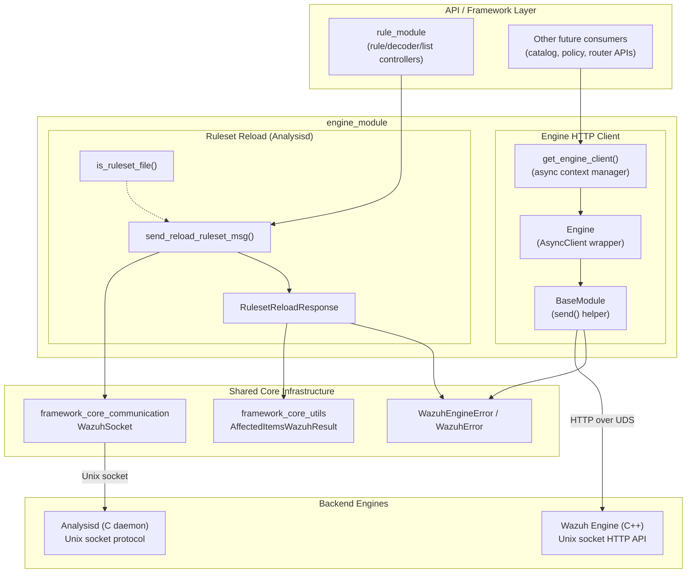
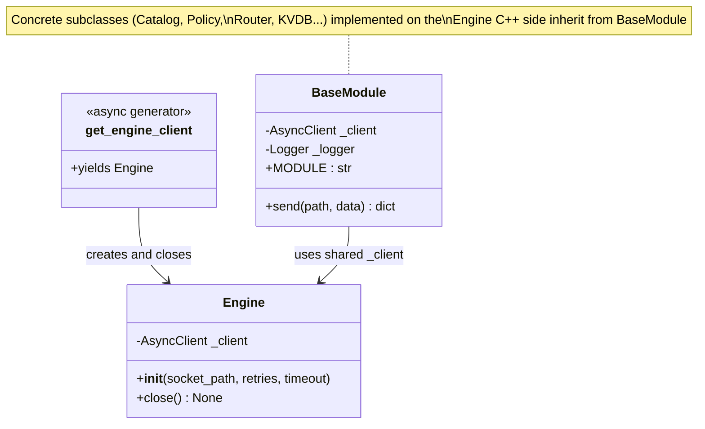
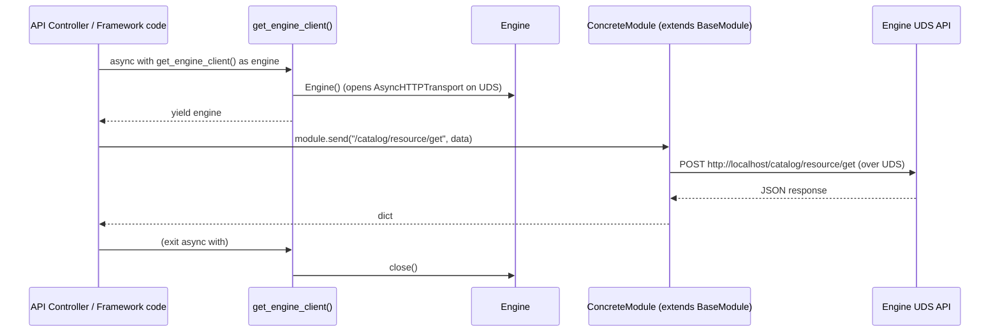
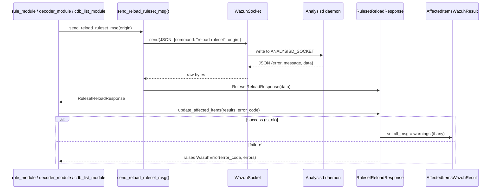
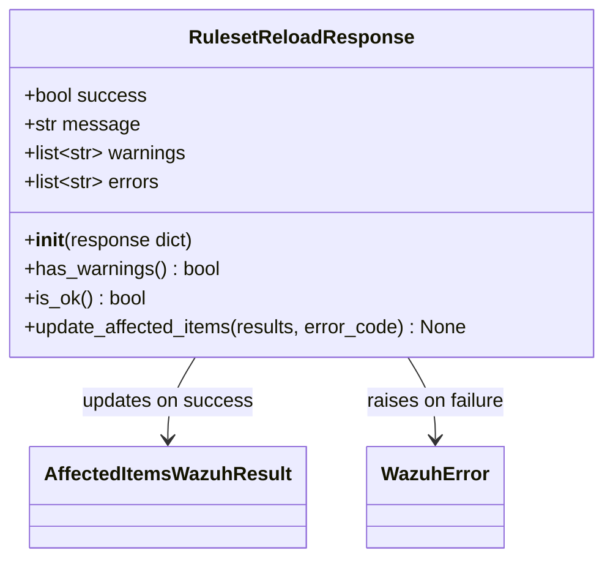

# Engine Module

## 1. Purpose

The `engine_module` provides the **Python-side client integration layer** that lets the Wazuh
Framework/API talk to two different backend engines:

1. **The Wazuh Engine (C++ HTTP API)** – the next-generation analysis engine (see
   [Wazuh_Engine_Core_(C++)](Wazuh_Engine_Core_(C++).md)) exposed over a local Unix domain
   socket using a lightweight HTTP protocol. The module offers a small, reusable async HTTP
   client (`Engine`) plus a `BaseModule` base class that concrete Engine sub-clients (catalog,
   policy, router, kvdb, etc. — implemented in the C++ side) can build upon.
2. **Analysisd (the legacy C ruleset engine)** – reached through the classic Wazuh Unix socket
   protocol (see [framework_core_communication](framework_core_communication.md)) to trigger a
   **ruleset reload** (rules, decoders and CDB lists) and interpret its structured response.

Although both concerns live under `framework/wazuh/core/engine*` and
`framework/wazuh/core/analysis.py`, they represent two independent integration points that
share the same architectural goal: **isolate the rest of the framework from the wire-level
details of talking to a backend engine**, exposing instead small, well-typed Python objects
and coherent error handling through `WazuhEngineError` / `WazuhError`.

This module has no internal REST controllers of its own; it is a **support/core library**
consumed by higher level modules such as [rule_module](rule_module.md) (ruleset reload after
rule/decoder/CDB-list updates) and, in the future, by additional API controllers that will
expose Engine catalog/policy/router functionality once implemented on top of `BaseModule`.

## 2. Architecture Overview

## 3. Sub-Areas

The module is composed of two cohesive but independent areas. Given its small footprint
(3 files, a handful of classes/functions), both areas are documented directly below rather
than as separate sub-module pages.

### 3.1 Engine HTTP Client (`framework/wazuh/core/engine/__init__.py`, `.../engine/base.py`)

**Responsibility:** Provide a minimal, reusable asynchronous HTTP client to communicate with
the Wazuh Engine (C++) process through its Unix Domain Socket (UDS) API, and a common base
class that future Engine sub-clients (catalog, kvdb, policy, router, geo, tester — see
[Wazuh_Engine_Core_(C++)](Wazuh_Engine_Core_(C++).md)) can extend.

#### Key Components

| Component | Type | Description |
|---|---|---|
| `Engine` | class | Wraps an `httpx.AsyncClient` configured with an `AsyncHTTPTransport` bound to a UDS path (default `/var/ossec/queue/sockets/engine-api`). Handles client lifecycle (`close()`). |
| `get_engine_client()` | async context manager | Creates an `Engine` instance, yields it to the caller, and guarantees `close()` is always called. Translates low-level `httpx` exceptions (`TimeoutException`, `UnsupportedProtocol`, `ConnectError`) into `WazuhEngineError` codes `2800`, `2801`, `2802`. |
| `BaseModule` | class | Base class for concrete Engine module clients. Holds a reference to the shared `AsyncClient` and exposes `send(path, data)`, which POSTs JSON payloads to `http://localhost{path}` (the hostname is irrelevant since the transport is UDS-based) and converts errors into `WazuhEngineError` (`2800`, `2803`, `2804`, `2805`). |

#### Component Diagram

#### Typical Usage Flow

#### Error Handling

Both `get_engine_client()` and `BaseModule.send()` normalize failures raised by `httpx` into the
framework's standard `WazuhEngineError` exception family so upper layers (API controllers)
never need to know about HTTP/transport-level details:

| Source | httpx exception | WazuhEngineError code |
|---|---|---|
| `get_engine_client()` | `TimeoutException` | 2800 |
| `get_engine_client()` | `UnsupportedProtocol` | 2801 |
| `get_engine_client()` | `ConnectError` | 2802 |
| `BaseModule.send()` | `TimeoutException` / `UnsupportedProtocol` / `ConnectError` | 2800 |
| `BaseModule.send()` | `HTTPError` (4xx/5xx status) | 2803 |
| `BaseModule.send()` | Any other unexpected exception | 2804 |
| `BaseModule.send()` | Response body is not valid JSON | 2805 |

### 3.2 Ruleset Reload Integration (`framework/wazuh/core/analysis.py`)

**Responsibility:** Trigger and interpret a **ruleset reload** operation on Analysisd whenever
rules, decoders or CDB lists are modified through the API/framework (see
[rule_module](rule_module.md), [decoder_module](decoder_module.md) and
[cdb_list_module](cdb_list_module.md)). This is a distinct, legacy communication path (raw
Unix socket, not HTTP) that predates the Engine HTTP client described above, but serves an
analogous "core notifies backend of a config change" purpose.

#### Key Components

| Component | Type | Description |
|---|---|---|
| `is_ruleset_file(filename)` | function | Determines whether a given file path belongs to one of the ruleset directories (`USER_LISTS_PATH`, `USER_RULES_PATH`, `USER_DECODERS_PATH`), used to decide whether a reload is required after a file operation. |
| `send_reload_ruleset_msg(origin)` | function | Builds a Wazuh socket message with command `reload-ruleset`, sends it to `common.ANALYSISD_SOCKET` via `WazuhSocket`, and wraps the raw JSON reply in a `RulesetReloadResponse`. |
| `RulesetReloadResponse` | class | Parses the raw response dict (`error`, `message`, `data`) into `success`, `message`, `warnings`, and `errors`. Provides `is_ok()`, `has_warnings()`, and `update_affected_items()` to integrate the outcome into an `AffectedItemsWazuhResult` (raising `WazuhError` on failure). |

#### Data Flow

#### Class Overview

## 4. How This Module Fits Into the System

* **Consumed by:** [rule_module](rule_module.md) (specifically its
  `rule_module_details_reload_integration` sub-area) calls `send_reload_ruleset_msg` after
  uploading/deleting rule files so Analysisd picks up the change immediately. Analogous
  consumers exist for decoders ([decoder_module](decoder_module.md)) and CDB lists
  ([cdb_list_module](cdb_list_module.md)).
* **Depends on:**
  * [framework_core_communication](framework_core_communication.md) — `WazuhSocket` is used
    to talk to Analysisd.
  * [framework_core_utils](framework_core_utils.md) — `AffectedItemsWazuhResult` and
    `common` (paths/socket constants) are used to build responses and resolve
    ruleset/socket paths.
  * `wazuh.core.exception` (`WazuhError`, `WazuhEngineError`) for standardized error
    reporting across the framework.
* **Talks to (external processes):**
  * The **Wazuh Engine (C++)** process via its Unix Domain Socket HTTP API — see
    [Wazuh_Engine_Core_(C++)](Wazuh_Engine_Core_(C++).md) for the server-side implementation
    (catalog, policy, router, kvdb, geo, tester APIs) that a `BaseModule` subclass would call
    into.
  * **Analysisd**, part of the native daemon suite documented in
    [Agent_&_Manager_Native_Daemons_(C)](Agent_&_Manager_Native_Daemons_(C).md), which
    processes the `reload-ruleset` command.

## 5. Design Notes

* The Engine HTTP client intentionally keeps `Engine` and `BaseModule` minimal and
  transport-agnostic beyond the UDS binding — all module-specific logic (e.g., catalog CRUD,
  policy management) is expected to live in subclasses of `BaseModule`, keeping this module a
  thin, dependency-light integration point.
* `get_engine_client()` follows the standard `contextlib.asynccontextmanager` pattern to
  guarantee the underlying `AsyncClient`/transport is always closed, even on error paths.
* The ruleset-reload path uses a **different transport** (raw Wazuh socket protocol) than the
  Engine HTTP client because it targets the legacy Analysisd daemon rather than the new C++
  Engine; both are grouped in this module because they represent the same conceptual
  responsibility — "notify a backend analysis engine of configuration changes" — from the
  framework's point of view.
* `RulesetReloadResponse.update_affected_items()` centralizes the success/warning/error
  interpretation logic so every caller (rule, decoder, CDB list endpoints) reports reload
  outcomes consistently to API clients.
