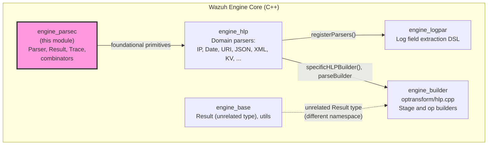
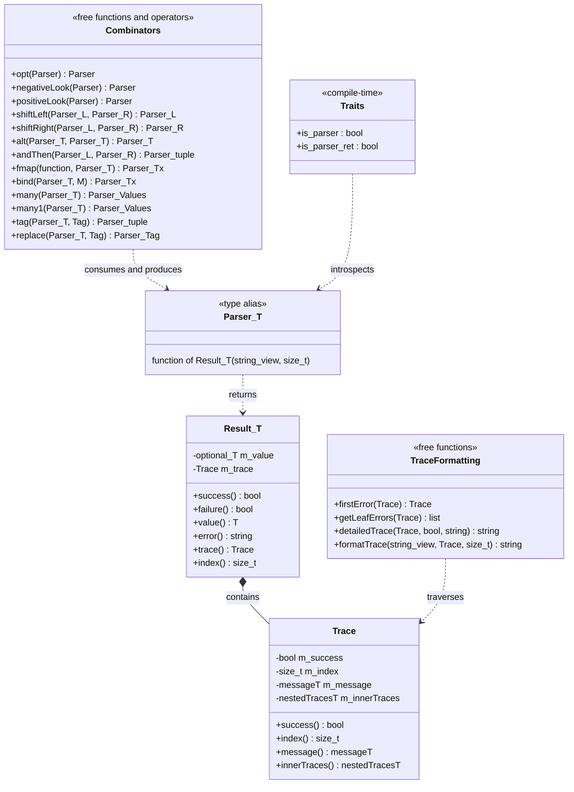
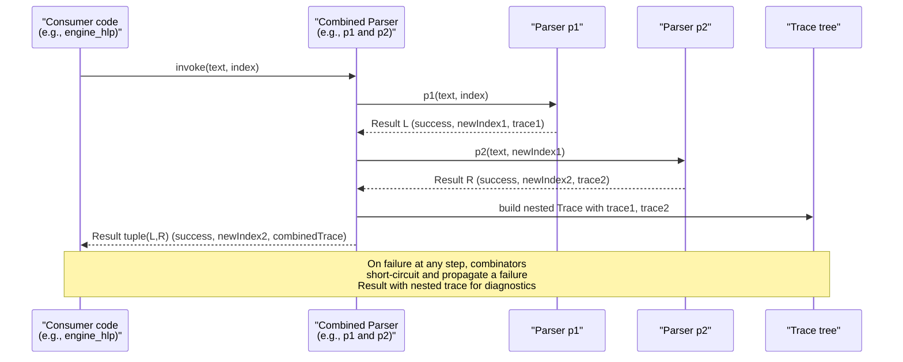
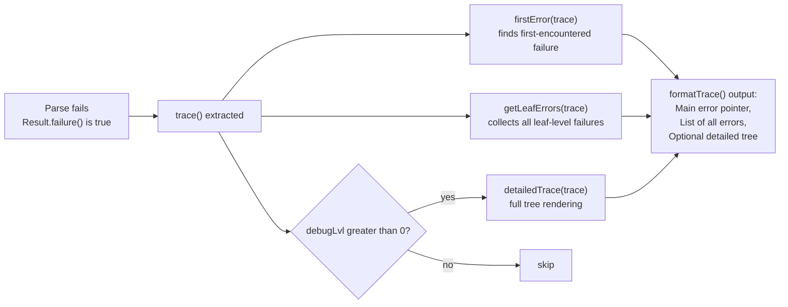
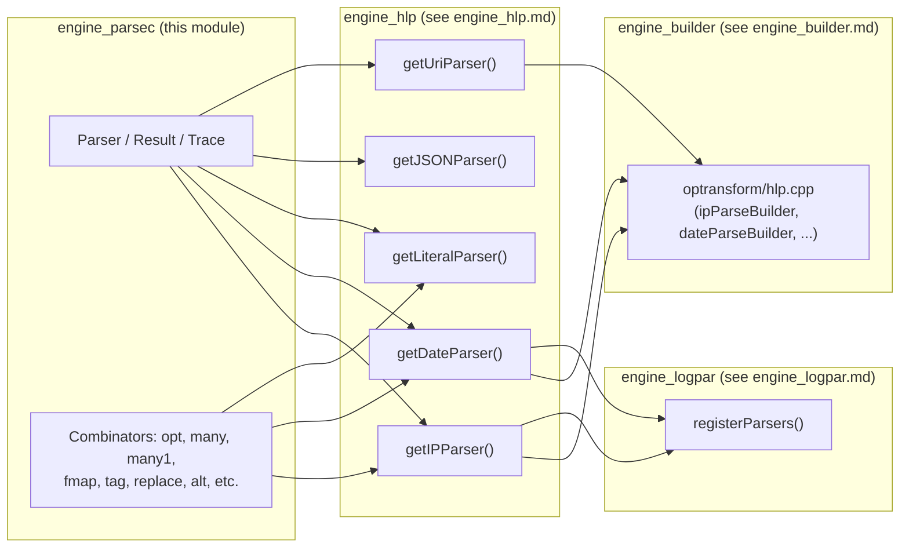

# Engine Parsec Module

## Introduction

The **engine_parsec** module is a header-only, C++ **parser combinator library** that forms the foundational text-parsing infrastructure used throughout the Wazuh Engine. It provides a small, composable set of generic primitives — `Parser<T>`, `Result<T>`, `Trace`, and a family of combinator functions/operators (`opt`, `many`, `many1`, `tag`, `replace`, `fmap`, `operator<<`, `operator>>`, `operator|`, `operator&`, `operator>>=`, `positiveLook`, `negativeLook`) — that let higher-level code build complex parsers by combining small, well-tested parsing functions.

Unlike traditional parser-generator approaches (grammars compiled to code), `parsec` follows the classic **parser combinator** pattern popularized by Haskell's Parsec library: a parser is simply a function `(std::string_view, size_t) -> Result<T>` that consumes an input string starting at a given index and returns either a successfully parsed value (with the new index) or a failure, together with a rich, nested `Trace` object that supports detailed diagnostic/error reporting.

This module has **no dependencies on other Wazuh Engine modules** — it is a pure, generic C++ template library (single header, `parsec.hpp`) that other Engine components depend on, most notably [engine_hlp](engine_hlp.md) (the High-Level Parsers library) and, transitively, [engine_builder](engine_builder.md) and [engine_logpar](engine_logpar.md).

---

## Purpose and Core Functionality

The primary goal of `engine_parsec` is to provide the **generic, reusable "glue" abstractions** needed to build a rich text-parsing DSL without duplicating boilerplate error handling, tracing, or control-flow logic. Concretely, it supplies:

1. **`Trace`** — an immutable, recursively-nestable diagnostic record capturing:
   - whether a parse step succeeded or failed,
   - the string index at which it occurred,
   - an optional human-readable message,
   - an optional list of nested (`innerTraces`) sub-traces produced by combinators.

2. **`Result<T>`** — the outcome of running a parser. Wraps an `std::optional<T>` value plus a `Trace`. Exposes `success()`, `failure()`, `value()`, `error()`, `trace()`, and `index()`.

3. **`Parser<T>`** — a type alias `std::function<Result<T>(std::string_view, size_t)>` representing "a function that tries to parse a `T` out of a string starting at a given offset."

4. **Combinators** — functions/operators that take one or more `Parser<T>` and produce a new, more complex `Parser<T>`:

   | Combinator | Behavior |
   |---|---|
   | `opt(p)` | Makes `p` optional; always succeeds. |
   | `negativeLook(p)` | Succeeds (consuming no input) iff `p` fails — negative lookahead. |
   | `positiveLook(p)` | Succeeds (consuming no input) iff `p` succeeds — positive lookahead. |
   | `operator<<` (`l << r`) | Runs `l` then `r`, keeps `l`'s value, discards `r`'s. |
   | `operator>>` (`l >> r`) | Runs `l` then `r`, keeps `r`'s value, discards `l`'s. |
   | `operator\|` (`l \| r`) | Tries `l`; if it fails, tries `r` (ordered choice/alternation). |
   | `operator&` (`l & r`) | Runs both in sequence, returns a `std::tuple<L, R>` of both. |
   | `fmap(f, p)` | Applies a transformation function `f` to the successful result of `p`. |
   | `operator>>=` (monadic bind) | Uses the result of `p` to dynamically construct the *next* parser via a factory function. |
   | `many(p)` | Runs `p` zero-or-more times, collecting results into a `Values<T>` (`std::list<T>`); never fails. |
   | `many1(p)` | Like `many`, but requires at least one success. |
   | `tag(p, tag)` | Wraps the result of `p` together with a caller-supplied tag value into a tuple. |
   | `replace(p, tag)` | Discards `p`'s value and replaces it with a fixed tag value. |

5. **Diagnostic/Trace Formatting Helpers** — `firstError`, `getLeafErrors`, `detailedTrace`, `formatTrace`. These walk the nested `Trace` tree produced by combinators to build human-friendly error reports, including a pointer (`^`) to the offending character in the source text and (optionally) a full tree view of every intermediate parsing decision.

6. **Compile-Time Traits** — `traits::is_parser<T>` and `traits::is_parser_ret<T, R>` allow generic code (e.g., in [engine_hlp](engine_hlp.md) or [engine_builder](engine_builder.md)) to statically verify that a template parameter is a `Parser<T>`, or a `Parser` whose value type derives from a particular base class `R`.

Because every combinator is a pure function that returns a new `Parser<T>` (itself just a `std::function`), parsers can be freely composed, stored, passed around, and reused — enabling a declarative style of writing complex grammars (e.g., IP addresses, dates, URIs, JSON fragments) as a composition of small, independently-testable pieces.

---

## Architecture

### Module Position in the System

`engine_parsec` sits at the lowest layer of the Engine's text-processing stack. It is consumed directly by the [engine_hlp](engine_hlp.md) module (High-Level Parsers), which implements domain-specific parsers (IP addresses, dates, URIs, JSON, XML, key-value maps, etc.) by composing `parsec` primitives together with `engine_hlp`'s own `abs`/`syntax` abstraction layers. `engine_hlp`, in turn, is used by [engine_builder](engine_builder.md) (specifically the `optransform` "parse" stage builders and `hlp.cpp` transform builders) and by [engine_logpar](engine_logpar.md) (the log-parsing DSL that builds field extraction pipelines).



> **Note:** `engine_base` also defines a `Result<T>` type (`base::Result`), but it is a **distinct, unrelated type** from `parsec::Result<T>`, used for different purposes (general operation results vs. parser combinator results). They are not related through inheritance or composition.

### Internal Structure

Because `engine_parsec` is a single header file, its "architecture" is best understood as three cooperating layers within that file:



---

## Data Flow: Parsing Process

The core mental model is: **a parser is a pure function taking (text, start-index) and returning a Result.** Combinators wrap parsers to create new parsers with richer behavior, always preserving this signature so composition is transparent.



### Error Reporting Flow

When a parse fails, the nested `Trace` produced by combinators can be rendered into actionable diagnostics via `formatTrace`:



---

## Component Interaction with Dependent Modules

`engine_parsec` itself has zero outward dependencies — it only requires the C++ standard library and `fmt::format` for trace formatting. Its **consumers** build progressively higher-level abstractions on top of it:



Note that domain parsers in `engine_hlp` (e.g., `getIPParser`, `getLiteralParser` shown below) generally **do not directly return `parsec::Parser<T>`/`parsec::Result<T>`** to their own external callers; instead they wrap the combinator machinery internally (via their own `syntax::Parser` and `abs::makeSuccess/makeFailure` layers) and expose a simplified, uniform `Parser` type specific to `engine_hlp`. This is the typical usage pattern: `parsec` provides the **generic combinator engine**, while each higher module defines its own thin adapter layer suited to its domain vocabulary (syntax parsers vs. semantic parsers, field extraction, etc.).

Example (from `engine_hlp`), illustrating how a domain-specific parser factory is structured on top of these ideas:

```cpp
Parser getIPParser(const Params& params)
{
    syntax::Parser synP = getSynParser();
    auto semP = getSemParser(target);
    return [name, synP, semP](std::string_view txt) {
        auto synR = synP(txt);
        if (synR.failure()) { return abs::makeFailure<ResultT>(synR.remaining(), name); }
        auto parsed = syntax::parsed(synR, txt);
        return abs::makeSuccess(SemToken{parsed, semP}, synR.remaining());
    };
}
```

This pattern — a factory function returning a lambda that closes over sub-parsers — is exactly the compositional style that `engine_parsec`'s combinators are designed to support at a lower, more generic level.

---

## Key Design Characteristics

1. **Purely Functional / Immutable** — `Trace` and `Result<T>` are value types with well-defined copy/move semantics; parsers are stateless functions, making them safe to share, cache, and reuse across threads once constructed.
2. **Total Composability** — Every combinator both *consumes* and *produces* a `Parser<T>`, so arbitrarily deep parser trees can be built without special-casing.
3. **Rich, Structured Diagnostics** — Rather than a single error string, failures carry a full nested `Trace` tree, enabling both quick "first-error" reporting and deep debugging via `detailedTrace`.
4. **Zero Runtime Dependencies on Other Engine Modules** — This makes `engine_parsec` trivially unit-testable and reusable in any C++ context requiring parser combinators (e.g., standalone tools in [engine_hlp](engine_hlp.md)'s tests, or potentially future CLI tools).
5. **Template-Driven Static Safety** — The `traits::is_parser` / `traits::is_parser_ret` type traits allow other modules (particularly builder code in [engine_builder](engine_builder.md)) to enforce at compile time that only valid `Parser<T>` types (or `Parser<T>` whose `T` derives from an expected base) are accepted by generic APIs.

---

## API Reference Summary

### Core Types

| Type | Description |
|---|---|
| `Trace` | Nested diagnostic record: success flag, index, optional message, optional list of inner traces. |
| `Result<T>` | Holds `optional<T> value` and a `Trace`. Provides `success()`, `failure()`, `value()`, `error()`, `trace()`, `index()`. |
| `Parser<T>` | `std::function<Result<T>(std::string_view, size_t)>` — the universal parser signature. |
| `Values<T>` | `std::list<T>` — return type for `many`/`many1`. |
| `M<Tx, T>` | `std::function<Parser<Tx>(T)>` — factory function type used by the monadic bind operator `>>=`. |

### Free Functions / Helpers

| Function | Description |
|---|---|
| `makeSuccess<T>(value, index, message?, innerTrace?)` | Builds a successful `Result<T>`. |
| `makeError<T>(error, index, innerTrace?)` | Builds a failed `Result<T>`. |
| `firstError(trace)` | Recursively finds the deepest-first failing `Trace`. |
| `getLeafErrors(trace)` | Collects all leaf-level (non-nested) failing traces. |
| `detailedTrace(trace, last, prefix)` | Renders a tree-like string view of the full trace. |
| `formatTrace(text, trace, debugLvl)` | Produces a full human-readable error report (main error + list + optional detailed tree). |

### Traits (namespace `parsec::traits`)

| Trait | Description |
|---|---|
| `is_parser<T>` | `true_type` if `T` is a `Parser<X>` for some `X`. |
| `is_parser_ret<T, R>` | `true_type` if `T` is `Parser<X>` and `X` derives from `R`. |

---

## Usage Guidance for Maintainers

- **When to modify this module:** Only when introducing a new *generic* combinator pattern needed across multiple domain parsers (e.g., a new lookahead variant, a "sepBy" combinator, or a new trace-formatting utility). Domain-specific parsing logic (dates, IPs, JSON, etc.) belongs in [engine_hlp](engine_hlp.md), not here.
- **Testing:** Since `engine_parsec` is header-only and dependency-free, unit tests should exercise combinators directly with synthetic string inputs and assert on both `Result<T>::value()` and the shape of `Result<T>::trace()`.
- **Performance considerations:** Because `Parser<T>` is a `std::function`, each combinator introduces a small amount of indirection/allocation overhead. For extremely hot parsing paths, `engine_hlp` may choose to bypass `parsec` combinators in favor of hand-written syntax parsers (as seen in its `syntax::Parser` abstraction) while still leveraging `parsec` traits/types for interoperability.

## Related Modules

- [engine_hlp.md](engine_hlp.md) — High-Level Parsers library; the primary and most direct consumer of `engine_parsec`, implementing concrete parsers (IP, date, URI, JSON, XML, KV-map, numeric types, etc.) using these combinators.
- [engine_builder.md](engine_builder.md) — Policy/asset builder subsystem; its `optransform/hlp.cpp` stage builders invoke `engine_hlp` parser factories (which are, in turn, built on `engine_parsec`).
- [engine_logpar.md](engine_logpar.md) — Log parsing DSL that registers and orchestrates `engine_hlp` parsers (and thus transitively `engine_parsec` combinators) to extract structured fields from raw log lines.
- [engine_base.md](engine_base.md) — Contains an unrelated `Result<T>` type used for general Engine operation results; distinct from `parsec::Result<T>` despite the similar name.
