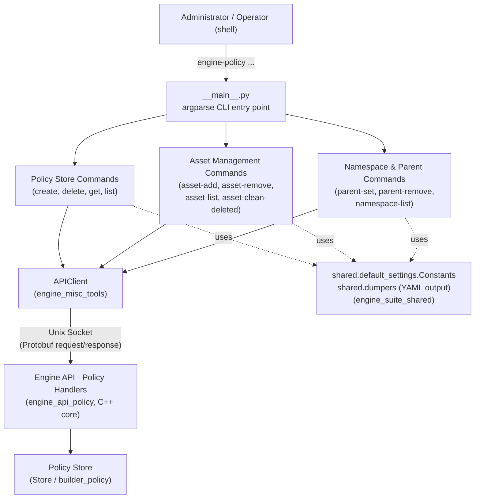
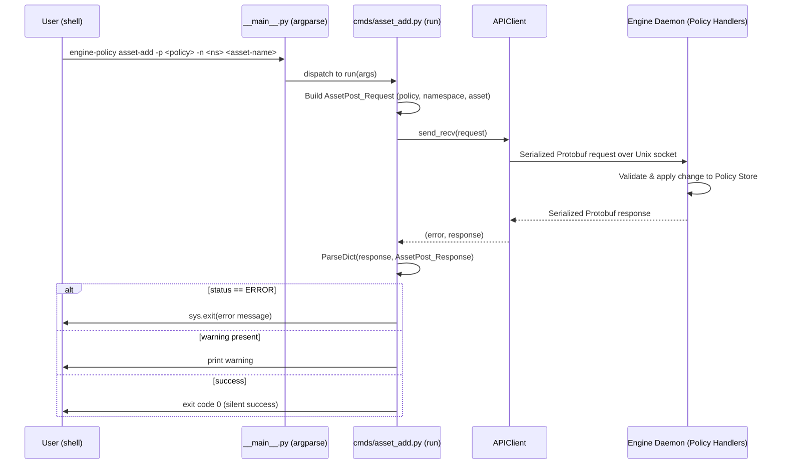

# Engine Policy Module

## 1. Introduction and Purpose

The **`engine_policy`** module is a Python-based **Command Line Interface (CLI)** tool, part of the broader `engine-suite` toolset shipped with the Wazuh Engine (see [Engine Administration CLI Tools](engine_integration.md) family of utilities). It provides administrators and operators with a convenient way to manage **security policies** used by the Wazuh Engine's decoding/rule pipeline, without having to interact directly with the Engine's binary protocol or socket API.

A "policy" in the Wazuh Engine represents an ordered composition of assets (decoders, rules, outputs, filters, etc.) organized under namespaces, which the [Engine Core (`builder_policy` / `engine_api_policy`)](engine_api.md) compiles into an executable pipeline. `engine_policy` is the **client-side** tool that lets users:

- Create, delete, retrieve and list policies (the policy "store" operations).
- Add, remove, list and clean up (deleted) assets attached to a policy.
- Manage the **default parent** asset for a given namespace within a policy — a mechanism used by the Engine to auto-link assets that don't declare an explicit parent.
- Inspect the **namespaces** defined inside a policy.

All commands are thin wrappers: they build a Protobuf request message, send it over a Unix domain socket to the running Engine daemon using the shared [`APIClient`](engine_misc_tools.md), and pretty-print the (YAML-formatted) response or surface any error returned by the Engine.

## 2. Architecture Overview

`engine_policy` follows the same architecture pattern as its sibling CLI tools (`engine_catalog`, `engine_router`, `engine_kvdb`, etc.): an `argparse`-based entry point dispatches to one command module per verb, and every command module talks to the Engine daemon through the shared low-level API client and protobuf schema.

### Key design points

- **Uniform command pattern**: every `cmds/*.py` file exposes exactly two functions, `configure(subparsers)` and `run(args)`. `configure` registers the subcommand, its arguments and defaults with `argparse`; `run` performs the actual request/response cycle. This pattern is shared across all `engine-suite` tools, see [Engine Suite Shared Utilities](engine_suite_shared.md).
- **Protobuf-based protocol**: requests/responses are defined in `api_communication.proto.policy_pb2` and the generic `api_communication.proto.engine_pb2` (status enum `ERROR`/`OK`, generic response envelopes). These are compiled from the same `.proto` contracts implemented server-side by the [Engine API — Policy handlers](engine_api.md).
- **Error handling convention**: every `run()` function performs the same three-step check — (1) transport-level error from `client.send_recv()`, (2) `status == ERROR` inside the parsed response, (3) an optional non-fatal `warning` field printed to stdout. On any failure the process exits via `sys.exit(...)`.
- **Defaults from shared constants**: default policy name (`Constants.DEFAULT_POLICY`) and default namespace (`Constants.DEFAULT_NS`) as well as the default API socket path (`Constants.SOCKET_PATH`) come from [`shared.default_settings`](engine_suite_shared.md), ensuring consistent defaults across the whole `engine-suite`.

## 3. Sub-Modules

The module's components are grouped into three functional areas, each documented in detail in its own file:

| Sub-module | Description | Documentation |
|---|---|---|
| **Policy Store Management** | Lifecycle operations on whole policies: `create`, `delete`, `get`, `list`. | [engine_policy_store.md](engine_policy_store.md) |
| **Asset Management** | Operations to attach/detach/inspect/clean assets inside a policy: `asset-add`, `asset-remove`, `asset-list`, `asset-clean-deleted`. | [engine_policy_assets.md](engine_policy_assets.md) |
| **Namespace & Default-Parent Management** | Operations to configure the default parent asset per namespace and to list the namespaces present in a policy: `parent-set`, `parent-remove`, `namespace-list`. | [engine_policy_hierarchy.md](engine_policy_hierarchy.md) |

The CLI entry point itself (`__main__.py`) is the small glue layer that wires all the above sub-modules into a single `engine-policy` executable; it is described in the [Policy Store Management](engine_policy_store.md) document alongside the `create`/`delete`/`get`/`list` commands, since it shares the same lifecycle-oriented top-level parser configuration.

## 4. Typical Command Flow

The sequence below illustrates a representative interaction — adding an asset to a policy — showing how every command in this module ultimately talks to the Engine:

## 5. Relationship to Other Modules

- **[Engine Administration CLI Tools](engine_integration.md)** — `engine_policy` is a sibling of `engine_catalog`, `engine_router`, `engine_kvdb`, `engine_test`, etc. All of them share the same CLI conventions and underlying transport.
- **[Engine Suite Shared Utilities](engine_suite_shared.md)** — provides `Constants` (default socket path, policy, namespace) and `dumpers.dict_to_str_yml` used to pretty-print YAML responses.
- **[Engine Misc Tools](engine_misc_tools.md)** — provides the `APIClient` class used by every command to perform the socket request/response cycle.
- **[Wazuh Engine Core — API](engine_api.md)** — the C++ server side (`engine_api_policy` handlers, backed by the `builder_policy` and `Store` components) that actually implements policy creation, asset attachment, default-parent resolution and namespace bookkeeping. `engine_policy` is purely a client for this API; no policy logic is implemented in this module itself.
