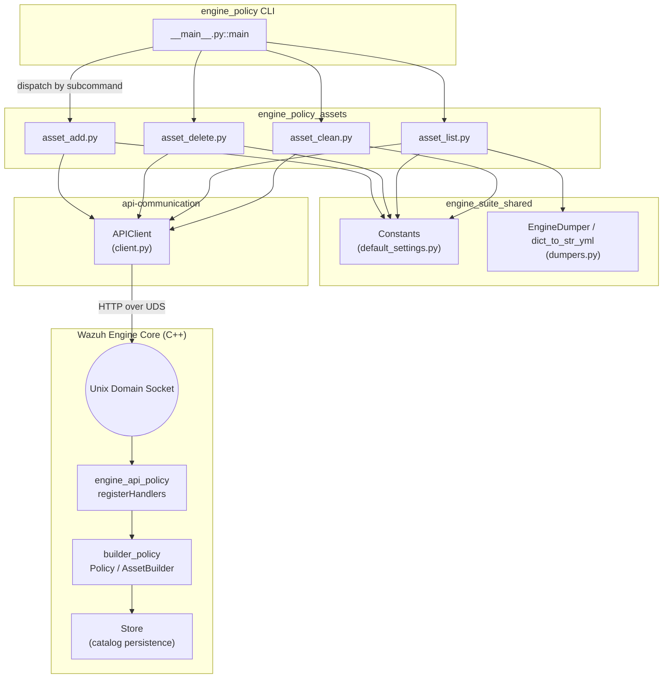
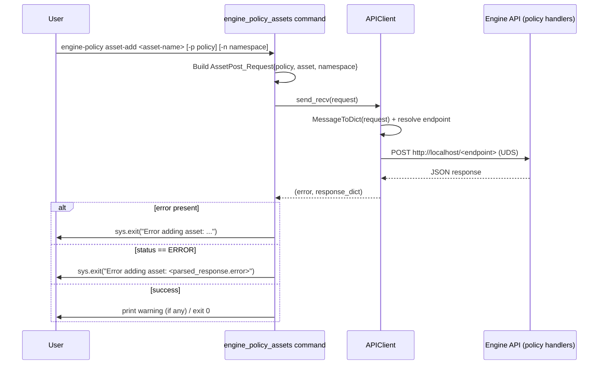
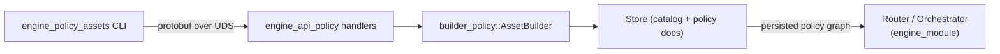

# Engine Policy Assets

## Introduction

`engine_policy_assets` is a CLI sub-module of the **Engine Policy** administration tool (`engine-policy`), part of the broader [Engine Administration CLI Tools](engine_misc_tools.md) suite. It provides the commands that manage **assets** (decoders, rules, outputs, filters, etc.) attached to a Wazuh Engine policy: adding an asset, removing an asset, listing all assets in a policy, and cleaning up assets that reference deleted catalog items.

This module is a thin, stateless command-line layer: every command builds a Protocol Buffers request, sends it over a Unix domain socket to the running Wazuh Engine (`wazuh-engine`) API server, and prints a human-readable result. All the real business logic (asset validation, storage, dependency resolution) lives in the C++ engine core — specifically the [engine_api_policy](engine_api.md) handlers and the [builder_policy](engine_builder.md) component — not in this Python module.

## Purpose and Scope

The module exposes four sub-commands registered under the `engine-policy` CLI:

| Command | File | Purpose |
|---|---|---|
| `asset-add` | `asset_add.py` | Attach an existing catalog asset to a policy namespace |
| `asset-remove` | `asset_delete.py` | Detach an asset from a policy namespace |
| `asset-list` | `asset_list.py` | List all assets currently attached to a policy |
| `asset-clean-deleted` | `asset_clean.py` | Remove dangling references to assets that were deleted from the catalog but are still linked in the policy |

These commands complement the sibling modules:
- [engine_policy_store](engine_policy_store.md) — policy lifecycle (create/get/list/delete)
- [engine_policy_hierarchy](engine_policy_hierarchy.md) — parent/namespace management for policies

Together, these three modules make up the parent **engine_policy** CLI tool.

## Architecture

### Component Relationships



### Request/Response Data Flow

Each command follows an identical sequence: parse CLI args → build a protobuf request → send over the API socket → parse the protobuf response → report success, warning, or error.



## Core Components

### `asset_add.py` — `configure`, `run`
Registers the `asset-add` sub-command and implements it:
- Args: `-p/--policy` (default `Constants.DEFAULT_POLICY`), `-n/--namespace` (default `Constants.DEFAULT_NS`), positional `asset-name`.
- Builds `epolicy.AssetPost_Request` (policy, asset, namespace) and sends it via `APIClient.send_recv`.
- On transport error or `engine.ERROR` status, exits with a descriptive message via `sys.exit`.
- Prints any non-empty `warning` field from the response (e.g., when the addition triggered a soft conflict recoverable by the engine).

### `asset_delete.py` — `configure`, `run`
Registers the `asset-remove` sub-command:
- Same argument shape as `asset-add`.
- Builds `epolicy.AssetDelete_Request` and sends it.
- Reports errors and prints warnings identically to `asset_add.py`.

### `asset_list.py` — `configure`, `run`
Registers the `asset-list` sub-command:
- Args: `-p/--policy`, `-n/--namespace` (no asset name needed — lists all).
- Builds `epolicy.AssetGet_Request` and sends it.
- On success, converts the returned `data` dictionary into YAML using `dict_to_str_yml` (backed by `EngineDumper`, see [engine_suite_shared](engine_suite_shared.md)) and prints it for readability.

### `asset_clean.py` — `configure`, `run`
Registers the `asset-clean-deleted` sub-command:
- Args: `-p/--policy` only.
- Builds `epolicy.AssetCleanDeleted_Request` and sends it.
- Useful after catalog assets are deleted directly (e.g., via [engine_catalog](engine_catalog.md)) while still being referenced by a policy; the engine removes the stale references and returns a summary in `data`.

## Dependencies

This module is intentionally minimal and depends on three shared building blocks:

1. **`api_communication.client.APIClient`** (see [engine_misc_tools](engine_misc_tools.md))
   Wraps `httpx` over a Unix domain socket transport. Provides:
   - `send_recv(message)`: serializes a protobuf request to JSON, POSTs it to `http://localhost/<endpoint>` over the UDS, and returns `(error, response_json)`.
   - `jsend` / `send`: higher-level helpers that also validate a `GenericStatus_Response`-style status field automatically (not used directly by the asset commands, which use `send_recv` and check status manually).
   - Endpoint resolution (`get_endpoint`) maps the protobuf message type to the correct REST-like path exposed by the engine's [engine_api_policy](engine_api.md) handlers.

2. **`shared.default_settings.Constants`** (see [engine_suite_shared](engine_suite_shared.md))
   Supplies default values used across all `engine-policy` commands:
   - `DEFAULT_POLICY = 'policy/wazuh/0'`
   - `DEFAULT_NS = 'user'`
   - `SOCKET_PATH`, `DEFAULT_SESSION`, `DEFAULT_API_TIMEOUT` (used by the parent CLI when `--api_socket` is not explicitly supplied).

3. **`shared.dumpers`** (`EngineDumper`, `dict_to_str_yml`) — used only by `asset_list.py` to pretty-print the asset list as YAML with sane quoting/line-break behavior.

4. **Protobuf message definitions** — `api_communication.proto.policy_pb2` (message types `AssetPost_Request/Response`, `AssetDelete_Request/Response`, `AssetGet_Request/Response`, `AssetCleanDeleted_Request/Response`) and `api_communication.proto.engine_pb2` (generic `ERROR`/`OK` status enum). These are the contract shared with the C++ [engine_api_policy](engine_api.md) handlers that actually process the requests.

## Integration with the Wazuh Engine

On the server side, requests dispatched by this module are received by the engine's HTTP-over-UDS server and routed to the policy API handlers (`registerHandlers` in `api/policy/handlers.hpp`, part of [engine_api](engine_api.md)). Those handlers delegate to the [builder_policy](engine_builder.md) component (`Asset`, `AssetBuilder`, `Policy`) to validate the asset against the schema/build context and to the [Store](Store.md) component to persist the updated policy definition. This keeps all engine invariants (asset existence, namespace scoping, graph consistency) enforced server-side, while the CLI remains a lightweight, easily-testable request/response wrapper.



## Usage Examples

```bash
# Add a decoder asset to the default policy/namespace
engine-policy asset-add decoder/apache-access/0

# Add an asset to a specific policy and namespace
engine-policy asset-add -p policy/custom/0 -n wazuh integration/aws/0

# List all assets currently in a policy (YAML output)
engine-policy asset-list -p policy/wazuh/0 -n user

# Remove an asset from a policy
engine-policy asset-remove -p policy/wazuh/0 -n user decoder/apache-access/0

# Clean up references to assets deleted from the catalog
engine-policy asset-clean-deleted -p policy/wazuh/0
```

## Error Handling Pattern

Every command follows the same defensive flow:

1. If `APIClient.send_recv` returns a transport-level `error` string (socket unreachable, timeout, malformed message), the CLI immediately exits with `sys.exit(f'Error ...: {error}')`.
2. Otherwise, the JSON response is parsed into the corresponding protobuf `*_Response` message using `ParseDict`. If `status == engine.ERROR`, the CLI exits with the engine-provided `error` message.
3. If the response includes a non-empty `warning` field (only in `asset_add`/`asset_delete`), it is printed to stdout without aborting execution.
4. On full success, the command returns `0`.

## Related Documentation

- [engine_policy_store.md](engine_policy_store.md) — sibling module for policy create/get/list/delete
- [engine_policy_hierarchy.md](engine_policy_hierarchy.md) — sibling module for parent/namespace management
- [engine_misc_tools.md](engine_misc_tools.md) — shared `APIClient` and other cross-tool utilities
- [engine_suite_shared.md](engine_suite_shared.md) — `Constants`, `EngineDumper`, `Executor`, `ResourceHandler`
- [engine_api.md](engine_api.md) — server-side API handlers (`engine_api_policy`) that process these requests
- [engine_builder.md](engine_builder.md) — policy/asset build and validation logic (`builder_policy`)
- [Store.md](Store.md) — persistence layer for policies and catalog assets
- [engine_catalog.md](engine_catalog.md) — CLI/API for managing the underlying catalog assets referenced by policies
