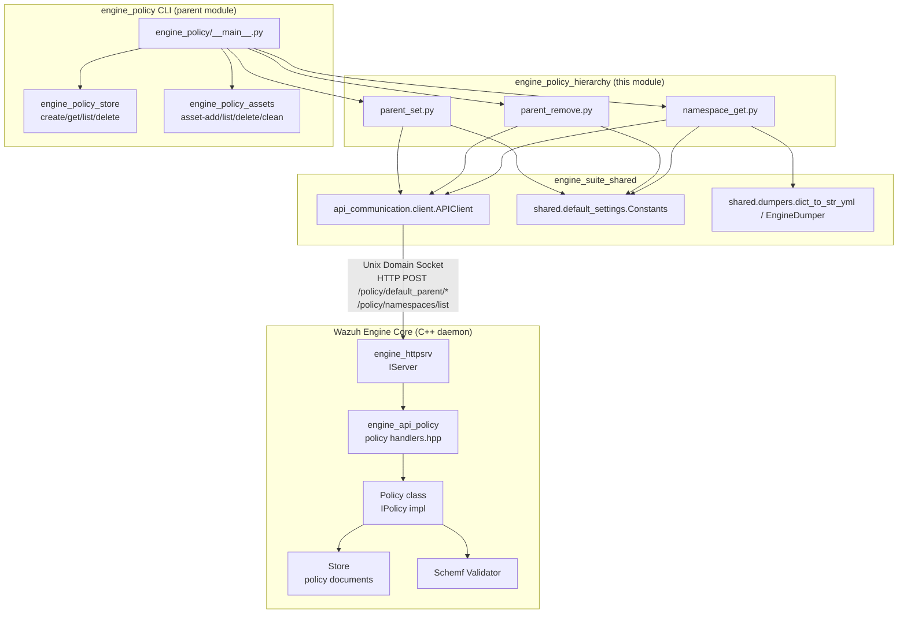
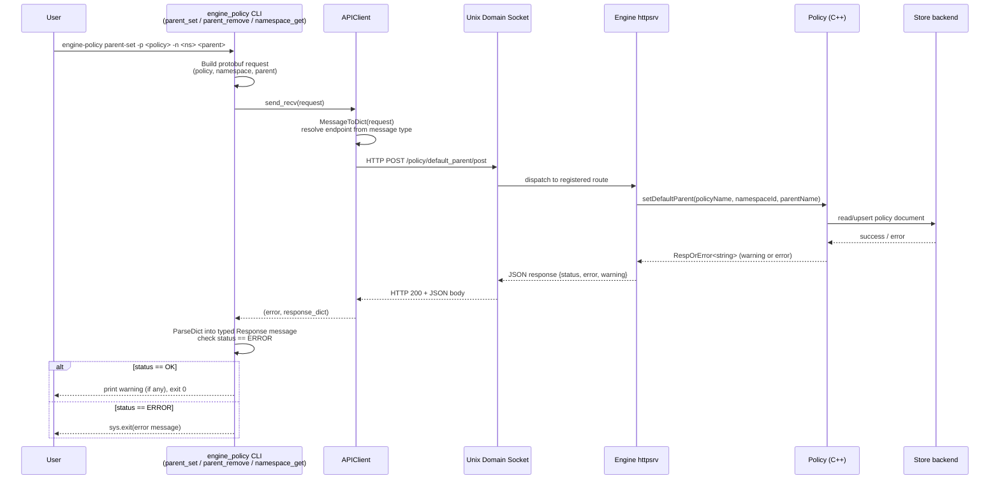
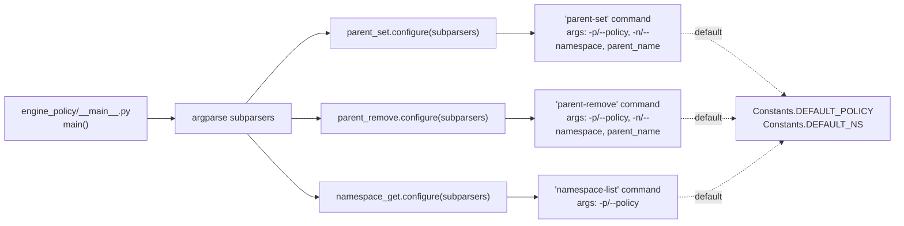
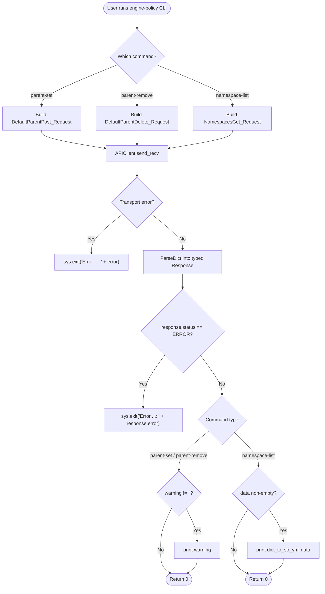
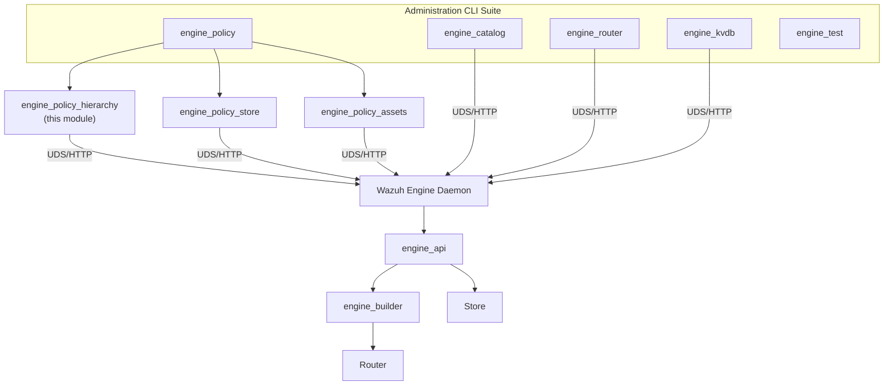

# Engine Policy Hierarchy Module

## Introduction

The **`engine_policy_hierarchy`** module is a small but important part of the `engine_policy` Python CLI tool (see [engine_policy_store.md](engine_policy_store.md) and [engine_policy_assets.md](engine_policy_assets.md) for sibling modules). It provides the command-line surface for managing **namespace hierarchy and default-parent relationships** within a Wazuh Engine policy.

In the Wazuh Engine, a *policy* is a named collection of decoder/rule/output *assets* grouped into *namespaces*. When an event is processed, assets belonging to different namespaces are chained together according to a *default parent* relationship — i.e., which asset (typically a decoder) should act as the entry point/parent for all assets in a given namespace when no explicit relationship is defined. This module exposes three CLI subcommands that let operators:

1. **Set** the default parent asset for a namespace (`parent-set`)
2. **Remove** the default parent asset for a namespace (`parent-remove`)
3. **List** all namespaces registered within a policy (`namespace-list`)

These commands are thin, stateless wrappers: they build a Protocol-Buffer request, send it over a Unix domain socket to the running `wazuh-engine` daemon's HTTP-over-UDS API, and print/interpret the response. All business logic and persistence live server-side in the C++ Engine (see [engine_api_policy.md](engine_api_policy.md) and the [engine_builder.md](engine_builder.md) policy subsystem).

---

## 1. Purpose and Core Functionality

| Command | CLI Name | Purpose |
|---|---|---|
| `parent_set.py` | `parent-set` | Assigns a default parent asset to a namespace within a policy. All un-parented assets in that namespace will implicitly attach to this parent. |
| `parent_remove.py` | `parent-remove` | Removes a previously configured default parent for a namespace. |
| `namespace_get.py` | `namespace-list` | Retrieves and prints (YAML) the full list of namespaces currently defined in a policy. |

### Common Design Pattern

Every command file in this module follows the exact same structure, consistent with all `engine_policy` subcommands:

```python
def run(args: dict) -> int:
    # 1. Extract CLI args (api_socket, policy, namespace, ...)
    # 2. Build a protobuf request message (api_communication.proto.policy_pb2)
    # 3. Send it via APIClient.send_recv()
    # 4. Parse/validate the response (engine_pb2.ERROR check)
    # 5. Print results / exit with error message
    return 0

def configure(subparsers) -> None:
    # Registers the subcommand, its arguments and defaults with argparse
    parser.set_defaults(func=run)
```

This pattern is shared across the entire [engine_policy](engine_policy.md) tool family (`engine_policy_store`, `engine_policy_assets`, and this module), making the CLI easy to extend with new subcommands.

---

## 2. Architecture

### 2.1 Component Diagram



### 2.2 File-to-Endpoint Mapping

| CLI File | Protobuf Request | Server Endpoint (registered in [engine_api_policy.md](engine_api_policy.md) `handlers.hpp`) | Server-side `Policy` method |
|---|---|---|---|
| `parent_set.py` | `DefaultParentPost_Request` | `POST /policy/default_parent/post` | `Policy::setDefaultParent` |
| `parent_remove.py` | `DefaultParentDelete_Request` | `POST /policy/default_parent/delete` | `Policy::delDefaultParent` |
| `namespace_get.py` | `NamespacesGet_Request` | `POST /policy/namespaces/list` | `Policy::listNamespaces` |

---

## 3. Data Flow

The request/response life cycle is identical for all three commands; only the protobuf message type and target field differ.



---

## 4. Component Interaction — CLI Argument Wiring

Each command registers itself with the shared `argparse` subparsers object exposed by the `engine_policy` `__main__.py` entry point (see [engine_policy.md](engine_policy.md)).



All three commands rely on `shared.default_settings.Constants` (see [engine_suite_shared.md](engine_suite_shared.md)) for default values:
- `DEFAULT_POLICY = 'policy/wazuh/0'`
- `DEFAULT_NS = 'user'`

This means an operator can invoke, e.g., `engine-policy parent-set my_decoder` without specifying `-p`/`-n` and it will target the default Wazuh policy and namespace.

---

## 5. Command Details

### 5.1 `parent-set` (parent_set.py)

- **Request message**: `epolicy.DefaultParentPost_Request` with fields `policy`, `parent`, `namespace`.
- **Response message**: `epolicy.DefaultParentPost_Response` (fields: `status`, `error`, `warning`).
- **Behavior**: On success, prints any non-empty `warning` field (e.g., overriding an existing default parent) and returns 0. On failure (`status == engine.ERROR`), exits the process via `sys.exit` with the server-provided error message.

**Function summary:**
- `configure(subparsers)`: Registers the `parent-set` subcommand with `-p/--policy` (default `Constants.DEFAULT_POLICY`), `-n/--namespace` (default `Constants.DEFAULT_NS`), and the positional `parent_name` argument.
- `run(args)`: Executes the request/response cycle described above.

### 5.2 `parent-remove` (parent_remove.py)

- **Request message**: `epolicy.DefaultParentDelete_Request` — structurally identical fields to the `Post` request (`policy`, `parent`, `namespace`).
- **Response message**: `epolicy.DefaultParentDelete_Response`.
- **Behavior**: Mirrors `parent-set`'s error/warning handling exactly, but invokes the deletion endpoint.

**Function summary:**
- `configure(subparsers)`: Registers the `parent-remove` subcommand with the same argument shape as `parent-set`.
- `run(args)`: Executes the request/response cycle, targeting the delete endpoint.

### 5.3 `namespace-list` (namespace_get.py)

- **Request message**: `epolicy.NamespacesGet_Request` with field `policy`.
- **Response message**: `epolicy.NamespacesGet_Response`, whose `data` field is a list of namespace identifiers.
- **Behavior**: If the response contains data, it is rendered as YAML via `shared.dumpers.dict_to_str_yml` (built on `EngineDumper`, a `yaml.Dumper` subclass with improved scalar formatting for quotes/newlines) and printed to stdout.

**Function summary:**
- `configure(subparsers)`: Registers the `namespace-list` subcommand with only `-p/--policy` (default `Constants.DEFAULT_POLICY`).
- `run(args)`: Executes the request/response cycle and pretty-prints the namespace list.

---

## 6. Process Flow — Typical Usage



---

## 7. Dependencies

### 7.1 Internal (within this repository)

| Dependency | Module Doc | Role |
|---|---|---|
| `api_communication.client.APIClient` | [engine_misc_tools.md](engine_misc_tools.md) | Handles UDS/HTTP transport, protobuf⇄dict conversion, and generic status checking. |
| `shared.default_settings.Constants` | [engine_suite_shared.md](engine_suite_shared.md) | Supplies default socket path, policy name, and namespace. |
| `shared.dumpers` (`dict_to_str_yml`, `EngineDumper`) | [engine_suite_shared.md](engine_suite_shared.md) | Formats namespace list output as human-readable YAML. |
| `api_communication.proto.policy_pb2` (`epolicy`) | Generated from Engine `.proto` definitions consumed by [engine_api_policy.md](engine_api_policy.md) | Defines `DefaultParentPost/Delete_Request/Response` and `NamespacesGet_Request/Response` message schemas. |
| `api_communication.proto.engine_pb2` (`engine`) | Same as above | Defines the shared `ReturnStatus`/`ERROR` enum used to detect failures. |

### 7.2 External (server-side, C++ Engine)

| Component | Module Doc | Role |
|---|---|---|
| `engine_httpsrv` (`IServer`) | [engine_httpsrv.md](engine_httpsrv.md) | Listens on the Unix domain socket and routes HTTP-like requests to handlers. |
| `engine_api_policy` handlers | [engine_api_policy.md](engine_api_policy.md) | Registers `/policy/default_parent/*` and `/policy/namespaces/list` routes and adapts protobuf requests to `Policy` API calls. |
| `Policy` class (`IPolicy`) | [engine_api_policy.md](engine_api_policy.md) / [builder_policy.md](builder_policy.md) | Implements `setDefaultParent`, `delDefaultParent`, and `listNamespaces` business logic, backed by the [Store.md](Store.md) document store and [Schemf_Validator_Engine.md](Schemf_Validator_Engine.md) for validation. |

---

## 8. How This Module Fits in the Overall System

This module is one of several CLI sub-tools bundled in the `Engine_Administration_CLI_Tools_(Python)` suite that lets administrators and integrators manage the Wazuh Engine (a C++ event-processing daemon) without writing raw protobuf/HTTP calls by hand. It sits at the very edge of the administration tooling stack:



By managing default-parent relationships and namespace visibility, `engine_policy_hierarchy` directly influences how the [builder_policy.md](builder_policy.md) subsystem constructs the asset execution graph (`PolicyGraph`) at policy-build time, and ultimately how events flow through the [Router.md](Router.md) at runtime.

---

## 9. Summary

`engine_policy_hierarchy` is a lightweight, three-command CLI extension responsible exclusively for **namespace and default-parent hierarchy management** on Wazuh Engine policies. It contains no business logic itself — its sole responsibilities are:

1. Parsing CLI arguments with sensible defaults.
2. Marshaling requests into the correct protobuf message types.
3. Communicating with the Engine daemon via `APIClient` over a Unix domain socket.
4. Interpreting and displaying success/warning/error results to the operator.

All actual state changes (setting/removing default parents, tracking namespaces) are performed by the C++ `Policy` class documented in [engine_api_policy.md](engine_api_policy.md).
