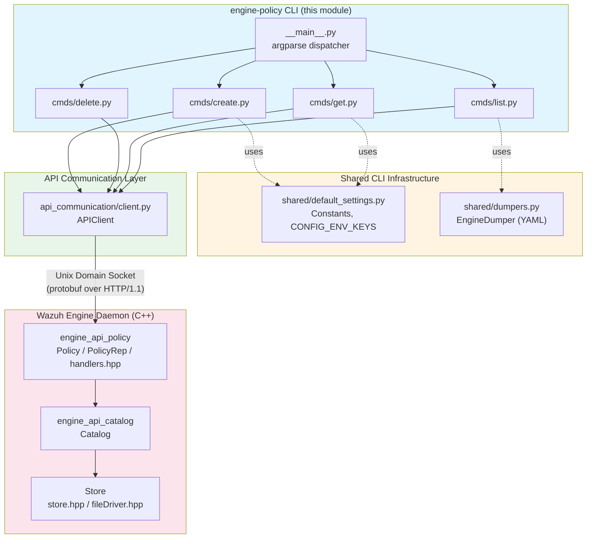
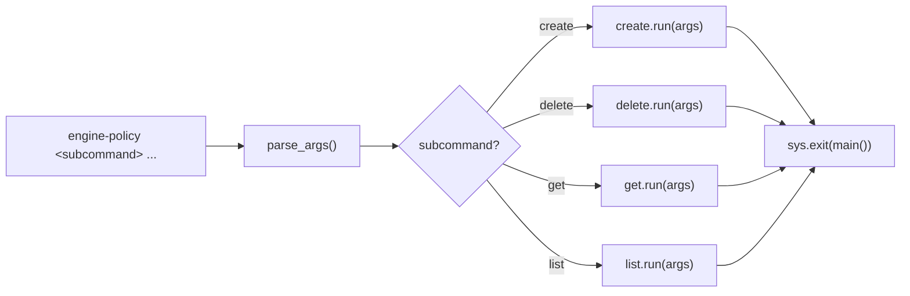
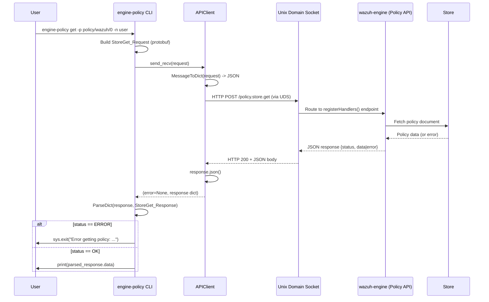
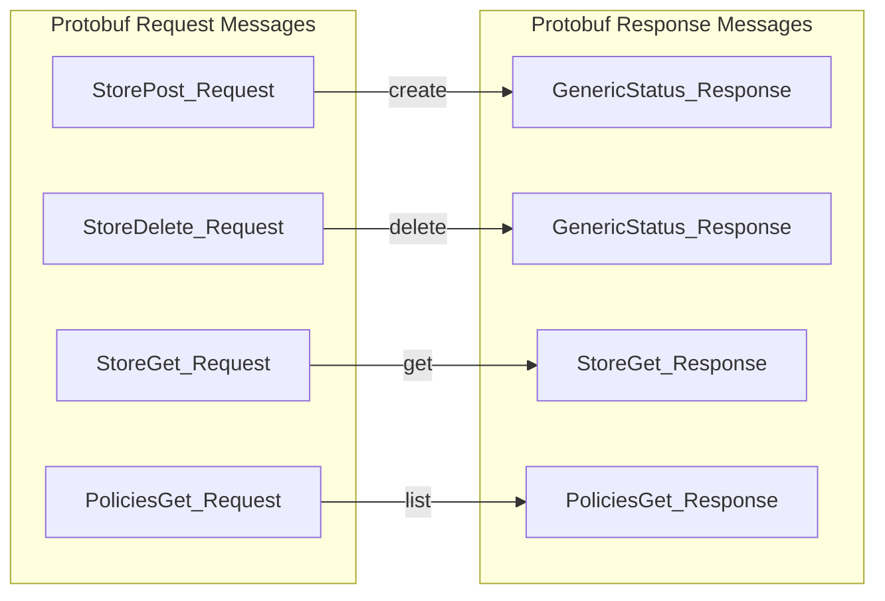
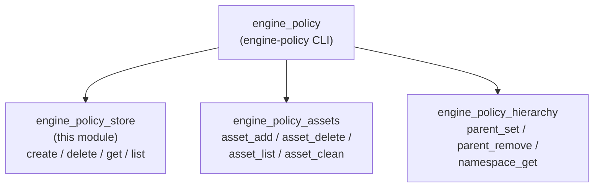

# Engine Policy Store

## Introduction

The **Engine Policy Store** module is the command-line subsystem responsible for the lifecycle management of *policies* in the Wazuh Engine — the security-detection runtime that evaluates rules, decoders and outputs against incoming events. A "policy" in the Engine is a named, versioned document stored in the Engine's backend **Store**, which aggregates the assets (decoders, rules, filters, outputs) that make up a detection pipeline for a given namespace.

This module implements the `engine-policy` CLI tool's **store-level** operations — `create`, `delete`, `get`, and `list` — which let administrators and automation scripts create new empty policies, remove existing ones, fetch a policy's current definition, and enumerate all policies known to the running Engine instance. It is a thin, stateless Python CLI layer that talks to the running `wazuh-engine` process over a local Unix domain socket using Protocol Buffers request/response messages.

This module is one of several sibling command groups under the broader `engine_policy` CLI (see [Engine_Administration_CLI_Tools_(Python).md](Engine_Administration_CLI_Tools_(Python).md)), which also includes asset management (`engine_policy_assets`) and namespace/parent hierarchy management (`engine_policy_hierarchy`). All these CLI groups ultimately drive the same C++ policy engine API described in [engine_api_policy](Wazuh_Engine_Core_(C++).md).

## Purpose and Core Functionality

| Command | Purpose |
|---|---|
| `engine-policy create -p <policy>` | Creates a new, empty policy entry in the Engine's Store. |
| `engine-policy delete -p <policy>` | Removes a policy (and its Store entry) from the Engine. |
| `engine-policy get -p <policy> [-n <namespace> ...]` | Retrieves and prints the current definition of a policy, optionally scoped to one or more namespaces. |
| `engine-policy list` | Lists all policies currently registered in the Engine, formatted as YAML. |

All four commands follow the same pattern:
1. Parse CLI arguments (`argparse`).
2. Build a Protocol Buffers request message specific to the operation.
3. Send the request to the Engine API Unix socket via a shared `APIClient`.
4. Parse/validate the response (checking a `status` field for `engine.ERROR`).
5. Print output or exit with a non-zero status and error message on failure.

Because the module performs no local business logic beyond message construction, it is intentionally minimal — the actual policy storage, validation, and versioning logic live in the C++ Engine backend (`Catalog`/`Store`/`Policy` components).

## Architecture



### Key Design Points

- **Stateless CLI wrapper**: Each command module (`create.py`, `delete.py`, `get.py`, `list.py`) exposes exactly two functions — `configure(subparsers)` to register the `argparse` subcommand, and `run(args)` to execute it. This uniform interface allows `__main__.py` to wire all subcommands generically.
- **Protobuf-based protocol**: Requests/responses use generated protobuf classes (`api_communication.proto.policy_pb2`, `api_communication.proto.engine_pb2`). The `APIClient` (from [engine_misc_tools](Engine_Administration_CLI_Tools_(Python).md)) serializes messages to JSON, POSTs them over a Unix socket transport, and deserializes the JSON response back into a protobuf message for validation.
- **Generic error handling**: All commands check the response `status` against `engine.ERROR` and call `sys.exit()` with a descriptive message on failure, ensuring consistent CLI exit codes/behavior for scripting.
- **Default socket path & policy** come from `shared.default_settings.Constants` (e.g., `SOCKET_PATH`, `DEFAULT_POLICY`, `DEFAULT_NS`), which are also used consistently across other `engine-*` CLI tools ([engine_suite_shared](Engine_Administration_CLI_Tools_(Python).md)).

## Component Breakdown

### `__main__.py` — CLI Entry Point

Defines the top-level `engine-policy` argument parser. Responsibilities:
- Reads package metadata (`engine-suite`) to expose `--version`.
- Registers a global `--api-socket` option (default: `Constants.SOCKET_PATH`) shared by all subcommands.
- Registers subparsers for all store-level (`create`, `delete`, `get`, `list`) and sibling command groups (assets, parent/namespace — implemented in other modules but wired from the same entry point).
- `main()` parses arguments and dispatches to the `func` attribute set by each subcommand's `configure()`.



### `cmds/create.py`

- Builds `epolicy.StorePost_Request` with the `policy` name.
- Sends via `APIClient.send_recv()`.
- Parses response as `engine.GenericStatus_Response`; exits with error text on failure.

### `cmds/delete.py`

- Builds `epolicy.StoreDelete_Request` with the `policy` name.
- Same send/validate/exit pattern as `create.py`.

### `cmds/get.py`

- Builds `epolicy.StoreGet_Request`, including the `policy` name and a repeated `namespaces` field (defaults to `[Constants.DEFAULT_NS]`, policy defaults to `Constants.DEFAULT_POLICY`).
- Parses response as `epolicy.StoreGet_Response` and prints the returned `data` field (the raw policy definition) to stdout.

### `cmds/list.py`

- Builds `epolicy.PoliciesGet_Request` (no parameters).
- Parses response as `epolicy.PoliciesGet_Response`.
- Converts the returned `data` (list of policy names) to a YAML string using `shared.dumpers.dict_to_str_yml` (built on `EngineDumper`, a customized `yaml.Dumper` that forces double-quote or literal block style for values containing quotes/newlines) and prints it.

## Data Flow — Typical Command Execution



## Command-to-Endpoint Mapping



Each request's protobuf type is mapped internally (via `get_endpoint()` in the `api_communication` client) to a specific HTTP-like path routed by the Engine's `httpsrv`/`router` subsystem to the appropriate handler registered in `engine_api_policy::handlers.hpp` (see [Wazuh_Engine_Core_(C++)](Wazuh_Engine_Core_(C++).md)).

## Error Handling Strategy

All four commands share a uniform two-tier error handling approach:

1. **Transport-level errors**: `APIClient.send_recv()` returns a non-`None` error string for connection failures, timeouts, or malformed responses (see `_set_error_msg()` for the taxonomy of `httpx` exceptions handled: `ConnectTimeout`, `ReadTimeout`, `WriteTimeout`, `ConnectError`, `ReadError`, `WriteError`, `CloseError`). On any transport error, the CLI immediately calls `sys.exit(f'Error ... : {error}')`.
2. **Application-level errors**: Even when the transport succeeds, the Engine may return a `status: ERROR` field in the protobuf response body (e.g., policy already exists, policy not found, invalid namespace). The CLI parses the response into the expected protobuf response type and checks `parsed_response.status == engine.ERROR`, exiting with `parsed_response.error` as the message.

This dual-layer strategy ensures that CLI scripts (used in provisioning, CI/CD, or operator tooling) can reliably detect failures via non-zero process exit codes regardless of failure origin.

## Dependencies

| Dependency | Role | Reference |
|---|---|---|
| `api_communication.client.APIClient` | Handles Unix-socket transport, protobuf⇄JSON conversion, and generic response validation (`jsend`/`send`/`send_recv`). | [Engine_Administration_CLI_Tools_(Python)](Engine_Administration_CLI_Tools_(Python).md) (`engine_misc_tools`) |
| `shared.default_settings.Constants` | Provides default socket path, default policy name, default namespace. | [Engine_Administration_CLI_Tools_(Python)](Engine_Administration_CLI_Tools_(Python).md) (`engine_suite_shared`) |
| `shared.dumpers.EngineDumper` / `dict_to_str_yml` | YAML serialization for `list` command output, with quoting/literal-style fixes for special characters. | [Engine_Administration_CLI_Tools_(Python)](Engine_Administration_CLI_Tools_(Python).md) (`engine_suite_shared`) |
| `api_communication.proto.policy_pb2`, `engine_pb2` | Generated protobuf message classes defining the wire format for policy store operations. | Generated from Engine proto definitions; consumed by [engine_api_policy](Wazuh_Engine_Core_(C++).md) |
| Engine daemon (`wazuh-engine`) | The C++ process listening on the Unix socket, hosting the `Catalog`/`Store`/`Policy` subsystems that actually persist and validate policies. | [Wazuh_Engine_Core_(C++)](Wazuh_Engine_Core_(C++).md) — `engine_api_policy`, `Store` |

## Relationship to Sibling Modules

The `engine_policy` CLI tool (parent module) is subdivided into three functional areas, of which this module (`engine_policy_store`) is one:



- **[engine_policy_assets](Engine_Administration_CLI_Tools_(Python).md)**: Manages the assets (decoders, rules, filters, outputs) *within* a policy that has already been created via this module's `create` command.
- **[engine_policy_hierarchy](Engine_Administration_CLI_Tools_(Python).md)**: Manages default-parent relationships and namespace introspection for policies managed here.
- Both sibling modules reuse the same `APIClient`, `Constants`, and error-handling conventions documented above, and typically operate on policy names created via this module's `create` command and require them to exist (as validated by the C++ `Store`).

## Usage Examples

```bash
# Create a new empty policy
engine-policy create -p policy/wazuh/0

# List all policies known to the Engine
engine-policy list

# Retrieve a policy's definition (default namespace = "user")
engine-policy get -p policy/wazuh/0 -n user

# Delete a policy
engine-policy delete -p policy/wazuh/0

# Override the default API socket
engine-policy --api-socket /var/ossec/queue/sockets/analysis list
```

## Related Documentation

- [Engine_Administration_CLI_Tools_(Python).md](Engine_Administration_CLI_Tools_(Python).md) — parent module tree covering all `engine-*` CLI tools, shared utilities (`engine_suite_shared`), and API communication client (`engine_misc_tools`).
- [Wazuh_Engine_Core_(C++).md](Wazuh_Engine_Core_(C++).md) — the C++ Engine daemon implementing the `engine_api_policy`, `Catalog`, and `Store` components that back this CLI's operations.
