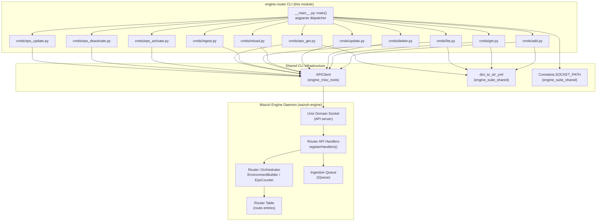
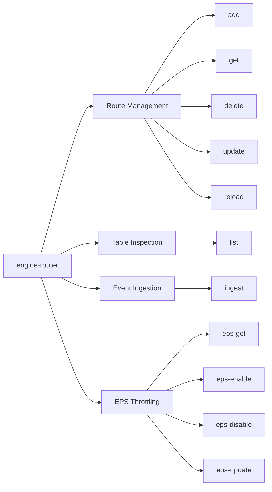
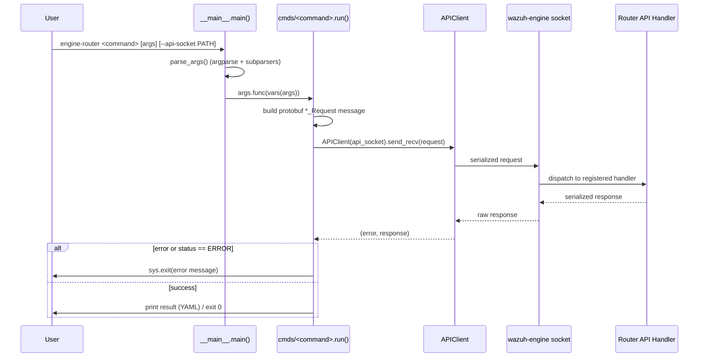
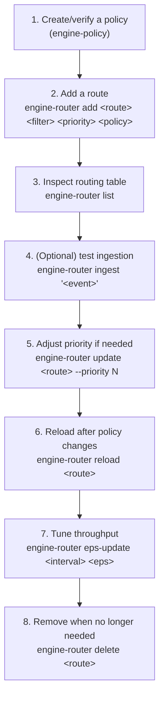

# Engine Router CLI (`engine-router`)

## 1. Purpose

`engine-router` is a Python command-line tool, part of the **engine-suite** toolset, used by administrators and
integrators to manage the **Router** subsystem of the Wazuh Engine (the C++ analysis daemon, `wazuh-engine`). The
Router is the component that receives decoded/normalized events and dispatches them to the appropriate **policy**
(the ruleset/pipeline that will process them) according to configured **routes** — named rules composed of a
*filter*, a target *policy* and a *priority*.

Through this CLI, operators can:

- **Manage routes**: create (`add`), inspect (`get`), update priority (`update`), remove (`delete`) and force a
  rebuild (`reload`) of a route.
- **Inspect the routing table**: list all configured routes and their current state (`list`).
- **Manually inject events**: push a raw event directly into the engine's ingestion queue for testing/troubleshooting
  purposes (`ingest`).
- **Control throughput (EPS)**: get, enable, disable and update the Events-Per-Second limiter used by the Router to
  throttle processing (`eps-get`, `eps-enable`, `eps-disable`, `eps-update`).

The tool does not implement any routing logic itself — it is a thin client that serializes user commands into
Protocol Buffer requests and sends them over a Unix domain socket to the running `wazuh-engine` process, which
executes the actual logic inside its native Router implementation.

## 2. Architecture Overview

Key relationships:

- **`APIClient`** (`src/engine/tools/api-communication/src/api_communication/client.py`) is the low-level transport
  used by every subcommand to serialize a Protobuf request, send it to `--api-socket` (default from
  `Constants.SOCKET_PATH`), and receive/deserialize the response. It is shared with every other `engine-suite` CLI
  tool (`engine_catalog`, `engine_policy`, `engine_kvdb`, etc.) — see [engine_misc_tools.md](engine_misc_tools.md).
- **`shared.dumpers.dict_to_str_yml`** and **`shared.default_settings.Constants`** are common utilities reused across
  all engine-suite tools — see [engine_suite_shared.md](engine_suite_shared.md).
- On the server side, requests are handled by the Router API handlers (`registerHandlers` in
  `src/engine/source/api/router/include/api/router/handlers.hpp`), which operate on the native C++ **Router**
  implementation (orchestrator, routing table, and EPS counter) that lives in the Wazuh Engine Core module
  — see [Router.md](Router.md) and [engine_api_router_tester.md](engine_api_router_tester.md).

## 3. Command Groups

The CLI is organized around four functional groups, all sharing the same request/response pattern: build a Protobuf
request → `APIClient.send_recv()` → validate `GenericStatus_Response` (or a specific response message) → print
result or exit with an error.

### 3.1 Route Management

| Command | File | Request Message | Response Message | Description |
|---|---|---|---|---|
| `add` | `cmds/add.py` | `RoutePost_Request` | `GenericStatus_Response` | Creates a new route with `name`, `filter`, `priority`, `policy`, and optional `description`. |
| `get` | `cmds/get.py` | `RouteGet_Request` | `RouteGet_Response` | Retrieves the full definition/state of a single route and prints it as YAML. |
| `delete` | `cmds/delete.py` | `RouteDelete_Request` | `GenericStatus_Response` | Removes an existing route by name. |
| `update` | `cmds/update.py` | `RoutePatchPriority_Request` | `GenericStatus_Response` | Currently only supports changing a route's `priority` (must be a positive integer); fails if no valid field is supplied. |
| `reload` | `cmds/reload.py` | `RouteReload_Request` | `GenericStatus_Response` | Forces the engine to rebuild the environment (policy graph) associated with a route, e.g. after the underlying policy/assets changed. |

### 3.2 Table Inspection

| Command | File | Request Message | Response Message | Description |
|---|---|---|---|---|
| `list` | `cmds/list.py` | `TableGet_Request` | `TableGet_Response` | Dumps the entire routing table (all routes, in priority order) as YAML. |

### 3.3 Event Ingestion

| Command | File | Request Message | Response Message | Description |
|---|---|---|---|---|
| `ingest` | `cmds/ingest.py` | `QueuePost_Request` | `GenericStatus_Response` | Pushes a raw `wazuh_event` string directly onto the engine's ingestion queue, bypassing normal event sources (useful for manual testing). |

### 3.4 EPS (Events-Per-Second) Throttling

| Command | File | Request Message | Response Message | Description |
|---|---|---|---|---|
| `eps-get` | `cmds/eps_get.py` | `EpsGet_Request` | `EpsGet_Response` | Reports current EPS limiter status (enabled/disabled, configured rate, refresh interval). |
| `eps-enable` | `cmds/eps_activate.py` | `EpsEnable_Request` | `GenericStatus_Response` | Activates EPS limiting. |
| `eps-disable` | `cmds/eps_deactivate.py` | `EpsDisable_Request` | `GenericStatus_Response` | Deactivates EPS limiting. |
| `eps-update` | `cmds/eps_update.py` | `EpsUpdate_Request` | `GenericStatus_Response` | Sets a new `events-per-second` value and `refresh-interval` (both validated to be non-negative before sending). |

## 4. Component Breakdown

### 4.1 `__main__.py` — CLI Entry Point

`main()` is the single executable entry point (`sys.exit(main())`). Responsibilities:

1. Reads the installed `engine-suite` package metadata to expose `--version`.
2. Registers the global `--api-socket` option, defaulting to `Constants.SOCKET_PATH` (shared engine-suite setting).
3. Creates a required subparser group (`dest='subcommand'`) and delegates registration of each subcommand to that
   subcommand's `configure(subparsers)` function, imported from every module under `cmds/`.
4. Parses `sys.argv`, then invokes `args.func(vars(args))` — the `func` default set by each subcommand's
   `configure()` — which routes execution into the specific `run()` implementation.

### 4.2 Command Modules (`cmds/*.py`)

Every command module follows an identical, predictable two-function contract, making the CLI easy to extend:

- **`configure(subparsers)`**: registers an `argparse` subparser (name, help text, positional/optional arguments)
  and sets `parser.set_defaults(func=run)` so `__main__.py` can dispatch to it generically.
- **`run(args)`**: extracts CLI arguments from the `args` dict, builds the appropriate Protobuf request object
  (from `api_communication.proto.router_pb2` / `engine_pb2`), sends it via `APIClient`, checks for transport errors
  and for an `ERROR` status in the parsed response, then prints output (using `dict_to_str_yml` for structured
  results) or exits with a descriptive error via `sys.exit`.

| File | `run()` validations | Notable behavior |
|---|---|---|
| `add.py` | none beyond required args | `description` is optional; omitted if not provided. |
| `get.py` | none | Prints only the `route` sub-object of the response as YAML. |
| `delete.py` | none | Simple name-based deletion. |
| `update.py` | `priority >= 0`; at least one updatable field supplied | Exits early with a clear message if no valid update was requested. |
| `reload.py` | none | Triggers a full rebuild of the route's environment/policy graph. |
| `list.py` | none | Prints the `table` sub-object of the response as YAML. |
| `ingest.py` | none | Directly wraps the raw event string in `QueuePost_Request.wazuh_event`. |
| `eps_get.py` | none | Prints the entire EPS response as YAML. |
| `eps_activate.py` / `eps_deactivate.py` | none | No parameters; simple toggle requests. |
| `eps_update.py` | `refresh-interval >= 0`; `events-per-second >= 0` | Both values validated client-side before the request is even built. |

## 5. Error Handling Pattern

All commands share a consistent, fail-fast error strategy:

1. **Transport-level error** — if `APIClient.send_recv()` returns a non-empty `error`, the CLI immediately calls
   `sys.exit(f'Error <action>: {error}')`.
2. **Application-level error** — the raw response dict is parsed into a typed Protobuf message
   (`ParseDict(response, ...)`). If `parsed_response.status == engine.ERROR`, the CLI exits with
   `parsed_response.error` as the message.
3. **Client-side validation error** — for commands with numeric parameters (`update`, `eps-update`), invalid values
   (e.g., negative numbers) are rejected *before* any network call is made.

This uniform pattern ensures predictable exit codes and error messages across all Router-related operations, which
is important for scripting and automation (e.g., in deployment or health-check scripts).

## 6. Relationship to Other Modules

| Related Module | Relationship |
|---|---|
| [engine_suite_shared.md](engine_suite_shared.md) | Supplies `Constants` (default socket path) and `dict_to_str_yml` (YAML pretty-printing) used throughout this CLI. |
| [engine_misc_tools.md](engine_misc_tools.md) | Supplies the `APIClient` transport class used to communicate with the engine's Unix domain socket API. |
| [Router.md](Router.md) / [engine_api_router_tester.md](engine_api_router_tester.md) | The server-side counterpart: `registerHandlers()` in the engine's `api/router` component receives and executes every request built by this CLI, operating on the native C++ Router (route table, orchestrator, EPS counter). |
| [engine_policy_store.md](engine_policy_store.md), [engine_catalog.md](engine_catalog.md), [engine_kvdb.md](engine_kvdb.md), [engine_test.md](engine_test.md) | Other CLIs in the same `engine-suite` package that manage complementary engine resources (policies, catalog assets, KVDBs, test sessions) referenced by routes managed through `engine-router`. |

## 7. Typical Usage Flow

