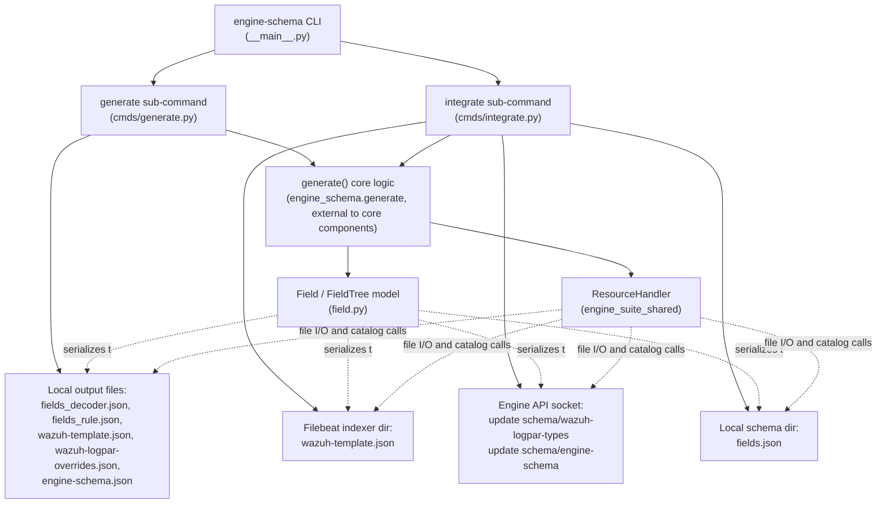
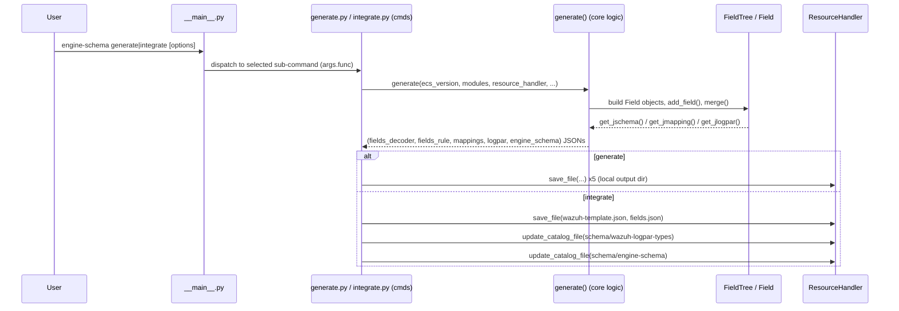

# Engine Schema Module

## 1. Introduction and Purpose

`engine_schema` is a Python command-line tool that is part of the **`engine-suite`** toolbox (see [engine_suite_shared.md](engine_suite_shared.md) for the shared CLI infrastructure used by all `engine-suite` tools). Its purpose is to **build and maintain the Wazuh Engine's data schema**: the set of fields (based on the Elastic Common Schema — ECS — plus Wazuh-specific extensions/modules) that the [Wazuh Engine Core](Wazuh_Engine_Core_(C++).md) uses to:

- Validate events and decoder/rule outputs (`fields_decoder`, `fields_rule` JSON Schemas).
- Configure the OpenSearch/Elasticsearch index mappings (`wazuh-template.json`).
- Configure the [HLP (High-Level Parsers)](engine_hlp.md) log-parsing overrides (`wazuh-logpar-overrides.json`).
- Feed the [Schemf (Schema Validation)](Schemf_(Schema_Validation).md) component and the engine's internal schema representation (`engine-schema.json`).

The tool has two operating modes, exposed as CLI sub-commands:

- **`generate`** — Builds all schema artifacts and writes them to local files, without touching a running Engine instance. Useful for build pipelines and manual inspection.
- **`integrate`** — Builds the schema artifacts and immediately applies them to a live system: it overwrites the indexer's `wazuh-template.json` and the local `fields.json`, and pushes the `wazuh-logpar-types` and `engine-schema` documents into the Engine's catalog through its Unix API socket (see [engine_api](engine_api.md) / [engine_api_catalog](engine_api_catalog.md)).

## 2. Architecture Overview

The module is intentionally small and split into two clear concerns: **command-line orchestration** and **the in-memory schema data model**. The actual field-aggregation logic (reading ECS field definitions, merging Wazuh custom modules, etc.) lives in a sibling `generate.py` file (not part of this module's core components) which both sub-commands invoke; this module documents the CLI entry points that drive that logic and the `Field`/`FieldTree` model that represents and serializes the resulting schema.



### High-level data flow



## 3. Sub-modules

| Sub-module | Documentation | Responsibility |
|---|---|---|
| Command-line interface & orchestration | [engine_schema_cli.md](engine_schema_cli.md) | Argument parsing, sub-command registration (`generate`, `integrate`), and orchestration of output writing / catalog updates. Covers `__main__.py`, `cmds/generate.py`, `cmds/integrate.py`. |
| Field schema data model | [engine_schema_field_model.md](engine_schema_field_model.md) | In-memory representation of schema fields and the field tree used to render JSON Schema, indexer mappings, and logpar overrides. Covers `field.py` (`Field`, `FieldTree`, `IndexerType`, `JsonType`). |

## 4. Relationship to Other Modules

- **[engine_suite_shared](engine_suite_shared.md)**: provides `ResourceHandler` (file saving, format handling) and `Constants`/default settings (e.g. default API socket path) used by both sub-commands.
- **[engine_api_catalog](engine_api_catalog.md) / [engine_api](engine_api.md)**: the `integrate` sub-command talks to the running Engine's catalog through the API socket to update the `schema/wazuh-logpar-types` and `schema/engine-schema` documents.
- **[engine_hlp](engine_hlp.md) / [engine_logpar](engine_logpar.md)**: consumers of the generated `wazuh-logpar-overrides.json`, which customizes how specific fields are parsed by the High-Level Parsers.
- **[Schemf_(Schema_Validation)](Schemf_(Schema_Validation).md)**: consumes the generated `engine-schema.json` / `fields.json` to validate field types at build/runtime.
- **[engine_test](engine_test.md) / [engine_kvdb_cpp_core](engine_kvdb_cpp_core.md)**: other `engine-suite` CLI tools sharing the same argument-parsing and resource-handling conventions.
- Sibling CLI tools in the same suite ([engine_catalog](engine_catalog.md), [engine_policy_store](engine_policy_store.md), [engine_router](engine_router.md), etc.) follow an identical `__main__.py` + `cmds/*.py` pattern.

## 5. Typical Usage

```bash
# Generate all schema artifacts locally
engine-schema generate --allowed-fields-path /path/to/allowed_fields.json \
    --output-dir ./out --ecs-version v8.17.0

# Generate and apply changes directly to a running Engine instance
engine-schema integrate --api-sock /run/wazuh-server/engine-api.socket \
    --indexer-dir /etc/filebeat/ --schema-dir /var/ossec/engine/ruleset/schemas/
```

After `integrate`, the manager must be restarted (`systemctl restart wazuh-manager`) for the new template to take full effect on the indexer side, while catalog changes are applied live.
