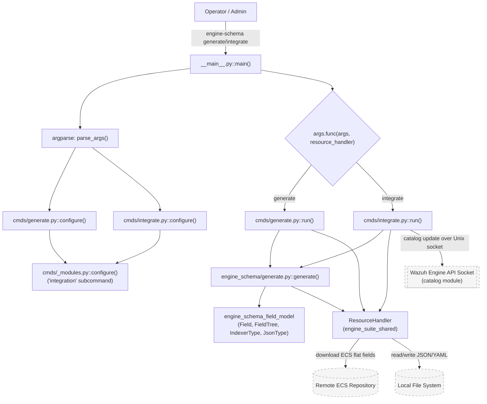
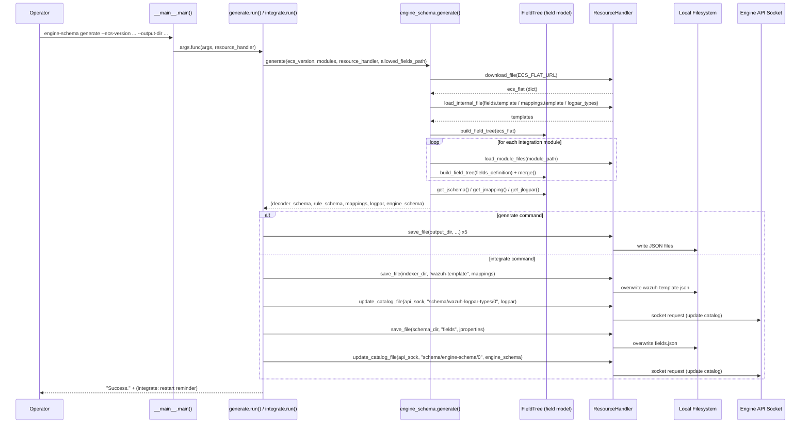
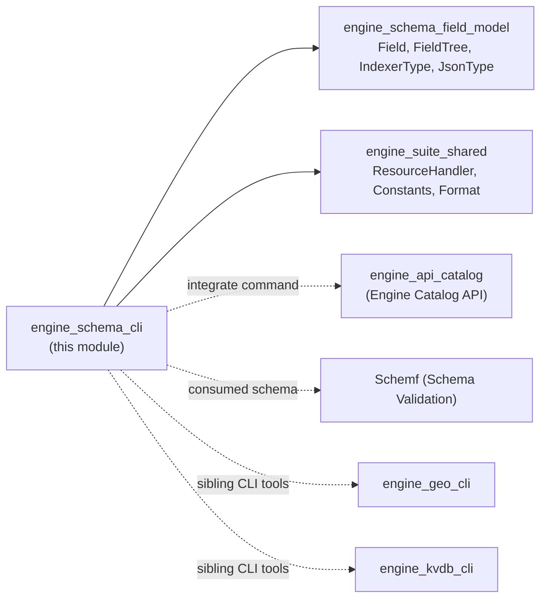

# Engine Schema CLI (`engine-schema`)

## Introduction

The **Engine Schema CLI** is the command-line entry point of the `engine-schema` Python tool, part of the Wazuh Engine administration toolkit (`engine-suite`). It is responsible for generating the **Elastic Common Schema (ECS)-based data schema** used by the Wazuh Engine — including field definitions, indexer (OpenSearch/Elasticsearch) mappings, log-parser (`logpar`) type overrides, and the internal engine schema document — and optionally **applying** those artifacts to a running Engine instance through its API socket.

This module contains only the CLI orchestration layer (argument parsing and command dispatch). The actual schema-building logic lives in the sibling `engine_schema_field_model` module, and file/network I/O is delegated to the shared `engine_suite_shared` utilities. This document focuses on the CLI layer and shows how it fits into the broader Engine Administration CLI Tools ecosystem.

## Purpose and Core Functionality

`engine-schema` provides two subcommands:

| Command | Purpose |
|---|---|
| `generate` | Downloads a specific ECS version, merges it with optional custom integration field modules, and **writes** the resulting schema/mapping/logpar/engine-schema files to a local output directory. Does **not** touch a running Engine. |
| `integrate` | Performs the same generation logic as `generate`, but instead of just writing local files, it **overwrites** the indexer template (`wazuh-template.json`) and the ECS fields file on disk, and **pushes** the updated `logpar` and `engine-schema` documents into the Engine's catalog via its Unix domain socket API. |

Both commands share:
- ECS version selection (`--ecs-version`, defaulting to a pinned ECS release).
- Optional integration modules (`integration <PATH>...` subcommand) that contribute additional custom fields (via `fields.yml`) and optional `logpar.json` overrides, merged on top of the base ECS field tree.
- A common `ResourceHandler` (from `engine_suite_shared`) abstraction for reading/writing JSON/YAML files, downloading remote resources, and talking to the Engine catalog API.

## Architecture Overview



## Component Breakdown

### `__main__.py` — CLI Bootstrap

- **`main()`**: The single executable entry point (`python -m engine_schema` or the installed `engine-schema` console script).
  - Builds the top-level `argparse.ArgumentParser` with a `--version` flag sourced from the installed `engine-suite` package metadata.
  - Registers subparsers for `generate` and `integrate` by delegating to their respective `configure()` functions.
  - Instantiates a single `ResourceHandler` (shared across subcommands) and invokes the selected subcommand's callback (`args.func`), passing the parsed arguments (as a `dict`) and the resource handler.

This mirrors the same bootstrap pattern used by sibling CLI tools such as `engine_geo_cli` and `engine_kvdb_cli` (see [engine_geo_cli.md](engine_geo_cli.md) and [engine_kvdb_cli.md](engine_kvdb_cli.md)).

### `cmds/generate.py` — Local Schema Generation

- **`configure(subparsers)`**: Registers the `generate` subcommand with arguments:
  - `--ecs-version` (default `v8.17.0`)
  - `--output-dir` (default `./`)
  - `--allowed-fields-path` (**required**) — path to a JSON file listing which fields are allowed to appear in the *rule* schema partition versus the *decoder* schema partition.
  - Delegates to `cmds/_modules.py::configure()` to add the nested `integration` subcommand for supplying custom field modules.
- **`run(args, resource_handler)`**: The callback executed when `generate` is invoked.
  1. Reads CLI arguments (ECS version, output dir, allowed-fields path, integration module paths).
  2. Calls the core `generate()` function (see below) to build all schema artifacts.
  3. Persists five output files into `output_dir` using `resource_handler.save_file(...)`:
     - `fields_decoder.json`
     - `fields_rule.json`
     - `wazuh-template.json` (indexer mappings)
     - `wazuh-logpar-overrides.json`
     - `engine-schema.json`

### `cmds/integrate.py` — Live Engine Integration

- **`configure(subparsers)`**: Registers the `integrate` subcommand with arguments:
  - `--ecs-version` (default `v8.17.0`)
  - `--api-sock` (default from `Constants.SOCKET_PATH`, e.g. `/var/ossec/queue/sockets/analysis`)
  - `--indexer-dir` (default `/etc/filebeat/`) — where `wazuh-template.json` lives.
  - `--schema-dir` (default engine ruleset schemas path) — where `fields.json` lives.
  - Also nests the `integration` subcommand via `cmds/_modules.py::configure()`.
- **`run(args, resource_handler)`**: The callback executed when `integrate` is invoked.
  1. Calls the same core `generate()` function to build schema artifacts.
  2. Overwrites `wazuh-template.json` in `indexer_dir` (indexer mappings).
  3. Pushes the `logpar` overrides document into the Engine catalog at `schema/wazuh-logpar-types/0` via `resource_handler.update_catalog_file(api_socket, ...)`.
  4. Overwrites `fields.json` in `schema_dir` (ECS field schema).
  5. Pushes the `engine-schema` document into the catalog at `schema/engine-schema/0`.
  6. Prints a reminder for the operator to restart `wazuh-manager` for changes to take effect.

> Note: `update_catalog_file` and the socket-based catalog communication ultimately talk to the Engine's `catalog` API module — see [engine_api_catalog.md](engine_api_catalog.md) — and the on-disk schema is consumed by the schema validation component documented in [Schemf_(Schema_Validation).md](Schemf_(Schema_Validation).md).

### `cmds/_modules.py` — Shared "integration" Subcommand (helper, used by both subcommands)

- **`configure(subparsers)`**: Adds an `integration` nested subcommand accepting one or more `integrations_path` values — directories each containing a `fields.yml` (and optionally `logpar.json`) that describe additional custom fields to merge into the ECS-based schema.
- **`get_args(args)`** (used internally): Extracts the list of integration paths from parsed arguments for passing into `generate()`.

## Data Flow: Command Execution



## Dependencies



- **[engine_schema_field_model.md](engine_schema_field_model.md)**: Provides the `Field`, `FieldTree`, `IndexerType`, and `JsonType` classes used to build the internal representation of the merged ECS + custom field schema, and to render it into JSON Schema (`to_jschema`), indexer mappings (`to_jmapping`), and logpar override formats.
- **[engine_suite_shared.md](engine_suite_shared.md)**: Supplies the `ResourceHandler` class (file I/O, remote downloads, catalog updates via socket) and `Constants`/`Format` used throughout both subcommands.
- **[engine_api_catalog.md](engine_api_catalog.md)** / **Wazuh_Engine_Core_(C++)**: The `integrate` command's catalog updates are received and processed by the Engine's native `Catalog` component.
- **[Schemf_(Schema_Validation).md](Schemf_(Schema_Validation).md)**: The generated `fields.json` / `engine-schema.json` artifacts are the schema data consumed by the Engine's runtime field validator.
- Sibling CLI tools such as **engine_geo_cli**, **engine_kvdb_cli**, `engine_catalog`, `engine_policy`, and `engine_router` share the same `engine-suite` packaging, `ResourceHandler`/`Constants` conventions, and `argparse` subcommand bootstrap pattern.

## Usage Examples

```bash
# Generate schema artifacts locally, without touching a running Engine
engine-schema generate \
    --ecs-version v8.17.0 \
    --output-dir ./out \
    --allowed-fields-path ./allowed_fields.json \
    integration /path/to/custom-integration-1 /path/to/custom-integration-2

# Generate and push changes to a live Engine instance
engine-schema integrate \
    --ecs-version v8.17.0 \
    --api-sock /var/ossec/queue/sockets/analysis \
    --indexer-dir /etc/filebeat/ \
    --schema-dir /var/ossec/engine/ruleset/schemas/
```

## Key Design Notes

1. **Separation of generation vs. application**: `generate` is side-effect-free with respect to a running Engine (it only writes local files), whereas `integrate` performs both file overwrites and live API calls — making `generate` safe for CI/offline schema previews and `integrate` the deployment-time operation.
2. **Extensibility via `integration` modules**: Both subcommands support the same nested `integration <PATH>...` mechanism, allowing operators to layer custom field definitions (e.g., from custom decoders/integrations) on top of the baseline ECS schema without modifying the core tool.
3. **Rule vs. Decoder field partitioning**: `generate` requires an `--allowed-fields-path` to split the full field schema into two subsets (`fields_rule.json` for rule-visible fields and `fields_decoder.json` for decoder-only fields), enforcing least-privilege field visibility between rules and decoders.
4. **Single shared core**: Both `generate.run()` and `integrate.run()` invoke the exact same `engine_schema.generate.generate()` function, ensuring output artifacts are guaranteed to be consistent whether written locally or pushed live.
