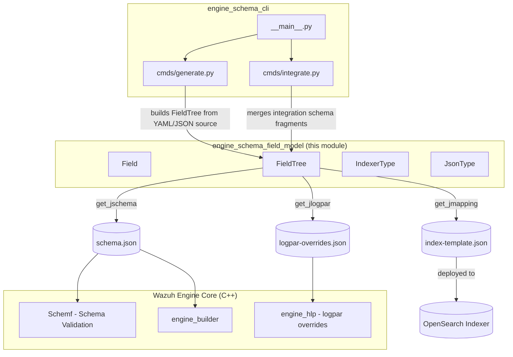
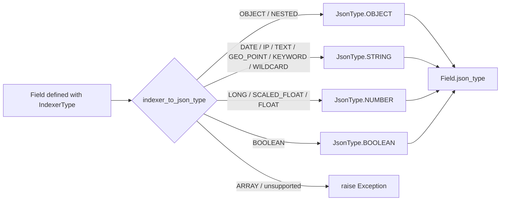
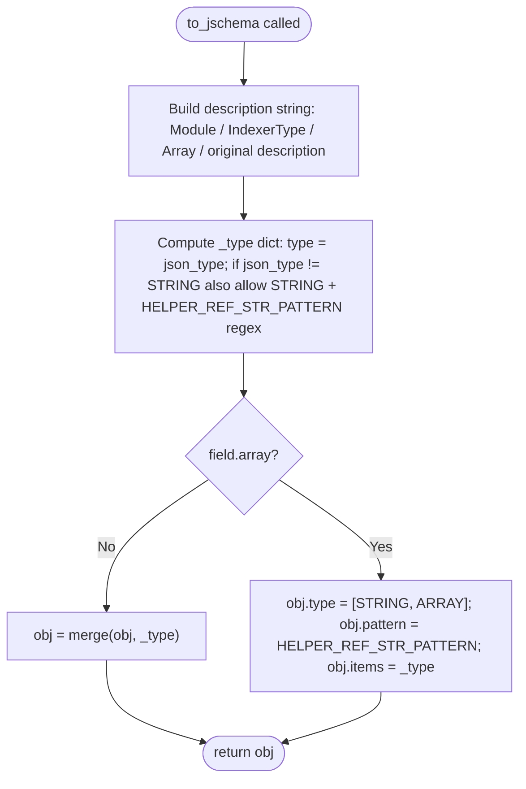
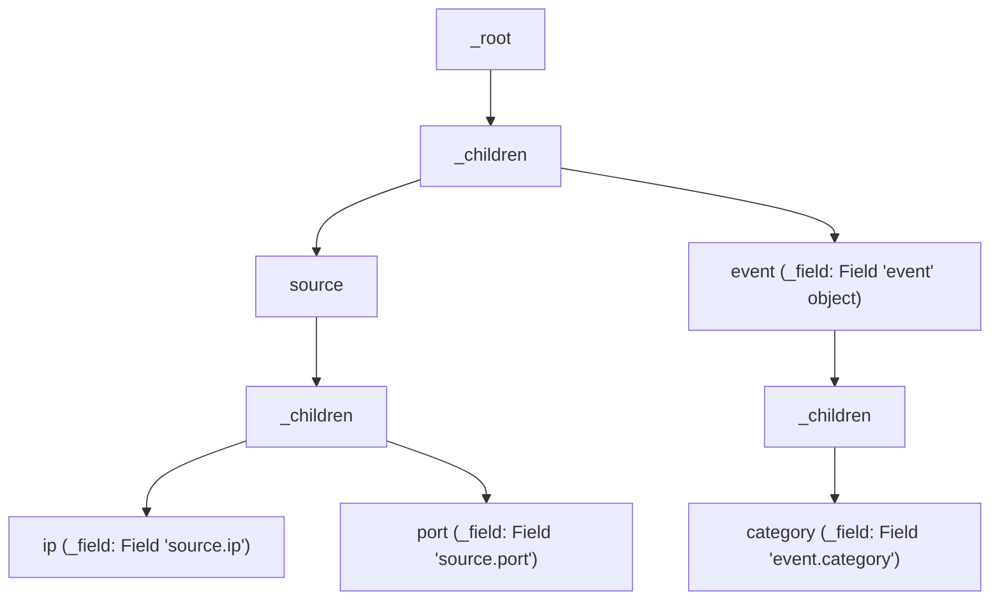
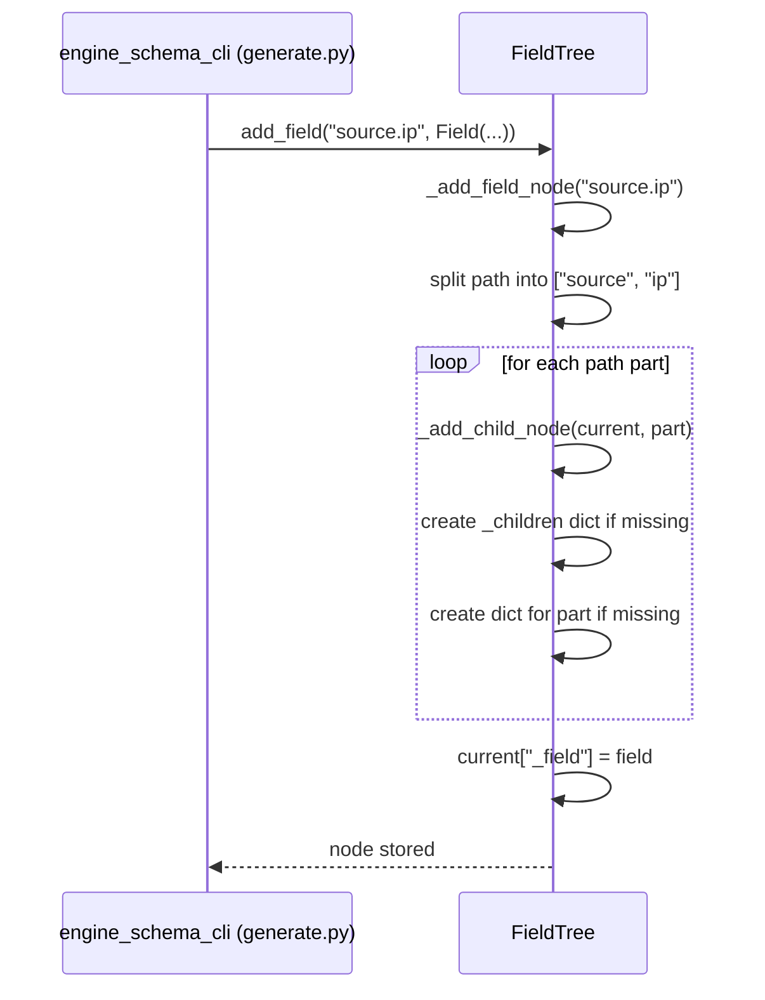
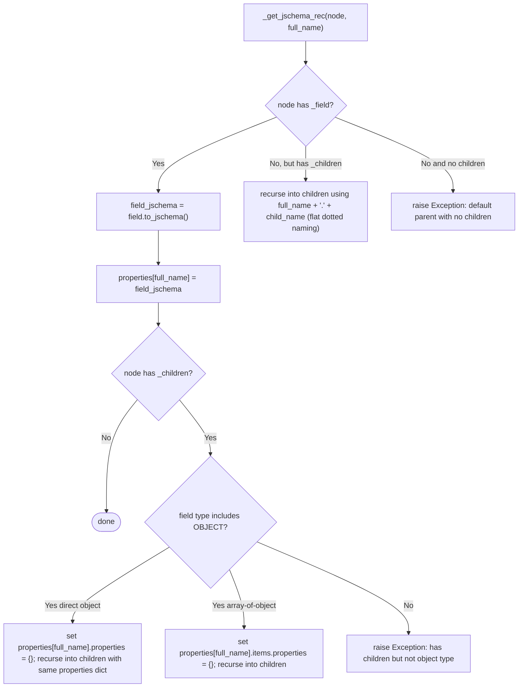
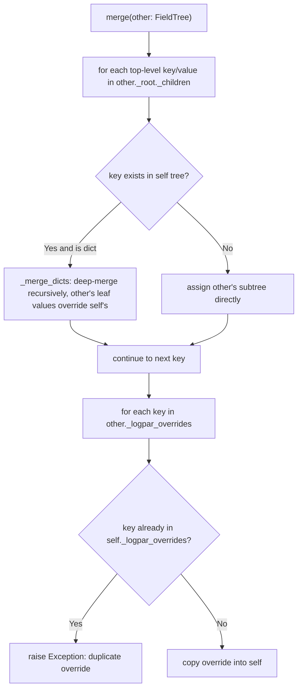
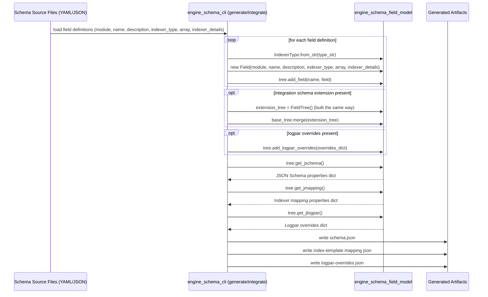

# Engine Schema Field Model

## Introduction

The **Engine Schema Field Model** is the core data-model module used by the Wazuh Engine's schema tooling to describe, organize, and render the fields that make up the Engine's event schema. It lives in a single file — `src/engine/tools/engine-suite/src/engine_schema/field.py` — and exposes four building blocks:

- **`IndexerType`** — an enumeration of the field types supported by the OpenSearch/Elasticsearch indexer (keyword, ip, long, object, geo_point, nested, scaled_float, text, boolean, date, float, array, wildcard).
- **`JsonType`** — an enumeration of the primitive JSON Schema types (string, object, number, array, boolean) used to validate engine configuration/assets that reference schema fields.
- **`Field`** — represents a single, fully-qualified schema field (e.g. `source.ip`), holding its metadata (module, description), its indexer type, and helpers to render both a JSON Schema fragment and an indexer mapping fragment for that field.
- **`FieldTree`** — a hierarchical container that aggregates many `Field` instances into a nested tree (mirroring dotted field paths, e.g. `source.ip`, `source.port`), and can emit the tree as a complete JSON Schema, a complete indexer mapping document, or a set of "logpar" parser overrides. It also supports merging multiple trees together.

This module has no runtime dependencies on the rest of the Wazuh codebase — it is a pure Python data model consumed by the CLI commands in the sibling [engine_schema_cli](engine_schema_cli.md) module (`generate.py`, `integrate.py`, `__main__.py`), which read schema source definitions (YAML/JSON), build a `FieldTree`, and write out the generated JSON Schema and indexer mapping artifacts consumed by the `engine_builder` and `Schemf` (Schema Validation) C++ components at engine build/run time — see [Wazuh Engine Core (C++)](Wazuh_Engine_Core_(C++).md).

---

## 1. Purpose and Core Functionality

The Wazuh Engine validates and transforms security events according to a **schema**: a catalog of well-known field names (`source.ip`, `event.category`, `agent.name`, etc.), each with a specific data type. This schema serves two purposes simultaneously:

1. **Validation of engine assets** (decoders, rules, outputs) — expressed as JSON Schema, so that asset authors get immediate feedback if they reference a field with the wrong type or write malformed helper/reference expressions.
2. **Indexing** — expressed as an OpenSearch/Elasticsearch mapping document, so that the fields are stored and searchable with the correct data type in the security data indexer.

Rather than hand-maintain two parallel and easily-diverging artifacts (a JSON Schema and an index mapping) for every field, the `engine_schema_field_model` module defines **a single source of truth per field** (`Field`) and mechanically derives both representations. `FieldTree` extends this to whole hierarchies of fields, producing:

- `get_jschema()` → JSON Schema `properties` fragment (nested or dotted, depending on whether children are known ahead of time).
- `get_jmapping()` → indexer mapping `properties` fragment.
- `get_jlogpar()` → a dictionary of logpar (log-parsing) overrides associated with specific fields.
- `merge()` → combine two `FieldTree`s (used when composing a base schema with per-integration schema extensions).

---

## 2. Architecture

### 2.1 Component Overview

```mermaid
classDiagram
    class IndexerType {
        <<enumeration>>
        KEYWORD
        IP
        LONG
        OBJECT
        GEO_POINT
        NESTED
        SCALED_FLOAT
        TEXT
        BOOLEAN
        DATE
        FLOAT
        ARRAY
        WILDCARD
        +__str__() str
        +from_str(name) IndexerType
    }

    class JsonType {
        <<enumeration>>
        STRING
        OBJECT
        NUMBER
        ARRAY
        BOOLEAN
        +__str__() str
        +from_str(name) JsonType
    }

    class Field {
        +module: str
        +name: str
        +description: str
        +indexer_type: IndexerType
        +array: bool
        +json_type: JsonType
        +indexer_details: dict
        +to_jschema() dict
        +to_jmapping() dict
    }

    class FieldTree {
        -_tree: dict
        -_root: dict
        -_children_tag: str
        -_field_tag: str
        -_logpar_overrides: dict
        +add_field(path, field: Field)
        +add_logpar_overrides(overrides: dict)
        +get_jschema() dict
        +get_jmapping() dict
        +get_jlogpar() dict
        +merge(other: FieldTree)
    }

    Field --> IndexerType : has
    Field --> JsonType : derives (json_type)
    FieldTree "1" o-- "many" Field : stores in nested nodes
    Field ..> "indexer_to_json_type()" : uses helper function
```

**Key design points:**

- `Field.json_type` is *derived* automatically from `indexer_type` via the module-level function `indexer_to_json_type()`, guaranteeing the JSON Schema and mapping stay consistent for a given field definition.
- `FieldTree` stores nodes as nested Python dictionaries keyed by path segment (`_children` for child nodes, `_field` for the `Field` object at that node, if any). This lets a node be both a "parent object" and (optionally) carry its own field definition — though typically a node is either a leaf field or an intermediate object.
- Multi-field mappings (`indexer_details['multi_fields']`) are automatically rewritten into the OpenSearch `fields` sub-mapping format inside `Field.__init__`.

### 2.2 Module Position in the Wazuh System



See [engine_schema_cli](engine_schema_cli.md) for the command-line tools that drive this model, and [Wazuh Engine Core (C++)](Wazuh_Engine_Core_(C++).md) for the downstream C++ components (`Schemf`, `builder`, `hlp`) that consume the generated artifacts.

---

## 3. Type System: `IndexerType` and `JsonType`

### 3.1 Enumerations

| `IndexerType` | Mapped `JsonType` | Notes |
|---|---|---|
| `OBJECT`, `NESTED` | `OBJECT` | Structural/container types |
| `DATE`, `IP`, `TEXT`, `GEO_POINT`, `KEYWORD`, `WILDCARD` | `STRING` | Rendered as JSON string in schema (with reference/helper pattern support) |
| `LONG`, `SCALED_FLOAT`, `FLOAT` | `NUMBER` | Numeric types |
| `BOOLEAN` | `BOOLEAN` | Direct mapping |
| `ARRAY` | *(not directly mapped; handled via `Field.array` flag instead)* | |

Both enums implement:
- `__str__()` → lower-cased enum name (used directly as the literal string written into JSON Schema `"type"` and mapping `"type"` fields).
- `from_str(name)` (classmethod) → parses a lower-case string back into the enum value, raising an `Exception` for unknown names. Used when loading field definitions from external YAML/JSON schema-source files (in `engine_schema_cli`).

### 3.2 Type Derivation Flow



The `indexer_to_json_type()` module function is the single mapping table between the "storage" type system (indexer) and the "validation" type system (JSON Schema). Any new `IndexerType` value must be added here or field construction will raise an exception when the type has no JSON representation.

---

## 4. The `Field` Class

### 4.1 Responsibilities

`Field` encapsulates everything needed to describe one leaf (or object) field of the schema:

- **Identity/metadata**: `module` (owning integration/module name, purely descriptive), `name` (fully dotted path), `description` (free text, embedded into the generated JSON Schema description).
- **Typing**: `indexer_type` (source of truth), `array` (whether the field holds a list of values of that type), `json_type` (derived), `indexer_details` (extra mapping-only settings, e.g. `scaling_factor` for `scaled_float`, or `multi_fields`).
- **Validation on construction**: `SCALED_FLOAT` fields *require* `scaling_factor` in `indexer_details`, or a constructor `Exception` is raised — this guards against incomplete field definitions reaching the generated artifacts.
- **Multi-field normalization**: if `indexer_details['multi_fields']` is present (a list of `{name, type}` dicts), it's transformed at construction time into the indexer's native `fields: {name: {type: ...}}` sub-mapping structure, and the original `multi_fields` key is removed.

### 4.2 Output Methods

#### `to_jschema()` — JSON Schema fragment



This allows every field's JSON Schema type to **also** accept a plain string matching `REF_STR_PATTERN` (`$field.ref`) or `HELPER_STR_PATTERN` (`helper_name(args)`), because Engine assets commonly assign helper-function results or field references instead of literal values — the schema must not reject those.

#### `to_jmapping()` — Indexer mapping fragment

Simple merge of `{'type': str(indexer_type)}` with any additional `indexer_details` (e.g. `scaling_factor`, `fields`, `ignore_above`), producing exactly the JSON expected in an OpenSearch/Elasticsearch mapping `properties` entry.

---

## 5. The `FieldTree` Class

### 5.1 Internal Tree Structure

`FieldTree` stores fields in a nested dictionary keyed by path segments, using two reserved keys:

- `_children`: `dict` mapping child path-segment → child node (same shape, recursively).
- `_field`: the `Field` object attached to this exact node (only present if this node is itself a defined field, not just an intermediate path segment).



For example, adding fields `source.ip` and `source.port` creates a `source` node with two children `ip` and `port`, each carrying their own `Field`. `source` itself may or may not carry a `_field` (if no `Field` was explicitly registered for the exact path `source`).

### 5.2 Building the Tree — `add_field(path, field)`



`_has_field_node(path)` performs a read-only traversal to check existence (used by `add_logpar_overrides` and `merge` to validate that override targets / merge targets actually exist).

### 5.3 Generating JSON Schema — `get_jschema()`

The recursive helper `_get_jschema_rec` walks the tree and decides, for every node, whether to emit:
- a **dotted flat property** (`"a.b.c": {...}`) when the parent has no `Field` of its own (pure grouping node), or
- a **nested `properties` object** (`"a": {type: object, properties: {"b": {...}}}`) when the parent node *does* have a `Field` (so its declared type, e.g. `object` or `nested`, is honored and its children become genuine JSON Schema sub-properties).



### 5.4 Generating Indexer Mapping — `get_jmapping()`

Simpler and always **nested** (mappings are inherently object-based): `_get_jmapping_rec` emits `{"type": ..., "properties": {...}}` for every node, defaulting to a generic `object` mapping (`_default_jmap_type()`) when a node has children but no explicit `Field` (i.e., an implicit grouping object).

### 5.5 Logpar Overrides — `add_logpar_overrides()` / `get_jlogpar()`

`add_logpar_overrides(overrides)` validates that every key in the supplied dictionary corresponds to an existing field path in the tree (raising an `Exception` otherwise) before storing it verbatim in `_logpar_overrides`. `get_jlogpar()` simply returns this dictionary — it is consumed by the `engine_hlp` module's high-level parsers (see [Wazuh Engine Core (C++)](Wazuh_Engine_Core_(C++).md)) to customize field-specific parsing behavior (e.g., special date formats for a particular field) at schema-generation time rather than at parser-definition time.

### 5.6 Merging Trees — `merge(other)`



`merge()` is how a **base engine schema** is combined with **per-integration schema extensions** (each integration can define additional fields under its own namespace, or extend existing object fields) into one final `FieldTree` before the artifacts are generated. Logpar overrides are merged additively but strictly (no silent overwrite — a duplicate key is treated as a configuration error).

---

## 6. End-to-End Usage Flow



---

## 7. Error Handling Summary

All error signaling in this module is via plain Python `Exception`, raised in these situations:

| Condition | Raised by |
|---|---|
| Unknown string passed to `IndexerType.from_str` / `JsonType.from_str` | `IndexerType.from_str`, `JsonType.from_str` |
| `IndexerType` value has no JSON Schema equivalent | `indexer_to_json_type` |
| `SCALED_FLOAT` field missing `scaling_factor` in `indexer_details` | `Field.__init__` |
| A schema-tree node has children but its field type is not `object`/`nested` (or array-of-object) | `FieldTree._get_jschema_rec` |
| A schema-tree node has neither a `_field` nor `_children` (malformed tree) | `FieldTree._get_jschema_rec` |
| `add_logpar_overrides` references a field path not present in the tree | `FieldTree.add_logpar_overrides` |
| `merge()` encounters a duplicate logpar override key | `FieldTree.merge` |

Callers (primarily the [engine_schema_cli](engine_schema_cli.md) commands) are expected to catch these exceptions and present actionable error messages to the schema author, since they typically indicate a malformed schema source file rather than a programming error.

---

## 8. Related Documentation

- [engine_schema_cli](engine_schema_cli.md) — the CLI commands (`generate`, `integrate`) that build `FieldTree` instances from schema source files and invoke this model to emit generated artifacts.
- [Wazuh Engine Core (C++)](Wazuh_Engine_Core_(C++).md) — consumers of the generated JSON Schema (`Schemf` schema validation, `builder`) and logpar overrides (`hlp`).
- [Engine Administration CLI Tools (Python)](Engine_Administration_CLI_Tools_(Python).md) — parent grouping of all `engine-suite` Python CLI tools, including `engine_schema`.
