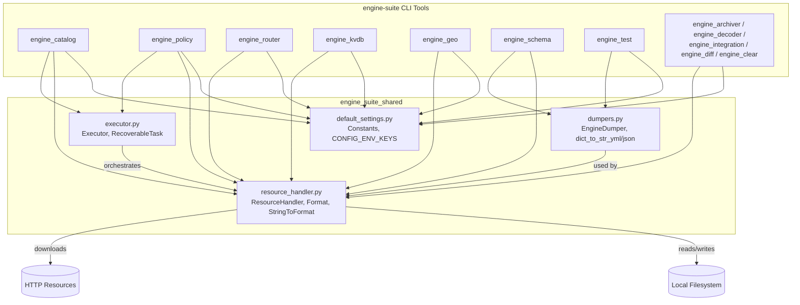
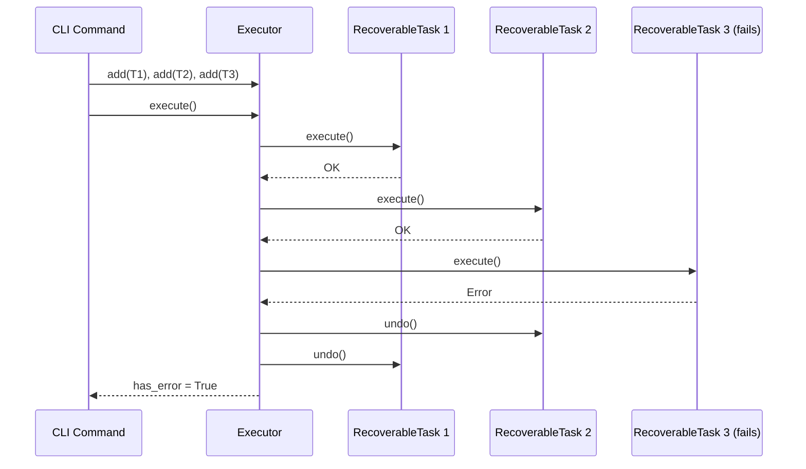
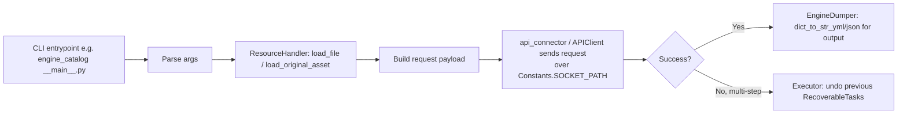

# Engine Suite Shared

## 1. Purpose & Overview

`engine_suite_shared` is a small, foundational Python library that provides **common utilities** consumed by every CLI tool in the **Engine Administration CLI Tools (Python)** module (`engine-suite`). It has no business logic of its own; instead, it centralizes cross-cutting concerns so that each CLI sub-tool (`engine_catalog`, `engine_policy`, `engine_router`, `engine_kvdb`, `engine_geo`, `engine_schema`, `engine_test`, `engine_archiver`, `engine_decoder`, `engine_integration`, `engine_diff`, `engine_clear`, etc.) does not have to reimplement:

- Global configuration constants and environment-variable keys used to talk to the Wazuh Engine API.
- YAML/JSON serialization helpers with Wazuh-specific formatting rules.
- A simple, reversible task-execution framework ("do/undo") for multi-step operations that must be rolled back on failure.
- File-system, resource-loading, and format-conversion helpers (JSON/YAML/plain-text) shared by all catalog/policy/schema management commands.

Because this module underpins nearly all Python-based engine administration tooling, understanding it is a prerequisite for understanding how any `engine-suite` command reads configuration, talks to the engine socket, or persists/loads resources (decoders, policies, schemas, KVDBs, etc.).

## 2. Architecture Overview

The module consists of four independent, low-coupling files. There are no classes that depend on each other within the module; each file addresses a distinct concern and is imported piecemeal by consumer CLI tools.

For details on the CLI tools themselves (argument parsing, sub-commands, API connectors) see the **Engine_Administration_CLI_Tools_(Python)** module's individual tool pages (e.g. `engine_test`, `engine_catalog`, `engine_policy`), and the wider **Wazuh_Engine_Core_(C++)** module (`engine_api`, `engine_httpsrv`, `engine_kvdb`, `engine_geo`) which implements the server-side counterparts (`Catalog`, `Policy`, `Router`, `KVDBManager`, `Geo::Manager`) that these CLI tools communicate with over the Unix socket defined in `Constants.SOCKET_PATH`.

## 3. Core Sub-Areas

Although the module is not split into separate documentation pages (it is small and cohesive), it logically groups into four responsibilities:

### 3.1 Configuration Constants — `default_settings.py`

- **`Constants`**: Holds fixed defaults used across all CLI tools:
  - `SOCKET_PATH`: Unix socket path (`/var/ossec/queue/sockets/analysis`) used to reach the Engine API (see `api/adapter` and `httpsrv`/socket server in the Engine Core).
  - `DEFAULT_POLICY`, `DEFAULT_SESSION`, `DEFAULT_NS`: Default policy/session/namespace identifiers used when a CLI command does not specify them explicitly (aligns with `engine_policy` and `engine_test` session commands).
  - `DEFAULT_API_TIMEOUT`: Default request timeout, matching server-side expectations.
  - `PLACEHOLDER`: Sentinel string for environment-variable path substitution.
- **`CONFIG_ENV_KEYS`** (Enum): Names of environment variables that can override the above defaults at runtime (`WAZUH_SERVER_API_SOCKET`, `WAZUH_SERVER_API_TIMEOUT`, `WAZUH_STANDALONE_LOG_LEVEL`).

These constants are the single source of truth for how any `engine-suite` command locates and times out against the running engine daemon.

### 3.2 Serialization Helpers — `dumpers.py`

- **`EngineDumper`**: A custom `yaml.Dumper` (using the fast `CDumper` implementation when available) that overrides scalar representation to:
  - Force double-quote style when a string contains a single quote.
  - Force literal block style (`|`) when a string contains a newline.

  This ensures YAML dumps of engine resources (decoders, rules, policies) remain human-readable and unambiguous.
- **`dict_to_str_yml(data)`** / **`dict_to_str_json(data, pretty=False)`**: Convenience wrappers to serialize Python dictionaries into YAML or JSON text, used whenever a CLI command needs to print or persist a resource fetched from/pushed to the Engine's `Store`/`Catalog`.

### 3.3 Reversible Task Execution — `executor.py`

- **`RecoverableTask`**: Wraps a pair of callables — `do` (the action) and `undo` (the compensating rollback action) — plus a human-readable `task_info` label. `execute()` runs `do` and captures/returns any exception message.
- **`Executor`**: A minimal saga/orchestrator that:
  1. Maintains an ordered list of `RecoverableTask` objects (`add`).
  2. Runs them sequentially (`execute`), optionally in `dry_run` mode (only prints intended actions).
  3. On failure of task *N*, automatically calls `undo()` on all previously succeeded tasks (`N-1 ... 0`) in reverse order, restoring consistency.
  4. Provides `list_tasks()` for introspection/debugging.

This pattern is used by CLI commands that must perform multiple dependent operations against the Catalog/Store/Policy APIs (e.g., adding several assets, updating a policy, then validating) where partial failure must not leave the engine's persisted state inconsistent.

### 3.4 Resource & File Handling — `resource_handler.py`

- **`Format`** (Enum: `JSON`, `YML`, `TEXT`) and **`StringToFormat(string)`**: Normalize user-supplied format strings (`"json"`, `"yml"`/`"yaml"`, `"text"`) into the internal `Format` enum used throughout the handler.
- **`ResourceHandler`**: The main utility class, offering:
  - **Internal package resources**: `load_internal_file(name, module, format)` reads bundled files shipped inside the `engine-suite` Python package (e.g., default schemas, templates).
  - **Local file I/O**: `load_file`, `_load_file`, `save_file`, `save_plain_text_file`, `read_plain_text_file`, `create_file`, `create_dir`, `delete_file`, `walk_dir` (with optional recursion).
  - **Remote resources**: `download_file(url, format)` fetches and parses YAML/JSON content over HTTP (used e.g. by `engine_geo` to download GeoIP databases or integration templates).
  - **Asset/module loading conventions**: `load_original_asset(path)` returns both the parsed structure and raw text of a decoder/rule/output asset (preserving the original for round-tripping); `load_module_files(module_path)` loads an integration module's `fields.yml` and optional `logpar.json` overrides, matching the structure expected by `engine_integration` and the Engine's `logpar`/`schemf` components.
  - **Working-directory helpers**: `current_dir_name()`, `cwd()`.

`ResourceHandler` is the primary bridge between the on-disk representation of engine assets (used by nearly every `engine-suite` sub-tool) and the in-memory Python dictionaries that get serialized (via `dumpers.py`) or sent to the Engine API.

## 4. How Consumers Use This Module

Typical usage patterns observed across the `engine-suite` tools:

1. **Configuration resolution**: Tools read `Constants` defaults, then check `os.environ` for the corresponding `CONFIG_ENV_KEYS` overrides before connecting to the Engine API socket.
2. **Loading/saving assets**: `engine_catalog`, `engine_policy`, `engine_schema`, and `engine_decoder` use `ResourceHandler` to load YAML/JSON resource definitions from disk (or bundled package data) before pushing them to the Engine's `Catalog`/`Store` via the API, and use `dumpers.py` to pretty-print responses back to the user.
3. **Multi-step operations**: Commands like `engine_policy asset_add`/`parent_set`, or `engine_integration create/add`, that touch multiple engine resources in sequence use `Executor`/`RecoverableTask` to ensure atomic-like behavior with rollback on partial failure.

## 5. Relationship to Other Modules

- **Engine_Administration_CLI_Tools_(Python)** — the direct and only consumer set of this shared library. Each sub-tool (`engine_catalog`, `engine_policy`, `engine_router`, `engine_kvdb`, `engine_geo`, `engine_schema`, `engine_test`, `engine_archiver`, `engine_decoder`, `engine_integration`, `engine_diff`, `engine_clear`) imports from `shared.*` for configuration, serialization, and file handling.
- **Wazuh_Engine_Core_(C++)** — the server-side counterpart. The socket path and API timeout constants defined here (`Constants.SOCKET_PATH`, `DEFAULT_API_TIMEOUT`) must match the server configuration exposed by the Engine's `httpsrv`/adapter layer (`engine_api`, `engine_httpsrv`) and the resources loaded/saved via `ResourceHandler` correspond to structures managed by the Engine's `Store`, `Catalog`, `builder`, and `KVDB` subsystems.
- **`engine_test`** — reuses similar `dumpers.py`/`default_settings.py`-style patterns for its own `EngineDumper`/session-management logic (note: `engine_test` also defines its own local `EngineDumper` reused via `base_tester_integration.py`).

## 6. Summary

`engine_suite_shared` is intentionally minimal: four focused files providing constants, serialization, transactional task execution, and resource I/O. Its simplicity is a deliberate design choice — it exists purely to avoid duplication across the numerous independent `engine-suite` CLI entry points, all of which need to talk to the same Engine API socket, persist/parse the same YAML/JSON asset formats, and occasionally perform multi-step operations that require rollback semantics.

Since this module is small and cohesive with no internal sub-module boundaries, no separate sub-module documentation pages were generated; all details are covered in this single page.
