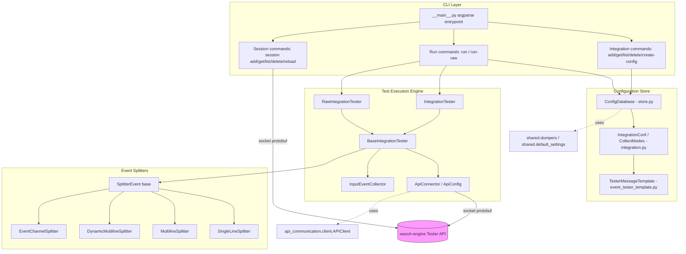
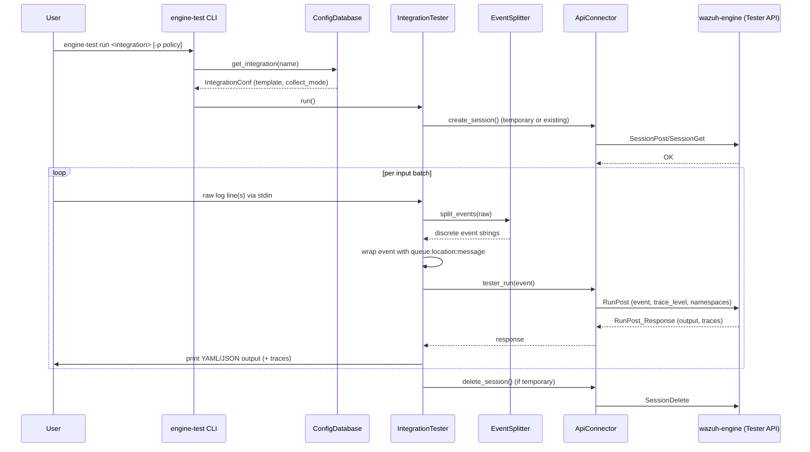

# engine_test — Engine Integration Testing CLI

## 1. Purpose

`engine_test` is a Python command-line tool, part of the `engine-suite` toolset, that lets developers
and integrators **test Wazuh Engine integrations (decoders, rules, outputs) interactively or in
batch** without needing a live agent or the full ingestion pipeline. It reads raw log lines (or
pre-formatted engine events) from stdin, wraps them using a per-integration template, sends them to a
running `wazuh-engine` instance through its Tester API (over a local socket), and prints the resulting
decoded output and/or the asset execution trace.

Typical uses:
- Verifying a decoder correctly parses a sample log line.
- Debugging why a rule/asset in a policy did or did not match.
- Regression-testing integrations by piping a corpus of sample logs and comparing outputs.

The tool maintains its own small **local JSON configuration store** (`engine-test.conf`) that records,
per integration, how raw input should be split into discrete events (single line, multi-line,
Windows Event Channel XML, etc.) and what "envelope" (queue, location) the engine expects for that
integration's events.

## 2. Architecture Overview

### High-level flow (single event test run)

## 3. Sub-modules

| Sub-module | Description | Docs |
|---|---|---|
| **CLI & Integration Commands** | `__main__.py` entrypoint and the `add`/`get`/`list`/`delete`/`create-config`/`run`/`run-raw` subcommands that manage integration configs and launch test runs. | [engine_test_cli.md](engine_test_cli.md) |
| **Session Management CLI** | The `session` subcommand group (`add`, `get`, `list`, `delete`, `delete-all`, `reload`) for managing Tester API sessions directly. | [engine_test_session_cli.md](engine_test_session_cli.md) |
| **Integration Configuration Store** | `ConfigDatabase`, `IntegrationConf`, `CollectModes`, and `TesterMessageTemplate` — the persistence layer and data model describing how each integration's events are framed and split. | [engine_test_config.md](engine_test_config.md) |
| **Test Execution Engine** | `BaseIntegrationTester`, `IntegrationTester`, `RawIntegrationTester`, `ApiConnector`/`ApiConfig`, and `InputEventCollector` — the runtime loop that reads input, talks to the engine over the Tester API, and renders results. | [engine_test_execution.md](engine_test_execution.md) |
| **Event Splitters** | `SplitterEvent` and its concrete strategies (`SingleLineSplitter`, `MultilineSplitter`, `DynamicMultilineSplitter`, `EventChannelSplitter`) that turn raw stdin text into discrete engine events. | [engine_test_splitters.md](engine_test_splitters.md) |

## 4. Relationship to Other Modules

- **`engine_suite_shared`** — `engine_test` reuses `shared.dumpers` (YAML/JSON pretty printing helpers) and
  `shared.default_settings` (default socket path, policy, namespaces) from the shared engine-suite utilities.
  See [engine_suite_shared.md](engine_suite_shared.md).
- **`engine_misc_tools`** — Communication with the engine daemon is performed through the generic
  `api_communication.client.APIClient` and its generated protobuf messages (`tester_pb2`, `engine_pb2`),
  shared by all `engine-suite` CLIs. See [engine_misc_tools.md](engine_misc_tools.md).
- **`engine_api` (Router/Tester/Policy handlers)** — On the server side, the requests issued by
  `ApiConnector` (`RunPost`, `SessionPost/Get/Delete/Reload`, `TableGet`) are served by the Engine's
  C++ API handlers for the Router/Tester subsystem. See [engine_api_router_tester.md](engine_api_router_tester.md).
- **`Router` (C++ Tester)** — The actual event evaluation against a policy happens in the Engine's
  Router testing component (`Tester`, `RuntimeEntry`), which `engine_test` drives indirectly through
  the API. See [Router.md](Router.md).
- Sibling Python CLI tools in the same `Engine_Administration_CLI_Tools_(Python)` module family
  (`engine_catalog`, `engine_policy`, `engine_router`, etc.) follow the same architecture pattern
  (argparse subcommands + `APIClient`) but manage different engine resources.

## 5. Key Concepts

- **Collect Mode**: Determines how raw text captured from stdin is split into individual events
  (`single-line`, `multi-line`, `dynamic-multi-line`, `windows-eventchannel`). Configured per integration
  and stored in `engine-test.conf`.
- **Template / Envelope**: For the `run` command (as opposed to `run-raw`), each integration has a
  stored "queue:location" envelope so raw messages can be reconstructed into the exact wire format
  (`queue:location:message`) the engine's `Router`/`Queue` expects.
- **Session**: A named Tester session bound to a policy. `engine-test run` creates a short-lived,
  auto-deleted session by default (`-p/--policy`), or can attach to a persistent one (`-s/--session-name`)
  managed via the `session` subcommands.
- **Trace Level**: Controls how much diagnostic information the engine returns per run — `NONE`,
  `ASSET_ONLY` (`-d`), or `ALL` (`-dd`), optionally filtered to specific assets (`-t/--trace`).
