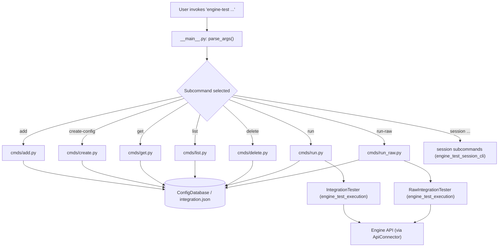
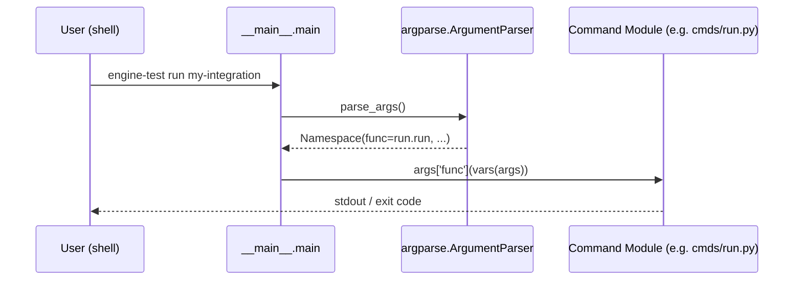
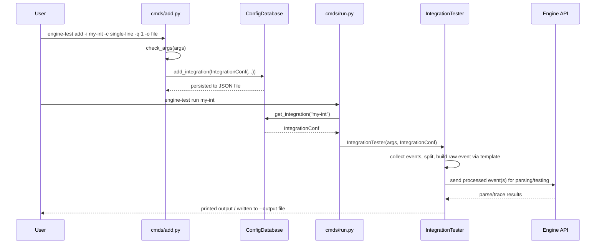
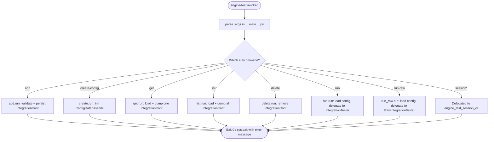
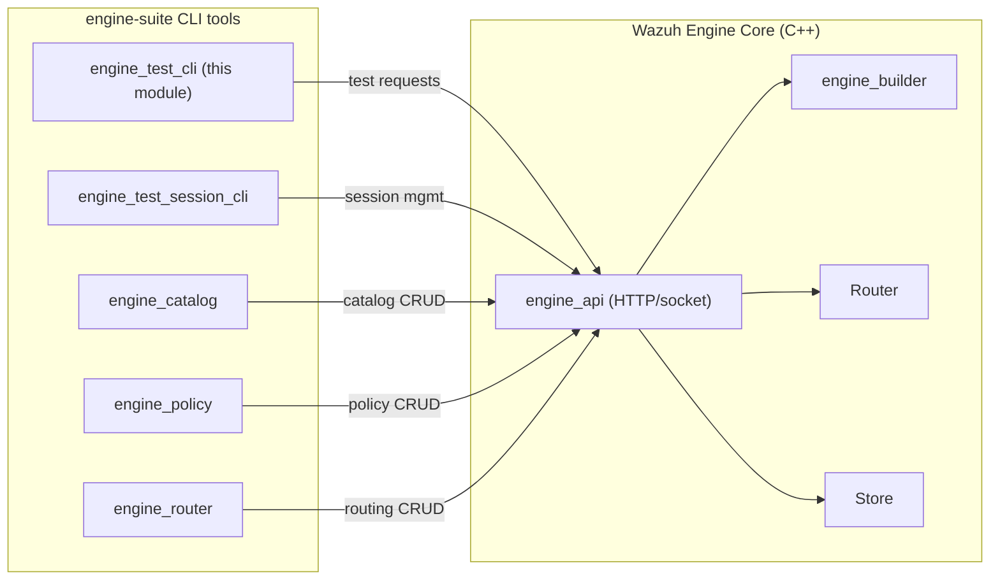

# Engine Test CLI

## Introduction

The **Engine Test CLI** is the primary command-line entry point for the `engine-test` tool, part of the Wazuh Engine administration suite (`engine-suite`). It allows developers, integrators, and QA engineers to define, manage, and execute end-to-end tests against decoder/rule integrations running inside the Wazuh Engine, without needing to manually craft raw socket requests to the Engine API.

This module implements the top-level argument parser (`__main__.py`) and the core lifecycle commands for managing **integration test configurations**: `add`, `create-config`, `get`, `list`, `delete`, `run`, and `run-raw`. It is the "front door" that a user interacts with when invoking `engine-test` from a shell, and it delegates the actual test execution and event collection logic to sibling modules within `engine_test`.

This documentation focuses on the CLI commands owned by `engine_test_cli`. For details on the underlying execution engine, event splitting, and session management, see the linked module docs below.

---

## 1. Purpose and Scope

`engine_test_cli` is responsible for:

1. **Bootstrapping the CLI** (`__main__.py`): building the top-level `argparse` parser, registering all subcommands, and dispatching to the selected command's `run()` function.
2. **Integration configuration lifecycle management**: commands that create, read, update (implicitly via `add`), list, and delete named "integration" test configurations stored in a local JSON-backed configuration database.
3. **Test execution triggers**: the `run` and `run-raw` commands, which load a stored integration configuration and hand off actual event collection/testing to the `IntegrationTester` / `RawIntegrationTester` classes (documented in [engine_test_execution.md](engine_test_execution.md)).

Out of scope for this module (but referenced/depended upon):
- Session management commands (`session`, `session-add`, `session-delete`, etc.) — see [engine_test_session_cli.md](engine_test_session_cli.md).
- The configuration data model (`IntegrationConf`, `ConfigDatabase`, `TesterMessageTemplate`) — see [engine_test_config.md](engine_test_config.md).
- Event collection, splitting, and API communication used during a test run — see [engine_test_execution.md](engine_test_execution.md) and [engine_test_splitters.md](engine_test_splitters.md).
- The broader `engine-suite` CLI ecosystem — see [engine_catalog.md](engine_catalog.md), [engine_policy.md](engine_policy.md), [engine_router.md](engine_router.md).
- The shared utilities used across all engine-suite tools (`Executor`, `ResourceHandler`, default settings) — see [engine_suite_shared.md](engine_suite_shared.md).

---

## 2. Architecture Overview

`engine_test_cli` follows a simple **command pattern**: `__main__.py` builds an `argparse` parser and delegates to per-command modules under `cmds/`. Each command module exposes two functions:

- `configure(subparsers)`: registers the subcommand, its arguments, and sets `parser.set_defaults(func=run)` (and optionally `post_parse=...` for validation hooks).
- `run(args)`: the actual command logic, invoked with a `dict` of parsed CLI arguments.



### Key relationships

| Component | Responsibility | Related module |
|---|---|---|
| `__main__.main` | Parses CLI args, dispatches to `args['func'](args)` | this module |
| `cmds/add.py` | Creates a new named integration configuration (collect mode, queue, location, lines) | this module → [engine_test_config.md](engine_test_config.md) |
| `cmds/create.py` | Initializes an empty configuration database file | this module → [engine_test_config.md](engine_test_config.md) |
| `cmds/get.py` | Dumps a single integration configuration (YAML/JSON) | this module → [engine_test_config.md](engine_test_config.md) |
| `cmds/list.py` | Lists all stored integration configurations | this module → [engine_test_config.md](engine_test_config.md) |
| `cmds/delete.py` | Removes an integration configuration | this module → [engine_test_config.md](engine_test_config.md) |
| `cmds/run.py` | Loads config, runs `IntegrationTester` (template-based testing) | [engine_test_execution.md](engine_test_execution.md) |
| `cmds/run_raw.py` | Loads config, runs `RawIntegrationTester` (raw/no-template testing) | [engine_test_execution.md](engine_test_execution.md) |

---

## 3. Component Details

### 3.1 `__main__.py::main`

The entry point registered as the `engine-test` executable. Responsibilities:

- Reads package metadata (`importlib.metadata`) to expose `--version`.
- Accepts a global `-c/--config` flag pointing to the configuration file (defaults to `DEFAULT_CONFIG_FILE`, defined in [engine_test_config.md](engine_test_config.md)).
- Registers all subcommands via each command module's `configure(subparsers)` function.
- Also wires in the **session** subcommand tree (`configure_session`) from [engine_test_session_cli.md](engine_test_session_cli.md), even though that logic lives in a sibling module — this is the single unified CLI surface.
- Calls `args.func(vars(args))` to dispatch to the selected command's handler.



### 3.2 `cmds/add.py`

Adds a new named integration test configuration to the database.

- **`check_positive(value)`**: argparse type-validator ensuring `--lines` is a positive integer.
- **`check_args(args)`**: post-parse validation hook:
  - If `collect_mode == MULTI_LINE`, `--lines` is mandatory.
  - `--queue` and `--location` must be supplied together (both or neither) — this determines whether a `TesterMessageTemplate` is created for the integration (used later by `run`, not `run-raw`).
- **`run(args)`**:
  1. Invokes `args['post_parse'](args)` (i.e., `check_args`) for validation.
  2. Builds an `IntegrationConf` (see [engine_test_config.md](engine_test_config.md)).
  3. Opens/creates the `ConfigDatabase` and persists the new integration via `db.add_integration(iconf)`.
- **`configure(subparsers)`**: registers the `add` subcommand with `-i/--integration-name`, `-c/--collect-mode`, `-q/--queue`, `-o/--location`, `-l/--lines`.

### 3.3 `cmds/create.py`

Simplest command: ensures a configuration file exists.

- **`run(args)`**: instantiates `ConfigDatabase(args['config_file'], create_if_not_exist=True)`. If the file already exists, `ConfigDatabase` will simply load it (no error) since creation is conditional on absence.
- **`configure(subparsers)`**: registers `create-config` with no extra arguments beyond the global `-c/--config`.

### 3.4 `cmds/delete.py`

- **`run(args)`**: loads the `ConfigDatabase` (must already exist) and calls `db.remove_integration(name)`.
- **`configure(subparsers)`**: registers `delete` with a required positional `integration-name`.

### 3.5 `cmds/get.py`

- **`run(args)`**: loads the config DB, fetches the `IntegrationConf` by name, and dumps it via `dump_as_tuple()`. Output format is YAML by default, or JSON with `-j/--json` (uses shared dumper utilities from [engine_suite_shared.md](engine_suite_shared.md)).
- **`configure(subparsers)`**: registers `get` with `-j/--json` and positional `integration-name`.

### 3.6 `cmds/list.py`

- **`run(args)`**: loads the config DB and calls `get_all_integrations()`.
  - Default: prints only the list of integration names.
  - With `-d/--detailed`: dumps full configuration data for every integration.
  - Output format controlled by `-j/--json` (default YAML).
- **`configure(subparsers)`**: registers `list` with `-d/--detailed` and `-j/--json` flags.

### 3.7 `cmds/run.py`

Runs a **template-based** integration test — i.e., the integration must have been configured with `--queue`/`--location` (via `add`), producing a `TesterMessageTemplate`.

- **`run(args)`**:
  1. Loads the named `IntegrationConf` from the `ConfigDatabase`.
  2. Instantiates `IntegrationTester(args, integration_config)` (from [engine_test_execution.md](engine_test_execution.md)) and calls `.run()`.
- **`configure(subparsers)`**: registers `run` with:
  - `--api-socket`: path to the Engine API Unix socket.
  - `--output`: optional file to persist processed events.
  - `-n/--namespaces`: namespaces to include when building the test session/policy.
  - Mutually exclusive `-p/--policy` vs `-s/--session-name`: run against an ephemeral policy-derived session, or an existing named session (see [engine_test_session_cli.md](engine_test_session_cli.md)).
  - Debug flags `-d/--debug`, `-dd/--full-debug`.
  - `-t/--trace`: list of assets to filter tracing output.
  - `-j/--json`: output/trace format.
  - Positional `integration-name`.

### 3.8 `cmds/run_raw.py`

Structurally identical to `run.py`, but delegates to `RawIntegrationTester` instead of `IntegrationTester`. This mode allows testing with **raw events** (no queue/location template required), useful for integrations that haven't been fully configured with `add -q/-o`, or for ad-hoc raw payload testing.

- Shares the same CLI surface (`--api-socket`, `--output`, `-n`, `-p`/`-s`, debug flags, `-t`, `-j`) as `run.py`.
- **`run(args)`**: loads `IntegrationConf`, instantiates `RawIntegrationTester(args, integration_config)`, calls `.run()`.

---

## 4. Data Flow: `add` → `run`



---

## 5. Process Flow: CLI Dispatch



---

## 6. Error Handling Conventions

Every command in this module follows the same defensive pattern:

```python
try:
    # perform DB load / mutation / delegate to tester
except Exception as ex:
    sys.exit(f"Error <doing something>: {ex}")
```

This ensures:
- Failures (missing integration, invalid JSON config file, permission errors, API connection issues) produce a **human-readable message on stderr** and a **non-zero exit code**, suitable for scripting/CI usage.
- No raw Python tracebacks are shown to end users under normal failure conditions.

---

## 7. Dependencies

| Dependency | Used for | Documentation |
|---|---|---|
| `engine_test_config` (`ConfigDatabase`, `IntegrationConf`, `CollectModes`, `TesterMessageTemplate`) | Persisting and loading integration test configurations | [engine_test_config.md](engine_test_config.md) |
| `engine_test_execution` (`IntegrationTester`, `RawIntegrationTester`, `ApiConnector`, `InputEventCollector`) | Executing the actual test against the Engine API | [engine_test_execution.md](engine_test_execution.md) |
| `engine_test_splitters` (`SingleLineSplitter`, `MultilineSplitter`, etc.) | Splitting collected raw input into discrete events (used indirectly via the tester classes) | [engine_test_splitters.md](engine_test_splitters.md) |
| `engine_test_session_cli` | Session lifecycle subcommands registered alongside this module's commands in the same CLI | [engine_test_session_cli.md](engine_test_session_cli.md) |
| `engine_suite_shared` (`dict_to_str_json`, `dict_to_str_yml`, `Constants`/`DefaultSettings`) | Output formatting and default CLI values (socket path, default policy/namespaces) | [engine_suite_shared.md](engine_suite_shared.md) |
| `engine_api` (Wazuh Engine C++ HTTP/Unix-socket API: catalog, policy, router, tester handlers) | The remote service that `IntegrationTester`/`RawIntegrationTester` ultimately communicate with | [engine_api.md](engine_api.md) (specifically [engine_api_router_tester.md](engine_api_router_tester.md)) |

---

## 8. How It Fits Into the Overall System

`engine_test_cli` is a leaf-level operator tool within the much larger **Wazuh Engine** ecosystem. While the Engine core (C++) performs actual log parsing, decoding, and rule evaluation (see [engine_builder.md](engine_builder.md), [Router.md](Router.md)), `engine-test` provides a scriptable, human-friendly way to:

1. Define reusable test "integrations" (named configurations describing how raw log lines should be wrapped and routed).
2. Feed sample log data (from stdin, files, or interactively) through the real Engine pipeline via its HTTP/Unix-socket API.
3. Inspect resulting decoded events and rule traces for debugging and CI-based regression testing of decoders/rules stored in the Engine catalog ([engine_api_catalog.md](engine_api_catalog.md)).

It complements other `engine-suite` CLIs such as [engine_catalog.md](engine_catalog.md) (manage decoders/rules/outputs), [engine_policy.md](engine_policy.md) (manage policies/asset graphs), and [engine_router.md](engine_router.md) (manage live routing), forming a full administrative toolchain for the Engine.


